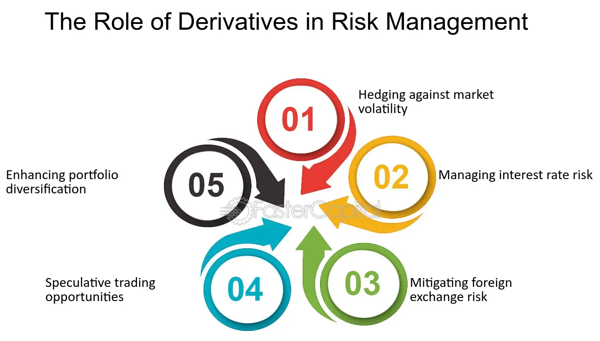

## Table of Contents

## What are derivatives and how do they function in financial markets?

Derivatives are financial instruments whose value is based on an underlying asset, like stocks, bonds, commodities, or currencies. They are called derivatives because their value is derived from something else. Common types of derivatives include futures, options, and swaps. In financial markets, derivatives are used for various purposes, such as hedging against risks, speculating on price movements, and gaining access to assets or markets that might be difficult to enter directly.

In the context of financial markets, derivatives function as tools for managing risk and making investments. For example, a farmer might use futures contracts to lock in a price for their crops ahead of the harvest, protecting against price drops. Similarly, an investor might buy an option to purchase a stock at a set price, betting that the stock's price will rise. Derivatives can also be used for speculation, where traders try to profit from short-term price movements without owning the underlying asset. While derivatives can be very useful, they can also be complex and risky, so it's important for anyone using them to understand how they work and the potential risks involved.

## How can derivatives be used to manage risk in a portfolio?

Derivatives can help manage risk in a portfolio by allowing investors to protect against potential losses. For example, if an investor owns a stock and is worried that its price might fall, they can buy a put option. This gives them the right to sell the stock at a set price, even if the market price drops lower. This way, the investor can limit their losses. It's like having insurance for their investment.

Another way derivatives can manage risk is through hedging. Imagine an investor has a lot of money in a certain industry, like technology. If they're worried about the whole industry going down, they can use futures contracts to balance out their risk. By selling futures on a tech index, they can make money if tech stocks fall, which helps offset any losses in their portfolio. This makes their investments more stable and less risky overall.

## What are the different types of derivatives commonly used in risk management?

The most common types of derivatives used in risk management are futures, options, and swaps. Futures are contracts to buy or sell an asset at a set price on a future date. They're often used by businesses to lock in prices for commodities like oil or wheat, protecting them from price changes. For example, an airline might use futures to fix the price of jet fuel, so they know what they'll be paying even if prices go up.

Options give the buyer the right, but not the obligation, to buy or sell an asset at a set price before a certain date. They're like insurance policies for investments. If you own a stock and are worried about its price dropping, you can buy a put option to sell it at a set price, no matter how low the market price goes. This can limit your losses if the stock price falls.

Swaps are agreements to exchange cash flows or other financial instruments. They're often used to manage [interest rate](/wiki/interest-rate-trading-strategies) risk or currency risk. For example, if a company has a loan with a variable interest rate and they're worried about rates going up, they can enter into an interest rate swap to exchange their variable rate for a fixed rate. This way, they know exactly what their interest payments will be, even if market rates change.

## Can you explain the concept of hedging using derivatives?

Hedging with derivatives is like buying insurance for your investments. Imagine you own a stock and you're worried its price might go down. You can use a derivative called a put option to protect yourself. A put option gives you the right to sell your stock at a set price, even if the market price drops lower. So, if the stock price does fall, you can still sell it at the higher price you set with the put option. This way, you limit how much money you could lose.

Another way to hedge is by using futures contracts. Let's say you have a lot of money invested in a certain industry, like technology. If you're worried that the whole industry might go down, you can sell futures on a tech index. This means you agree to sell the index at a set price in the future. If tech stocks do fall, you'll make money from the futures contract, which can help offset any losses in your portfolio. It's like balancing your risk, making your investments more stable.

## What are the benefits of using derivatives for risk management?

Using derivatives for risk management can help protect your investments from big losses. Imagine you own a stock and you're worried its price might drop. You can buy a put option, which is like insurance for your stock. If the price does fall, the put option lets you sell your stock at a higher price than the market, so you don't lose as much money. This way, you can sleep better at night knowing you're covered if things go wrong.

Derivatives also help balance out your risk. If you have a lot of money in one industry, like technology, and you're worried about the whole industry going down, you can use futures contracts. By selling futures on a tech index, you can make money if tech stocks fall, which helps offset any losses in your portfolio. This makes your investments more stable and less risky overall. It's like having a safety net that catches you if you fall.

## What are the potential risks and drawbacks of using derivatives?

Using derivatives can be risky because they can be very complicated. If you don't understand them well, you might make big mistakes. For example, if you buy a put option to protect your stock but you get the timing wrong, you might end up losing money on both the stock and the option. Also, derivatives can be very volatile, meaning their prices can change a lot in a short time. This can lead to big losses if the market moves against you.

Another risk is that derivatives can be used to take on too much risk. Some people use them to bet on price movements, which can lead to big wins but also big losses. If you're not careful, you might end up losing more money than you can afford. Plus, using derivatives can make your portfolio more complex, which can be hard to manage and might lead to unexpected problems.

## How do futures and options differ in their application to risk management?

Futures and options are both used to manage risk, but they work in different ways. Futures are contracts where you agree to buy or sell something at a set price on a future date. They're often used by businesses to lock in prices for things like oil or wheat. For example, an airline might use futures to fix the price of jet fuel, so they know what they'll be paying even if prices go up. This helps them avoid big losses if prices change a lot.

Options, on the other hand, give you the right, but not the obligation, to buy or sell something at a set price before a certain date. They're like insurance for your investments. If you own a stock and are worried about its price dropping, you can buy a put option to sell it at a set price, no matter how low the market price goes. This can limit your losses if the stock price falls. Unlike futures, options give you more flexibility because you don't have to use them if you don't want to.

## What role do swaps play in managing financial risk?

Swaps are agreements where two parties exchange cash flows or other financial instruments. They're often used to manage risks like interest rate changes or currency fluctuations. For example, if a company has a loan with a variable interest rate and they're worried about rates going up, they can enter into an interest rate swap. This swap lets them exchange their variable rate for a fixed rate, so they know exactly what their interest payments will be, even if market rates change. This helps them avoid big surprises and manage their finances better.

Another common use of swaps is for currency risk management. Imagine a company that does business in different countries and gets paid in different currencies. If they're worried about one currency losing value compared to another, they can use a currency swap. This swap lets them exchange payments in one currency for payments in another, helping them balance out their risk. By using swaps, companies can protect themselves from unexpected changes in interest rates or currency values, making their financial planning more stable and predictable.

## How can derivatives be used to manage interest rate risk?

Derivatives can help manage interest rate risk by allowing companies to lock in interest rates. Imagine a company has a loan with a variable interest rate, and they're worried that rates might go up. They can use an interest rate swap to exchange their variable rate for a fixed rate. This way, they know exactly what their interest payments will be, even if market rates change. It's like turning a surprise into a plan, making it easier for the company to budget and avoid big surprises.

Another way to manage interest rate risk with derivatives is by using options. For example, a company might buy an interest rate cap, which is like an insurance policy. If interest rates go above a certain level, the cap pays out, helping the company cover the extra interest costs. This way, the company can limit how much extra they might have to pay if rates go up. Using derivatives like swaps and options helps companies feel more secure and plan their finances better, even when interest rates are unpredictable.

## What strategies involve using derivatives to manage currency risk?

Companies that do business in different countries often use derivatives to manage currency risk. Imagine a company that gets paid in different currencies and is worried about one currency losing value compared to another. They can use a currency swap to exchange payments in one currency for payments in another. This helps them balance out their risk. For example, if a U.S. company expects to receive euros in the future, they can swap those euros for dollars now, so they know exactly how many dollars they'll get, even if the euro loses value.

Another way to manage currency risk is by using currency options. These options give a company the right, but not the obligation, to exchange one currency for another at a set rate. If a company is worried about the exchange rate moving against them, they can buy a currency option as a kind of insurance. For example, if they need to convert euros to dollars in the future, they can buy an option to do so at a favorable rate. If the exchange rate moves in their favor, they don't have to use the option, but if it moves against them, the option helps limit their losses. Using derivatives like swaps and options helps companies feel more secure and plan their finances better, even when currency values are unpredictable.

## How do advanced risk management models incorporate derivatives?

Advanced risk management models use derivatives to help predict and manage risks better. These models look at lots of data and use math to figure out how likely it is that something bad will happen to a company's investments. Derivatives, like futures, options, and swaps, are added to these models to see how they can help protect against those risks. For example, a model might show that buying a put option can limit losses if a stock price drops. By including derivatives, the models can give a clearer picture of what might happen and how to prepare for it.

These models also help companies decide which derivatives to use and when. They can run different scenarios to see how using a futures contract or a swap might change the risk level of their portfolio. For instance, if a company is worried about interest rates going up, the model can show how an interest rate swap could help them manage that risk. By using these advanced models, companies can make smarter choices about how to use derivatives to keep their investments safe and stable.

## What regulatory considerations should be taken into account when using derivatives for risk management?

When using derivatives for risk management, companies need to follow rules set by financial regulators. These rules are there to make sure that using derivatives is safe and fair. For example, in the United States, the Commodity Futures Trading Commission (CFTC) and the Securities and Exchange Commission (SEC) have rules about how derivatives can be used. Companies have to report their derivative trades and make sure they have enough money to cover any losses. This helps prevent big problems that could hurt the economy.

Another important thing to think about is the Dodd-Frank Act, which was made after the 2008 financial crisis. This law says that many derivatives have to be traded on public exchanges and cleared through a central clearinghouse. This makes trading more transparent and reduces the risk of one company's problems affecting others. Companies also need to keep good records and be ready for checks by regulators to make sure they're following all the rules. By following these regulations, companies can use derivatives to manage risk without causing trouble for themselves or others.

## References & Further Reading

Hull, J. C. - *Options, Futures, and Other Derivatives*. This book is a comprehensive resource that examines the various types of derivatives and their applications in risk management and speculative strategies. Hull’s work is foundational for understanding the mechanics and valuation of derivative instruments, and it provides insights into their practical uses in the financial markets.

Aldridge, I. - *High-Frequency Trading: A Practical Guide to Algorithmic Strategies and Trading Systems*. Aldridge offers an in-depth exploration of [algorithmic trading](/wiki/algorithmic-trading), with a focus on high-frequency trading ([HFT](/wiki/high-frequency-trading-strategies)) strategies. This guide discusses the technology, infrastructure, and algorithms that power HFT, as well as the implications for market [liquidity](/wiki/liquidity-risk-premium) and [volatility](/wiki/volatility-trading-strategies).

Lopez de Prado, M. - *Advances in Financial Machine Learning*. This book explores the integration of [machine learning](/wiki/machine-learning) techniques into financial markets. Lopez de Prado emphasizes algorithmic implementations and provides practical examples of applying machine learning to enhance trading strategies, including aspects related to risk management and trading efficiency.

CFTC and SEC - *Findings regarding the market events of May 6, 2010*. This report provides an official account of the so-called “Flash Crash” of May 6, 2010, an event that highlighted the complexities and risks associated with algorithmic trading. The findings offer critical insights into how high-speed trading can affect market stability and underscore the importance of appropriate regulatory frameworks.

Merton, R. C. - *Theory of Rational Option Pricing*. Merton's seminal work lays the theoretical foundation for option pricing models, drawing connections between stochastic processes and finance. This theory is central to understanding the pricing and hedging of derivatives in contemporary financial markets.

Additional resources and articles on derivatives and algorithmic trading. For further exploration, academic journals, industry reports, and online publications such as “The Journal of Finance”, “Risk.net”, and “Quantitative Finance” provide a wealth of information on the latest trends, technologies, and research developments in derivatives and algorithmic trading.

