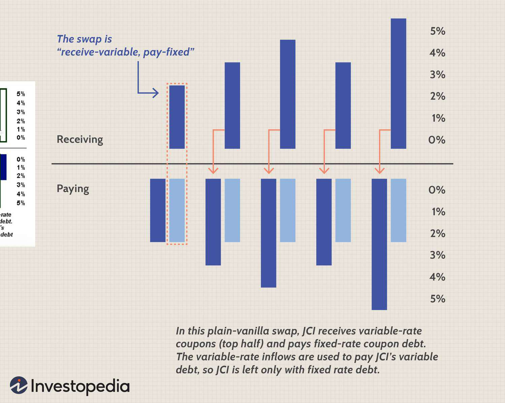

Financial instruments are essential to the efficient functioning of financial markets, providing a mechanism for raising capital, facilitating trade, and managing risks. Key among these instruments are derivatives and mechanisms such as algorithmic trading, which play pivotal roles in enhancing the operational efficiency of financial markets. Derivatives, as complex financial contracts, derive their value from underlying assets, such as stocks, bonds, or commodities, and are instrumental in risk management and speculative strategies. They allow investors to hedge against potential negative price movements, providing a layer of security and predictability in volatile markets.

Algorithmic trading, on the other hand, involves using computer algorithms to execute trades at high speeds and volumes, often without human intervention. This method has become increasingly prevalent due to its ability to process vast amounts of data and make real-time decisions, thereby enhancing market liquidity and efficiency. Algorithms can incorporate derivatives into their strategies to exploit market inefficiencies, execute complex trading strategies, and manage risk effectively. 



As financial markets evolve, the integration of derivatives within algorithmic trading strategies has gained prominence. This synergistic relationship presents opportunities for optimizing trade execution, managing financial risks, and leveraging market trends to achieve investment goals. However, it also introduces complexities and potential risks that necessitate robust risk management practices. Understanding these interactions is crucial for financial professionals seeking to navigate the dynamic landscape of contemporary financial markets. The subsequent sections of this article will explore the integration of derivatives in algorithmic trading strategies, the importance of risk management, potential risks, and the best practices to mitigate them, ultimately providing comprehensive insight into these critical aspects of modern finance.

## Table of Contents

## Understanding Financial Instruments

Financial instruments, encompassing a wide array of assets such as stocks, bonds, derivatives, and commodities, play pivotal roles in investment and trading by fulfilling diverse functions. Stocks represent equity ownership in companies and entitle shareholders to a portion of the company's profits. Bonds are debt securities that allow issuers to raise capital by borrowing from investors, promising repayment with interest. Commodities include tangible goods such as gold, oil, and agricultural products that investors trade on the basis of supply and demand dynamics.

Derivatives stand out as complex financial contracts whose value is contingent upon the performance of underlying assets. These underlying assets can be securities, commodities, interest rates, or market indexes. Common forms of derivatives include options, futures, forwards, and swaps. For instance, an option gives the holder the right, but not the obligation, to buy or sell an asset at a predetermined price on or before a certain date. Futures contracts obligate the transacting parties to exchange an asset at a specified price on a future date.

One of the primary functions of derivatives is risk management. They provide mechanisms for hedging against potential adverse price movements of underlying assets, thereby safeguarding investments. For example, a farmer might use futures contracts to lock in the price of their crop months before harvest, mitigating the risk of price fluctuations. These instruments also offer investors opportunities for speculation, enabling them to potentially profit from short-term price movements without owning the underlying asset.

Effective risk management is essential when dealing with financial instruments, especially derivatives. Risk management strategies often involve utilizing models like Value at Risk (VaR). VaR estimates the maximum potential loss over a given time period at a particular confidence level. For instance, if a portfolio has a one-day VaR of $1 million at a 95% confidence level, it implies that there is a 5% chance the portfolio could lose more than $1 million in a single day.

Risk management strategies also include diversification, stress testing, and the use of derivatives to hedge positions. Diversification involves spreading investments across various assets to reduce exposure to any single asset or risk [factor](/wiki/factor-investing). Stress testing evaluates how a portfolio would fare under extreme market conditions. Together, these strategies form a comprehensive approach to anticipate and mitigate financial risks, ensuring that investors are better equipped to handle unforeseen adverse events. 

The dynamic nature of financial instruments, particularly derivatives, necessitates a thorough understanding of their mechanisms and the implementation of robust risk management practices. This not only helps in protecting investments but also offers avenues for strategic growth and financial innovation in the complex landscape of investment and trading.

## Role of Derivatives in Risk Management

Derivatives are essential tools in risk management, providing mechanisms to hedge against various types of risks such as market, credit, and [liquidity](/wiki/liquidity-risk-premium) risks. Through instruments like futures, options, and swaps, firms can protect themselves against adverse price movements by securing prices for underlying assets in advance. This prerogative enables companies to maintain stability in volatile market conditions by mitigating potential losses.

In financial markets, derivatives serve dual purposes: they are used for hedging strategies and speculative opportunities. For hedging, derivatives ensure that businesses and investors can offset potential losses due to fluctuations in market prices. For instance, a company anticipating a rise in commodity prices can use futures contracts to lock in current prices, thus shielding itself from future price spikes. In contrast, speculators might use derivatives to gain from price movements without the intent of owning the actual asset.

The use of derivatives in risk management is not without challenges. Foremost among these are the complexity and leverage associated with derivative instruments. Leverage allows market participants to control large positions with relatively smaller amounts of capital, which can amplify both gains and losses. Consequently, robust risk management frameworks are imperative to oversee derivative positions effectively.

Risk controls are critical components of these frameworks. Stress testing is a method employed to simulate adverse market conditions and assess the potential impact on a portfolio. This practice helps in identifying vulnerabilities and ensuring that sufficient capital reserves are maintained. Moreover, setting risk limits is a prudent approach to prevent excessive exposures and ensure adherence to strategic risk appetites. These limits could include maximum allowable exposure to specific asset classes or predetermined derivatives positions.

Incorporating derivatives into a risk management strategy requires an understanding of their intricacies and potential implications. Adequate risk assessments and control measures ensure that derivatives remain effective tools for hedging and speculative purposes, fostering market stability and safeguarding financial health.

## Algorithmic Trading and Its Implications

Algorithmic trading refers to the utilization of computer algorithms to [carry](/wiki/carry-trading) out trades at exceptionally high speeds, displacing manual intervention in the trading process. This method significantly enhances market efficiency and liquidity by enabling rapid order execution and large-[volume](/wiki/volume-trading-strategy) trade processing, which often results in tighter spreads and lower transaction costs. By automatically processing real-time data, algorithms can make precise decisions swiftly, capitalizing on fleeting market opportunities that human traders might overlook.

Despite these advantages, [algorithmic trading](/wiki/algorithmic-trading) introduces notable risks, such as flash crashes. Flash crashes occur when algorithms react to market anomalies, causing extreme price fluctuations in a very short time. The speed and complexity of algorithmic systems can exacerbate market [volatility](/wiki/volatility-trading-strategies), potentially leading to significant market destabilization during rapid shifts.

Algorithmic trading systems are built to analyze real-time data and make decisions based on predefined strategies. For example, an algorithm might continuously monitor market data and employ strategies like statistical [arbitrage](/wiki/arbitrage) or [market making](/wiki/market-making) to exploit market inefficiencies. However, these systems can be vulnerable to coding errors that may lead to unexpected trading behaviors. A minor programming mistake can cascade, influencing millions of trades in seconds and possibly resulting in substantial financial losses.

Mitigating the risks associated with algorithmic trading requires rigorous oversight and risk management strategies. Strategies include real-time monitoring and implementing circuit breakers to halt trading during extreme market conditions. Regulators may also impose constraints on algorithm designs to ensure stability. Establishing rigorous pre-deployment testing and ongoing software audits can be instrumental in identifying and rectifying potential errors within algorithms. Moreover, firms often deploy risk management techniques, including stress testing under various market scenarios, to anticipate and mitigate potential downsides from extreme market movements or algorithm failures.

In summary, while algorithmic trading significantly enhances market operations through efficiency and liquidity improvements, it demands meticulous risk management practices. Proper oversight and strategic safeguards are crucial in preventing the adverse effects of rapid trading environments and ensuring market stability.

## Integration of Derivatives in Algorithmic Trading Strategies

Derivatives are essential in the development of sophisticated algorithmic trading strategies due to their ability to exploit market inefficiencies. These financial instruments, including futures, options, and swaps, offer unique characteristics that algorithms can leverage to execute advanced trading strategies.

Futures contracts, which obligate the purchase or sale of an asset at a predetermined future date and price, allow algorithms to capitalize on price movements anticipated by model predictions. Options, providing the right but not the obligation to buy or sell an asset at a specific price before a certain date, can be used in strategies such as delta hedging. In delta hedging, algorithms maintain a delta-neutral portfolio by adjusting the proportions of stock and options to mitigate the price movements' impact. Swaps, agreements to exchange cash flows or other financial instruments, support strategies designed to manage [interest rate](/wiki/interest-rate-trading-strategies) risks and currency fluctuations.

Algorithmic trading relies on several mathematical models and techniques. For example, algorithms using Black-Scholes options pricing model can determine the theoretical fair value of options, aiding in dynamic hedging strategies. Python example for calculating the Black-Scholes price:

```python
from math import log, sqrt, exp
from scipy.stats import norm

def black_scholes(S, K, T, r, sigma, option_type='call'):
    d1 = (log(S / K) + (r + (sigma ** 2) / 2) * T) / (sigma * sqrt(T))
    d2 = d1 - sigma * sqrt(T)

    if option_type == 'call':
        option_price = S * norm.cdf(d1) - K * exp(-r * T) * norm.cdf(d2)
    elif option_type == 'put':
        option_price = K * exp(-r * T) * norm.cdf(-d2) - S * norm.cdf(-d1)
    return option_price

# Example usage
S = 100  # Current stock price
K = 100  # Option strike price
T = 1    # Time to expiration in years
r = 0.05 # Risk-free interest rate
sigma = 0.2 # Volatility of the underlying asset

call_price = black_scholes(S, K, T, r, sigma, 'call')
```

To ensure these strategies are effective, robust risk management practices are necessary. Algorithms that incorporate derivatives must be capable of real-time monitoring, ensuring they adjust to market changes instantaneously. Risk limits must be established to prevent undesirable losses, integrating stop-loss orders and stress-testing processes to maintain control over leveraged positions.

Successful integration of derivatives in algorithmic trading not only enhances trading efficiency but also augments risk management capabilities within complex financial landscapes. By doing so, financial institutions can respond to market changes swiftly and effectively while mitigating potential risks associated with trading volatile derivatives.

## Challenges and Risks in Managing Derivatives and Algorithms

Managing derivatives and algorithmic trading requires addressing both operational complexity and regulatory challenges to maintain market stability. Derivatives, by their nature, are intricate financial instruments whose management necessitates an understanding of underlying asset behavior, market conditions, and potential leverage impacts. When these are combined with algorithmic trading, which executes trades at high speeds and volumes, the complexity magnifies, introducing unique challenges.

### Systemic Risks

High-frequency trading ([HFT](/wiki/high-frequency-trading-strategies)), a subset of algorithmic trading, has brought efficiency but also systemic risks, particularly evident in events like the "flash crash" of May 6, 2010. During such episodes, rapid algorithmic trading can exacerbate market volatility and lead to liquidity shortages. Algorithmic failures, such as incorrect execution logic or reaction to erroneous market data, could destabilize financial markets, creating widespread disruptions.

### Balancing Innovation and Stability

The challenge lies in crafting regulatory frameworks that foster innovation while ensuring market integrity. Regulations like the Dodd-Frank Act and the Markets in Financial Instruments Directive II (MiFID II) are attempts to impose necessary oversight and controls. They aim to ensure transparency, manage systemic risks, and protect investors from the potential pitfalls of complex trading strategies.

### Risk Mitigation Tools

To mitigate these risks, several tools and methodologies can be employed:

1. **Real-Time Monitoring**: Continuous monitoring systems are essential for catching anomalies or errors that could lead to substantial losses or market disturbances before significant damage ensues.

2. **Stress Testing**: This involves simulating extreme market conditions to evaluate the resilience of trading strategies and the robustness of risk management frameworks. Stress tests help in understanding how portfolios might behave in adverse conditions, allowing preemptive adjustments.

3. **Robust Risk Controls**: Implementing predefined risk limits, automated stop-loss mechanisms, and circuit breakers to prevent extreme losses from unforeseen price movements are part of effective risk management practices.

### Continuous Adaptation and Technological Investment

As financial markets and technologies evolve, so must the systems and processes that govern them. Continuous adaptation is required to keep pace with advancements in technology and changes in market dynamics. Investing in cutting-edge solutions such as [machine learning](/wiki/machine-learning) algorithms can enhance predictive analytics capabilities, offering better foresight into potential risks and opportunities.

Moreover, regular audits and updates to trading systems help preemptively address vulnerabilities that might emerge due to new technological landscapes or shifts in market behavior. By focusing on these areas, financial institutions can better navigate the complexities associated with derivatives and algorithmic trading, ensuring both growth and stability in ever-evolving markets.

## Regulatory Framework and Best Practices

Regulatory frameworks govern the activities of derivatives and algorithmic trading to ensure stability and integrity in financial markets. These frameworks are critical for mitigating systemic risks and safeguarding market participants.

**Compliance with Key Regulations:**

1. **Dodd-Frank Act:** Enacted in response to the 2008 financial crisis, the Dodd-Frank Wall Street Reform and Consumer Protection Act aims to reduce risks in the U.S. financial system. It imposes strict regulations on derivatives trading, including mandatory clearing and reporting of over-the-counter (OTC) derivatives through central counterparties, improving transparency and reducing counterparty risk.

2. **MiFID II (Markets in Financial Instruments Directive II):** This European Union directive enhances transparency across the EU's financial markets and standardizes the regulatory disclosures required for particular markets. MiFID II significantly impacts algorithmic and high-frequency trading by imposing rules on trading venues, such as registered algorithms’ testing and ensuring operational resilience and compliance.

3. **Basel III:** This global regulatory framework, developed in response to shortcomings of Basel II following the financial crisis, focuses on strengthening bank capital requirements. It emphasizes liquidity risk management and mandates banks to maintain higher quality capital to absorb shocks arising from financial and economic stress, impacting how institutions manage derivatives exposure.

**Best Practices for Market Integrity:**

- **Comprehensive Risk Assessments:** Financial institutions should conduct regular and thorough risk assessments to identify potential exposures in trading activities. This involves stress testing scenarios to understand the impact of market volatilities on derivatives and algorithmic trades.

- **Algorithm Testing:** Rigorous testing of trading algorithms is essential to ensure they perform as expected under various market conditions. Testing should include backtesting using historical data, simulating potential market scenarios, and verifying compliance with applicable regulations.

- **Collateral Management:** Effective collateral management practices are crucial for mitigating counterparty risk in derivatives trading. Institutions should ensure that collateral requirements are met, and procedures for valuation and substitution are in place to minimize exposure during market disruptions.

**Collaboration and Continuous Improvement:**

- **Regulator-Financial Institution Collaboration:** Effective collaboration between regulatory bodies and financial institutions fosters a proactive approach to risk management and compliance. By sharing information and insights, regulators and institutions can develop better frameworks for monitoring market risks.

- **Clear Compliance Protocols and Training:** Organizations should establish and communicate clear compliance protocols to ensure all employees understand the regulatory requirements. Regular training programs can keep practitioners updated on the latest regulations, helping them apply best practices in their operations.

In conclusion, maintaining robust regulatory frameworks and adhering to best practices are fundamental to ensuring that derivatives and algorithmic trading practices support a stable and efficient financial system.

## The Future of Financial Instruments, Derivatives, and Algorithmic Trading

Technological advancements are continuously transforming financial markets, with [artificial intelligence](/wiki/ai-artificial-intelligence) (AI), machine learning (ML), and blockchain standing at the forefront of this evolution. These technologies enhance the efficiency, speed, and precision of trading strategies, promising significant improvements over traditional methods.

AI and ML allow for highly sophisticated trading algorithms capable of processing vast amounts of data in real time. These algorithms can identify patterns and predict market movements with increased accuracy, facilitating better-informed trading decisions. For example, using supervised learning, historical price data can be used to predict future prices, while unsupervised learning can uncover hidden patterns in large datasets. Moreover, [reinforcement learning](/wiki/reinforcement-learning) enables algorithms to adapt dynamically to changing market conditions, continuously optimizing trading strategies.

Blockchain technology offers the potential to revolutionize derivatives trading by enhancing transparency and security. By utilizing decentralized ledgers, blockchain can ensure that all parties have access to the same information, reducing the risk of disputes and fraud. Smart contracts, self-executing agreements with the terms of the contract directly written into code, can be used to automate settlements and ensure that transactions are both faster and more reliable.

Furthermore, big data analytics significantly enhances risk management capabilities. The ability to analyze large volumes of data from diverse sources allows for improved identification and assessment of risks. Real-time risk monitoring systems can detect and respond to potential threats almost instantaneously, minimizing losses and enhancing market stability.

However, these opportunities come with a set of challenges, primarily related to systemic risks. The increased reliance on technology could lead to vulnerabilities, especially if there are coding errors or cybersecurity breaches. As such, advanced frameworks are necessary to address these risks. Ensuring the integrity and reliability of these new systems will be essential to maintaining market stability.

In conclusion, while technological advancements offer profound benefits for financial markets, ongoing innovation must be matched by robust regulatory and risk management frameworks to mitigate potential systemic risks effectively.

## Conclusion

Derivatives and algorithmic trading have emerged as pivotal components in the modern financial landscape, playing a crucial role in managing risks and enhancing the efficiency of markets. They enable market participants to hedge against uncertainties, speculate on price movements, and allocate capital more effectively. To fully harness these advantages, understanding the inherent risks and implementing robust risk management practices are paramount. Risk management frameworks must address the complexities and potential volatilities associated with both derivatives and the automation provided by algorithmic trading. 

Collaborative efforts between regulatory bodies and financial institutions are necessary to ensure that innovations in financial instruments align with market integrity and stability. This requires a synchronized approach to regulatory compliance, risk assessment, and operational oversight. Regulatory frameworks such as Dodd-Frank, MiFID II, and Basel III play significant roles in providing guidelines that align industry practices with public interest, ensuring that market participants operate within established boundaries.

As financial markets continue to evolve with rapid technological advancements, continuous research and adaptation of risk management strategies will be vital. Emerging technologies such as artificial intelligence, machine learning, and blockchain present new opportunities and challenges in their application to derivatives and algorithmic trading. These technologies hold the promise of further enhancing trading efficiency and risk management capabilities, although they also necessitate advanced frameworks to manage potential systemic risks.

This article highlights the necessity for continually evolving practices to sustain the benefits that derivatives and algorithmic trading offer. Through iterative advancements and rigorous oversight, the financial industry can navigate the complex dynamics of modern markets, ensuring both innovation and stability are maintained.

## References & Further Reading

Hull, J. C. - *Options, Futures, and Other Derivatives*. This book is a comprehensive resource that examines the various types of derivatives and their applications in risk management and speculative strategies. Hull’s work is foundational for understanding the mechanics and valuation of derivative instruments, and it provides insights into their practical uses in the financial markets.

Aldridge, I. - *High-Frequency Trading: A Practical Guide to Algorithmic Strategies and Trading Systems*. Aldridge offers an in-depth exploration of algorithmic trading, with a focus on high-frequency trading (HFT) strategies. This guide discusses the technology, infrastructure, and algorithms that power HFT, as well as the implications for market liquidity and volatility.

Lopez de Prado, M. - *Advances in Financial Machine Learning*. This book explores the integration of machine learning techniques into financial markets. Lopez de Prado emphasizes algorithmic implementations and provides practical examples of applying machine learning to enhance trading strategies, including aspects related to risk management and trading efficiency.

CFTC and SEC - *Findings regarding the market events of May 6, 2010*. This report provides an official account of the so-called “Flash Crash” of May 6, 2010, an event that highlighted the complexities and risks associated with algorithmic trading. The findings offer critical insights into how high-speed trading can affect market stability and underscore the importance of appropriate regulatory frameworks.

Merton, R. C. - *Theory of Rational Option Pricing*. Merton's seminal work lays the theoretical foundation for option pricing models, drawing connections between stochastic processes and finance. This theory is central to understanding the pricing and hedging of derivatives in contemporary financial markets.

Additional resources and articles on derivatives and algorithmic trading. For further exploration, academic journals, industry reports, and online publications such as “The Journal of Finance”, “Risk.net”, and “Quantitative Finance” provide a wealth of information on the latest trends, technologies, and research developments in derivatives and algorithmic trading.