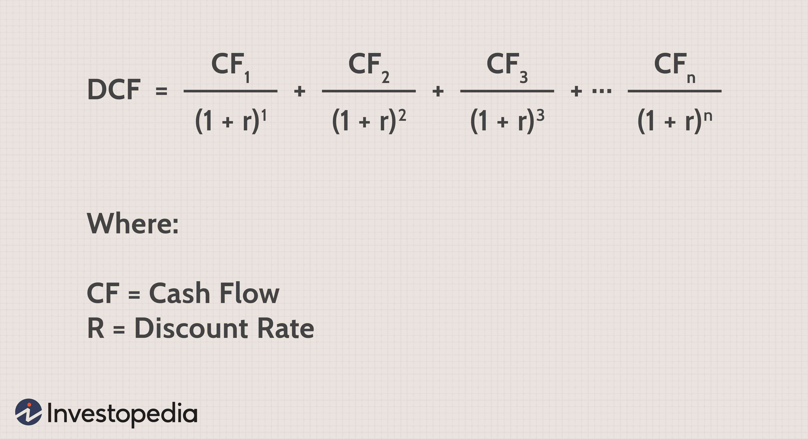

The landscape of real estate investment is evolving rapidly, driven by advances in technology and innovative financial models. Among these, Discounted Cash Flow (DCF) analysis stands out as a vital tool for valuation. DCF analysis is a method employed to assess the value of an investment by estimating its future cash flows and discounting them to present value using an appropriate discount rate. This approach allows investors to make informed decisions about the profitability and viability of real estate opportunities, taking into account factors such as initial costs, maintenance, potential income, and market conditions.

In recent years, the integration of algorithmic trading strategies into real estate investment strategies has become a notable trend. This evolution aims to enhance decision-making processes and optimize returns by leveraging advanced data analytics and computational power. Algorithmic trading, which uses computer algorithms to automatically execute trades based on predefined rules, has traditionally been associated with financial markets. However, its principles are increasingly being applied to real estate to achieve more efficient and precise investment strategies.



This article explores the role of DCF analysis in real estate valuation and its intersection with algorithmic trading. We will address how DCF is utilized to assess the potential of real estate investments, examining its benefits and limitations. Furthermore, we will investigate how DCF analysis can be augmented with insights from algorithmic trading, offering investors a hybrid approach to navigate the complexities of modern real estate markets. As technology continues to redefine investment paradigms, understanding how these tools can work in tandem is crucial for those aiming to maximize returns and make strategic real estate decisions.

## Table of Contents

## Understanding Discounted Cash Flow (DCF) Analysis

Discounted Cash Flow (DCF) analysis is an essential technique for valuing investments, particularly in real estate. This method centers around estimating the value of an investment based on its anticipated future cash flows. The core purpose of DCF analysis is to assess the present value of an asset by applying a discount rate to future cash flows.

The discount rate used in DCF is pivotal as it accounts for the time value of money—a concept that dictates that money available today is worth more than the same amount in the future due to its potential earning capacity. The choice of the discount rate can significantly influence the valuation; it often reflects the required rate of return for the investor, incorporating factors such as inflation and investment risk.

In real estate, DCF analysis considers several critical factors. Initial costs, such as the purchase price and any associated transaction fees, form the starting point. Maintenance costs, including repairs and ongoing upkeep, are also integral to the analysis as they impact the net cash flow generated by the property. Potential income is a key component, encompassing rental income and any appreciation in property value over time.

Understanding DCF is vital for real estate investors as it provides a structured approach to evaluating the financial viability of a property. By determining the present value of anticipated cash flows, investors can make well-informed decisions regarding the acquisition or disposition of real estate assets. This systematic evaluation helps in identifying whether a property is overvalued or undervalued, thereby assisting in strategic investment choices. 

Accurate application of DCF analysis requires careful estimation of future cash flows and an appropriate discount rate. These elements are crucial in ensuring that the valuation mirrors realistic expectations, enabling investors to align their strategies with market conditions and investment goals.

## Application of DCF in Real Estate Valuation

Discounted Cash Flow (DCF) analysis is instrumental in real estate valuation through its ability to estimate the Net Present Value (NPV) of an investment. By discounting future rental incomes and projected sales proceeds, DCF provides investors with a present value for these anticipated cash flows, helping them ascertain the financial viability of a property investment. 

Key components of DCF in real estate include projected cash flows, which are the estimated income streams from rent and property sale; holding periods, which define the duration over which an investor plans to hold the property before selling; and discount rates, which reflect the investor's required rate of return and accounting for risk.

To evaluate properties, real estate investors utilize DCF analysis to forecast potential income streams, thus determining what these future earnings are worth today. This involves assessing individual cash flows over the lifetime of the investment and applying a discount rate to adjust for time and risk. The formula for NPV in a DCF analysis is expressed as:

$$

NPV = \sum \left( \frac{CF_t}{(1 + r)^t} \right) - C_0 
$$

where $CF_t$ represents the cash flow in year $t$, $r$ is the discount rate, and $C_0$ is the initial investment cost.

Among the challenges in applying DCF analysis to real estate is the accurate estimation of variables. Repair costs can vary significantly depending on property condition and unforeseen issues, making initial and ongoing cost estimates crucial. Predicting rental income increases is another difficulty, as relying on historical data may not always capture future market dynamics. Similarly, selecting an appropriate discount rate is crucial; it must adequately reflect the time value of money and the property's risk profile but can vary based on market conditions and investor expectations.

As such, while DCF analysis offers valuable insights and a robust framework for property valuation, it demands precise assumptions and data-driven estimates to deliver reliable investment evaluations.

## Algorithmic Trading in Real Estate

Algorithmic trading utilizes computer algorithms to execute trading decisions automatically, based on pre-defined sets of rules and parameters. This automation enables the rapid assessment and execution of trading strategies, making it particularly suitable for environments where quick decision-making is critical.

In the context of real estate, [algorithmic trading](/wiki/algorithmic-trading) techniques are being employed to facilitate data-driven investment strategies. These algorithms analyze vast quantities of data from diverse sources such as property listings, market trends, historical price data, and economic indicators. By processing this data quickly, they can identify patterns and trends that are not easily discernible through manual analysis.

Key advantages of employing algorithmic trading in real estate include the ability to identify undervalued properties and to optimize the timing of purchases and sales. This optimization stems from the algorithms' use of sophisticated models that consider multiple factors, including market [volatility](/wiki/volatility-trading-strategies) and projected property values. For instance, algorithms might employ regression models or [machine learning](/wiki/machine-learning) techniques to forecast future property prices, taking into account seasonality, location, and macroeconomic factors.

Consider an example of a Python code snippet that demonstrates how a simplistic algorithm might analyze real estate data to predict property prices:

```python
import pandas as pd
from sklearn.model_selection import train_test_split
from sklearn.linear_model import LinearRegression

# Load real estate dataset
data = pd.read_csv('real_estate_data.csv')

# Feature selection
features = data[['location_score', 'size', 'age', 'market_index']]
target = data['price']

# Splitting the dataset into training and testing sets
X_train, X_test, y_train, y_test = train_test_split(features, target, test_size=0.2, random_state=42)

# Initialize and train the model
model = LinearRegression()
model.fit(X_train, y_train)

# Making predictions
predictions = model.predict(X_test)

# Output predictions
print(predictions)
```

The above example showcases a basic predictive model using linear regression to estimate property prices based on selected features. More sophisticated algorithms might incorporate additional data and advanced models like neural networks or decision trees for more accurate predictions.

Moreover, algorithmic trading in real estate is augmented by its ability to adapt to new data continuously. Algorithms can be designed to update their models with the latest market information, ensuring that investment strategies remain relevant amidst changing market conditions.

In summary, the integration of algorithmic trading strategies in real estate provides a powerful mechanism for optimizing investment decisions through rapid data processing and advanced predictive analytics. This approach aligns with the modern investor's need for speed and precision, promising enhanced returns through strategic timing and well-informed market insights.

## Synergy of DCF Analysis and Algorithmic Trading

The integration of Discounted Cash Flow (DCF) analysis with algorithmic trading techniques represents an evolution in the way real estate investments are approached, evaluated, and executed. By leveraging the strengths of both methods, investors can significantly enhance their ability to evaluate and respond swiftly to real-time market dynamics.

One of the most compelling aspects of this synergy is the capacity for real-time data analysis and decision-making. Traditional DCF analysis, while robust, relies on periodic updates to reflect changes in income, expenses, and market conditions. By incorporating algorithmic trading strategies, investors can automate these updates, allowing for a continuous flow of real-time information into the DCF model. This continuous updating mechanism ensures that valuations reflect the most current market conditions, leading to potentially increased profitability of real estate investments.

Algorithmic systems excel in processing large volumes of data efficiently and pinpointing trends or anomalies that may not be immediately apparent to human analysts. When integrated with DCF analysis, these systems can continuously recalibrate input variables, such as projected cash flows and discount rates, using up-to-date market data. For instance, an algorithm might adjust the discount rate based on shifts in the macroeconomic environment, ensuring that the DCF model remains realistic and actionable.

This integration requires a dynamic and responsive investment approach, marrying the thorough, forward-looking valuation techniques inherent in DCF analysis with the rapid data processing and predictive power of algorithmic trading. The seamless fusion of these methodologies allows for a nuanced understanding of market trends and the underlying factors influencing real estate valuations.

The potential of such a combined approach is reflected in various metrics. For example, the Net Present Value (NPV) and Internal Rate of Return (IRR) can be recalculated continuously, providing a near real-time understanding of an investment's viability:

```python
import numpy as np

# Simple example of NPV calculation
def npv(rate, cash_flows):
    return np.sum([cf / (1 + rate)**t for t, cf in enumerate(cash_flows)])

rate = 0.05  # example discount rate
cash_flows = [-100000, 20000, 30000, 40000, 50000]  # example cash flows

print(f"NPV: {npv(rate, cash_flows)}")
```

The code above demonstrates how an investor might apply real-time data to update NPV calculations in response to shifting market conditions. This iterative and responsive recalibration can provide deeper insights, assisting investors in making well-informed decisions promptly.

Ultimately, the integration of DCF analysis with algorithmic trading does not merely enhance existing real estate valuation practices but transforms them, turning static assessments into dynamic analyses that can continually adapt as new data and trends emerge. This strategic synergy exemplifies a forward-thinking approach to real estate investment, harnessing technological advancements to inform and optimize investment strategies.

## Challenges and Considerations

Combining Discounted Cash Flow (DCF) analysis with algorithmic trading in real estate investment introduces both opportunities and challenges. One significant challenge is the complexity of system setups and the requisite technical expertise necessary to effectively integrate these methodologies. Establishing a sophisticated system that accurately merges DCF models with algorithm-driven insights requires robust infrastructure and a comprehensive understanding of both financial models and algorithmic frameworks. 

Another critical [factor](/wiki/factor-investing) is the reliance on high-quality data and the sophistication of the algorithms employed. Data inaccuracies or limitations can lead to flawed analysis and misguided investment decisions. Advanced algorithms necessitate precise and abundant data inputs to perform effectively. Therefore, investors must ensure access to reliable, extensive datasets that accurately reflect market dynamics. Ensuring the algorithms themselves are sophisticated enough to interpret this data correctly is a further technical challenge.

Over-reliance on these models also presents risks. While algorithms can process data far beyond human capabilities, they may not fully account for unforeseen events or market anomalies that can dramatically affect real estate investments. Investors must maintain a balance between algorithmic-driven decisions and human intuition, being aware of external factors such as economic shifts, regulatory changes, or environmental events that could impact the market unpredictably.

Moreover, the landscape of real estate and financial technology is constantly evolving. Therefore, the fusion of DCF and algorithmic trading strategies demands ongoing evaluation and adaptation. As technologies advance and market conditions fluctuate, investors must continually refine their models and strategies to maintain their relevance and effectiveness. This requires a commitment to staying informed about technological advancements and market trends, as well as the flexibility to pivot strategies in response to these changes.

In summary, while the integration of DCF analysis and algorithmic trading can provide powerful insights and advantages in real estate investment, it demands careful consideration of system complexity, data integrity, algorithm sophistication, and adaptability to external changes.

## Conclusion

Discounted Cash Flow (DCF) analysis remains fundamental to real estate valuation due to its meticulous approach in forecasting future financial performance. By evaluating expected future cash flows and discounting them to their present value, DCF provides a comprehensive method to assess the intrinsic value of real estate assets. This technique considers various factors such as initial investment costs, operational expenses, and anticipated income, enabling investors to make informed decisions with a focus on long-term profitability.

The integration of algorithmic trading strategies into real estate investment introduces fresh opportunities for enhanced decision-making processes. Algorithms can analyze large datasets, recognizing patterns and market trends faster than manual analysis. This capability allows investors to gain insights into potential market shifts and capitalize on emerging opportunities. As these technologies advance, the ability to incorporate real-time data into investment strategies becomes increasingly pivotal, offering a competitive edge in optimizing profitability.

The fusion of traditional valuation methodologies with cutting-edge algorithmic trading strategies is poised to redefine future investment practices. This intersection is not merely a technological shift but a strategic evolution that offers adaptability to fluctuating markets. Investors who embrace these advancements and continue to innovate can position themselves advantageously in a rapidly transforming industry.

In an evolving real estate landscape, practitioners who integrate these sophisticated tools may achieve superior returns by leveraging precise valuations and dynamic market analysis. An adaptable approach, aligned with technology advancements and market demands, will be critical for sustained investment success.

## References & Further Reading

[1]: Damodaran, A. (2002). ["Investment Valuation: Tools and Techniques for Determining the Value of Any Asset."](https://archive.org/details/investmentvaluat0000damo_n6k9) Wiley Finance.

[2]: Geltner, D., Miller, N.G., Clayton, J., & Eichholtz, P. (2013). ["Commercial Real Estate Analysis and Investments."](https://www.researchgate.net/publication/245702364_Commercial_Real_Estate_Analysis_and_Investments) OnCourse Learning.

[3]: Fabozzi, F.J., & Peterson Drake, P. (2009). ["Finance: Capital Markets, Financial Management, and Investment Management."](https://books.google.com/books/about/Finance.html?id=mUBsAwAAQBAJ) Wiley.

[4]: Chan, E. (2009). ["Quantitative Trading: How to Build Your Own Algorithmic Trading Business."](https://github.com/ftvision/quant_trading_echan_book) John Wiley & Sons.

[5]: Lopez de Prado, M. (2018). ["Advances in Financial Machine Learning."](https://books.google.com/books/about/Advances_in_Financial_Machine_Learning.html?id=oU9KDwAAQBAJ) Wiley.

[6]: Brooks, C., & Tsolacos, S. (2010). ["Real Estate Modelling and Forecasting."](https://assets.cambridge.org/97805218/73390/frontmatter/9780521873390_frontmatter.pdf) Cambridge University Press.