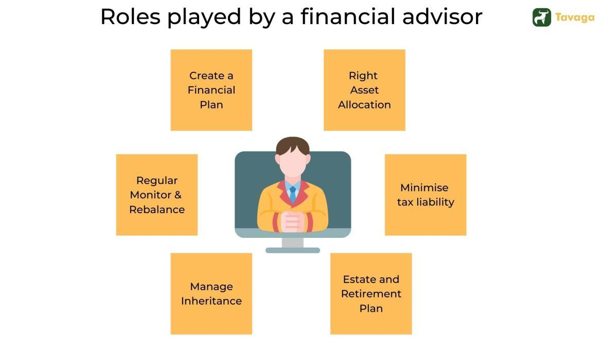

## Table of Contents

## What is a financial advisor and what do they do?

A financial advisor is a professional who helps people with their money. They give advice on how to save, invest, and plan for the future. People go to financial advisors when they need help making big money decisions, like buying a house, saving for retirement, or figuring out how to pay for their kids' college.

Financial advisors look at a person's whole financial situation. They ask about income, debts, and goals. Then, they make a plan that fits the person's needs. This plan might include investing in stocks, bonds, or mutual funds. It could also involve setting up a budget or planning for taxes. The advisor keeps track of the plan and makes changes if needed, helping the person reach their financial goals.

## How can a financial advisor help someone who is just starting to manage their finances?

A financial advisor can be a big help for someone who is just starting to manage their money. They can teach you the basics, like how to make a budget and stick to it. They'll look at how much money you make and how much you spend, then help you figure out where you can save more. They'll also explain simple ways to start saving, like putting money into a savings account every month.

Once you have the basics down, a financial advisor can help you think about the future. They can show you how to start investing, even if you don't have a lot of money. They might suggest putting some money into a retirement account, like a 401(k) or an IRA. They'll explain what these are and how they work. Over time, as you learn more and your money grows, the advisor will keep helping you make smart choices to reach your goals.

## What are the different types of financial advisors and their specializations?

There are different types of financial advisors, each with their own special skills. One type is a certified financial planner (CFP). CFPs are trained to look at your whole financial picture. They help with things like saving for retirement, planning for your kids' college, and making sure you have enough money when you stop working. Another type is a registered investment advisor (RIA). RIAs focus on helping you invest your money in things like stocks, bonds, and mutual funds. They make sure your investments match your goals and how much risk you're okay with taking.

There are also other kinds of financial advisors. For example, a chartered financial analyst (CFA) is really good at analyzing investments and markets. They can help you understand where to put your money to get the best returns. A certified public accountant (CPA) who also gives financial advice can help you with taxes and making sure you're following the law. Each type of advisor has different training and focuses on different parts of your money, so it's good to know what you need help with before choosing one.

## How do you choose the right financial advisor for your needs?

Choosing the right financial advisor starts with knowing what you need help with. If you're just starting out and need help with basics like budgeting and saving, a certified financial planner (CFP) might be a good choice. They look at your whole financial picture and can help you set up a plan that fits your goals. If you're more interested in investing your money, a registered investment advisor (RIA) could be better. They focus on helping you pick the right investments, like stocks or mutual funds, that match your comfort with risk.

Once you know what kind of help you need, it's important to check the advisor's qualifications and experience. Make sure they have the right certifications, like CFP or RIA, and that they have worked with people in situations similar to yours. It's also a good idea to see how they get paid. Some advisors charge a fee for their services, while others might earn money from commissions on the products they sell. Understanding their fee structure helps you know if they're looking out for your best interests. Finally, trust your gut. You should feel comfortable talking to your advisor and confident that they understand your goals and will help you reach them.

## What should you expect during your first meeting with a financial advisor?

During your first meeting with a financial advisor, expect them to ask a lot of questions about your money. They'll want to know how much you earn, how much you spend, and what you owe. They'll also ask about your goals, like if you want to buy a house, save for your kids' college, or plan for retirement. The advisor will listen to your answers and start to understand what you need help with. This meeting is all about getting to know each other and figuring out how the advisor can help you reach your goals.

The advisor might also explain how they work and how they get paid. They could charge you a fee for their time, or they might earn money from selling you certain financial products. It's important to understand this so you know they're looking out for your best interests. By the end of the meeting, you should have a good idea of what the advisor can do for you and whether you feel comfortable working with them. If everything goes well, you'll start making a plan together to help you manage your money better.

## How are financial advisors compensated, and what are the fee structures?

Financial advisors can be paid in different ways. One common way is through fees. They might charge you a flat fee for their services, like a set amount for making a financial plan. Or, they might charge you a percentage of the money they manage for you, usually around 1% each year. This is called an assets under management (AUM) fee. Some advisors also charge by the hour, which can be good if you just need help with a specific problem.

Another way advisors get paid is through commissions. This means they earn money when they sell you certain financial products, like insurance or mutual funds. The company that makes the product pays the advisor a commission. This can be good because you might not have to pay the advisor directly, but it can also mean they might suggest products that pay them more, not necessarily what's best for you. It's important to ask your advisor how they get paid so you know they're working in your best interest.

## What are the benefits of working with a certified financial planner (CFP) versus other types of advisors?

Working with a certified financial planner (CFP) can be really helpful because they look at your whole money situation. They help you with everything from making a budget to planning for retirement. CFPs have to pass a tough test and follow strict rules, so you know they're trained well and will do what's best for you. They can help you set goals and make a plan to reach them, no matter if you're just starting out or already have a lot saved.

Other types of advisors, like registered investment advisors (RIAs) or chartered financial analysts (CFAs), might focus more on just one part of your money, like investing. They're good at what they do, but they might not look at your whole financial picture like a CFP does. If you need help with a lot of different money things, a CFP might be the best choice because they can help you with everything all at once.

## How can financial advisors assist with investment strategies and portfolio management?

Financial advisors can help you figure out the best way to invest your money. They look at how much risk you're okay with taking and what you want to achieve with your investments. Then, they suggest different types of investments, like stocks, bonds, or mutual funds, that fit your goals. They might also talk about how to spread your money out so you're not putting all your eggs in one basket. This is called diversification, and it helps lower the risk of losing money.

Once you start investing, financial advisors keep an eye on your portfolio. They check how your investments are doing and make changes if needed. If the market changes or your goals change, they'll adjust your investments to make sure you're still on track. They can also help you understand when to buy or sell investments, and how to do it in a way that saves you money on taxes. Having a financial advisor means you have someone to guide you through the ups and downs of investing, making it easier to reach your financial goals.

## What role do financial advisors play in retirement planning and estate planning?

Financial advisors are really important when it comes to planning for retirement. They help you figure out how much money you'll need when you stop working and how to save for it. They might suggest putting money into a 401(k) or an IRA, which are special accounts that help you save for retirement. They'll also look at how much risk you're okay with taking and pick investments that fit your goals. As you get closer to retirement, they'll help you decide when to start taking money out and how to make it last as long as possible. They keep an eye on your plan and make changes if needed, so you can feel confident about your future.

Financial advisors also help with estate planning, which is about making sure your money and things go to the right people after you're gone. They can help you write a will, which says who gets what. They might also suggest setting up trusts, which can help your family save on taxes and make sure your wishes are followed. They'll talk to you about what you want to happen and make a plan that fits your family's needs. By working with a financial advisor, you can make sure your money is taken care of and your loved ones are looked after, even when you're not here.

## How can financial advisors help in navigating complex financial situations like divorce or inheritance?

Financial advisors can be a big help when you're going through a divorce. They can look at all your money, like your savings, investments, and debts, and help you figure out how to split everything fairly. They'll also help you understand what you need to do to keep your money safe during the divorce. After the divorce, they can help you make a new plan for your money, so you know how to take care of yourself and maybe even your kids. They'll help you set new goals and make sure you're on the right track to reach them.

When you get an inheritance, a financial advisor can help you figure out what to do with the money. They'll look at your whole financial situation and help you decide if you should spend it, save it, or invest it. They can show you how to use the money to reach your goals, like buying a house or saving for retirement. They'll also help you understand any tax rules that come with getting an inheritance, so you don't have to pay more than you need to. With their help, you can make smart choices and make the most of your inheritance.

## What are the latest trends and technologies that financial advisors are using to enhance their services?

Financial advisors are using new technology to help their clients in better ways. One big trend is using robo-advisors, which are computer programs that help with investing. They use math to pick the best investments for you based on how much risk you want to take. This makes it easier for people to start investing without needing a lot of money. Another trend is using apps and online tools that let you see all your money in one place. These tools can show you your bank accounts, investments, and even your debts all at once, so it's easier to keep track of everything.

Another important technology is artificial intelligence (AI). AI can help advisors look at a lot of information quickly and find patterns that might be hard for a person to see. This can help them give better advice and make smarter investment choices. Also, many advisors are using video calls and online meetings to talk to their clients, which makes it easier to get help no matter where you are. These new tools and trends are making it simpler for people to manage their money and reach their financial goals.

## How can one evaluate the performance and effectiveness of their financial advisor over time?

Evaluating the performance of your financial advisor over time is important to make sure they're helping you reach your goals. One way to do this is by looking at how your investments are doing. Are they growing like you hoped? Are they doing better than the market overall? Your advisor should be able to show you reports that explain how your money is doing and why. It's also good to check if they're sticking to the plan you made together. If your goals or life situation changes, they should be adjusting your plan to fit your new needs.

Another way to evaluate your advisor is by thinking about how they communicate with you. Do they explain things in a way that's easy to understand? Do they answer your questions and keep you updated on your money? A good advisor should make you feel comfortable and confident about your financial decisions. Finally, consider the fees you're paying. Are you getting good value for what you're paying? If you feel like you're not making progress or if you're not happy with how things are going, it might be time to talk to your advisor about it or even look for someone new.

## References & Further Reading

[1]: Lo, A. W., & Hasanhodzic, J. (2010). ["The Heretics of Finance: Conversations with Leading Practitioners of Technical Analysis."](https://www.amazon.com/Heretics-Finance-Conversations-Practitioners-Technical/dp/1576603164) Bloomberg Press.

[2]: Fabozzi, F. J., & Focardi, S. M. (2017). ["Artificial Intelligence in Asset Management."](https://books.google.com/books/about/Equity_Valuation_Science_Art_or_Craft.html?id=AwZGDwAAQBAJ) CFA Institute Research Foundation Briefs.

[3]: Alexandrova-Kabadjova, B., Martínez-Jaramillo, S., García-Almanza, A. L., & Tsang, E. (2012). ["Simulation in Computational Finance and Economics: Tools and Emerging Applications."](https://www.researchgate.net/publication/233743181_Simulation_in_Computational_Finance_and_Economics_Tools_and_Emerging_Applications) IGI Global.

[4]: Bodie, Z., Kane, A., & Marcus, A. J. (2017). ["Investments,"](https://www.mheducation.com/highered/product/Investments-Bodie.html) 11th Edition. McGraw-Hill Education.

[5]: Narang, R. K. (2009). ["Inside the Black Box: The Simple Truth About Quantitative Trading."](https://www.amazon.com/Inside-Black-Box-Quantitative-Trading/dp/0470432063) John Wiley & Sons.