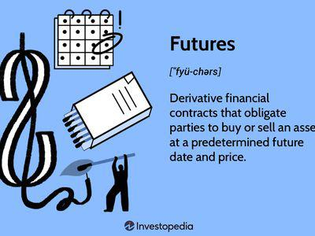

In the volatile world of finance, safeguarding investments is an essential practice. One of the robust strategies employed is hedging with futures, which provides a way to mitigate risk by locking in prices or returns in the face of unpredictable market conditions. This article examines how futures can serve as a crucial element in financial strategies, particularly through their integration with algorithmic trading systems.

Algorithmic trading, characterized by the use of algorithms to automate trading decisions, has revolutionized the speed and accuracy with which futures contracts can be executed. This technological advancement enables traders to swiftly analyze market data, execute trades at optimal prices, and reduce human error, thus enhancing the overall efficacy of hedging strategies. In this context, futures play a critical role by allowing traders to either secure gains or minimize losses in their investment portfolios.



For investors ranging from novice traders to seasoned professionals, understanding the concepts of futures and their application in hedging is vital. Futures contracts obligate the buyer to purchase an asset, or the seller to sell an asset, at a pre-determined future date and price. This characteristic can be used strategically to protect against adverse price movements that might otherwise affect a portfolio's value.

The use of futures in hedging strategies includes both benefits and drawbacks. On the one hand, futures provide leverage, liquidity, and the possibility to hedge against price fluctuations in a cost-effective manner. On the other, they may introduce complexities such as basis risk and the need for margin requirements, which traders must carefully manage.

Join us as we explore how to utilize futures strategically within algorithmic trading platforms to hedge against market uncertainties. We will cover basic concepts, benefits, and potential drawbacks, as well as strategies to effectively employ futures for risk management. Whether you are seeking to bolster your trading knowledge or refine your investment strategy, this guide aims to offer valuable insights into the integration of futures in hedging investments.

## Table of Contents

## Understanding Hedging With Futures

Futures are pivotal instruments in the financial markets, serving as agreements that obligate the buyer to purchase, and the seller to sell, a specific asset at a predetermined future date and price. These contracts are instrumental in hedging strategies, which aim to mitigate undesirable exposure to price volatility in various asset categories, including indices, commodities, and other derivatives.

Hedging with futures typically involves creating offsetting positions that counterbalance potential losses in an investment portfolio. For instance, a portfolio manager concerned about a potential downturn in the stock market might use S&P 500 futures to hedge their stock investments. By taking a short position in S&P 500 futures, any losses in the stock holdings due to a market decline could be offset by gains in the futures position.

Index futures, such as the S&P 500 futures, provide a broad-based hedging mechanism against market risks. They allow investors to hedge against market-wide movements rather than individual stock [volatility](/wiki/volatility-trading-strategies). Similarly, commodity futures, such as oil or wheat contracts, allow producers and consumers to fix prices in advance, thus shielding them from unfavorable price shifts.

For example, an agricultural producer concerned about a decline in crop prices could protect their revenue by short selling futures contracts for the crops they produce. Conversely, a bakery worried about rising wheat prices could go long on wheat futures to lock in current prices. These positions ensure that, regardless of future market movements, the producer or consumer can stabilize their costs and revenue.

The financial principles underpinning futures contracts rely on the concept of margin and leverage. Futures contracts require an initial margin—a fraction of the contract's value—which allows for significant market exposure with a relatively smaller capital outlay. The subsequent daily settlement, known as "marking to market," adjusts the margin account balance based on market movements, ensuring both parties have the necessary collateral to uphold their contract obligations.

Mechanically, using futures contracts as a hedging tool demands a precise understanding of market trends, current and projected asset prices, and the [liquidity](/wiki/liquidity-risk-premium) of the futures markets. Adjustments to hedging positions require careful analysis of these factors to ensure that hedge positions are efficient and effective in mitigating risk exposure.

In summary, hedging with futures constitutes a strategic approach to risk management, offering sophistication and precision in protecting investment portfolios from volatility. By utilizing these financial contracts, investors can achieve a balanced exposure to market risks, fortifying their financial positions against unforeseen price changes.

## Hedging Strategies Using Futures

Hedging strategies using futures involve both short and long hedge methods to protect against unfavorable market movements. These strategies are instrumental in reducing uncertainty and stabilizing the financial performance of investors and corporations.

**Short Hedge Strategies**

A short hedge is employed to shield against a potential decline in the price of an asset. It is particularly useful for producers or holders of a commodity who intend to sell in the future. For instance, agricultural producers often use short futures contracts to safeguard crop prices. A farmer growing wheat, anticipating a downturn in wheat prices, might sell wheat futures contracts. By doing so, the farmer locks in a sales price for a future date, ensuring a more stable revenue stream regardless of market fluctuations.

```python
# Calculating the number of contracts to sell
# Assuming a farmer has 10,000 bushels of wheat and each futures contract covers 1,000 bushels
bushels_to_hedge = 10000
contract_size = 1000
contracts_to_sell = bushels_to_hedge / contract_size
print(f"Contracts to sell: {contracts_to_sell}")
```

**Long Hedge Strategies**

Conversely, a long hedge is suitable for those expecting a future requirement for an asset, intending to purchase later. Take the case of bakeries, which need to manage their exposure to rising wheat costs. A bakery may enter into long futures contracts to lock in a purchase price for wheat, thereby protecting themselves from price surges that could increase their input costs.

**Calculating Hedge Ratios and Contract Selection**

Determining the appropriate hedge ratio is vital for effective hedging. The hedge ratio is calculated using the formula:

$$
\text{Hedge Ratio} = \frac{\text{Value of the Asset being Hedged}}{\text{Value of Futures Contracts}}
$$

An accurate hedge ratio ensures that the futures position offsets the price risk of the underlying asset. The choice of contracts depends on factors such as contract size, expiration date, and liquidity.

**Real-World Applications**

In situations where futures contracts precisely match the hedger's exposure, these instruments can effectively minimize unwanted risks. For example, an airline company anticipating an increase in fuel prices might employ a long hedge using jet fuel futures to stabilize its operating expenses. By selecting suitable futures contracts and calculating precise hedge ratios, the airline can achieve substantial cost savings and predictability in its fuel expenditures.

By adopting well-calculated hedge strategies, both short and long, entities can effectively mitigate price risks and achieve financial stability. Futures provide a reliable mechanism for locking in costs or revenues, facilitated by meticulous planning and execution.

## Role of Algorithmic Trading in Hedging With Futures

Algorithmic trading is transforming the landscape of hedging with futures by automating trade execution and enhancing decision-making accuracy. Through the use of sophisticated algorithms, traders can analyze vast amounts of data in real-time to identify market trends and execute trades swiftly, minimizing the risk of human error. The automation facilitated by these algorithms enables traders to seize fleeting opportunities and lock in favorable prices that might otherwise be missed in manual trading.

In the development and optimization of hedging strategies, several critical components are paramount. First, algorithms must effectively sift through market data to discern patterns and generate predictive insights. This requires robust data processing capabilities and advanced mathematical models that can calibrate even to subtle market signals. Next, algorithms should be equipped with efficient execution modules capable of placing orders at optimal times to maximize the hedging effectiveness. Furthermore, the system must maintain flexibility to adapt to market volatility, which involves dynamically adjusting hedge positions to respond to market developments.

One of the practical applications of [algorithmic trading](/wiki/algorithmic-trading) systems is their capability for real-time monitoring and adjusting of hedge positions. These systems continuously track financial markets, updating hedging positions as necessary to maintain the desired level of risk coverage. This dynamic adjusting ensures that the hedging strategy remains aligned with the trader's risk management goals, even in rapidly changing market conditions. For instance, an algorithm can automatically increase the number of futures contracts used to hedge a portfolio if market indicators signal a higher risk of price volatility.

Backtesting is a significant facet of enhancing hedge efficiency within algorithmic trading. By employing historical data, traders can simulate trading strategies to evaluate their performance before deploying them in live markets. This practice helps identify potential weaknesses in the strategy and offers insights into its robustness across different market environments. For example, a Python-based [backtesting](/wiki/backtesting) framework might involve scripts that model future trades and assess performance metrics like return on investment and risk-adjusted returns. Here is a Python snippet demonstrating a simple backtesting approach:

```python
import pandas as pd

def backtest_strategy(historical_data, strategy_func):
    balance = 10000  # initial balance
    trades = []

    for index, row in historical_data.iterrows():
        decision = strategy_func(row)
        if decision == 'buy':
            trade = {'date': row['date'], 'price': row['price'], 'type': 'buy'}
            trades.append(trade)
            balance -= row['price']
        elif decision == 'sell' and trades:
            trade = trades.pop()
            balance += row['price']

    return balance

# Dummy strategy function
def simple_strategy(row):
    if row['momentum'] > 0.5:
        return 'buy'
    elif row['momentum'] < -0.5:
        return 'sell'
    else:
        return 'hold'

historical_data = pd.DataFrame({'date': ['2023-01-01', '2023-01-02'], 'price': [100, 105], 'momentum': [0.6, -0.7]})
final_balance = backtest_strategy(historical_data, simple_strategy)
print("Final Balance:", final_balance)
```

Algorithmic trading, by executing trades efficiently and optimizing hedging strategies through data-driven insights and real-time monitoring, stands as a valuable tool in managing financial risks through futures. Its ability to backtest strategies using historical data enhances its role by ensuring informed decision-making, which is crucial in achieving successful hedging outcomes.

## Factors to Consider in Hedging a Position

In hedging a position with futures, the initial step is to determine the specific exposure needing mitigation. This involves understanding the nature of risks involved: systematic and unsystematic risks. Systematic risk, inherent to the entire market or market segment, is beyond individual control, such as economic recessions or political instability. In contrast, unsystematic risk pertains to specific assets or companies, like management decisions or product recalls. Futures hedging primarily addresses systematic risk by creating offsetting positions that neutralize broader market volatilities, while unsystematic risks are often managed through diversification within a portfolio.

The effectiveness of futures hedges can be influenced by basis risk, liquidity risk, and market risk. Basis risk arises when the price of the asset underlying the futures contract and the actual asset do not move in perfect correlation, creating a potential gap in hedge effectiveness. Liquidity risk refers to the inability to execute trades without significant price changes, affecting the ability to enter or [exit](/wiki/exit-strategy) futures positions efficiently. Market risk involves broader price volatility that can influence the value of both the asset and the futures contract.

A critical component in futures hedging is determining the optimal hedge ratio. This involves calculating the ratio of futures contracts to hold relative to the size of the position being hedged. Typically, this can be calculated using the formula:

$$
\text{Hedge Ratio} = \frac{\text{Covariance of asset and futures prices}}{\text{Variance of futures prices}}
$$

Selecting appropriate contracts is also essential to align with financial objectives and desired risk coverage. This requires an analysis of factors such as contract size, expiration dates, and pricing mechanisms.

Transaction costs significantly affect hedging decisions. These costs include brokerage fees, commissions, and margin requirements. Margin requirements demand maintaining a specific equity balance in the trading account to cover potential losses, which may constrain capital allocation for other investments. High transaction costs can diminish the benefits of hedging, necessitating careful evaluation of cost-benefit balances.

When constructing a hedging strategy, these factors must be considered comprehensively to ensure alignment with the investor’s financial objectives while managing potential downsides effectively.

## Risks, Limitations, and Alternatives when Hedging with Futures

Hedging with futures is an established method to mitigate price volatility; however, it is not devoid of challenges and risks. One primary risk associated with futures is the potential for a mismatch in contract specifications. Standardized futures contracts have fixed quantities, quality grades, and delivery dates, which might not precisely suit the specific requirements of the hedger. This lack of customization can lead to imperfect hedges, where the hedge does not fully cover the exposure, or over-hedging, where it exceeds the exposure.

Unexpected market gaps represent another risk [factor](/wiki/factor-investing) in futures trading. These gaps can occur due to geopolitical events, economic announcements, or significant market shifts when the futures market is closed. In such situations, the price of futures might open at a level significantly different from the previous close, which can disrupt the hedging strategy.

Standardized futures contracts have inherent limitations because they are designed for general use and might not align perfectly with a hedger's specific needs. This standardization implies that the terms are inflexible, which could create basis risk—the risk that the cash price and the futures price will not move in perfect correlation.

Alternatives to futures can offer more tailored hedging solutions. Forwards, for example, are customizable contracts that can be precisely aligned with the hedger's requirements regarding quantity, quality, and delivery timing. However, they come with counterparty risk, which is the risk that the other party may default on the contract. Options provide the right, but not the obligation, to buy or sell an asset at a predetermined price, offering flexible downside protection for a premium. Swaps, which are agreements to exchange future cash flows, can be used to hedge against changes in interest rates or currency values. Insurance products can also serve as hedging instruments for specific risks by transferring risk to an insurer for a premium.

When constructing a hedging strategy, it's crucial to balance between complete and partial hedging. Complete hedging aims to eliminate all exposure to risk, but it might lead to missed opportunities for gains if the market moves favorably. Partial hedging, on the other hand, allows some level of risk exposure, which might result in a trade-off between potential returns and risk reduction. Each approach needs to be carefully considered based on the hedger’s risk tolerance and financial objectives. 

Ultimately, while futures are effective hedge instruments, understanding their risks and limitations and exploring alternatives enables investors to fulfill their specific hedging needs while managing a balanced risk-reward profile.

## Conclusion

Hedging with futures represents a formidable strategy in financial management, offering investors the ability to lock in prices and manage associated risks effectively. By engaging in this practice, individuals and institutions can create a level of predictability in an otherwise volatile market, safeguarding their investments against unwanted price fluctuations. This strategy is particularly beneficial in markets characterized by high volatility, where price movements can significantly impact value and profitability.

Algorithmic trading further enhances the effectiveness of hedging with futures by bringing precision and speed to trade execution. By leveraging algorithms, traders can analyze vast amounts of market data swiftly and execute trades at optimal prices, thus reducing the likelihood of human error. Automated systems allow for real-time adjustments to hedge positions, ensuring that the strategy remains aligned with current market conditions. The integration of historical data backtesting within these systems aids in refining hedging approaches, optimizing outcomes for investors.

However, while futures hedging is a potent tool, understanding its inherent risks and exploring viable alternatives is crucial for holistic risk management. Investors need to be aware of potential issues such as discrepancies in contract specifications and unexpected market gaps, which could impact the effectiveness of a hedge. Alternatives like options, swaps, and insurance products offer different levels of risk mitigation and should be considered as part of a comprehensive risk strategy.

Personal risk tolerance, prevailing market conditions, and specific investment goals are critical factors that should guide the construction of a hedging strategy. These considerations ensure that strategies are tailored to meet individual financial objectives, achieving a balance between potential returns and risk exposure.

Continuous learning and adaptation are essential for success in dynamic markets. As financial instruments and market technologies evolve, staying informed and embracing new tools is crucial for maintaining and enhancing hedging effectiveness. By remaining open to innovation and adjusting strategies accordingly, investors can navigate market uncertainties with confidence and achieve successful hedging outcomes.

## References & Further Reading

[1]: Hull, J. C. (2014). ["Options, Futures, and Other Derivatives"](https://www.amazon.com/Options-Futures-Other-Derivatives-9th/dp/0133456315). Pearson Education Limited.

[2]: Black, F., & Scholes, M. (1973). ["The Pricing of Options and Corporate Liabilities."](https://www.cs.princeton.edu/courses/archive/fall09/cos323/papers/black_scholes73.pdf) Journal of Political Economy, 81(3), 637-654.

[3]: Murphy, J. J. (1999). ["Technical Analysis of the Financial Markets: A Comprehensive Guide to Trading Methods and Applications"](https://archive.org/details/technicalanalysi0000murp). New York Institute of Finance.

[4]: De Prado, M. L. (2018). ["Advances in Financial Machine Learning"](https://www.amazon.com/Advances-Financial-Machine-Learning-Marcos/dp/1119482089). Wiley.

[5]: Chan, E. (2008). ["Quantitative Trading: How to Build Your Own Algorithmic Trading Business"](https://github.com/ftvision/quant_trading_echan_book). Wiley Trading.

[6]: Aronson, D. R. (2007). ["Evidence-Based Technical Analysis: Applying the Scientific Method and Statistical Inference to Trading Signals"](https://onlinelibrary.wiley.com/doi/book/10.1002/9781118268315). Wiley.

[7]: Jansen, S. (2020). ["Machine Learning for Algorithmic Trading"](https://github.com/stefan-jansen/machine-learning-for-trading). Packt Publishing.

[8]: Goodfellow, I., Bengio, Y., & Courville, A. (2016). ["Deep Learning"](https://www.deeplearningbook.org/). MIT Press.