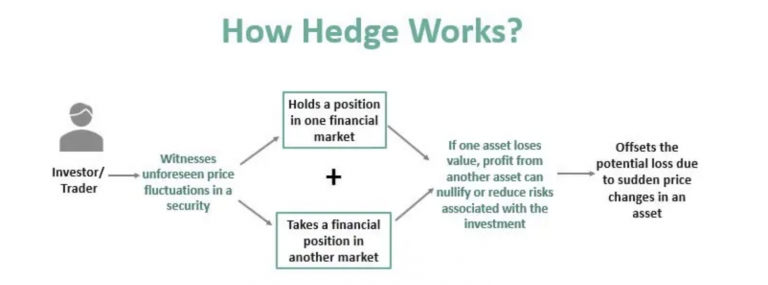

## Table of Contents

## What are futures and how do they work?

Futures are contracts that let you buy or sell something at a set price on a specific date in the future. They are used for things like farm products, oil, or financial stuff like stock market indexes. People use futures to guess if prices will go up or down, or to protect themselves from price changes.

When you buy a future, you're agreeing to buy the thing at the set price when the contract ends. If the price goes up, you can make money because you bought it cheaper before. But if the price goes down, you might lose money. Selling a future means you agree to sell at the set price later. If the price drops, you make money because you sold it at a higher price before. But if the price rises, you might lose money. Futures can be risky, so you need to be careful.

## What is hedging and why is it important in trading?

Hedging is like buying insurance for your investments. When you hedge, you do something to protect your money from big changes in the market. Imagine you own a bunch of stocks, and you're worried their prices might go down. You can use hedging to make sure you don't lose too much money if that happens. It's a way to balance out the risk so you can sleep better at night, knowing your investments are safer.

Hedging is important in trading because it helps you manage risk. No one can predict the future, and the market can be unpredictable. By using hedging strategies, traders can protect themselves from sudden drops in prices or other unexpected events. This means they can keep their investments safe and continue trading without worrying too much about losing everything. It's a key part of smart trading and can make a big difference in the long run.

## How can futures be used to hedge against price fluctuations?

Futures can be used to hedge against price fluctuations by locking in prices for future transactions. Let's say you're a farmer who grows wheat. You can sell wheat futures to guarantee a price for your wheat months before you even harvest it. If the price of wheat drops by the time you're ready to sell, you're protected because you already locked in a higher price with the futures contract. This way, you know exactly how much money you'll get, no matter what happens to the market price.

On the other hand, if you're a company that needs to buy wheat, you can use futures to protect yourself from rising prices. You can buy wheat futures to set a price now for wheat you'll need later. If the price of wheat goes up, you're safe because you already bought at a lower price. This helps you plan your costs better and avoid surprises. By using futures to hedge, both buyers and sellers can manage their risks and feel more secure about their financial future.

## What are the basic steps to start hedging with futures?

To start hedging with futures, first, you need to understand what you want to protect. If you're a farmer, you might want to lock in a good price for your crops. If you're a business, you might want to secure a price for something you need to buy later. Once you know what you're hedging, you need to find the right futures contract. These contracts are traded on special markets called futures exchanges. You can find contracts for lots of things, like corn, oil, or even stock market indexes.

Next, you need to decide how many futures contracts you need. This depends on how much of the thing you're trying to protect. For example, if you're a farmer with a big wheat field, you'll need more contracts than someone with a small field. Once you've figured that out, you can buy or sell the futures through a broker. A broker is someone who helps you make trades on the futures market. After you've made your trade, you just wait until the contract ends. If prices moved against you, the futures help you break even or lose less money. If prices moved in your favor, you might make a little extra, but the main goal is to protect yourself, not to make a big profit.

## What types of positions can be hedged using futures?

You can use futures to hedge many different types of positions. For example, if you're a farmer, you can hedge the price of your crops like wheat or corn. If you run a business that uses a lot of oil or other commodities, you can hedge the price of those things to protect against rising costs. Even if you invest in stocks or stock market indexes, you can use futures to hedge against big drops in the stock market. The key is to find a futures contract that matches what you're trying to protect.

Hedging with futures works for both buying and selling positions. If you need to buy something in the future, like a manufacturer needing raw materials, you can buy futures to lock in a price now. This way, if prices go up, you're safe because you already set a lower price. On the other hand, if you're selling something in the future, like a farmer selling their harvest, you can sell futures to lock in a good price now. If prices drop, you're protected because you already agreed to sell at a higher price. So, whether you're buying or selling, futures can help you manage the risk of price changes.

## How do you calculate the number of futures contracts needed for hedging?

To figure out how many futures contracts you need for hedging, you first need to know how much of the thing you want to protect. If you're a farmer with 10,000 bushels of wheat, you're trying to hedge those 10,000 bushels. Then, you look at the size of one futures contract. A wheat futures contract might cover 5,000 bushels. To find out how many contracts you need, you divide the amount you want to hedge by the size of one contract. In this case, 10,000 bushels divided by 5,000 bushels per contract equals 2 contracts.

Once you have the basic number of contracts, you might want to adjust it a bit. Sometimes, you might not want to hedge all of your position because you think part of it might still go your way. Or maybe you want to hedge more than you have to be extra safe. This is called over-hedging or under-hedging. You can decide how much you want to hedge based on how much risk you're comfortable with. The main thing is to make sure you're using the right number of contracts to protect what you need to, without taking on too much extra risk.

## What are the risks associated with using futures for hedging?

Using futures for hedging can help protect you from price changes, but it also comes with some risks. One risk is that the price of the thing you're hedging might move in a way you didn't expect. For example, if you're a farmer who sold wheat futures to lock in a price, and then the price of wheat goes up a lot, you might miss out on making more money. This is called opportunity cost. Also, futures markets can be unpredictable and sometimes move in big ways, which can make your hedging plan not work as well as you hoped.

Another risk is that futures contracts need something called margin, which is like a deposit to make sure you can pay if things go wrong. If the market moves against you, you might need to put in more money to keep your position. This is called a margin call, and if you can't meet it, you could lose your position and any money you put in. Futures also have something called basis risk, which means the price of the futures contract might not move exactly the same way as the price of the thing you're trying to hedge. This can make your hedge less effective than you planned.

## Can you explain the concept of basis risk in futures hedging?

Basis risk in futures hedging is the chance that the price of the futures contract you're using doesn't move the same way as the price of the thing you're trying to protect. Let's say you're a farmer hedging your wheat with wheat futures. The price of wheat in the market might go up, but the price of the wheat futures might not go up by the same amount. This difference between the two prices is called the basis, and it can make your hedge not work as well as you hoped.

For example, imagine you locked in a price for your wheat using futures, but by the time you're ready to sell your wheat, the market price for wheat has gone up a lot more than the futures price. You're still protected from a big drop in price, but you might miss out on some of the extra money you could have made. Basis risk is something you need to think about when you're using futures to hedge, because it can affect how well your plan works.

## How does one choose the right futures contract for hedging a specific position?

Choosing the right futures contract for hedging depends on what you're trying to protect. If you're a farmer with wheat to sell, you'd pick a wheat futures contract. If you're a business that needs to buy oil, you'd choose an oil futures contract. The key is to find a futures contract that matches the thing you're trying to hedge. You also need to check the contract's size, which tells you how much of the thing one contract covers. For example, a wheat futures contract might cover 5,000 bushels. Make sure the contract's size fits what you need to hedge.

Another thing to think about is when the futures contract ends. You want the contract to end around the same time you'll be buying or selling the thing you're hedging. If you're selling wheat in September, you'd pick a September wheat futures contract. This helps make sure your hedge works when you need it to. Also, consider the market where the futures are traded. Different markets might have different rules or costs, so pick one that works best for you. By matching the futures contract to what you're hedging, when you need it, and where it's traded, you can set up a good hedge.

## What are some advanced strategies for hedging with futures?

One advanced strategy for hedging with futures is called a "stack and roll" approach. This means you use a bunch of futures contracts that end at different times to keep your hedge going for a long time. Imagine you're a farmer who wants to protect the price of your wheat for the whole year. You could use a futures contract that ends in March, another that ends in June, and another that ends in September. As each contract gets close to ending, you "roll" it into the next one, kind of like passing the baton in a relay race. This way, you always have a hedge in place, no matter what the market does.

Another advanced strategy is called "delta hedging." This one is a bit trickier because it involves keeping an eye on how much the price of the futures contract changes compared to the price of what you're hedging. Let's say you're using stock index futures to protect your stock portfolio. You need to figure out how many futures contracts to use based on how much the futures price moves when the stock market moves. If the market goes up or down a lot, you might need to adjust the number of futures contracts to keep your hedge working right. It's like constantly fine-tuning your hedge to make sure it's doing its job.

These strategies can help you manage risk better, but they also need more work and watching. You have to keep an eye on the markets and be ready to make changes to your hedge as things change. It's a bit like playing a game where you need to keep adjusting your moves to stay ahead. But if you do it right, these advanced strategies can give you more control over your financial future.

## How do regulatory and market conditions affect futures hedging strategies?

Regulatory and market conditions can really change how you use futures to hedge. Rules from places like the Commodity Futures Trading Commission (CFTC) can affect what you can do with futures. For example, they might set limits on how many futures contracts you can have at once. These rules are there to keep the market fair and safe, but they can make it harder to set up the hedge you want. Also, if the government changes the rules about what you need to do to trade futures, like how much money you need to put down, it can affect your plans. You might need to adjust your strategy to follow the new rules.

Market conditions are also important. If the market is really up and down, it can be harder to predict what will happen, and your hedge might not work as well. For example, if there's a big surprise like a war or a natural disaster, prices can jump around a lot. This can make the difference between the futures price and the price of what you're hedging bigger, which is called basis risk. Also, if there's not a lot of trading going on in the futures market, it can be harder to buy or sell the contracts you need. You might need to change your strategy to deal with these market changes, like using different futures contracts or adjusting how much you hedge.

## What are the tax implications of using futures for hedging?

When you use futures for hedging, it can affect your taxes. In the United States, the IRS treats futures trading a bit differently than other kinds of investments. If you're using futures to hedge, you might be able to use something called "Section 1256 contracts." This means that any gains or losses from your futures trading are treated as 60% long-term capital gains and 40% short-term capital gains, no matter how long you held the contracts. This can be good because long-term capital gains usually have lower tax rates than short-term gains.

But, you need to be careful to follow the rules. The IRS wants to make sure you're really using futures to hedge, not just to make money. If they think you're just trading futures to make a profit, they might not let you use the special tax treatment. Also, if you're hedging as part of your business, like a farmer hedging crop prices, you might be able to treat your futures gains and losses as part of your business income. This can be different from how you'd treat them if you were just investing. It's a good idea to talk to a tax professional to make sure you're doing everything right and taking advantage of any tax benefits you can.

## What are Hedging Strategies Using Futures?

Hedging strategies using futures involve both short and long hedge methods to protect against unfavorable market movements. These strategies are instrumental in reducing uncertainty and stabilizing the financial performance of investors and corporations.

**Short Hedge Strategies**

A short hedge is employed to shield against a potential decline in the price of an asset. It is particularly useful for producers or holders of a commodity who intend to sell in the future. For instance, agricultural producers often use short futures contracts to safeguard crop prices. A farmer growing wheat, anticipating a downturn in wheat prices, might sell wheat futures contracts. By doing so, the farmer locks in a sales price for a future date, ensuring a more stable revenue stream regardless of market fluctuations.

```python
# Calculating the number of contracts to sell
# Assuming a farmer has 10,000 bushels of wheat and each futures contract covers 1,000 bushels
bushels_to_hedge = 10000
contract_size = 1000
contracts_to_sell = bushels_to_hedge / contract_size
print(f"Contracts to sell: {contracts_to_sell}")
```

**Long Hedge Strategies**

Conversely, a long hedge is suitable for those expecting a future requirement for an asset, intending to purchase later. Take the case of bakeries, which need to manage their exposure to rising wheat costs. A bakery may enter into long futures contracts to lock in a purchase price for wheat, thereby protecting themselves from price surges that could increase their input costs.

**Calculating Hedge Ratios and Contract Selection**

Determining the appropriate hedge ratio is vital for effective hedging. The hedge ratio is calculated using the formula:

$$
\text{Hedge Ratio} = \frac{\text{Value of the Asset being Hedged}}{\text{Value of Futures Contracts}}
$$

An accurate hedge ratio ensures that the futures position offsets the price risk of the underlying asset. The choice of contracts depends on factors such as contract size, expiration date, and [liquidity](/wiki/liquidity-risk-premium).

**Real-World Applications**

In situations where futures contracts precisely match the hedger's exposure, these instruments can effectively minimize unwanted risks. For example, an airline company anticipating an increase in fuel prices might employ a long hedge using jet fuel futures to stabilize its operating expenses. By selecting suitable futures contracts and calculating precise hedge ratios, the airline can achieve substantial cost savings and predictability in its fuel expenditures.

By adopting well-calculated hedge strategies, both short and long, entities can effectively mitigate price risks and achieve financial stability. Futures provide a reliable mechanism for locking in costs or revenues, facilitated by meticulous planning and execution.

## What factors should be considered when hedging a position?

In hedging a position with futures, the initial step is to determine the specific exposure needing mitigation. This involves understanding the nature of risks involved: systematic and unsystematic risks. Systematic risk, inherent to the entire market or market segment, is beyond individual control, such as economic recessions or political instability. In contrast, unsystematic risk pertains to specific assets or companies, like management decisions or product recalls. Futures hedging primarily addresses systematic risk by creating offsetting positions that neutralize broader market volatilities, while unsystematic risks are often managed through diversification within a portfolio.

The effectiveness of futures hedges can be influenced by basis risk, liquidity risk, and market risk. Basis risk arises when the price of the asset underlying the futures contract and the actual asset do not move in perfect correlation, creating a potential gap in hedge effectiveness. Liquidity risk refers to the inability to execute trades without significant price changes, affecting the ability to enter or [exit](/wiki/exit-strategy) futures positions efficiently. Market risk involves broader price [volatility](/wiki/volatility-trading-strategies) that can influence the value of both the asset and the futures contract.

A critical component in futures hedging is determining the optimal hedge ratio. This involves calculating the ratio of futures contracts to hold relative to the size of the position being hedged. Typically, this can be calculated using the formula:

$$
\text{Hedge Ratio} = \frac{\text{Covariance of asset and futures prices}}{\text{Variance of futures prices}}
$$

Selecting appropriate contracts is also essential to align with financial objectives and desired risk coverage. This requires an analysis of factors such as contract size, expiration dates, and pricing mechanisms.

Transaction costs significantly affect hedging decisions. These costs include brokerage fees, commissions, and margin requirements. Margin requirements demand maintaining a specific equity balance in the trading account to cover potential losses, which may constrain capital allocation for other investments. High transaction costs can diminish the benefits of hedging, necessitating careful evaluation of cost-benefit balances.

When constructing a hedging strategy, these factors must be considered comprehensively to ensure alignment with the investor’s financial objectives while managing potential downsides effectively.

## References & Further Reading

[1]: Hull, J. C. (2014). ["Options, Futures, and Other Derivatives"](https://www.amazon.com/Options-Futures-Other-Derivatives-9th/dp/0133456315). Pearson Education Limited.

[2]: Black, F., & Scholes, M. (1973). ["The Pricing of Options and Corporate Liabilities."](https://www.cs.princeton.edu/courses/archive/fall09/cos323/papers/black_scholes73.pdf) Journal of Political Economy, 81(3), 637-654.

[3]: Murphy, J. J. (1999). ["Technical Analysis of the Financial Markets: A Comprehensive Guide to Trading Methods and Applications"](https://archive.org/details/technicalanalysi0000murp). New York Institute of Finance.

[4]: De Prado, M. L. (2018). ["Advances in Financial Machine Learning"](https://www.amazon.com/Advances-Financial-Machine-Learning-Marcos/dp/1119482089). Wiley.

[5]: Chan, E. (2008). ["Quantitative Trading: How to Build Your Own Algorithmic Trading Business"](https://github.com/ftvision/quant_trading_echan_book). Wiley Trading.

[6]: Aronson, D. R. (2007). ["Evidence-Based Technical Analysis: Applying the Scientific Method and Statistical Inference to Trading Signals"](https://onlinelibrary.wiley.com/doi/book/10.1002/9781118268315). Wiley.

[7]: Jansen, S. (2020). ["Machine Learning for Algorithmic Trading"](https://github.com/stefan-jansen/machine-learning-for-trading). Packt Publishing.

[8]: Goodfellow, I., Bengio, Y., & Courville, A. (2016). ["Deep Learning"](https://www.deeplearningbook.org/). MIT Press.