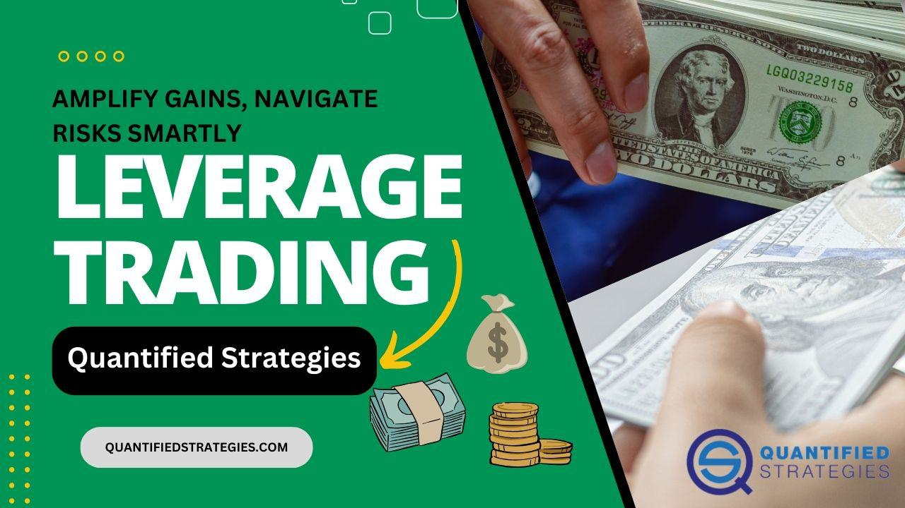

The foreign exchange (forex) market is the largest financial market globally, with a daily trading volume exceeding $6 trillion as of 2021, according to the Bank for International Settlements. Operating as a decentralized market, forex facilitates currency exchange between institutions, governments, businesses, and individuals across the globe. The sheer size and liquidity of the forex market render it a pivotal component of the global financial ecosystem, impacting international trade, investment flows, and economic stability.

In the forex market, leverage is a critical concept, allowing traders to control larger positions with a relatively small amount of capital. Essentially, leverage is a tool that magnifies potential gains and losses, effectively amplifying a trader's exposure to market movements. It is expressed as a ratio; for example, a 100:1 leverage ratio means that for every dollar in an account, a trader can take positions worth $100. While leverage increases the potential for significant profits, it also escalates the risk of substantial losses, necessitating disciplined risk management practices.



Algorithmic trading, or algo trading, has gained immense traction in the forex market, driven by technological advancements and the quest for efficiency. This trading approach involves using computer algorithms to automatically execute trades based on predetermined criteria, eliminating the need for manual intervention. The adoption of algorithmic trading in forex is accelerating, as it offers speed, precision, and the elimination of emotional biases that can affect human traders. Algorithms can analyze market conditions, execute trades, and manage risk in real-time, making them a valuable tool in navigating the complexities of the forex market.

The growing popularity of algo trading is fueled by advancements in computational power, big data analytics, and machine learning. These technologies enhance the capability of algorithms to process vast amounts of data and adapt to changing market conditions, thereby optimizing trading strategies. As more traders and institutions harness the power of algorithms, the forex market is witnessing a transformative shift towards automation and data-driven decision-making, shaping the future landscape of currency trading.

## Table of Contents

## Understanding Forex Trading and Leverage

Forex trading, also known as foreign exchange trading, involves the buying and selling of currencies on a global market. Participants include banks, corporations, governments, and individual traders, all aiming to profit from fluctuations in currency exchange rates. The forex market operates 24 hours a day, five days a week, due to the time zone differences in global financial centers, such as New York, London, Tokyo, and Sydney.

Currencies are traded in pairs, where the value of one currency is compared against another. For example, in the EUR/USD currency pair, the euro (EUR) is the base currency, while the US dollar (USD) is the quote currency. The exchange rate indicates how much of the quote currency is needed to purchase one unit of the base currency. If the EUR/USD rate is 1.20, it means that one euro can be exchanged for 1.20 US dollars.

### Leverage in Forex Trading

Leverage is a crucial concept in [forex](/wiki/forex-system) trading, allowing traders to control a larger position in the market with a smaller amount of invested capital. Essentially, leverage is a borrowed capital provided by brokers, enabling traders to multiply their buying power. For example, with a leverage ratio of 100:1, a trader can manage a position worth $100,000 with just $1,000 in their account.

The formula for leverage is:

$$
\text{Leverage} = \frac{\text{Total Value of Transaction}}{\text{Trader's Equity}}
$$

The primary advantage of leverage is the potential for significant gains from relatively small market movements. However, this amplifies both profits and losses, making risk management essential. A 1% move in the market can result in a 100% gain or loss on the trader's initial investment with high leverage.

### Benefits and Risks of Leverage

**Benefits:**

1. **Increased Profit Potential:** Leverage allows traders to boost their position size and potentially increase their returns on investments. This can be particularly advantageous in a market with narrow margins and small price movements.

2. **Efficient Use of Capital:** Traders can manage larger positions without needing to commit a large portion of their capital, allowing for diversified investments and enhanced capital efficiency.

**Risks:**

1. **Amplified Losses:** Just as leverage can amplify profits, it can also magnify losses. A small adverse movement in the market can lead to significant losses, potentially exceeding the trader's initial investment.

2. **Margin Calls:** When losses approach the amount of equity a trader has in their account due to leveraged positions, brokers may issue margin calls, demanding an increase in funds to maintain open positions or forcing the closure of those positions.

Effective risk management techniques, such as setting stop-loss orders and maintaining adequate account equity, are vital to safely navigate the leveraged forex trading environment. Understanding leverage allows traders to optimize their strategies, balancing the pursuit of profit with risk mitigation.

## The Role of Algorithmic Trading in the Forex Market

Algorithmic trading refers to the use of computer algorithms to execute trading orders in financial markets with minimal human intervention. In the forex market, [algorithmic trading](/wiki/algorithmic-trading) involves using advanced programs and trading strategies to buy and sell currency pairs. This method leverages pre-programmed instructions to execute trades at speeds and frequencies that are humanly impossible, offering significant advantages in terms of speed, efficiency, and the elimination of emotional bias often seen in manual trading.

### Benefits of Algorithmic Trading

1. **Speed and Efficiency:** Algorithms can process vast amounts of market data in real time and execute trades within milliseconds. This rapid decision-making capability is essential in the fast-paced forex market, where prices can change in the blink of an eye. The use of algorithms ensures that traders can capitalize on even minute price fluctuations, enhancing the efficiency of their trading operations.

2. **Emotion-Free Trading:** By automating the trading process, algorithmic trading removes the emotional component from decision-making. Traders are often influenced by fear or greed, which can lead to irrational decisions. Algorithms, operating solely on data and pre-established rules, prevent emotional intervention, resulting in consistent and logical trading actions.

3. **Increased Market Liquidity:** Algorithmic trades contribute to higher market liquidity, particularly beneficial in the forex market, ensuring smoother transactions at better prices. This increase in liquidity reduces the spread between bid and ask prices, directly benefiting traders by minimizing transaction costs.

### Common Algorithmic Trading Strategies in Forex

1. **Trend Following Strategies:** These strategies are based on technical indicators, such as moving averages, to identify and capitalize on emerging trends in the forex market. When a currency pair's price follows a consistent upward or downward trajectory, a trend-following algorithm can initiate buy or sell orders accordingly.

2. **Arbitrage Strategies:** Arbitrage in forex seeks to exploit price imbalances between different markets or currency pairs. An algorithm can be designed to simultaneously buy and sell a currency in different markets, profiting from the price discrepancy. Due to the high speed required to take advantage of these fleeting opportunities, algorithms are ideally suited for arbitrage trading.

3. **Market Making Strategies:** These involve placing both buy and sell limit orders to profit from the spread in currency prices. Algorithms continuously update prices to reflect market conditions, allowing traders to benefit from small changes in currency values while providing liquidity to the market.

4. **News-Based Strategies:** News-based algorithms capitalize on market movements triggered by economic news or geopolitical events. By parsing and analyzing news data feeds, these algorithms can react to significant announcements faster than a human trader could, enabling them to take advantage of resultant market volatility.

Algorithmic trading in the forex market not only enhances trading efficiency and speed but also provides the mechanism for sophisticated and diverse trading strategies. It is an indispensable tool for modern traders seeking to gain a competitive edge in the global currency markets.

## Key Considerations for Using Leverage and Algorithms

Using leverage and algorithms in forex trading requires careful consideration due to its inherent risks and complexities. Proper risk management strategies, such as setting stop-loss orders, are crucial when leveraging positions in the forex market. Stop-loss orders automatically close a trade when the exchange rate reaches a predetermined level, thereby limiting potential losses. This strategy is vital in forex, where market movements can be swift and unpredictable. A good rule of thumb is to set stop-loss levels at a point that aligns with an acceptable risk-reward ratio, often recommended around 1:2 or 1:3, depending on the trader's risk tolerance.

Algorithmic trading, while efficient, comes with its own set of challenges. One major risk is market [volatility](/wiki/volatility-trading-strategies), which can cause significant deviations from expected outcomes, especially in highly leveraged trades. Algorithms need to be adaptive to changing market dynamics to avoid significant losses. Overfitting is another substantial risk, where an algorithm is tailored too closely to historical data and fails to perform well in real-time market conditions. Developing a robust algorithm involves regular [backtesting](/wiki/backtesting) on diverse data sets to ensure its reliability across different market conditions.

To develop an effective algorithmic trading strategy, traders should consider several key steps. Firstly, clear objectives and criteria should be defined, including risk tolerance levels and financial targets. Then, choosing the right programming language, such as Python, is crucial due to its extensive libraries and community support. For instance, trading strategies involving moving averages or [momentum](/wiki/momentum) can be initially evaluated using Python libraries like NumPy for numerical calculations and Pandas for data manipulation.

Here's a basic example of a moving average crossover strategy implemented in Python:

```python
import pandas as pd
import numpy as np

# Sample market data
prices = pd.Series([1.1, 1.2, 1.3, 1.4, 1.5, 1.4, 1.3, 1.2, 1.3, 1.4])

# Calculate moving averages
short_window = 2
long_window = 5
short_mavg = prices.rolling(window=short_window, min_periods=1).mean()
long_mavg = prices.rolling(window=long_window, min_periods=1).mean()

# Signal generation
signals = pd.DataFrame(index=prices.index)
signals['price'] = prices
signals['short_mavg'] = short_mavg
signals['long_mavg'] = long_mavg
signals['signal'] = 0.0
signals['signal'][short_window:] = np.where(signals['short_mavg'][short_window:] > signals['long_mavg'][short_window:], 1.0, 0.0)
signals['positions'] = signals['signal'].diff()

print(signals)
```

This code demonstrates a simple moving average crossover strategy, where a buy signal is generated when the short-term moving average crosses above the long-term moving average, and a sell signal otherwise. However, simplicity in design does not negate the need for rigorous testing to ensure performance consistency across different market conditions.

Overall, leveraging and algorithmic trading in forex can offer significant advantages but require meticulous planning, risk management, and adaptation to the ever-changing market landscape. Regular updates and improvements of the algorithm, along with an ongoing evaluation of market conditions, are essential to maintaining a competitive edge.

## How to Get Started with Forex Algo Trading

To begin with forex algorithmic (algo) trading, it is essential to have a foundational understanding of forex itself. Forex, or foreign exchange, involves the trading of currencies in pairs, such as USD/EUR. Basic knowledge of how these currencies fluctuate based on geopolitical events, economic indicators, and market sentiment will aid in making informed decisions.

A strong grasp of technical analysis is equally important. This involves the study of past market data, primarily price and [volume](/wiki/volume-trading-strategy), to forecast future movements. Key concepts include support and resistance levels, trend lines, and indicators such as Moving Averages (MA) and the Relative Strength Index (RSI). These tools will be integral in developing algorithmic strategies that interpret market conditions automatically.

Selecting a reliable trading platform and broker is crucial in forex algo trading. The trading platform should support algorithmic trading and provide robust APIs for seamless integration. It must offer real-time data access, a user-friendly interface, and strong security measures. Meanwhile, a broker should be regulated, offer competitive spreads, and provide high leverage, while also facilitating smooth execution speeds and efficient customer service.

The process of developing, backtesting, and deploying an algorithm involves several steps:

1. **Define the Trading Strategy**: Begin with a clear hypothesis on how you expect to profit from the market, translating this into specific mathematical rules or conditions. For example, a simple Moving Average Crossover strategy might be defined as buying when a short-term MA crosses above a long-term MA and selling in the opposite scenario.

2. **Code the Algorithm**: Utilize programming languages such as Python for implementing the strategy. Python libraries like Pandas for data manipulation, NumPy for numerical calculations, and PyAlgoTrade or Backtrader for developing backtesting models are beneficial. Here is a simple example of a Moving Average Crossover strategy in Python:

   ```python
   import pandas as pd

   # assuming df is your DataFrame containing 'Close' prices
   df['Short_MA'] = df['Close'].rolling(window=10).mean()
   df['Long_MA'] = df['Close'].rolling(window=50).mean()
   df['Signal'] = 0

   df['Signal'][10:] = np.where(df['Short_MA'][10:] > df['Long_MA'][10:], 1, -1)
   df['Position'] = df['Signal'].diff()
   ```

3. **Backtesting**: Simulate your strategy using historical data to evaluate its effectiveness and adjust parameters as necessary. Metrics such as the Sharpe Ratio, maximum drawdown, and profit factor are helpful in assessing performance.

4. **Optimization and Validation**: Refine the algorithm by optimizing parameters and ensuring it does not overfit to historical data. Cross-validation techniques can help in this regard.

5. **Deployment**: Once satisfied with backtesting results, move the algorithm to a live trading environment. It involves configuring it for real-time data feeds and ensuring orders are placed as intended with the broker.

6. **Monitoring and Adjustment**: Continuously monitor the algorithm’s performance in real-time and make necessary adjustments. Market conditions change, which may necessitate updates to the algorithm.

Entering the world of forex algo trading demands a solid preparation phase. By understanding the market, employing rigorous technical analysis, and following a structured approach to algorithm development and deployment, traders can improve their chances of success in this dynamic arena.

## Benefits and Challenges of Forex Algo Trading

Algorithmic trading, often referred to as algo trading, has become a pivotal force in the forex market, offering a myriad of benefits. One of its primary advantages is increased efficiency. Algo trading systems can process vast amounts of market data in real-time and execute trades at speeds far beyond human capabilities. This speed ensures that traders can capitalize on even the smallest price movements, optimizing entry and [exit](/wiki/exit-strategy) points to enhance profitability.

Additionally, algo trading mitigates emotional bias, a common pitfall in manual trading. Emotional trading can lead to irrational decisions driven by fear or greed, but algorithms operate based on pre-defined parameters, ensuring consistent and objective execution of trading strategies.

However, trading algorithms present challenges. Infrastructure requirements can be substantial, necessitating powerful computing resources to handle high-frequency data analysis and execution. Consistent system maintenance is essential to ensure optimal performance and minimize downtime, which can result in missed trading opportunities or financial losses.

Market anomalies pose significant risks to algorithm performance. Events such as economic announcements or geopolitical tensions can cause abrupt and unpredictable market behavior, potentially rendering algorithms less effective or causing erroneous trades. To address this, robust risk management strategies and adaptive algorithms that can adjust to varying market conditions are vital.

Moreover, developing a successful algorithm requires rigorous backtesting and strategy validation. Backtesting involves evaluating an algorithm against historical data to predict its future performance, but it must be approached cautiously to avoid overfitting – designing the algorithm to perform well on past data but poorly in live market conditions.

In conclusion, while forex algo trading presents remarkable advantages in terms of efficiency, speed, and objectivity, it is crucial for traders to acknowledge and address the underlying challenges. By investing in reliable infrastructure, maintaining effective risk management practices, and continuously refining trading strategies, traders can harness the full potential of algorithmic trading in the ever-evolving forex landscape.

## Conclusion

The foreign exchange (forex) market, as discussed, is a pivotal component of the global financial system. Its liquid nature and 24-hour operation make it a platform of choice for traders worldwide. Leverage has been identified as a transformative tool within this market, allowing traders to control significant positions with a relatively small amount of capital. This amplification of potential returns is, however, coupled with increased risk, underscoring the importance of prudent risk management tactics such as setting stop-loss orders.

Algorithmic trading is another game-changer in forex, revolutionizing the way trades are executed. The ability of algorithms to process vast amounts of data within seconds and execute trades devoid of human emotions significantly enhances trading efficiency and precision. Despite these advantages, the development and deployment of algorithmic strategies demand considerable expertise. Traders must navigate challenges such as algorithmic overfitting and adapt to market volatility, which can affect performance.

In conclusion, the synergy of leverage and algorithmic trading holds great promise for the forex market, offering enhanced opportunities for adept traders. However, it is crucial to approach these tools with comprehensive knowledge and caution. A robust understanding of forex mechanics, risk management techniques, and the intricacies of algorithmic strategies is vital. Given the dynamic nature of the forex market, continuous learning and adaptation are indispensable for long-term success. Whether you are new to forex trading or a seasoned trader, staying informed about technological advancements and market changes is key to navigating this complex but rewarding landscape.

## References & Further Reading

[1]: "Triennial Central Bank Survey of Foreign Exchange and OTC Derivatives Markets in 2019," Bank for International Settlements, [link](https://www.bis.org/statistics/rpfx22.htm)

[2]: Lopez, M. de Prado (2018). ["Advances in Financial Machine Learning"](https://www.amazon.com/Advances-Financial-Machine-Learning-Marcos/dp/1119482089). Wiley.

[3]: Bjorgum, L. (2019). ["Machine Learning for Algorithmic Trading"](https://github.com/stefan-jansen/machine-learning-for-trading). Packt Publishing.

[4]: Chan, E. P. (2009). ["Quantitative Trading: How to Build Your Own Algorithmic Trading Business"](https://github.com/ftvision/quant_trading_echan_book). Wiley.

[5]: Aronson, D. R. (2006). ["Evidence-Based Technical Analysis: Applying the Scientific Method and Statistical Inference to Trading Signals"](https://www.amazon.com/Evidence-Based-Technical-Analysis-Scientific-Statistical/dp/0470008741). Wiley.

[6]: Harris, L. (2003). ["Trading and Exchanges: Market Microstructure for Practitioners"](https://www.amazon.com/Trading-Exchanges-Market-Microstructure-Practitioners/dp/0195144708). Oxford University Press.