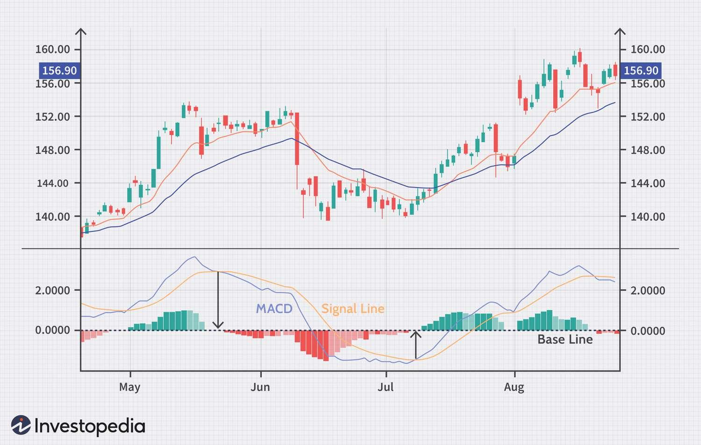

## Table of Contents

## What is the MACD indicator and how does it work?

The MACD, or Moving Average Convergence Divergence, is a popular tool used in technical analysis to help traders understand the momentum and possible future trends of a stock or other financial asset. It is based on the difference between two moving averages, usually a 12-day and a 26-day exponential moving average (EMA). The MACD line is created by subtracting the 26-day EMA from the 12-day EMA. This line helps traders see how the short-term momentum is changing compared to the longer-term momentum.

In addition to the MACD line, there's another line called the signal line, which is typically a 9-day EMA of the MACD line. Traders watch for when the MACD line crosses above or below this signal line. If the MACD line crosses above the signal line, it's often seen as a bullish signal, suggesting it might be a good time to buy. If it crosses below, it's considered a bearish signal, suggesting it might be a good time to sell. The MACD also includes a histogram, which shows the difference between the MACD line and the signal line, helping traders visualize the strength of the momentum.

## How can the MACD be used to identify momentum in trading?

The MACD helps traders see the momentum in the market by showing how fast the price of a stock is moving. It does this by comparing two moving averages, one short-term and one long-term. When the short-term average is moving faster than the long-term average, the MACD line goes up, showing that the momentum is increasing. If the short-term average starts to slow down compared to the long-term average, the MACD line goes down, showing that the momentum is decreasing.

Traders use the MACD to make decisions about buying or selling. When the MACD line crosses above the signal line, it's a sign that the momentum is getting stronger, which might be a good time to buy. If the MACD line crosses below the signal line, it means the momentum is getting weaker, which might be a good time to sell. The histogram part of the MACD also helps because it shows the difference between the MACD line and the signal line. A bigger histogram bar means stronger momentum, and a smaller bar means weaker momentum.

## What are the basic components of the MACD (MACD line, signal line, histogram)?

The MACD has three main parts: the MACD line, the signal line, and the histogram. The MACD line is made by taking the difference between a short-term moving average, usually 12 days, and a long-term moving average, usually 26 days. This line shows if the short-term movement of a stock's price is faster or slower than its long-term movement. If the MACD line is going up, it means the short-term movement is getting faster compared to the long-term movement, showing increasing momentum. If it's going down, it means the short-term movement is getting slower, showing decreasing momentum.

The signal line is a moving average of the MACD line, typically over 9 days. Traders watch for when the MACD line crosses over the signal line. If the MACD line goes above the signal line, it's a sign that the momentum is getting stronger, which might be a good time to buy. If the MACD line goes below the signal line, it means the momentum is getting weaker, which might be a good time to sell. The histogram is the third part, and it shows the difference between the MACD line and the signal line. A bigger histogram bar means stronger momentum, and a smaller bar means weaker momentum.

## How do you calculate the MACD and what settings are commonly used?

To calculate the MACD, you first need to find the difference between two moving averages of a stock's price. The most common settings used are a 12-day short-term moving average and a 26-day long-term moving average. Both of these moving averages are usually exponential moving averages (EMAs). The MACD line is created by subtracting the 26-day EMA from the 12-day EMA. This line shows how the short-term momentum of the stock is changing compared to its longer-term momentum.

Next, you calculate the signal line, which is typically a 9-day EMA of the MACD line. Traders watch for when the MACD line crosses above or below this signal line to make buying or selling decisions. The histogram is the last part of the MACD and is found by subtracting the signal line from the MACD line. The size of the histogram bars shows how strong the momentum is. These settings of 12, 26, and 9 days are the most commonly used, but traders can adjust them to fit their own trading style or the specific stock they are watching.

## What does a MACD crossover indicate and how can it be used in trading decisions?

A MACD crossover happens when the MACD line crosses over the signal line. When the MACD line goes above the signal line, it's called a bullish crossover. This means the short-term momentum is getting stronger compared to the long-term momentum, and it might be a good time to buy the stock. On the other hand, when the MACD line goes below the signal line, it's called a bearish crossover. This means the short-term momentum is getting weaker, and it might be a good time to sell the stock.

Traders use these crossovers to help them decide when to buy or sell. If they see a bullish crossover, they might buy the stock because they think its price will go up. If they see a bearish crossover, they might sell the stock because they think its price will go down. It's important to remember that the MACD is just one tool, and traders often use it along with other tools and information to make their trading decisions.

## How can divergence between price and MACD be used as a trading signal?

Divergence happens when the price of a stock and the MACD are moving in different directions. If the price of a stock is going up but the MACD is going down, this is called bearish divergence. It means the upward movement in the price might be losing strength, and the price could start to go down soon. On the other hand, if the price of a stock is going down but the MACD is going up, this is called bullish divergence. It means the downward movement in the price might be losing strength, and the price could start to go up soon.

Traders use divergence to help them make decisions about buying or selling. If they see bearish divergence, they might decide to sell the stock because they think its price will start to fall. If they see bullish divergence, they might decide to buy the stock because they think its price will start to rise. It's important for traders to use divergence along with other tools and information to make the best trading decisions.

## What are the limitations and potential pitfalls of using MACD in momentum trading?

Using the MACD for momentum trading has some limitations and potential pitfalls. One big issue is that the MACD can give false signals, especially in markets that are moving sideways or not trending strongly. For example, the MACD might show a bullish crossover suggesting it's a good time to buy, but the price might not go up as expected. This can lead to traders buying at the wrong time and losing money. Also, because the MACD uses moving averages, there can be a delay in the signals it gives. This means by the time the MACD shows a signal, the best time to act might have already passed.

Another limitation is that the MACD works best in markets that are clearly trending, either up or down. If the market is choppy or moving back and forth, the MACD can be less useful and might give confusing signals. Traders need to be careful and use other tools along with the MACD to confirm its signals. Relying too much on the MACD without looking at other indicators or market conditions can lead to bad trading decisions. So, while the MACD can be a helpful tool, it's important to understand its limits and use it wisely as part of a bigger trading plan.

## How can the MACD histogram be used to gauge the strength of momentum?

The MACD histogram is a great tool to see how strong the momentum of a stock's price is. It shows the difference between the MACD line and the signal line. If the histogram bars are getting bigger, it means the momentum is getting stronger. When the bars are tall, it shows a lot of strength in the trend. On the other hand, if the histogram bars are getting smaller, it means the momentum is getting weaker. When the bars are short, it shows the trend is losing strength.

Traders use the histogram to help them decide when to buy or sell. If they see the histogram bars growing taller, they might think it's a good time to buy because the momentum is strong. If the bars start to shrink, they might think about selling because the momentum is weakening. It's important to remember that the histogram is just one part of the MACD, and traders should use it along with other tools to make the best decisions.

## Can you explain the concept of zero line crossovers in MACD and their significance?

Zero line crossovers in MACD happen when the MACD line moves from being below the zero line to above it, or from above the zero line to below it. When the MACD line goes above the zero line, it's called a bullish zero line crossover. This means that the short-term moving average is now higher than the long-term moving average, which suggests that the stock's price might start to go up. It's a sign that the momentum is turning positive.

On the other hand, when the MACD line goes below the zero line, it's called a bearish zero line crossover. This means that the short-term moving average is now lower than the long-term moving average, which suggests that the stock's price might start to go down. It's a sign that the momentum is turning negative. Traders watch these zero line crossovers to help them decide when to buy or sell a stock, but they should also use other tools to make sure their decisions are good ones.

## How do traders combine MACD with other indicators to enhance momentum trading strategies?

Traders often combine the MACD with other indicators to make their momentum trading strategies better. One common way is to use the MACD with the Relative Strength Index (RSI). The RSI helps traders see if a stock is overbought or oversold. If the MACD shows a bullish crossover and the RSI is below 30, it might be a strong sign to buy because the stock is gaining momentum and is also seen as oversold. On the other hand, if the MACD shows a bearish crossover and the RSI is above 70, it might be a strong sign to sell because the stock is losing momentum and is also seen as overbought.

Another way traders use the MACD with other indicators is by looking at moving averages. For example, they might use the MACD along with the 50-day and 200-day simple moving averages (SMAs). If the MACD shows a bullish crossover and the stock's price is also above both the 50-day and 200-day SMAs, it could be a strong buy signal because it shows the stock is in an uptrend. If the MACD shows a bearish crossover and the stock's price is below both SMAs, it could be a strong sell signal because it shows the stock is in a downtrend. Using the MACD with other indicators helps traders make more informed decisions and reduces the chance of false signals.

## What are some advanced techniques for using MACD in high-frequency trading environments?

In high-frequency trading environments, traders often use advanced techniques with the MACD to make quick and precise decisions. One technique is to use very short-term moving averages for the MACD calculation. Instead of using the standard 12-day and 26-day EMAs, traders might use 5-day and 10-day EMAs to make the MACD more sensitive to short-term price movements. This can help them catch small trends that last only a few minutes or even seconds. They might also adjust the signal line to a shorter period, like a 3-day EMA, to get faster signals. By doing this, traders can react quickly to changes in momentum, which is crucial in high-frequency trading where every second counts.

Another advanced technique is to use the MACD histogram to spot very short-term momentum changes. Traders might look for sudden increases or decreases in the histogram bars to decide when to buy or sell. They can also use algorithms to automatically trade based on these histogram changes. For example, if the histogram suddenly grows taller, an algorithm might trigger a buy order, expecting the price to rise quickly. Similarly, if the histogram suddenly shrinks, it might trigger a sell order, expecting the price to fall. Combining the MACD with other high-frequency indicators, like [volume](/wiki/volume-trading-strategy) spikes or [order book](/wiki/order-book-trading-strategies) data, can also help traders make better decisions and improve their trading performance in fast-paced markets.

## How can backtesting be used to optimize MACD settings for specific momentum trading strategies?

Backtesting is a way to test trading strategies using past data to see how well they would have worked. For optimizing MACD settings in momentum trading, traders can use [backtesting](/wiki/backtesting) to try different combinations of the short-term and long-term moving averages, as well as the signal line period. For example, they might change the standard 12-day and 26-day EMAs to 10-day and 20-day EMAs and see if that makes their strategy more profitable. By running these tests on historical data, traders can find the best settings that fit their specific momentum trading goals, whether it's catching quick trends or holding onto longer ones.

Once traders have run the backtests, they can compare the results to see which MACD settings give the best performance. They might look at things like how much money they would have made, how often they would have been right, and how big their losses would have been. This helps them choose the settings that work best for their strategy. Backtesting isn't perfect because past results don't always predict future performance, but it's a useful tool to help traders make smarter choices about their MACD settings and improve their momentum trading strategies.

## What is MACD and what are its components?

The Moving Average Convergence Divergence (MACD) is a widely used trend-following momentum indicator in technical analysis, designed to reveal changes in the strength, direction, momentum, and duration of a trend in a stock's price. At its core, the MACD reflects the convergence and divergence of two moving averages, which can help traders identify potential buy and sell signals.

The MACD is primarily composed of three key components: the MACD Line, the Signal Line, and the Histogram. Each component plays a crucial role in providing insights into price movements.

1. **MACD Line**: This is calculated by subtracting the 26-day Exponential Moving Average (EMA) from the 12-day EMA. The formula is as follows:
$$
   \text{MACD Line} = \text{EMA}_{12} - \text{EMA}_{26}

$$

   The MACD Line represents the difference between a shorter-term and a longer-term moving average. A rising MACD Line indicates that the short-term EMA is rising faster than the long-term EMA, suggesting upward [momentum](/wiki/momentum), while a falling MACD Line indicates the opposite.

2. **Signal Line**: This is a 9-day EMA of the MACD Line and acts as a smoothing filter. The Signal Line is used to generate trading signals through crossovers with the MACD Line:
$$
   \text{Signal Line} = \text{EMA}_{9}(\text{MACD Line})

$$

   When the MACD Line crosses above the Signal Line, it generates a bullish signal, suggesting a potential buying opportunity. Conversely, when the MACD Line crosses below the Signal Line, it generates a bearish signal, indicating a potential selling point.

3. **Histogram**: The MACD Histogram displays the difference between the MACD Line and the Signal Line. It provides a visual representation of the momentum of price movements, with changes in direction highlighting shifts in market sentiment. The histogram is calculated as:
$$
   \text{Histogram} = \text{MACD Line} - \text{Signal Line}

$$

   The Histogram helps traders identify potential reversals or continuations in the trend. Positive values of the Histogram indicate that the MACD Line is above the Signal Line, while negative values suggest the opposite.

Understanding these elements is fundamental for effectively using MACD in trading strategies. By analyzing the relationship between these components, traders can gain insights into the momentum of an asset's price and make informed decisions about potential entry and [exit](/wiki/exit-strategy) points.

## References & Further Reading

[1]: Murphy, J. J. (1999). ["Technical Analysis of the Financial Markets: A Comprehensive Guide to Trading Methods and Applications."](https://archive.org/details/technicalanalysi0000murp) New York Institute of Finance.

[2]: Appel, G. (2005). ["Technical Analysis: Power Tools for Active Investors."](https://www.amazon.com/Technical-Analysis-Power-Active-Investors/dp/0132930048) FT Press.

[3]: Pring, M. J. (2002). ["Technical Analysis Explained: The Successful Investor's Guide to Spotting Investment Trends and Turning Points."](https://www.amazon.com/Technical-Analysis-Explained-Fifth-Successful/dp/0071825177) McGraw-Hill.

[4]: Elder, A. (1993). ["Trading for a Living: Psychology, Trading Tactics, Money Management."](https://www.amazon.com/Trading-Living-Psychology-Tactics-Management/dp/0471592242) Wiley.

[5]: Kirkpatrick, C. D., & Dahlquist, J. R. (2010). ["Technical Analysis: The Complete Resource for Financial Market Technicians."](https://ptgmedia.pearsoncmg.com/images/9780134137049/samplepages/9780134137049.pdf) FT Press.

[6]: Achelis, S. B. (2000). ["Technical Analysis from A to Z."](https://www.mhebooklibrary.com/doi/book/10.1036/9780071380119) McGraw-Hill.