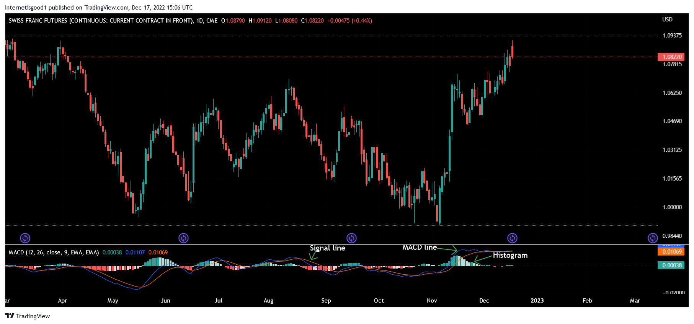

Understanding the role of technical analysis in trading practices is an essential skill for traders at all levels of expertise. Technical analysis involves evaluating market data, primarily historical price and volume data, to forecast future market behavior. Among the myriad tools employed in technical analysis, the Moving Average Convergence Divergence (MACD) indicator stands out as a fundamental tool widely used across trading communities. 

MACD is particularly prominent in momentum trading, where traders seek to capitalize on the direction and strength of market trends. The MACD indicator aids in identifying these trends through its calculation of the difference between two moving averages of a security's price, typically the 12-day and 26-day exponential moving averages (EMAs). The resulting MACD line is plotted alongside a 9-day EMA of the MACD line itself, known as the Signal Line, providing visual cues for potential buy or sell signals.



In modern trading environments, MACD's application extends beyond traditional trading practices to the algorithms underpinning automated trading systems. These systems rely on MACD signals to make swift, data-driven trading decisions, taking advantage of high-frequency trading opportunities without human intervention. By integrating MACD into algorithmic trading frameworks, traders can efficiently exploit momentum signals, adapting their strategies in response to rapid market shifts.

In this article, we will explore the fundamental components of the MACD indicator, its operational mechanics, and its strategic application in trading. This exploration will equip traders with the knowledge needed to develop effective trading positions and strategies in both traditional and algorithmic contexts.

## Table of Contents

## Understanding MACD and Its Components

The Moving Average Convergence Divergence (MACD) is a widely used trend-following momentum indicator in technical analysis, designed to reveal changes in the strength, direction, momentum, and duration of a trend in a stock's price. At its core, the MACD reflects the convergence and divergence of two moving averages, which can help traders identify potential buy and sell signals.

The MACD is primarily composed of three key components: the MACD Line, the Signal Line, and the Histogram. Each component plays a crucial role in providing insights into price movements.

1. **MACD Line**: This is calculated by subtracting the 26-day Exponential Moving Average (EMA) from the 12-day EMA. The formula is as follows:
$$
   \text{MACD Line} = \text{EMA}_{12} - \text{EMA}_{26}

$$

   The MACD Line represents the difference between a shorter-term and a longer-term moving average. A rising MACD Line indicates that the short-term EMA is rising faster than the long-term EMA, suggesting upward [momentum](/wiki/momentum), while a falling MACD Line indicates the opposite.

2. **Signal Line**: This is a 9-day EMA of the MACD Line and acts as a smoothing filter. The Signal Line is used to generate trading signals through crossovers with the MACD Line:
$$
   \text{Signal Line} = \text{EMA}_{9}(\text{MACD Line})

$$

   When the MACD Line crosses above the Signal Line, it generates a bullish signal, suggesting a potential buying opportunity. Conversely, when the MACD Line crosses below the Signal Line, it generates a bearish signal, indicating a potential selling point.

3. **Histogram**: The MACD Histogram displays the difference between the MACD Line and the Signal Line. It provides a visual representation of the momentum of price movements, with changes in direction highlighting shifts in market sentiment. The histogram is calculated as:
$$
   \text{Histogram} = \text{MACD Line} - \text{Signal Line}

$$

   The Histogram helps traders identify potential reversals or continuations in the trend. Positive values of the Histogram indicate that the MACD Line is above the Signal Line, while negative values suggest the opposite.

Understanding these elements is fundamental for effectively using MACD in trading strategies. By analyzing the relationship between these components, traders can gain insights into the momentum of an asset's price and make informed decisions about potential entry and [exit](/wiki/exit-strategy) points.

## Interpreting MACD Signals

Traders interpret the Moving Average Convergence Divergence (MACD) indicator primarily through analyzing crossovers, divergence, and the momentum portrayal in its histogram. Each of these elements provides critical insights into potential market movements and trading opportunities.

A crossover occurs when the MACD Line intersects with the Signal Line. When the MACD Line moves above the Signal Line, it typically signals a bullish trend, suggesting an opportunity for traders to consider buying positions. This crossover reflects an increase in upward momentum, indicating that the asset's price might continue to rise. Conversely, if the MACD Line crosses below the Signal Line, this is interpreted as a bearish signal. It suggests that the price might continue to decline, presenting a potential selling opportunity. These crossovers serve as essential indicators within trading strategies, providing clear signals on possible entry and exit points.

Divergence between MACD lines and price action is another significant aspect of MACD interpretation. Bullish divergence occurs when the price of a security is making new lows while the MACD is making higher lows. This suggests a possible reversal from a downtrend to an uptrend. Conversely, bearish divergence occurs when the price is reaching new highs, but the MACD is making lower highs, indicating a potential reversal from an uptrend to a downtrend. Tracking these divergences is crucial for traders aiming to predict turning points within the market.

The MACD Histogram, which represents the difference between the MACD Line and Signal Line, provides additional insights into the strength of the momentum. By examining the size of the histogram bars, traders can gauge the rate at which momentum is changing. A growing histogram can indicate increasing momentum in the current trend direction, whereas a shrinking histogram might signal a weakening trend. This momentum depiction is valuable for timing trades more accurately and enhances the utility of crossovers and divergence analyses.

In practical application, traders often combine MACD interpretations with other technical indicators to confirm signals and strengthen trading decisions. For instance, integrating MACD signals with [volume](/wiki/volume-trading-strategy) indicators can provide a broader context and increase the reliability of the trading signals.

## Utilizing MACD in Momentum Trading Strategies

The Moving Average Convergence Divergence (MACD) indicator plays a significant role in crafting effective momentum trading strategies by identifying changes in the strength, direction, and duration of a trend. Traders leverage MACD to exploit these momentum shifts, typically by integrating it with other technical indicators to reinforce the validity of detected trend reversals.

When devising momentum trading strategies, the MACD is commonly used to observe two crucial factors: MACD crossovers and divergences. These situations can signal optimal entry and exit points for trades.

1. **MACD Crossovers**: A crossover occurs when the MACD Line intersects the Signal Line. A common trading strategy is to buy when the MACD Line crosses above the Signal Line, signifying a bullish momentum shift. Conversely, a trader might sell when the MACD Line falls below the Signal Line, indicating a bearish shift. This straightforward approach mainly identifies potential trend continuations or reversals.

2. **MACD Divergence**: Divergence is recognized when the MACD indicator and price action move in opposite directions. A bullish divergence might occur if a security's price continues to form lower lows while the MACD forms higher lows. This pattern can suggest a potential price reversal to the upside. Conversely, a bearish divergence is noted when prices reach higher highs while MACD marks lower highs, indicating a potential downtrend.

Traders often enhance these signals by employing additional technical indicators to reduce false positives. For instance, integrating MACD signals with Relative Strength Index (RSI) can offer better confirmation of overbought or oversold market conditions, thereby supporting more informed decision-making and reducing the risk of unprofitable trades.

Considering coding MACD strategies in Python, traders can automate strategy execution, allowing for rapid analysis and responses to market shifts. Here's a simple example utilizing the `pandas` and `pandas_ta` libraries:

```python
import pandas as pd
import pandas_ta as ta

# Assuming df is a pandas DataFrame containing 'Close' prices
df['MACD'], df['Signal Line'] = ta.macd(df['Close'], fast=12, slow=26, signal=9)

# Generating trading signals
df['Crossover'] = 0
df.loc[df['MACD'] > df['Signal Line'], 'Crossover'] = 1  # Buy signal
df.loc[df['MACD'] < df['Signal Line'], 'Crossover'] = -1  # Sell signal
```

In this code, MACD and Signal Line values are calculated from a time series of closing prices. The crossover logic is then applied to classify periods into buy or sell actions.

Ultimately, the effective utilization of MACD in momentum trading strategies lies in its versatile application alongside other technical measures, reinforcing the identification of viable trading opportunities while minimizing exposure to market uncertainties.

## Algorithmic Trading with MACD

The integration of the Moving Average Convergence Divergence (MACD) indicator within [algorithmic trading](/wiki/algorithmic-trading) systems facilitates automated decision-making by leveraging predefined conditions based on MACD’s momentum signals. By using algorithmic trading, traders can efficiently execute transactions without human intervention, thereby enhancing speed, precision, and the ability to process large volumes of data almost instantaneously.

MACD, as a trend-following momentum indicator, plays a pivotal role in algorithmic trading by identifying potential buy and sell signals through the crossovers of its MACD Line and Signal Line. Algorithmic systems utilize these signals to determine entry and exit points, optimize trade execution timing, and deploy strategies rapidly in response to changing market conditions. The critical advantage of employing MACD in algorithmic trading lies in its capacity to interpret real-time data with responsiveness and accuracy, minimizing human error.

Python, a favored programming language for developing algorithmic trading strategies due to its simplicity and robustness, offers several libraries and tools to implement MACD-based strategies effectively. Libraries such as 'pandas' and 'pandas_ta' (pandas technical analysis) facilitate the analysis and manipulation of time-series data—key components in building trading algorithms.

For example, a basic Python implementation using MACD with 'pandas' and 'pandas_ta' could look as follows:

```python
import pandas as pd
import pandas_ta as ta

# Load your time series data into a Pandas DataFrame
data = pd.read_csv('historical_data.csv')

# Calculate the MACD using the pandas_ta library
macd = ta.macd(data['close'])  # assuming 'close' is the column for closing prices

# Add MACD to the DataFrame
data = data.join(macd)

# Define a simple strategy condition: Buy when MACD Line crosses above Signal Line
buy_signals = (data['MACD_12_26_9'] > data['MACDs_12_26_9'])

# Define exit condition: Sell when MACD Line crosses below Signal Line
sell_signals = (data['MACD_12_26_9'] < data['MACDs_12_26_9'])

# Logic can be extended to execute trades automatically
```

By automating trading decisions based on MACD signals, algorithmic systems can consistently apply complex strategies while recognizing and adapting to market trends quickly. Despite its benefits, it is essential for traders to conduct thorough [backtesting](/wiki/backtesting) to ensure the reliability of MACD-based algorithms across different market conditions and asset classes. This cautious approach mitigates the inherent risks associated with false signals, especially in volatile markets.

## Comparing MACD with RSI

The Moving Average Convergence Divergence (MACD) and the Relative Strength Index (RSI) are two widely utilized tools in technical analysis, often employed together to enhance market analysis. While both are momentum indicators, each serves a distinct purpose by providing unique insights into market conditions.

MACD primarily focuses on momentum and trend-following by measuring the difference between two exponential moving averages (EMAs). Its main components, the MACD Line and the Signal Line, help traders identify potential bullish or bearish trends based on the crossover signals. The MACD Histogram, which represents the difference between the MACD Line and the Signal Line, offers additional insights into the strength and direction of the trend.

On the other hand, RSI is designed to assess the speed and change of price movements by comparing recent price gains against recent losses. It operates on a scale of 0 to 100, providing a direct measure of whether an asset is overbought or oversold. Traditionally, an RSI above 70 suggests that an asset might be overbought, while an RSI below 30 could indicate it is oversold.

When combined, MACD and RSI enable traders to gain well-rounded strategic insights. While MACD offers a broader view of trend direction and momentum, RSI provides a perspective on the potential intensity of the asset's current price phase. For instance, a situation where the MACD indicates a bullish trend while the RSI suggests an overbought condition might prompt traders to proceed with caution, possibly waiting for confirmation before trading.

Incorporating these indicators into trading strategies involves leveraging their strengths to corroborate signals. For example, a trader might look for a MACD Line crossing above the Signal Line for a buy signal, but double-check this signal with the RSI to ensure the asset is not overbought. Thus, using MACD and RSI together can enhance decision-making processes and help mitigate the risks of relying on a single indicator.

## Limitations of MACD

The Moving Average Convergence Divergence (MACD) indicator is a widely used tool in technical analysis, yet it is not without its limitations. As a lagging indicator, MACD tends to provide signals based on past price movements, which may sometimes result in delayed responses to real-time market conditions. This inherent lag can lead to false signals, particularly in volatile or sideways markets. In such environments, price action can fluctuate erratically, resulting in MACD crossovers that may not accurately reflect any persistent market trend, thus prompting misinformed trading decisions.

One of the primary challenges with MACD is its sensitivity to noise generated by short-term price fluctuations. In choppy markets, traders may observe multiple crossovers that suggest trend changes which do not materialize. This false signaling can lead to unnecessary trades, increasing transaction costs and reducing overall trading performance. Due to this, traders often find it prudent to corroborate MACD indications with other technical indicators to enhance accuracy and reliability.

For example, using the Relative Strength Index (RSI) alongside MACD can provide a more comprehensive analysis. While MACD highlights momentum and trend-following aspects, RSI aids in identifying overbought or oversold conditions. By integrating these indicators, traders can better discern whether a MACD crossover aligns with stronger market signals provided by RSI or other methods.

To illustrate, consider a Python implementation where MACD signals are paired with other indicators:

```python
import pandas as pd
import pandas_ta as ta

# Sample data preparation
data = pd.read_csv('price_data.csv')
close_prices = data['Close']

# Calculating MACD using pandas_ta
macd = ta.macd(close_prices, fast=12, slow=26, signal=9)

# Calculating RSI
rsi = ta.rsi(close_prices, length=14)

# Combining signals to reduce false positives
buy_signals = (macd['MACD_12_26_9'] > macd['MACDs_12_26_9']) & (rsi < 30)
sell_signals = (macd['MACD_12_26_9'] < macd['MACDs_12_26_9']) & (rsi > 70)

# Outputting combined signals
data['Buy Signals'] = buy_signals
data['Sell Signals'] = sell_signals

print(data[['Date', 'Close', 'Buy Signals', 'Sell Signals']].dropna())
```

In this example, buy signals are generated only when the MACD Line crosses above the Signal Line, and RSI is below 30, indicating an oversold market condition. Conversely, sell signals are considered valid when the MACD Line falls below the Signal Line and the RSI exceeds 70, indicating overbought conditions. This approach helps mitigate the limitations of MACD by filtering out potentially misleading signals in isolation.

## Conclusion

The Moving Average Convergence Divergence (MACD) is a significant asset within the technical analysis toolkit, valued for its capability to help traders discern potential market trends. By evaluating the convergence and divergence between moving averages, traders gain insights into momentum shifts and potential buy or sell signals. Despite being a robust indicator, users must acknowledge MACD's limitations, particularly its nature as a lagging indicator, which can occasionally lead to false signals, especially in volatile market conditions. 

Incorporating MACD with other technical indicators can mitigate these limitations, enhancing the effectiveness and reliability of trading strategies. For instance, combining MACD with the Relative Strength Index (RSI) provides a balanced view of momentum and market conditions, aiding in making more informed trading decisions.

Traders must continually refine their understanding and skills to maximize the utility of MACD within both traditional and algorithmic trading frameworks. This constant learning and adaptation involve staying informed about market conditions, technological advancements, and evolving trading strategies. Additionally, leveraging tools such as algorithmic trading platforms and Python libraries like `pandas` can streamline the integration of MACD into automated trading systems, fostering efficiency and prompt decision-making. By blending MACD with complementary strategies and technologies, traders can harness its full potential to anticipate and respond to market dynamics effectively.

## FAQs

### FAQs

**What distinguishes MACD from other technical indicators?**

The Moving Average Convergence Divergence (MACD) indicator is distinct from other technical indicators due to its dual role as a trend-following tool and a momentum indicator. Unlike indicators such as the Relative Strength Index (RSI), which predominantly highlight overbought or oversold conditions, the MACD focuses on the interaction between moving averages to assess the strength and direction of a trend. It achieves this by comparing the difference between the 12-day and 26-day Exponential Moving Averages (EMAs), tracked by the MACD Line, and a 9-day EMA of the MACD Line, denoting the Signal Line. This configuration assists traders in identifying potential shifts in market momentum through crossovers and divergence patterns, offering a broader scope of analysis than some single-focus indicators.

**How can MACD be effectively implemented in trading strategies?**

Effective implementation of MACD in trading strategies requires a comprehensive understanding of its signals and incorporating it alongside other analytical tools. Traders primarily focus on MACD Line and Signal Line crossovers for buy or sell signals. For instance:

- A bullish signal occurs when the MACD Line crosses above the Signal Line, suggesting potential upward momentum and a buy opportunity.
- Conversely, a bearish signal is identified when the MACD Line falls below the Signal Line, indicating downward momentum and a potential sell signal.

Additionally, traders can leverage divergence, where the MACD movements diverge from price actions, to spot potential trend reversals. To enhance strategy robustness, many combine MACD with other indicators like the RSI to confirm momentum changes or trend strength. This multifaceted approach aids in reducing false signals and boosting trading accuracy.

**What are the standard timeframes most suitable for MACD application?**

The MACD is versatile across various timeframes, making it suitable for multiple trading styles:

- **Daily Timeframe:** This is commonly used where each point corresponds to daily market data, beneficial for swing traders who aim to capture medium-term trends.
- **Hourly or Shorter Timeframes:** Popular among day traders intending to utilize short-term price movements, adapting the MACD to faster timeframes such as 5-minute or 15-minute charts can offer quicker signals.

Traders can customize MACD settings to align with specific trading goals. For instance, adjusting the EMA periods from the classic 12, 26, and 9 settings to 5, 35, and 5 might better suit certain stock profiles or trading environments, emphasizing the need for experimentation and backtesting to optimize performance.

## References & Further Reading

[1]: Murphy, J. J. (1999). ["Technical Analysis of the Financial Markets: A Comprehensive Guide to Trading Methods and Applications."](https://archive.org/details/technicalanalysi0000murp) New York Institute of Finance.

[2]: Appel, G. (2005). ["Technical Analysis: Power Tools for Active Investors."](https://www.amazon.com/Technical-Analysis-Power-Active-Investors/dp/0132930048) FT Press.

[3]: Pring, M. J. (2002). ["Technical Analysis Explained: The Successful Investor's Guide to Spotting Investment Trends and Turning Points."](https://www.amazon.com/Technical-Analysis-Explained-Fifth-Successful/dp/0071825177) McGraw-Hill.

[4]: Elder, A. (1993). ["Trading for a Living: Psychology, Trading Tactics, Money Management."](https://www.amazon.com/Trading-Living-Psychology-Tactics-Management/dp/0471592242) Wiley.

[5]: Kirkpatrick, C. D., & Dahlquist, J. R. (2010). ["Technical Analysis: The Complete Resource for Financial Market Technicians."](https://ptgmedia.pearsoncmg.com/images/9780134137049/samplepages/9780134137049.pdf) FT Press.

[6]: Achelis, S. B. (2000). ["Technical Analysis from A to Z."](https://www.mhebooklibrary.com/doi/book/10.1036/9780071380119) McGraw-Hill.