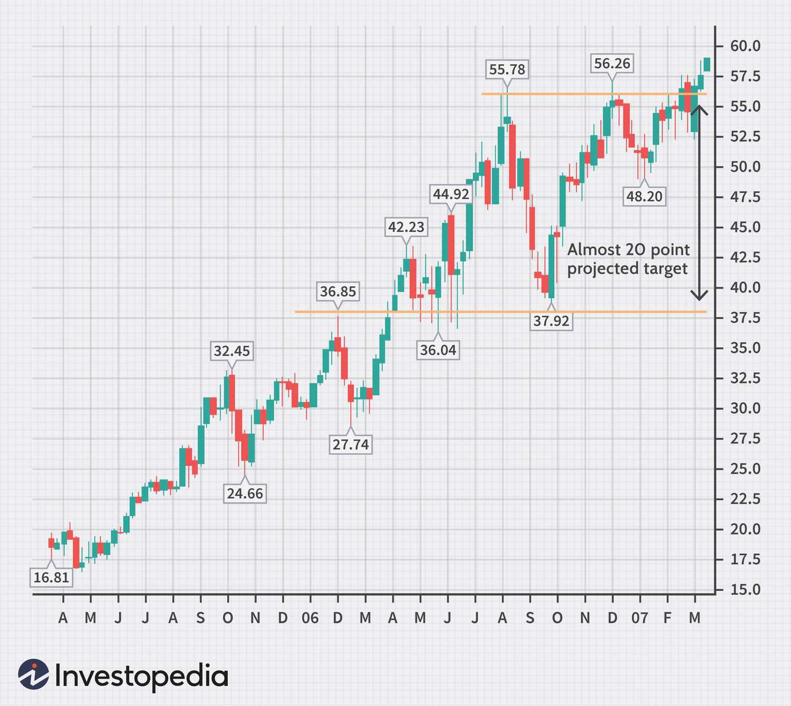

In the fast-evolving world of trading, leveraging the power of both technical analysis and algorithmic trading across multiple time frames has become crucial for securing a competitive edge. Multiple time frame analysis provides traders with a comprehensive perspective by evaluating market movements over various time scales. This method allows traders to perceive broad trends alongside immediate market conditions, enhancing the accuracy of their strategic decisions.

Traders benefit from this approach by being able to structure their trading tactics to align with long-term trends while also capitalizing on short-term market movements. This dual understanding helps in refining strategies, optimizing entry and exit points, and ultimately improving profitability.



This article aims to explore the synergy between multiple time frame analysis and algorithmic trading. By integrating these two, traders can develop strategies that are not only more informed but also adaptive to complex market dynamics. Through automation, these processes can be streamlined, offering consistently high performance amidst diverse and often volatile market conditions.

## Table of Contents

## Understanding Multiple Time Frame Analysis

Multiple time frame analysis (MTFA) is a method whereby traders examine the same financial instrument across different chart intervals, such as daily, weekly, hourly, or even minute charts. This approach provides a more comprehensive understanding of market dynamics by revealing trends that may not be visible when focusing on a single time frame. Each time frame can exhibit distinct patterns and trends due to varying levels of market noise and volatility.

For instance, a trader might observe a strong upward trend on a daily chart while noting a consolidation phase on an hourly chart. This discrepancy can indicate potential entry or exit points. Understanding these nuances helps in confirming or refuting trade signals. For instance, if a trader spots a bullish pattern on both the weekly and daily charts, it reinforces the probability of a successful trade.

Incorporating multiple time frames enables a layered perspective on market trends, where long-term trends can guide the overall trade strategy, while shorter time frames can fine-tune the timing of entries and exits. By doing so, traders can align their trades with the general market direction seen over longer intervals while capitalizing on shorter-term price movements.

Using multiple time frames can be particularly beneficial when the primary time frame indicates one direction, and a secondary time frame provides detailed insights into potential reversals or breakouts. For example, a trader might use a monthly chart to determine the major trend direction and a 15-minute chart to time the precise entry and [exit](/wiki/exit-strategy). This strategic layering reduces noise and can potentially improve the accuracy of trade decisions.

In practice, software platforms supporting MTFA usually allow traders to visualize multiple time frames simultaneously and may also offer features to automate analysis, such as identifying trends or generating alerts across chosen intervals. This capability is crucial for traders relying on algorithmic approaches to consistently and efficiently manage trades in dynamic markets.

## Setting Up Multiple Time Frame Analysis

Setting up multiple time frame analysis involves a structured approach to examining different chart timeframes to improve trading accuracy and decision-making. The first step is identifying your primary trading time frame. This time frame should align with your trading style and risk tolerance. For instance, a day trader might focus on a 15-minute or hourly chart, while a swing trader might prefer daily charts.

Once your primary time frame is established, it's essential to incorporate a higher time frame, such as weekly or monthly charts. These higher time frames help you identify broader trend directions and pinpoint potential support and resistance levels. Such macro perspectives are crucial as they provide context for price movements observed in shorter time frames. For example, if the weekly chart shows a strong upward trend, traders on lower time frames might favor long positions.

Conversely, lower time frames, such as hourly or 15-minute charts, are crucial for determining optimal trade entries and exits. These charts can reveal minute details and short-term price patterns, such as consolidations or [breakout](/wiki/breakout-trading) setups. For instance, a breakout from a consolidation pattern on a 15-minute chart might signal a good entry point within the context of a broader trend identified on the weekly chart.

To practically apply this analysis in trading, traders often look for confirmations across different time frames before executing trades. Python can be utilized to automate this analysis:

```python
import pandas as pd
import ta  # Technical Analysis library

def view_multiple_timeframes(data, high_tf='W', low_tf='H'):
    # Convert to appropriate timeframes
    high_tf_data = data.resample(high_tf).agg({'Open': 'first', 'High': 'max', 'Low': 'min', 'Close': 'last'})
    low_tf_data = data.resample(low_tf).agg({'Open': 'first', 'High': 'max', 'Low': 'min', 'Close': 'last'})

    # Calculate moving averages as sample indicators
    high_tf_data['MA_20'] = ta.trend.sma_indicator(high_tf_data['Close'], window=20)
    low_tf_data['MA_20'] = ta.trend.sma_indicator(low_tf_data['Close'], window=20)

    return high_tf_data, low_tf_data

# Assuming 'df' is a DataFrame with time-indexed price data
# high_timeframe, low_timeframe = view_multiple_timeframes(df)
```

This snippet demonstrates how to adaptively view data across different time frames using Python. It uses the `pandas` library to resample datasets into different time scales and the `ta` library to add technical indicators, helping clarify trends and decision points. By integrating multiple time frames, traders can achieve a balanced view of long-term trends and short-term price movements, creating opportunities for more precise and informed trading decisions.

## Key Technical Indicators for Multiple Time Frames

Moving Averages (MAs) are crucial tools in multi-timeframe analysis, allowing traders to decipher trend directions by smoothing price data over specified periods. They help in pinpointing potential crossover events, where a shorter-term MA intersects a longer-term one, signaling possible entry and exit opportunities. For example, a common strategy is the use of the 50-day and 200-day moving averages: a "Golden Cross" occurs when the 50-day MA crosses above the 200-day MA, indicating a bullish trend, while a "Death Cross" suggests a bearish trend in the opposite scenario. The formula for a simple moving average (SMA) is as follows:

$$
\text{SMA} = \frac{\text{Sum of closing prices over a period}}{\text{Number of periods}}
$$

The MACD (Moving Average Convergence Divergence) indicator is effective in identifying [momentum](/wiki/momentum) shifts and confirming trend changes across various time frames. The MACD is calculated by subtracting the 26-period Exponential Moving Average (EMA) from the 12-period EMA. A nine-day EMA of the MACD, known as the "signal line," is plotted on top of the MACD line, serving as a trigger for buy and sell signals. The MACD formula is:

$$
\text{MACD} = \text{EMA}_{12} - \text{EMA}_{26}
$$

Relative Strength Index (RSI) gauges the speed and change of price movements, serving as a valuable tool for identifying overbought or oversold conditions. On different time frames, RSI can confirm trends, helping traders determine the strength and possible reversals of a trend. The RSI is calculated as follows:

$$
\text{RSI} = 100 - \left( \frac{100}{1 + \text{RS}}} \right)
$$

Where RS (Relative Strength) is the average of 'n' days' up closes divided by the average of 'n' days' down closes. Traders typically consider an RSI above 70 as overbought and below 30 as oversold. 

These indicators, when applied across multiple time frames, provide a comprehensive view of market dynamics, assisting traders in making well-informed decisions.

## Algorithmic Trading Strategies with Multiple Time Frames

Algorithmic trading leverages technology to automate decision-making processes, significantly enhancing the ability to consistently apply trading strategies. When combined with multiple time frame analysis, [algorithmic trading](/wiki/algorithmic-trading) can optimize the timing and accuracy of trades. Here, we discuss strategies that capitalize on this synergy.

**Trend Following with Confirmation** involves aligning trading decisions with broader trends observed on higher time frames, such as daily or weekly charts. This approach reduces the risk associated with countertrend trades. For instance, an algorithm might identify a bullish trend on the daily chart using a moving average indicator. Once this trend is established, the algorithm can further examine shorter time frames, like hourly or 15-minute charts, to confirm trade signals such as moving average crossovers or RSI readings that denote momentum favorable to the trend direction. Python code implementing a simple moving average crossover strategy might look like this:

```python
import pandas as pd
import talib

def moving_average_strategy(data):
    data['SMA50'] = talib.SMA(data['Close'], timeperiod=50)
    data['SMA200'] = talib.SMA(data['Close'], timeperiod=200)
    buy_signals = []
    sell_signals = []

    for i in range(len(data)):
        if data['SMA50'][i] > data['SMA200'][i]:
            buy_signals.append(data['Close'][i])
            sell_signals.append(float('nan'))
        elif data['SMA50'][i] < data['SMA200'][i]:
            buy_signals.append(float('nan'))
            sell_signals.append(data['Close'][i])
        else:
            buy_signals.append(float('nan'))
            sell_signals.append(float('nan'))

    return buy_signals, sell_signals

data = pd.read_csv('historical_data.csv')
buy_signals, sell_signals = moving_average_strategy(data)
```

**Confluence Strategy** focuses on identifying trading opportunities where multiple time frames and indicators present congruent signals. This increases the probability of success, as trades are executed in alignment with both broader and more immediate market conditions. For instance, if both daily and 4-hour charts show a confluence of RSI and MACD bullish signals, the probability of a successful trade increases. This strategy requires an algorithm capable of scanning across various time frames and aggregating signals to detect convergence.

**Price Pattern Execution** utilizes identifiable patterns such as head and shoulders or cup and handle formations on longer time frames, say daily or weekly charts. Once a pattern is recognized, algorithms can calibrate these insights to execute precise entries on lower time frames like 15-minute or 5-minute charts. This method capitalizes on the predictability of patterns while optimizing entry points to capture price movements efficiently. An automation system scans for patterns across the time frames and executes trades once confirmation on a shorter time frame is achieved.

Such algorithmic strategies that harness multiple time frames not only improve the precision of entry and exit points but also enhance the reliability of trading outcomes. By systematically integrating comprehensive market perspectives with the tactical acuity of algorithmic trading, these strategies offer robust frameworks for navigating the complexities of financial markets.

## Benefits of Multi-Timeframe Technical Analysis

Multi-timeframe technical analysis provides a comprehensive market view by integrating long-term and short-term trends. This approach enables traders to better understand the overall market context while identifying precise entry and exit points. By aligning trade decisions with broader trends, traders can significantly increase the accuracy of their entries and exits. This alignment minimizes the impact of market noise and enhances decision-making, effectively reducing the likelihood of false signals that might occur if considering a single timeframe. Consistency across multiple timeframes helps in confirming trading decisions, as traders can observe whether signals are corroborated across different time periods.

Using multiple timeframes allows traders to optimize their strategies. For instance, a trader might use a daily chart to understand the long-term trend and a 15-minute chart to find an optimal entry point. This combination ensures that trades are made in the direction of the prevailing trend, which is generally considered to offer a higher probability of success. Furthermore, the consistent alignment of signals across diverse timeframes adds a layer of confirmation that bolsters the trader's confidence.

Incorporating multi-timeframe analysis also reduces the emotional aspect of trading, as decisions are based on a broader set of data rather than isolated signals. By balancing various perspectives, traders can avoid impulsive decisions triggered by short-term market fluctuations. Instead, they are grounded in a well-rounded analysis that considers both prevailing market trends and immediate price action.

This analytical depth is particularly valuable in an algorithmic trading context, where automated systems can be programmed to monitor and react to conditions across multiple timeframes. Algorithms can execute trades efficiently by processing large amounts of data to align with specified criteria, thereby offering consistent performance across varying market conditions. Python, with libraries like Pandas and NumPy, or professional trading platforms like MetaTrader with MQL4/5, can be used to automate and enhance multi-timeframe trading strategies efficiently. For example, an algorithm might be structured as follows:

```python
import pandas as pd

# Example function to determine trend based on SMA
def determine_trend(data, short_window=50, long_window=200):
    data['50_SMA'] = data['Close'].rolling(window=short_window).mean()
    data['200_SMA'] = data['Close'].rolling(window=long_window).mean()
    data['Signal'] = 0
    data['Signal'][short_window:] = np.where(data['50_SMA'][short_window:] > data['200_SMA'][short_window:], 1, 0)
    # 1 indicates an upward trend, 0 indicates a downward trend
    return data

# Import your timeframe specific data
data = pd.read_csv('your_data.csv')

data_with_trend = determine_trend(data)
```
The code snippet provided describes setting up a simple trend-following strategy using short-term and long-term simple moving averages (SMA). This strategy can be further refined by applying additional timeframes and conditions for more robust trading signals.

In summary, multi-timeframe technical analysis facilitates a holistic, disciplined trading strategy by integrating different temporal perspectives and leveraging them to enhance trading performance.

## Risks and Challenges

Utilizing multiple time frames in trading can be highly advantageous, but it also introduces a set of risks and challenges that traders must manage. One primary concern is 'paralysis by analysis,' a situation where traders face overwhelming data from too many time frames or indicators. This overload often results in indecision, as traders struggle to interpret conflicting information. For example, a daily chart may suggest a strong upward trend, while an hourly chart indicates a potential reversal. This discord can create confusion and hesitation, impacting decision-making quality.

Moreover, the risk of conflicting signals is a significant challenge when working with multiple time frames. It happens when different time frames provide opposite indications, making it difficult to determine the correct [course](/wiki/best-algorithmic-trading-courses) of action. For instance, a weekly time frame might show a bullish trend, while the intraday chart suggests bearish momentum. Such discrepancies can lead to incorrect trades if not reconciled with a consistent strategy.

To mitigate these risks, discipline and well-defined strategies are essential. Traders need to establish clear rules for which time frames to prioritize and under what conditions they will execute trades. This discipline helps avoid unnecessary or risky trades that could arise from impulsive decisions based on short-term market fluctuations. By setting strict entry and exit criteria, traders can improve consistency and reduce emotional biases.

```python
# Example of a simple Python function to decide trade actions based on multiple time frames
def trade_decision(daily_trend, hourly_signal):
    if daily_trend == 'up' and hourly_signal == 'up':
        return 'Buy'
    elif daily_trend == 'down' and hourly_signal == 'down':
        return 'Sell'
    elif daily_trend != hourly_signal:
        return 'Hold'
    else:
        return 'No Action'

# Example of using the function
daily_trend = 'up'
hourly_signal = 'down'
decision = trade_decision(daily_trend, hourly_signal)
print(f'Trade Decision: {decision}')
```

In conclusion, successfully navigating the challenges of multi-timeframe analysis requires careful planning and strategy formulation. Traders must remain vigilant against over-analysis and conflicting signals, ensuring that their approach aligns with their overall trading objectives.

## Conclusion

Trading successfully in today’s markets requires not only skill and knowledge but a strategic approach combining various analytical methods. Utilizing multiple time frames in technical analysis can significantly enhance a trader's ability to gauge market conditions and make more informed trading decisions. By examining both long-term trends and short-term market movements, traders gain a comprehensive understanding of market dynamics, which helps in refining trade entries and exits. This dual perspective reduces the likelihood of false signals and increases the likelihood of aligning trades with prevailing market trends.

Moreover, the rise of algorithmic trading has revolutionized how traders implement multi-timeframe strategies. Automation allows for the seamless integration of different time frames, ensuring consistent and optimized performance across diverse market conditions. Algorithms can efficiently process vast amounts of data in real time, identify patterns across multiple time scales, and execute trades with precision. This not only enhances efficiency but also significantly reduces the cognitive load on traders, allowing them to focus on strategy refinement and risk management. By leveraging programming languages like Python, traders can develop robust algorithms tailored to exploit specific market conditions, thereby maximizing their profitability potential. Overall, the integration of multiple time frames in technical analysis, combined with the power of modern algorithmic trading systems, equips traders with a powerful toolkit to achieve sustained success in today’s complex financial markets.

## References & Further Reading

[1]: "Advances in Financial Machine Learning" by Marcos Lopez de Prado

[2]: Aronson, D. (2006). "Evidence-Based Technical Analysis: Applying the Scientific Method and Statistical Inference to Trading Signals." John Wiley & Sons.

[3]: Jansen, S. (2020). "Machine Learning for Algorithmic Trading." Packt Publishing Ltd.

[4]: Chan, E. P. (2008). "Quantitative Trading: How to Build Your Own Algorithmic Trading Business." John Wiley & Sons.

[5]: Kirkpatrick, C. D., & Dahlquist, J. R. (2010). "Technical Analysis: The Complete Resource for Financial Market Technicians." FT Press.

[6]: Kaufman, P. J. (2013). "Trading Systems and Methods." John Wiley & Sons.

[7]: Murphy, J. J. (1999). "Technical Analysis of the Financial Markets: A Comprehensive Guide to Trading Methods and Applications." New York Institute of Finance.