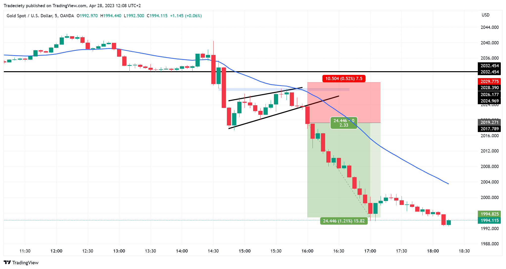

## Table of Contents

## What are multiple time frames in trading?

Multiple time frames in trading means looking at different time periods on a chart to make better decisions. Traders use this to see both the big picture and the small details. For example, a trader might look at a daily chart to see the overall trend, then switch to a 1-hour chart to find the best time to buy or sell.

Using multiple time frames helps traders understand where the market is going and when to act. It's like zooming in and out on a map. By looking at longer time frames, traders can spot major trends. Then, by looking at shorter time frames, they can find the right moments to enter or exit trades. This approach can make trading more successful by combining big picture views with precise timing.

## Why is it important to use multiple time frames?

Using multiple time frames is important because it helps traders see the whole story of the market. Imagine you're trying to understand a long trip. If you only look at a map of the whole country, you might miss the best road to take. But if you only look at a close-up map of a small area, you might not know which direction to go in the bigger picture. By using different time frames, traders can see both the long-term trends and the short-term movements, making their decisions more informed and effective.

This approach also helps traders manage risk better. When you look at a longer time frame, like a weekly chart, you can see if the market is in a strong uptrend or downtrend. This big picture view helps you decide if it's safe to trade in that direction. Then, by switching to a shorter time frame, like a 15-minute chart, you can find the best time to enter or [exit](/wiki/exit-strategy) a trade, reducing the chance of making a bad move. Using multiple time frames is like having a safety net that keeps you from making hasty decisions based on just one view of the market.

## How can beginners start using multiple time frames in their trading?

Beginners can start using multiple time frames by first choosing a main time frame that matches their trading style. If they are day traders, they might pick a 1-hour chart as their main view. If they are swing traders, a daily chart might be better. Once they have their main time frame, they should look at a longer time frame, like a weekly chart, to see the bigger trend. This helps them decide if they should be buying or selling. Then, they can use a shorter time frame, like a 15-minute chart, to find the best time to enter or exit a trade.

It's important for beginners to practice this method without real money first. They can use a demo account to get used to switching between different time frames. As they practice, they will learn to spot how the shorter time frame movements fit into the bigger picture. This will help them make better trading decisions. Over time, using multiple time frames will become a natural part of their trading routine, helping them to trade more confidently and successfully.

## What are the most common time frames used by traders?

The most common time frames used by traders are the daily, 4-hour, 1-hour, and 15-minute charts. Daily charts are popular with swing traders who hold trades for several days or weeks. They give a good view of the bigger trend and help traders see where the market is going over time. The 4-hour chart is useful for traders who want to see the market's movement over a few hours but still get a sense of the daily trend. It's a good middle ground between the daily and shorter time frames.

The 1-hour chart is often used by day traders who want to make trades within a single day. This time frame shows more detail than the 4-hour chart and helps traders find good entry and exit points. The 15-minute chart is even more detailed and is used by traders who need to make quick decisions. It's great for finding the best times to get in and out of trades during the day. By using these different time frames, traders can see both the big picture and the small details, which helps them make better trading choices.

## How do different time frames affect trading decisions?

Different time frames can change how traders see the market and make choices. When traders look at a long time frame like a weekly chart, they see the big trend. This helps them decide if they should be buying or selling. For example, if the weekly chart shows the market is going up, a trader might decide to buy. But if the weekly chart shows the market is going down, the trader might decide to sell. The long time frame gives a clear view of where the market is heading over time.

Short time frames, like a 15-minute chart, help traders find the best time to buy or sell. If a trader sees the market is going up on the weekly chart, they can use the 15-minute chart to find the exact moment to buy. This short time frame shows more details and quick changes in the market. By using both long and short time frames, traders can make better decisions. They can see the big trend and find the right time to act, which can help them make more money and avoid big losses.

## What are the advantages of using a top-down approach in multiple time frame analysis?

Using a top-down approach in multiple time frame analysis means starting with the big picture and then looking at smaller details. This helps traders understand the overall trend first. When traders look at a long time frame like a weekly chart, they can see if the market is going up or down over time. This big picture view helps them decide if they should be buying or selling. By starting with the big trend, traders can avoid making decisions based on short-term movements that might not matter in the long run.

Once traders know the big trend, they can use shorter time frames to find the best time to buy or sell. For example, if the weekly chart shows the market is going up, a trader can look at a 1-hour chart to find the exact moment to buy. This short time frame shows more details and quick changes in the market, helping traders make better entry and exit decisions. By using the top-down approach, traders can combine the big picture with the small details, which can lead to more successful trades and better risk management.

## How can traders synchronize entry and exit points across different time frames?

To synchronize entry and exit points across different time frames, traders start by looking at the longest time frame, like a weekly chart, to see the big trend. If the weekly chart shows the market is going up, traders know they should be looking to buy. Then, they move to a shorter time frame, like a daily chart, to see if the trend is still strong. If the daily chart also shows the market going up, traders can feel more confident about their decision to buy.

Next, traders use an even shorter time frame, like a 1-hour chart, to find the best time to enter the trade. They look for signs that the market is about to move up, like a price bouncing off a support level. Once they enter the trade, they keep watching the shorter time frame to decide when to exit. If the 1-hour chart shows the market starting to go down, it might be time to sell. By using different time frames this way, traders can make sure their entry and exit points line up with the big trend and the smaller movements, helping them make better trades.

## What are some common mistakes to avoid when using multiple time frames?

One common mistake when using multiple time frames is focusing too much on the shorter time frames and ignoring the big trend. Traders might see a good buying signal on a 15-minute chart but miss that the daily chart shows the market is going down. This can lead to bad trades because the short-term signal doesn't match the big picture. It's important to always start with the longest time frame to see the overall trend before looking at shorter ones.

Another mistake is switching between time frames too quickly. Traders might get confused by all the different charts and lose track of the main trend. It's better to take time to study each time frame carefully and make sure they all line up before making a trade. Jumping around too much can lead to rushed decisions and mistakes. By taking a step-by-step approach and making sure the big trend and the smaller movements match, traders can avoid these common errors and make better trading choices.

## How can advanced traders use multiple time frames to improve their trading strategies?

Advanced traders can use multiple time frames to get a deeper understanding of the market and improve their trading strategies. They start by looking at the longest time frame, like a monthly or weekly chart, to see the big trend. This helps them decide if they should be buying or selling. Once they know the big trend, they move to shorter time frames, like a daily or 4-hour chart, to confirm that the trend is still strong. By using this top-down approach, advanced traders can make sure their trades line up with the overall market direction, which can lead to more successful trades.

Next, advanced traders use even shorter time frames, like a 1-hour or 15-minute chart, to find the best time to enter and exit trades. They look for signs that the market is about to move in the direction of the big trend, like a price bouncing off a support or resistance level. By combining the big picture with the small details, advanced traders can fine-tune their entry and exit points, reducing their risk and increasing their chances of making a profit. This method helps them make more informed decisions and improve their overall trading performance.

## What role do multiple time frames play in risk management?

Multiple time frames help traders manage risk by giving them a clear view of the big trend and the smaller movements. When traders start with a long time frame, like a weekly chart, they can see if the market is going up or down over time. This big picture helps them decide if it's safe to trade in that direction. If the weekly chart shows the market is going up, traders know it's safer to buy. But if the weekly chart shows the market is going down, it's safer to sell. By knowing the big trend, traders can avoid making trades that go against the market, which can help them lose less money.

After knowing the big trend, traders use shorter time frames, like a 1-hour chart, to find the best time to enter and exit trades. This helps them reduce risk because they can wait for the right moment to make a move. If the 1-hour chart shows the market is about to move up, traders can buy at a good price. If the 1-hour chart shows the market is about to move down, they can sell at a good price. By using multiple time frames, traders can make safer trades and manage their risk better. This way, they can protect their money and make more successful trades.

## How can traders use multiple time frames to identify trend confirmations?

Traders can use multiple time frames to identify trend confirmations by first looking at a long time frame, like a weekly chart, to see the big trend. If the weekly chart shows the market is going up, traders know they should be looking to buy. Then, they check a shorter time frame, like a daily chart, to see if the trend is still strong. If the daily chart also shows the market going up, it confirms that the big trend is still in place. This helps traders feel more confident about their decision to buy because they know the market is moving in the same direction on both time frames.

Next, traders use an even shorter time frame, like a 1-hour chart, to find the best time to enter the trade. They look for signs that the market is about to move up, like a price bouncing off a support level. If the 1-hour chart also shows the market going up, it confirms the trend even more. By using different time frames this way, traders can make sure the big trend and the smaller movements match, helping them make better trades with less risk.

## What are the latest tools and technologies available for analyzing multiple time frames?

Traders today can use many tools and technologies to look at different time frames. One popular tool is trading platforms like MetaTrader 4 and 5. These platforms let traders see many time frames at the same time. They can switch between weekly, daily, and hourly charts easily. Another useful tool is charting software like TradingView. This software has lots of ways to draw lines and shapes on charts, which helps traders see trends better. It also lets traders share their charts with others, which can help them learn from each other.

There are also special indicators and tools made just for using multiple time frames. For example, the Multi-Time Frame (MTF) indicators can show signals from different time frames on one chart. This makes it easier for traders to see if the big trend matches the smaller movements. Another helpful technology is [algorithmic trading](/wiki/algorithmic-trading) software. This software can be set up to look at different time frames and make trades automatically based on what it sees. By using these tools and technologies, traders can make better decisions and manage their trades more easily.

## What are the Key Technical Indicators for Multiple Time Frames?

Moving Averages (MAs) are crucial tools in multi-timeframe analysis, allowing traders to decipher trend directions by smoothing price data over specified periods. They help in pinpointing potential crossover events, where a shorter-term MA intersects a longer-term one, signaling possible entry and exit opportunities. For example, a common strategy is the use of the 50-day and 200-day moving averages: a "Golden Cross" occurs when the 50-day MA crosses above the 200-day MA, indicating a bullish trend, while a "Death Cross" suggests a bearish trend in the opposite scenario. The formula for a simple moving average (SMA) is as follows:

$$
\text{SMA} = \frac{\text{Sum of closing prices over a period}}{\text{Number of periods}}
$$

The MACD (Moving Average Convergence Divergence) indicator is effective in identifying [momentum](/wiki/momentum) shifts and confirming trend changes across various time frames. The MACD is calculated by subtracting the 26-period Exponential Moving Average (EMA) from the 12-period EMA. A nine-day EMA of the MACD, known as the "signal line," is plotted on top of the MACD line, serving as a trigger for buy and sell signals. The MACD formula is:

$$
\text{MACD} = \text{EMA}_{12} - \text{EMA}_{26}
$$

Relative Strength Index (RSI) gauges the speed and change of price movements, serving as a valuable tool for identifying overbought or oversold conditions. On different time frames, RSI can confirm trends, helping traders determine the strength and possible reversals of a trend. The RSI is calculated as follows:

$$
\text{RSI} = 100 - \left( \frac{100}{1 + \text{RS}}} \right)
$$

Where RS (Relative Strength) is the average of 'n' days' up closes divided by the average of 'n' days' down closes. Traders typically consider an RSI above 70 as overbought and below 30 as oversold. 

These indicators, when applied across multiple time frames, provide a comprehensive view of market dynamics, assisting traders in making well-informed decisions.

## References & Further Reading

[1]: "Advances in Financial Machine Learning" by Marcos Lopez de Prado

[2]: Aronson, D. (2006). "Evidence-Based Technical Analysis: Applying the Scientific Method and Statistical Inference to Trading Signals." John Wiley & Sons.

[3]: Jansen, S. (2020). "Machine Learning for Algorithmic Trading." Packt Publishing Ltd.

[4]: Chan, E. P. (2008). "Quantitative Trading: How to Build Your Own Algorithmic Trading Business." John Wiley & Sons.

[5]: Kirkpatrick, C. D., & Dahlquist, J. R. (2010). "Technical Analysis: The Complete Resource for Financial Market Technicians." FT Press.

[6]: Kaufman, P. J. (2013). "Trading Systems and Methods." John Wiley & Sons.

[7]: Murphy, J. J. (1999). "Technical Analysis of the Financial Markets: A Comprehensive Guide to Trading Methods and Applications." New York Institute of Finance.