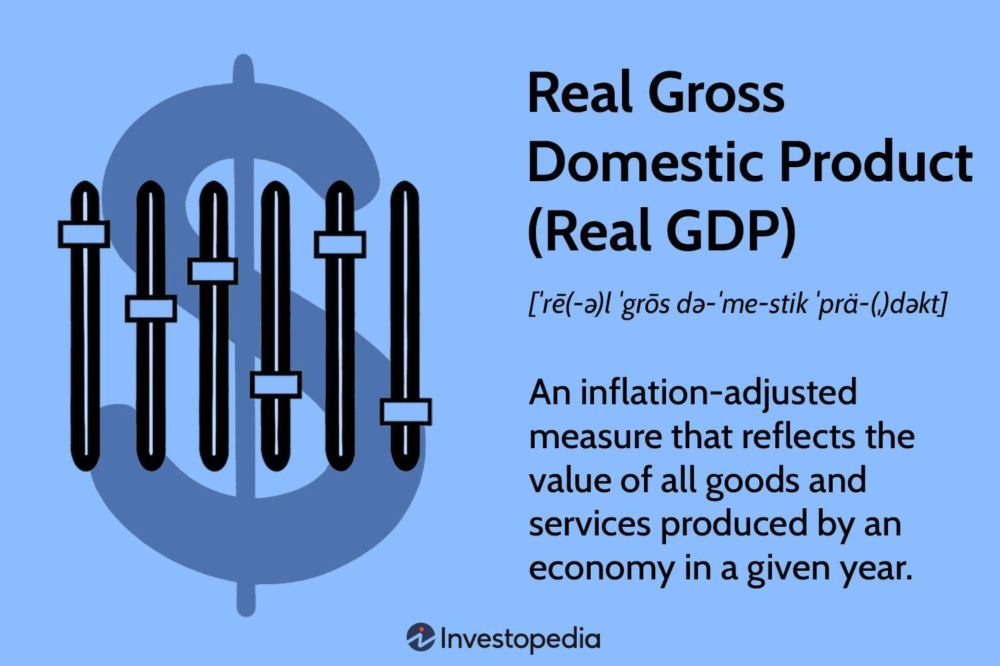

## Table of Contents

## What is Real GDP and how is it different from Nominal GDP?

Real GDP, or Gross Domestic Product, is a measure of the total value of all goods and services produced in a country over a specific period, adjusted for inflation. This means that Real GDP shows the economic output in terms of what it would be worth in a chosen base year's prices. By removing the effects of inflation, Real GDP provides a more accurate picture of an economy's growth over time. For example, if a country's Real GDP increased from one year to the next, it means that the economy actually produced more goods and services, not just that prices went up.

Nominal GDP, on the other hand, is the total value of all goods and services produced in a country using current prices, without adjusting for inflation. This means that Nominal GDP can increase even if the quantity of goods and services produced stays the same, simply because prices have risen. For instance, if the price of a loaf of bread goes up, Nominal GDP will go up even if the same number of loaves are sold. The key difference between Real GDP and Nominal GDP is that Real GDP gives a clearer picture of economic growth by accounting for changes in price levels, while Nominal GDP reflects both price changes and actual output changes.

## Why do economists prefer using Real GDP over Nominal GDP?

Economists prefer using Real GDP over Nominal GDP because it gives a more accurate picture of how an economy is doing. Real GDP takes away the effect of inflation, which means it shows how much more or less stuff a country is making from year to year. If you just look at Nominal GDP, you might think the economy is growing when it's really just prices that are going up. By using Real GDP, economists can see if people are actually producing more things, which is a better way to measure real growth.

Another reason economists like Real GDP is that it helps them compare the economy over different years more fairly. Since Real GDP uses prices from a base year, it makes it easier to see if the economy is getting better or worse over time without the confusion of changing prices. This is important for making good decisions about things like taxes, spending, and interest rates. So, even though Nominal GDP is easier to calculate, Real GDP is more useful for understanding the true health of an economy.

## How is Real GDP calculated?

To calculate Real GDP, you start by figuring out the total value of all the goods and services made in a country during a year, but you use prices from a chosen base year instead of the current year's prices. This means you take the amount of stuff produced this year and multiply it by the prices of that stuff from the base year. This way, you can see how much more or less is being produced without the prices messing things up.

The formula to calculate Real GDP is pretty simple. It's the sum of all the goods and services produced, each multiplied by their price in the base year. So, if you made 100 apples this year and the price of an apple in the base year was $1, then the value of the apples in Real GDP would be $100. You do this for everything made in the country and add it all up to get the Real GDP. This helps economists see the real growth of the economy, without inflation making things look different.

## What are the main components of Real GDP?

Real GDP is made up of four main parts: what people spend on things, what businesses invest in, what the government buys, and the difference between what a country sells to other countries and what it buys from them. The first part is called personal consumption, and it's all the stuff people buy like food, clothes, and cars. The second part is business investment, which includes things like factories, machines, and buildings that businesses use to make stuff.

The third part of Real GDP is government spending, which includes everything the government buys, like roads, schools, and services. The last part is called net exports, which is what a country sells to other countries minus what it buys from them. If a country sells more than it buys, net exports are positive, and if it buys more than it sells, net exports are negative. All these parts together show how much stuff a country is making, without the prices changing the numbers.

## How does Real GDP help in understanding economic growth?

Real GDP helps us understand how much an economy is growing by showing us how much more stuff a country is making from one year to the next. When we look at Real GDP, we can see if people are buying more things, if businesses are making more investments, if the government is spending more, or if the country is selling more stuff to other countries. All these things together tell us if the economy is getting bigger or smaller. By using prices from a base year, Real GDP makes sure that we're not just seeing higher numbers because prices went up, but because more goods and services are actually being made.

When Real GDP goes up, it means the economy is growing because more things are being produced. This is important because it can show if people are getting richer or if more jobs are being created. If Real GDP stays the same or goes down, it might mean the economy is not doing well, and people might have less money to spend. By looking at Real GDP over time, we can see if the economy is on a good path or if it needs help. This helps leaders make decisions about things like taxes and spending to keep the economy healthy.

## What are the limitations of using Real GDP as an economic indicator?

Real GDP is a great way to see how much stuff a country is making, but it has some problems too. One big problem is that it doesn't tell us everything about how well people are doing. For example, Real GDP might go up because more things are being made, but if the money is only going to a few rich people, most people might not feel any better off. Also, Real GDP doesn't count things like volunteer work or taking care of your own kids, which can be really important to people's lives but don't show up in the numbers.

Another issue with Real GDP is that it doesn't show if the growth is good for the environment. If a country makes more stuff but pollutes a lot more, Real GDP might go up, but the air and water might get worse. Plus, Real GDP doesn't tell us about how happy people are or how safe they feel. So, while Real GDP is a good tool for looking at how much an economy is growing, it doesn't give us the whole picture of how well a country and its people are doing.

## How do economists use Real GDP to compare economic performance across different countries?

Economists use Real GDP to compare how well different countries' economies are doing by looking at how much stuff each country is making, without the prices messing things up. They do this by changing the numbers to a common currency, like US dollars, and using prices from the same base year for all countries. This way, they can see which country is making more things and growing faster. For example, if Country A's Real GDP is growing faster than Country B's, it means Country A is making more stuff and its economy is doing better.

However, comparing Real GDP across countries can be tricky because countries have different numbers of people. To fix this, economists often look at Real GDP per person, which is called Real GDP per capita. This tells us how much stuff each person in a country is getting, which is a better way to see if people are doing better or worse. If Country A has a higher Real GDP per capita than Country B, it means the average person in Country A is richer. But even with these adjustments, Real GDP doesn't tell us everything about how well people are living in different countries.

## Can Real GDP be used to assess the standard of living within a country?

Real GDP can give us some clues about the standard of living in a country, but it's not perfect. When we look at Real GDP per person, or Real GDP per capita, it shows us how much stuff each person in the country gets on average. If Real GDP per capita is going up, it might mean people are getting richer and can buy more things, which could make their lives better. But, Real GDP doesn't tell us everything about how people are living. It doesn't count things like how happy people are, how safe they feel, or how much they help each other out. So, while it's useful, it's not the whole story.

Another problem with using Real GDP to check the standard of living is that it doesn't show if the money is spread out evenly. If a few people get very rich and everyone else stays the same or gets poorer, Real GDP might go up, but most people won't feel any better off. Also, Real GDP doesn't care about the environment. If a country makes more stuff but pollutes a lot, Real GDP might go up, but the air and water might get worse, which can make life harder for people. So, while Real GDP is a good starting point, we need to look at other things too to really understand how people are living.

## How does Real GDP influence government policy decisions?

Real GDP helps governments decide what to do with their money and laws. When Real GDP goes up, it means the country is making more stuff, and people might be getting richer. Governments might then spend more on things like schools and roads, or they might cut taxes to help people keep more of their money. If Real GDP is going down, it could mean the economy is not doing well. Governments might then spend more to help the economy grow, like building new projects or giving money to people who need it.

But, Real GDP doesn't tell the whole story. Governments also look at other things like how many people have jobs, how much prices are going up, and how much money people are making. If Real GDP is up but a lot of people are still poor, the government might focus on helping those people. If Real GDP is down and people are losing jobs, the government might try to create more jobs. So, while Real GDP is important, it's just one piece of the puzzle that governments use to make decisions.

## What role does Real GDP play in forecasting economic trends?

Real GDP is really helpful for guessing what will happen with the economy in the future. Economists look at how Real GDP has been changing over time to see if it's going up or down. If Real GDP has been growing for a while, they might guess that it will keep growing, and the economy will keep getting better. But if Real GDP starts to go down, they might think there could be tough times ahead, like a recession. By looking at Real GDP, economists can make guesses about things like how many jobs there will be, how much people will spend, and what the government should do.

But Real GDP isn't perfect for predicting the future. It's just one piece of the puzzle. Economists also look at other stuff, like how much people are spending, how many people have jobs, and what's happening in other countries. Sometimes, Real GDP might go up, but other signs might show that the economy isn't doing as well as it seems. So, while Real GDP is a good starting point for making guesses about the future, it's important to look at everything together to get a better picture of what might happen.

## How do adjustments for inflation affect the interpretation of Real GDP?

Adjustments for inflation are really important when we look at Real GDP because they help us see how much more stuff a country is making, not just how much prices have gone up. If we didn't adjust for inflation, we might think the economy is doing better than it really is. For example, if prices go up a lot but people aren't making more things, Nominal GDP would go up, but Real GDP would stay the same or even go down. This shows us that the economy isn't really growing, it's just that things cost more.

By using a base year's prices, Real GDP gives us a clear picture of how the economy is doing over time. If Real GDP goes up, it means people are actually making more stuff, not just that prices have gone up. This helps us understand if the economy is getting better or worse. It's like looking at how many apples are being grown instead of just seeing that the price of apples went up. This way, we can make better decisions about things like taxes and spending to help the economy grow in a real way.

## What advanced statistical methods are used to refine Real GDP estimates?

To make Real GDP numbers more accurate, economists use some fancy math called advanced statistical methods. One of these methods is called seasonal adjustment. This helps take away the ups and downs that happen every year, like more spending during holidays. By doing this, economists can see the real changes in the economy, not just the normal yearly patterns. Another method they use is called chain-linking. This helps connect the numbers from different years together smoothly, even when prices change a lot. It's like making a chain where each link fits perfectly with the next one, so the whole thing stays strong.

Another important method is called hedonic pricing. This one is used to figure out how much better or worse things are getting over time. For example, if a new computer is faster and cheaper than last year's model, hedonic pricing helps count that as growth in Real GDP. It's like saying, "Hey, this new computer is worth more because it's better, even if it costs the same." Lastly, economists use something called benchmarking, where they compare their early guesses with more complete data that comes later. This helps them fix any mistakes and make their numbers more accurate. All these methods together help make sure the Real GDP numbers are as close to the truth as possible.

## What is Understanding Nominal GDP?

Nominal GDP refers to the total market value of all final goods and services produced within a country's borders, calculated using current year prices. Unlike real GDP, which adjusts for inflation, nominal GDP measures current output in current prices. This can result in misleading interpretations, as changes in nominal GDP may reflect shifts in price levels rather than actual increases or decreases in economic production. 

The formula to calculate nominal GDP is:

$$

\text{Nominal GDP} = C + I + G + (X - M)
$$

Where:
- $C$ represents consumption expenditures by households and non-profit institutions.
- $I$ stands for investment by businesses in physical capital and construction.
- $G$ is government spending on goods and services.
- $X$ denotes exports of goods and services, while $M$ indicates imports. The term $(X - M)$ represents the net exports. 

This aggregate encompasses all economic activity within a given period, irrespective of changes in price levels. Understanding nominal GDP is essential for evaluating economic conditions at a specific point in time because it captures the market value of goods and services using current prices without adjusting for inflation or deflation. This characteristic can highlight unsophisticated views of economic change when not interpreted with other metrics, particularly during periods of significant inflationary or deflationary pressures.

## What is Exploring Real GDP?

Real GDP is a crucial economic metric that provides a more accurate depiction of an economy's growth by adjusting nominal GDP for the effects of inflation. This adjustment uses a set of constant prices from a base year, allowing for an analysis of economic performance over time that isolates genuine growth from inflationary influences. 

The calculation of Real GDP is essential for understanding true economic growth. It focuses on actual economic performance over different periods by using the GDP deflator, a price index that measures the change in prices for all of the goods and services produced in an economy. The formula for Real GDP is:

$$
\text{Real GDP} = \frac{\text{Nominal GDP}}{\text{GDP Deflator}} \times 100
$$

By removing the distortion caused by fluctuating price levels, Real GDP provides a clearer picture of how an economy evolves and expands across time. This clarity is fundamental not only for academic analysis but also for practical applications where reliable data is paramount.

Real GDP's significance extends to policymakers and economists who rely on it to construct forward-thinking economic strategies. By measuring genuine economic expansion, Real GDP becomes a cornerstone for developing policies aimed at fostering sustainable growth, allocating resources, and addressing macroeconomic challenges. These strategies can involve [interest rate](/wiki/interest-rate-trading-strategies) adjustments, fiscal policies, and interventions designed to stabilize and stimulate the economy.

In summary, Real GDP is an indispensable tool for accurately assessing economic growth by excluding inflationary effects. It allows for a genuine evaluation of economic progress and forms the basis for informed decision-making in both policy and investment contexts.

## What are the key differences between Nominal and Real GDP?

Nominal GDP and real GDP are two fundamental metrics used to assess an economy's performance, with the primary distinction stemming from their treatment of inflation. Nominal GDP calculates the total market value of all finished goods and services produced within a country's borders at current market prices, without adjustments for inflation. Consequently, it can reflect price level changes over time, thus not accurately representing true economic growth. In contrast, real GDP adjusts for inflation, providing a more precise measure of an economy's actual growth by using constant prices from a predetermined base year. This adjustment is achieved via the GDP deflator, an index that reflects the average price level of all goods and services in an economy.

The GDP deflator is calculated as follows:

$$
\text{GDP Deflator} = \left( \frac{\text{Nominal GDP}}{\text{Real GDP}} \right) \times 100
$$

By employing this formula, economists can ascertain the real GDP, ensuring inflationary impacts are separated from growth metrics. This inflation adjustment is crucial for accurately comparing economic output across different time periods, as it allows for an analysis unaffected by the fluctuating price levels.

Understanding these differences is vital for economic analysis, particularly in developing robust strategies in [algorithmic trading](/wiki/algorithmic-trading). Algorithms rely on both nominal and real GDP data to forecast economic trends, anticipate market shifts, and make informed investment decisions. By distinguishing between nominal and real GDP, trading algorithms can integrate precise economic insights, optimizing their performance. Consequently, a firm grasp of the distinctions between these GDP measures equips algorithmic traders with a strategic advantage in navigating varied economic conditions.

## References & Further Reading

[1]: ["Gross Domestic Product (GDP)" - Investopedia](https://www.investopedia.com/terms/g/gdp.asp)

[2]: ["Real vs. Nominal GDP" - The Balance](https://www.thebalancemoney.com/what-is-real-gdp-how-to-calculate-it-vs-nominal-3306040)

[3]: ["Macroeconomics" - by N. Gregory Mankiw](https://archive.org/details/macro-economics-mankew)

[4]: ["Algorithmic Trading: Winning Strategies and Their Rationale"](https://onlinelibrary.wiley.com/doi/pdf/10.1002/9781118676998.fmatter) by Ernest P. Chan

[5]: ["Python for Data Analysis"](https://wesmckinney.com/book/) by Wes McKinney

[6]: ["Python Machine Learning"](https://scikit-learn.org/stable/index.html) by Sebastian Raschka and Vahid Mirjalili