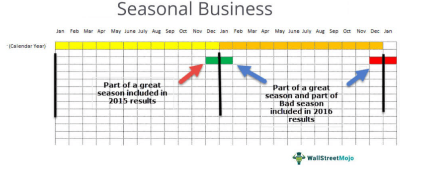

## Table of Contents

## What is the Consumer Price Index (CPI)?

The Consumer Price Index, or CPI, is a way to measure how the prices of things we buy change over time. It looks at the cost of a basket of goods and services that people typically buy, like food, clothes, and rent. By comparing the cost of this basket from one period to another, the CPI can tell us if prices are going up or down. If the CPI goes up, it means things are getting more expensive, which is called inflation. If it goes down, it means things are getting cheaper, which is called deflation.

The CPI is important because it helps people understand how their cost of living is changing. Governments and businesses use the CPI to make decisions about things like wages, taxes, and interest rates. For example, if the CPI shows that prices are rising a lot, the government might decide to increase wages so that people can still afford to buy what they need. The CPI is also used to adjust Social Security benefits and other payments to keep up with inflation. By keeping track of the CPI, we can better plan for the future and make sure our money goes as far as possible.

## Why is the CPI important for understanding inflation?

The CPI is important for understanding inflation because it measures how the prices of things we buy every day change over time. When the CPI goes up, it means that the cost of living is increasing, which is what we call inflation. By looking at the CPI, we can see if prices are going up a little bit or a lot, which helps us understand how fast inflation is happening.

This information is really useful for everyone. For example, if you know that inflation is high, you might decide to spend your money differently or save more. Governments and businesses also use the CPI to make big decisions. If inflation is too high, the government might change interest rates or adjust policies to try to slow it down. So, the CPI helps us all plan better and make smarter choices with our money.

## What does 'seasonally adjusted' mean in the context of CPI data?

When we talk about CPI data being 'seasonally adjusted,' it means that the numbers have been changed to take out the ups and downs that happen at the same time every year. For example, prices might go up in the winter because of holidays, or they might go down in the summer when there are sales. By taking out these regular changes, we can see the real trend in prices more clearly.

Seasonal adjustment helps us understand the true rate of inflation without the noise from seasonal events. It makes the CPI data more useful for making decisions because it shows what's really happening with prices over time, not just what's happening because of the time of year. This way, we can see if prices are going up because of inflation or just because it's a busy shopping season.

## How is seasonal adjustment applied to CPI data?

Seasonal adjustment is done by looking at past CPI data to see how prices change at different times of the year. For example, if prices always go up in December because of holiday shopping, this pattern is figured out and taken out of the current year's data. This way, the CPI numbers show what's really happening with prices, not just what happens every year at the same time.

Once the seasonal patterns are known, they are removed from the current CPI data. This makes the numbers smoother and easier to understand. It helps us see if prices are going up because of inflation or just because it's a busy time of year. By doing this, we get a clearer picture of how the cost of living is changing over time.

## What are the benefits of using seasonally adjusted CPI data?

Using seasonally adjusted CPI data helps us see the real changes in prices more clearly. When we take out the ups and downs that happen every year, like higher prices during the holidays or lower prices during sales, we can better understand if prices are going up because of inflation or just because it's a busy time of year. This makes it easier to see the true trend in how much things cost over time.

This clearer picture is really helpful for everyone. For people, it means they can make better choices about spending and saving their money. For governments and businesses, it helps them make important decisions, like setting interest rates or planning budgets. By using seasonally adjusted CPI data, we can all plan better and understand how the cost of living is changing without getting confused by regular seasonal changes.

## Can you explain the difference between seasonally adjusted and non-seasonally adjusted CPI data?

Seasonally adjusted CPI data is when the numbers are changed to take out the ups and downs that happen at the same time every year. For example, prices might go up in December because of the holidays, or they might go down in the summer because of sales. By taking out these regular changes, we can see if prices are really going up because of inflation or if it's just because of the time of year.

Non-seasonally adjusted CPI data, on the other hand, shows the prices just as they are, without taking out the seasonal changes. So, if you look at this data, you might see big changes in prices during certain times of the year, like higher prices in December or lower prices in the summer. This can make it harder to see the true trend in how much things cost over time because the seasonal ups and downs can hide the real changes.

Using seasonally adjusted data helps us understand the real rate of inflation better. It makes the numbers smoother and easier to understand, which is helpful for everyone trying to make decisions about money. Non-seasonally adjusted data is still useful, but it can be confusing because it includes all the regular ups and downs that happen every year.

## How does seasonal adjustment affect the interpretation of CPI data?

Seasonal adjustment makes it easier to see the real changes in prices over time. When we take out the regular ups and downs that happen every year, like higher prices during the holidays or lower prices during sales, we can see if prices are going up because of inflation or just because it's a busy time of year. This helps us understand the true rate of inflation better, without getting confused by the seasonal changes.

Without seasonal adjustment, the CPI data shows all the ups and downs that happen every year. This can make it harder to see the real trend in how much things cost over time. For example, if you see prices go up in December, it might be because of the holidays and not because of inflation. By using seasonally adjusted data, we get a clearer picture of how the cost of living is changing, which is helpful for making decisions about money.

## What are some common seasonal patterns that affect CPI?

Some common seasonal patterns that affect CPI happen every year at the same time. For example, prices often go up in December because of the holidays. People buy more gifts and food for holiday celebrations, so stores might raise their prices. Another example is in the summer, when prices can go down because of sales. Stores want to get rid of old summer clothes and other items, so they put them on sale, which makes the CPI go down a bit.

Another seasonal pattern is seen in the winter, when heating costs go up. People use more heat to stay warm, so the cost of energy like gas and electricity can go up, which affects the CPI. Also, in the spring, prices for fresh produce might go down because it's the start of the growing season and there's more fresh food available. These regular changes happen every year and can make the CPI numbers go up and down, even if the real cost of living isn't changing that much.

## How can seasonally adjusted CPI data be used in economic forecasting?

Seasonally adjusted CPI data is really helpful for economic forecasting because it shows the true changes in prices over time, without the ups and downs that happen every year. When economists look at this data, they can see if prices are going up because of inflation or if it's just because of the time of year. This helps them predict how the economy will do in the future. For example, if the seasonally adjusted CPI is going up a lot, it might mean that inflation is high, and the economy could be growing fast. But if it's going down, it could mean that prices are falling, and the economy might be slowing down.

Using this data, economists and policymakers can make better guesses about what might happen next. They can decide if they need to change interest rates or make other big decisions to keep the economy stable. For example, if the seasonally adjusted CPI shows that inflation is getting too high, the government might decide to raise interest rates to slow things down. On the other hand, if it shows that prices are falling too much, they might lower interest rates to help the economy grow. By looking at seasonally adjusted CPI data, they can plan for the future and help make sure the economy stays on track.

## What are the limitations or potential pitfalls of using seasonally adjusted CPI data?

Even though seasonally adjusted CPI data is really helpful, it has some limitations. One big problem is that the adjustments are based on past data. If the patterns of how prices change during the year start to change, the adjustments might not work as well. For example, if people start buying more in the summer because of new trends, the old data might not catch this new pattern, and the adjustments could be off. This means the seasonally adjusted numbers might not show the real changes in prices as well as we'd like.

Another issue is that seasonal adjustments can hide important short-term changes in prices. If there's a big event or a sudden change in the economy, like a big sale or a new tax, the seasonal adjustments might smooth out these changes too much. This can make it hard to see what's really happening right now. So, while seasonally adjusted data helps us see long-term trends, it might miss out on important short-term information that could be useful for making quick decisions.

## How do statistical agencies determine the seasonal adjustment factors for CPI?

Statistical agencies use past data to figure out the seasonal adjustment factors for CPI. They look at many years of CPI numbers to see how prices change at different times of the year. For example, they might see that prices always go up in December because of the holidays. They use this information to make a model that shows these regular patterns. This model helps them take out the seasonal ups and downs from the current CPI data, so they can see the real changes in prices.

Sometimes, the agencies use special computer programs to help with this work. These programs can look at a lot of data and find the patterns that happen every year. They use math to figure out how much to adjust the numbers. This way, the seasonally adjusted CPI data shows what's really happening with prices, not just the regular changes that happen every year. It's a careful process that helps make sure the numbers are as accurate as possible.

## What advanced techniques are used to refine the seasonal adjustment of CPI data?

To make the seasonal adjustment of CPI data even better, statistical agencies use some advanced techniques. One of these is called the X-13ARIMA-SEATS method. This is a fancy way of saying they use a special computer program to look at the data and find the patterns that happen every year. It helps them take out the seasonal changes more accurately by using math to predict how prices will change in the future based on what happened before. This method also helps them see if there are any sudden changes or special events that might affect prices, so they can adjust for those too.

Another technique they use is called regression analysis. This means they look at how different things, like the time of year or special events, affect prices. By understanding these relationships, they can make the seasonal adjustments more precise. For example, if they see that prices always go up a lot in December, they can use regression analysis to figure out exactly how much to adjust the numbers to take out this regular change. These advanced techniques help make sure the seasonally adjusted CPI data is as accurate as possible, so everyone can understand the real changes in prices better.

## What is the Consumer Price Index (CPI) and how is it understood?

The Consumer Price Index (CPI) functions as a pivotal measure in assessing inflation, representing variations in the prices of a predetermined basket of goods and services over time. This index is meticulously compiled and released monthly by the Bureau of Labor Statistics (BLS), providing crucial insights into economic trends and shifts in purchasing power. The CPI's systematic approach involves tracking the price changes of an extensive array of items that urban consumers purchase regularly, including food, housing, apparel, transportation, medical care, and education.

To calculate the CPI, the BLS employs a weighted average method. Prices for each item in the basket are monitored and combined using a formula that accounts for the relative importance of each item to the average consumer's budget. The formula can be expressed as:

$$
\text{CPI} = \left( \frac{\Sigma (P_t \times Q_0)}{\Sigma (P_0 \times Q_0)} \right) \times 100
$$

Here, $P_t$ is the price of each item in the current period, $P_0$ is the price of each item in the base period, and $Q_0$ is the quantity of each item in the base period. This calculation produces an index number that reflects the overall price level relative to the base year, set typically at 100.

Economists and traders heavily rely on the CPI as a fundamental tool to assess inflationary pressures within the economy. By analyzing changes in the CPI, economic [agents](/wiki/agents) can identify periods of rising or falling prices, guiding monetary policies and investment strategies. A rising CPI often signals increasing inflation, prompting central banks to adjust interest rates to maintain economic stability. Likewise, traders use CPI data to refine forecasts and optimize investment decisions, capitalizing on anticipating market reactions to inflation trends.

The CPI also serves as an indicator of purchasing power changes. As the index rises, the purchasing power of money declines, meaning consumers can afford fewer goods and services with the same amount of money. This attribute of the CPI highlights its significance in wage negotiations, cost-of-living adjustments, and economic policy formulations.

In conclusion, the Consumer Price Index is a critical economic indicator, offering a consistent benchmark for inflation assessment and economic analysis. Its monthly publication by the Bureau of Labor Statistics ensures that traders, economists, and policymakers have access to current and historical data, essential for making informed decisions in a dynamic economic environment.

## References & Further Reading

[1]: ["Consumer Price Index - All Urban Consumers"](https://www.bls.gov/news.release/cpi.t01.htm) provided by the U.S. Bureau of Labor Statistics

[2]: Bergstra, J., Bardenet, R., Bengio, Y., & Kégl, B. (2011). ["Algorithms for Hyper-Parameter Optimization."](https://dl.acm.org/doi/10.5555/2986459.2986743) Advances in Neural Information Processing Systems 24.

[3]: ["Advances in Financial Machine Learning"](https://www.amazon.com/Advances-Financial-Machine-Learning-Marcos/dp/1119482089) by Marcos Lopez de Prado

[4]: ["Evidence-Based Technical Analysis: Applying the Scientific Method and Statistical Inference to Trading Signals"](https://www.amazon.com/Evidence-Based-Technical-Analysis-Scientific-Statistical/dp/0470008741) by David Aronson

[5]: Stock, J. H., & Watson, M. W. (1999). ["Forecasting inflation"](https://www.princeton.edu/~mwatson/papers/Stock_Watson_JME_1999.pdf). Journal of Monetary Economics, 44(2), 293-335.

[6]: Hyndman, R. J., & Athanasopoulos, G. (2018). ["Forecasting: principles and practice."](https://otexts.com/fpp2/)

[7]: ["Machine Learning for Algorithmic Trading"](https://github.com/stefan-jansen/machine-learning-for-trading) by Stefan Jansen

[8]: ["Quantitative Trading: How to Build Your Own Algorithmic Trading Business"](https://www.amazon.com/Quantitative-Trading-Build-Algorithmic-Business/dp/0470284889) by Ernest P. Chan