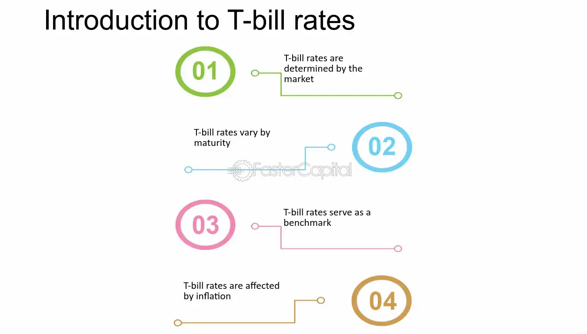

## Table of Contents

## What are T-Bills and how do they work?

T-Bills, or Treasury Bills, are short-term government securities that are issued by the U.S. Department of the Treasury. They are a way for the government to borrow money from investors for a short period, usually ranging from a few days to a year. When you buy a T-Bill, you're essentially lending money to the government, and in return, the government promises to pay you back the full amount you invested when the T-Bill matures, plus a bit of interest.

The way T-Bills work is pretty straightforward. You can buy them at a discount from their face value, which means you pay less than what you will get back when they mature. For example, if you buy a $1,000 T-Bill for $980, you'll get $1,000 back when it matures. The difference between what you paid and what you get back is your interest. T-Bills are considered very safe investments because they are backed by the full faith and credit of the U.S. government, making them a popular choice for conservative investors looking for a secure place to park their money for a short time.

## Why are T-Bills considered risk-free?

T-Bills are considered risk-free because they are backed by the U.S. government. This means the government promises to pay you back the money you invested, plus a little interest. Since the U.S. government has the power to tax and print money, it is very unlikely that it will not be able to pay back its debts. This makes T-Bills one of the safest investments you can make.

Another reason T-Bills are seen as risk-free is that they are short-term. They usually last for less than a year, so there is less time for anything to go wrong. Even if the economy faces some problems, the government can still pay back the money in such a short time. This short duration adds to the safety of T-Bills, making them a popular choice for people who want to keep their money safe.

## How is the risk-free rate determined using T-Bills?

The risk-free rate is a key idea in finance, and it's often figured out using T-Bills. It's the rate of return you can get on an investment that has no risk of losing money. Since T-Bills are backed by the U.S. government, they're seen as having no risk. So, the interest rate on T-Bills is used as the risk-free rate. To find this rate, you look at the yield on the most recent T-Bill auction. The yield is the interest you earn, and it's shown as a percentage of the T-Bill's face value.

People usually use the yield from the 3-month T-Bill to figure out the risk-free rate. This is because 3 months is short enough to be considered safe, but long enough to give a good idea of what the rate should be. By using this rate, investors and financial experts can compare other investments to see if they're worth the extra risk. If an investment offers a higher return than the risk-free rate, it might be a good deal, but it also comes with more risk.

## What is the difference between nominal and real risk-free rates?

The nominal risk-free rate is the interest rate you see on T-Bills without taking into account inflation. It's the basic rate you get for lending money to the government. For example, if you buy a T-Bill and it says you'll get 2% interest, that's the nominal rate. It's the raw number you see before anything else is considered.

The real risk-free rate, on the other hand, takes inflation into account. Inflation is when prices go up over time, making money worth less. The real rate shows what you actually earn after inflation. To find the real rate, you take the nominal rate and subtract the expected inflation rate. If the nominal rate is 2% and inflation is expected to be 1%, the real rate would be 1%. This gives you a better idea of the true value of your investment.

## How often are T-Bill rates updated and where can they be found?

T-Bill rates are updated every week. The U.S. Department of the Treasury holds auctions for T-Bills, and new rates are set during these auctions. The auctions happen on a regular schedule, with different T-Bills being auctioned on different days of the week. For example, 4-week and 8-week T-Bills are auctioned on Tuesdays, 13-week and 26-week T-Bills on Mondays, and 52-week T-Bills on Thursdays.

You can find the most recent T-Bill rates on the U.S. Department of the Treasury's website. They have a section called "Treasury Securities" where you can see the results of the latest auctions. Financial news websites and apps also show T-Bill rates, so you can check places like Bloomberg or Yahoo Finance. Just look for the section about government bonds or Treasury securities.

## What are the maturity periods available for T-Bills?

T-Bills come in different lengths of time before they pay you back, called maturity periods. The shortest ones last just 4 weeks, which is about a month. There are also T-Bills that last 8 weeks, which is a bit longer than a month. These short periods are good if you want your money back quickly.

Then there are T-Bills that last a bit longer. You can get ones that last 13 weeks, which is about 3 months, or 26 weeks, which is about 6 months. The longest T-Bill you can buy lasts 52 weeks, which is a whole year. These different lengths let you pick how long you want to lend your money to the government.

## How do T-Bill yields compare to other government securities?

T-Bill yields are usually lower than the yields on other government securities like Treasury Notes and Treasury Bonds. This is because T-Bills have shorter maturity periods, usually from a few weeks to a year. Since they are short-term, they are seen as very safe, and people are willing to accept a lower return for that safety. Treasury Notes, on the other hand, have maturities of 2, 3, 5, 7, or 10 years, and Treasury Bonds can go up to 30 years. Because these securities have longer terms, they need to offer higher yields to attract investors who are willing to tie up their money for a longer time.

Even though T-Bill yields are lower, they are still important for setting a baseline for other investments. The yield on T-Bills is used as the risk-free rate, which is a key number in finance. Other investments, like stocks or corporate bonds, are compared to this rate to see if they offer enough extra return to make up for their higher risk. So while T-Bills might not give you the highest return, they play a big role in helping investors understand and compare the value of other investments.

## What role do T-Bills play in the Capital Asset Pricing Model (CAPM)?

T-Bills are really important in the Capital Asset Pricing Model, or CAPM for short. CAPM is a way to figure out how much return you should expect from an investment, based on how risky it is. In CAPM, the risk-free rate is a big part of the equation, and T-Bills are used to find this rate. Since T-Bills are backed by the U.S. government and have short maturity periods, they're seen as very safe, making their yield a good choice for the risk-free rate.

In the CAPM formula, you start with the risk-free rate, which comes from T-Bills, and then add a bit more based on how risky the investment is. The extra return you get for taking on more risk is called the risk premium. By using the T-Bill rate as the risk-free rate, CAPM helps investors see if an investment is worth it. If the expected return from an investment is higher than what you'd get from T-Bills, it might be a good deal, but you also need to think about how much risk you're willing to take.

## How do changes in T-Bill rates affect financial markets?

Changes in T-Bill rates can have a big impact on financial markets. When T-Bill rates go up, it usually means that other interest rates, like those on loans and mortgages, go up too. This can make borrowing money more expensive, which might slow down spending and investment. People might also move their money from riskier investments, like stocks, to safer ones like T-Bills, because they want to get the higher, safer returns. This can cause stock prices to drop and affect the whole market.

On the other hand, when T-Bill rates go down, borrowing money becomes cheaper. This can encourage people and businesses to take out loans and spend more, which can help the economy grow. Lower T-Bill rates might also make investors look for higher returns in riskier investments, like stocks, which can push stock prices up. So, changes in T-Bill rates are watched closely by investors and can influence many parts of the financial world.

## What are the limitations of using T-Bills to determine the risk-free rate?

Using T-Bills to find the risk-free rate has some limits. One big limit is that T-Bills are short-term, usually lasting less than a year. If you want to look at long-term investments, the T-Bill rate might not be the best choice because it doesn't match the time frame of those investments. Also, T-Bills are only issued by the U.S. government, so the rate might not be right for investors in other countries where the government might be seen as less safe.

Another limit is that the T-Bill rate can change a lot over time. If you're trying to figure out how much return you should expect from an investment, using a T-Bill rate that's always changing can make it hard to plan. Plus, even though T-Bills are seen as very safe, they're not completely risk-free. Things like inflation or big changes in the economy can still affect their value. So, while T-Bills are a good starting point for finding the risk-free rate, they have some limits that you need to think about.

## How can T-Bill rates be used in arbitrage pricing theory?

T-Bill rates play a key role in arbitrage pricing theory, or APT for short. APT is a way to figure out how much return you should expect from an investment. It looks at different things that can affect the investment's price, like how the economy is doing or what's happening in certain industries. In APT, the T-Bill rate is used as the starting point, or the risk-free rate. This rate is what you'd get if you put your money in something super safe like T-Bills. By starting with this safe rate, APT helps you see if an investment is a good deal by adding on extra returns for the risks you're taking.

Using T-Bill rates in APT helps investors spot chances to make money through arbitrage. Arbitrage is when you buy something in one place and sell it in another to make a profit without taking much risk. If an investment's expected return, figured out using APT, is higher than what you'd get from T-Bills, you might find a way to buy that investment and make a profit. By comparing the T-Bill rate to the expected returns from other investments, APT shows where these money-making opportunities might be. This makes T-Bill rates a really useful tool for investors looking to make smart choices in the market.

## What advanced statistical methods are used to forecast T-Bill rates for risk-free rate determination?

Forecasting T-Bill rates for figuring out the risk-free rate involves using some fancy math and stats. One common way is to use time series analysis, which looks at past T-Bill rates to predict future ones. This can include methods like ARIMA (AutoRegressive Integrated Moving Average) models, which can catch patterns in how rates change over time. Another method is using regression analysis, where you try to see how T-Bill rates are affected by other things, like the economy or what the Federal Reserve is doing. By understanding these connections, you can make better guesses about where T-Bill rates might go next.

Another advanced method is machine learning, which uses computers to find patterns in big piles of data. Techniques like neural networks can learn from past data to predict future T-Bill rates. These models can handle lots of different factors at once, which can make them more accurate than simpler methods. Also, something called the yield curve, which shows how T-Bill rates change over different lengths of time, can be used to help predict future rates. By combining these different methods, experts can make more accurate forecasts of T-Bill rates, which helps them figure out the risk-free rate better.

## What is the Risk-Free Rate and How Can We Understand It?

The risk-free rate represents the return on an investment presumed to have no possibility of default, typically illustrated by Treasury Bill (T-Bill) yields. This concept is pivotal in financial theory, as it forms the baseline for evaluating the additional risk (or risk premium) investors take on when placing their capital in riskier assets. The risk-free rate is crucial for two primary reasons: its benchmark status in investment appraisal and its foundational role within models like the Capital Asset Pricing Model (CAPM).

Economists and investors rely on the risk-free rate to provide a point of comparison for other investments. Riskier ventures should, theoretically, offer returns that exceed the risk-free rate by an amount commensurate with their level of risk. This is because the return from riskier assets is expected to compensate investors for the additional risk taken. Mathematically, the risk premium can be represented as:

$$
\text{Risk Premium} = \text{Expected Return} - \text{Risk-Free Rate}
$$

T-Bills are typically associated with this measure due to their government backing, which significantly mitigates the default risk. Additionally, their short-term nature—often ranging from a few days to a year—minimizes exposure to [interest rate](/wiki/interest-rate-trading-strategies) fluctuations and other market volatilities. Consequently, T-Bills provide a reliable and consistent benchmark for the risk-free rate.

Within the Capital Asset Pricing Model (CAPM), the risk-free rate plays a central role in determining the expected return on an asset. CAPM posits that the expected return of an asset is a function of the risk-free rate, the asset's sensitivity to market movements (beta), and the market risk premium. The formula is given by:

$$
E(R_i) = R_f + \beta_i (E(R_m) - R_f)
$$

Where:
- $E(R_i)$ is the expected return of the investment,
- $R_f$ is the risk-free rate,
- $\beta_i$ is the beta of the investment,
- $E(R_m)$ is the expected return of the market.

This relationship underscores the importance of the risk-free rate in investment decisions, influencing portfolio construction and the assessment of asset performance. Accurately estimating the risk-free rate enables investors to make sound decisions that align expected returns with their risk tolerance and financial objectives. Thus, understanding and applying the risk-free rate correctly is essential for both individual investors and financial institutions aiming for optimal investment outcomes.

## References & Further Reading

1. **"Principles of Corporate Finance" by Richard A. Brealey, Stewart C. Myers, and Franklin Allen** – This book offers a foundational understanding of finance, including a comprehensive discussion on T-Bills, the risk-free rate, and various investment concepts.

2. **U.S. Department of the Treasury's official website** – Provides firsthand information on Treasury securities, T-Bill auctions, and current yields. [treasury.gov](https://www.treasury.gov)

3. **"Algorithmic Trading: Winning Strategies and Their Rationale" by Ernie Chan** – A resourceful book that explains algorithmic trading strategies and offers practical advice on implementing these methodologies, with a focus on statistical models.

4. **"Options, Futures, and Other Derivatives" by John C. Hull** – This text covers a spectrum of derivative securities and includes an examination of T-Bills in the context of risk management and investment strategies.

5. **The Federal Reserve's official website** – Offers insights into monetary policy, including the role of Treasury securities like T-Bills in open market operations. [federalreserve.gov](https://www.federalreserve.gov)

6. **"Quantitative Finance for Physicists: An Introduction" by Anatoly B. Schmidt** – This book bridges the gap between theoretical physics and finance, explaining algorithmic trading and financial mathematics with examples applicable to T-Bills.

7. **Research articles in journals such as the Journal of Finance and the Journal of Financial Economics** – Offer empirical studies and theoretical advancements in the field of Treasury securities, risk-free rates, and algorithmic trading.

8. **Python libraries and resources:**
   - **pandas** and **numpy**: Essential for data manipulation and numerical calculations in algorithmic trading.
   - **scikit-learn**: Useful for implementing machine learning models that can capture market inefficiencies.
   - **The Python Cookbook**: A practical guide to Python programming, helpful for developing and optimizing trading algorithms.

9. **Investopedia** – An online resource that provides a variety of articles on financial markets, risk-free rates, Treasury Bills, and algorithmic trading. [investopedia.com](https://www.investopedia.com)

10. **"Machine Learning for Asset Managers" by Marcos López de Prado** – This book explores the application of machine learning techniques in asset management, providing insight into algorithmic improvements for T-Bill investment strategies.

