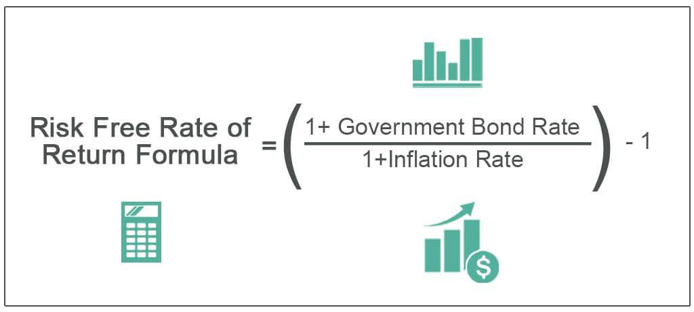

The financial markets form a complex ecosystem where a multitude of instruments and agents interact, impacting interest rates and guiding investment decisions. Among these instruments, the risk-free rate holds particular importance as a fundamental benchmark in various financial models and investment evaluations. The risk-free rate is essentially the theoretical return on an investment with zero risk and is often represented by the yields on government-issued securities, notably U.S. Treasury Bills (T-Bills). These short-term securities are lauded for their perceived safety, underpinned by the unwavering creditworthiness of the U.S. government.

T-Bills, typically issued with maturities ranging from a few days up to one year, play a pivotal role in the financial ecosystem. They offer investors a low-risk avenue for capital allocation, especially during periods of market volatility, by providing a stable and predictable return. The assurance of safety and liquidity makes them a favored choice for risk-averse investors and institutions alike.



In recent years, advancements in technology have significantly influenced the trading landscape of these government securities. Algorithmic trading has emerged as a transformative force, enabling market participants to employ computational algorithms to execute trades at speeds and efficiencies unattainable by human traders. These algorithms leverage real-time data to identify market trends and optimize trading strategies, particularly in the T-Bill market.

By integrating data-driven decision-making processes, algorithmic trading provides a mechanism for investors to maximize their financial outcomes while navigating the intricacies of the T-Bill market. This development not only enhances the precision and speed of transactions but also has the potential to foster a more efficient and liquid market environment.

Thus, understanding the interplay between the risk-free rate, T-Bills, and algorithmic trading offers valuable insights into the modern financial landscape, allowing investors to align their strategies with the evolving dynamics of capital markets.

## Table of Contents

## Understanding the Risk-Free Rate

The risk-free rate represents the return on an investment presumed to have no possibility of default, typically illustrated by Treasury Bill (T-Bill) yields. This concept is pivotal in financial theory, as it forms the baseline for evaluating the additional risk (or risk premium) investors take on when placing their capital in riskier assets. The risk-free rate is crucial for two primary reasons: its benchmark status in investment appraisal and its foundational role within models like the Capital Asset Pricing Model (CAPM).

Economists and investors rely on the risk-free rate to provide a point of comparison for other investments. Riskier ventures should, theoretically, offer returns that exceed the risk-free rate by an amount commensurate with their level of risk. This is because the return from riskier assets is expected to compensate investors for the additional risk taken. Mathematically, the risk premium can be represented as:

$$
\text{Risk Premium} = \text{Expected Return} - \text{Risk-Free Rate}
$$

T-Bills are typically associated with this measure due to their government backing, which significantly mitigates the default risk. Additionally, their short-term nature—often ranging from a few days to a year—minimizes exposure to [interest rate](/wiki/interest-rate-trading-strategies) fluctuations and other market volatilities. Consequently, T-Bills provide a reliable and consistent benchmark for the risk-free rate.

Within the Capital Asset Pricing Model (CAPM), the risk-free rate plays a central role in determining the expected return on an asset. CAPM posits that the expected return of an asset is a function of the risk-free rate, the asset's sensitivity to market movements (beta), and the market risk premium. The formula is given by:

$$
E(R_i) = R_f + \beta_i (E(R_m) - R_f)
$$

Where:
- $E(R_i)$ is the expected return of the investment,
- $R_f$ is the risk-free rate,
- $\beta_i$ is the beta of the investment,
- $E(R_m)$ is the expected return of the market.

This relationship underscores the importance of the risk-free rate in investment decisions, influencing portfolio construction and the assessment of asset performance. Accurately estimating the risk-free rate enables investors to make sound decisions that align expected returns with their risk tolerance and financial objectives. Thus, understanding and applying the risk-free rate correctly is essential for both individual investors and financial institutions aiming for optimal investment outcomes.

## The Role of Treasury Bills in Financial Markets

Treasury Bills (T-Bills) are essential financial instruments that governments utilize to address short-term funding requirements. These debt securities are typically issued with maturities of one year or less, offering investors a secured return backed by the credit of the issuing government. In the United States, T-Bills are considered nearly risk-free investments due to their government backing, hence serving as a cornerstone in the estimation of the risk-free rate. This risk-free rate is pivotal as it represents the baseline return investors expect from an investment devoid of credit risk, subsequently influencing interest rates and market valuations.

T-Bills' significance in financial markets is multi-faceted. Primarily, they provide a safe refuge for investors, particularly during periods of financial instability and market [volatility](/wiki/volatility-trading-strategies). Traditionally viewed as a reliable store of value, T-Bills are favored by risk-averse investors seeking stability over high returns. This dependable nature is due to their short maturity periods and the robust credit standing of their issuer, effectively minimizing the default risk.

Moreover, T-Bills play a crucial role in the broader economic landscape, particularly in monetary policy operations. Central banks, including the U.S. Federal Reserve, utilize T-Bills to manage [liquidity](/wiki/liquidity-risk-premium) within the financial system. By buying or selling these securities, central banks can influence the money supply and interest rates. For instance, purchasing T-Bills injects liquidity into the banking system, potentially lowering interest rates and stimulating economic activity. Conversely, selling T-Bills withdraws liquidity, which can help cool an overheating economy and curb inflation.

In addition to liquidity control, T-Bills are integral to open market operations, serving as a tool for financial stability. They act as collateral in various financial transactions, underpinning a wide range of credit operations and financial products. This collateral function is crucial as it bolsters the stability and efficiency of the financial markets, helping to ensure trust and reduce systemic risks.

The influence of T-Bills extends to their role as benchmarks in both domestic and international finance. As a proxy for the risk-free rate, they are a foundational element in various economic models and financial practices, such as the Capital Asset Pricing Model (CAPM), which calculates expected investment returns by accounting for risk through the relationship between market performance and individual securities.

Overall, Treasury Bills are indispensable to financial markets, offering a secure investment vehicle while simultaneously serving vital roles in monetary policy and economic stabilization.

## Algorithmic Trading and T-Bills

Algorithmic trading, a method that leverages advanced mathematical models and software systems for trading financial securities, has profoundly impacted the financial markets. Its application in trading government securities like Treasury Bills (T-Bills) is noteworthy given the typically high liquidity and safety profile of T-Bills. Algorithmic trading enhances the traditional trading processes by utilizing computer algorithms to execute trades at speeds and frequencies that are impossible for a human trader. 

One of the core advantages of [algorithmic trading](/wiki/algorithmic-trading) is its ability to meticulously analyze interest rates and market trends. Algorithms are designed to parse vast amounts of historical and real-time data to detect patterns and predict future movements. This capability is crucial in the T-Bill market where interest rate movements play a pivotal role in determining yields and investment decisions. For instance, an algorithm might analyze historical interest rate data and macroeconomic indicators to forecast interest rate shifts that could impact T-Bill yields.

The benefits of algorithmic trading are multifaceted, including increased speed and precision in trade execution, along with reduced transaction costs. Speed is essential in the T-Bill market, where prices can fluctuate rapidly based on changes in economic indicators or government policy statements. Algorithms can execute trades in milliseconds, ensuring that traders capitalize on transient market conditions that would be missed by manual trading processes. Precision is improved as algorithms eliminate human error, ensuring that trades are executed as planned based on predefined parameters.

Reduced costs are also a significant advantage since algorithmic trading can operate with minimal human intervention, lowering labor costs. Furthermore, algorithms optimize execution costs by accessing various trading venues simultaneously, seeking the best price available. This aspect aligns well with the analysis of Treasury markets, where even the slightest pricing inefficiency can be leveraged for a financial gain.

To illustrate the operational capabilities of algorithmic trading in T-Bills, a basic example can be demonstrated using Python. Consider a scenario where an algorithm calculates the moving average of T-Bill yields over different time frames to signal potential buy or sell opportunities. A simple Python script using libraries like `pandas` for data manipulation and `numpy` for numerical calculations could look like this:

```python
import pandas as pd
import numpy as np

# Sample T-Bill yield data
data = {
    'Date': ['2023-01-01', '2023-01-02', '2023-01-03'],
    'Yield': [0.05, 0.05, 0.06]
}

# Load data into a DataFrame
df = pd.DataFrame(data)

# Calculate moving averages
short_window = 2
long_window = 3
df['Short_MA'] = df['Yield'].rolling(window=short_window, min_periods=1).mean()
df['Long_MA'] = df['Yield'].rolling(window=long_window, min_periods=1).mean()

# Generate buy/sell signals
df['Signal'] = np.where(df['Short_MA'] > df['Long_MA'], 'Buy', 'Sell')

print(df)
```

In this code, the algorithm takes historical yield data, calculates short-term and long-term moving averages, and generates buy or sell signals based on their crossover. Such strategies can be more complex, involving additional data points and indicators, but the concept remains centered around leveraging data insights for strategic trading decisions.

Overall, algorithmic trading offers significant value in the T-Bill market by enhancing trading efficiency and optimizing strategic decisions. As technology advances, the sophistication and applicability of algorithms will likely extend further, providing even greater insights and opportunities in the constantly evolving financial landscape.

## Benefits and Drawbacks of Investing in T-Bills

Treasury Bills (T-Bills) are a popular investment choice for individuals and institutions seeking low-risk and liquid investment opportunities. Their attraction lies predominantly in their short-term nature and government backing, which effectively minimizes default risk. This section examines the benefits and drawbacks of investing in T-Bills and assesses their suitability for various types of investors.

T-Bills are widely recognized as a low-risk investment primarily because they are backed by the full faith and credit of the U.S. government, making them virtually default-free. The ease with which T-Bills can be bought and sold also adds to their attractiveness, offering high liquidity in the market. Investors can quickly convert them into cash without a significant loss in value, which is critical during periods of financial stress or emergency cash needs.

Despite these benefits, there are inherent drawbacks associated with investing in T-Bills, particularly concerning their yield. T-Bills generally offer lower returns compared to other investment vehicles, such as stocks or corporate bonds. This low yield can be unattractive, particularly in a low-interest-rate environment where T-Bills might not even keep pace with inflation. The real return, defined as the nominal return adjusted for inflation, can be minimal or even negative during such periods.

The concept of interest rate risk is also pertinent to T-Bill investments. Interest rate risk pertains to the potential for investment losses stemming from changes in interest rates, which can inversely affect the market value of existing T-Bills. For instance, when interest rates rise, newly issued T-Bills may offer higher yields, rendering existing T-Bills with lower coupon rates less attractive. This devaluation can lead to capital losses if the T-Bills are sold before maturity.

When evaluating the suitability of T-Bills for different investor types, they are particularly favored by those seeking capital preservation over high returns. Retirees and conservative institutional investors often prioritize the safety and liquidity offered by T-Bills over potential capital gains. For these investors, the stability of T-Bills in an investment portfolio can act as a safeguard against market volatility and economic downturns, preserving capital even during periods of financial uncertainty.

In conclusion, while T-Bills provide a stable and secure investment option, their lower yields and sensitivity to interest rate movements are important considerations. They remain a prudent choice for risk-averse investors and those in need of liquidity, yet may not suit those seeking higher returns. Balancing the pros and cons is essential for investors to align T-Bill investments with their financial goals and risk tolerance levels.

## Algorithmic Strategies for Maximizing Returns

Algorithmic strategies have transformed the landscape of Treasury Bill (T-Bill) trading, offering sophisticated means to maximize returns through data-driven methodologies. Key strategies such as Mean Reversion and Statistical Arbitrage stand out for their application in this domain, allowing traders to pinpoint and exploit subtle inefficiencies within the T-Bill market.

Mean Reversion is based on the principle that prices and returns eventually revert to their long-term averages. In T-Bill trading, this strategy is implemented by identifying periods where the yield deviates significantly from its historical mean, suggesting a mispricing that a reversion may correct. Traders can automate the detection of these deviations using statistical tools, and enter positions to capitalize on anticipated yield adjustments. The trading strategy can be scripted in Python, utilizing libraries such as Pandas for time-series analysis and NumPy for calculations.

```python
import pandas as pd
import numpy as np

# Simulated T-Bill yield data
data = pd.Series([0.03, 0.032, 0.031, 0.035, 0.033, 0.036, 0.034, 0.037])

# Calculate mean and standard deviation
mean_yield = data.mean()
std_dev = data.std()

# Identify potential mean reversion opportunities
potential_entries = data[(data > mean_yield + std_dev) | (data < mean_yield - std_dev)]

print("Potential Mean Reversion Opportunities:", potential_entries)
```

Statistical Arbitrage involves using statistical techniques to exploit discrepancies between the expected and actual prices or yields. In T-Bill markets, this can mean taking advantage of the price spreads between similar government securities or exploiting yield curve changes. This strategy requires robust statistical modeling and real-time data processing, often relying on [machine learning](/wiki/machine-learning) algorithms to enhance prediction accuracy and trade execution precision.

These algorithmic strategies not only open avenues for potential higher returns by identifying and acting on market inefficiencies but also significantly bolster risk management. By continuously analyzing market data, these strategies enable dynamic portfolio adjustments, minimizing exposure to adverse conditions. Furthermore, algorithmic trading systems contribute to portfolio optimization by precisely allocating resources in response to evolving market indicators.

The employment of algorithmic strategies in T-Bill trading exemplifies the fusion of technology and finance, providing investors with an edge in achieving superior returns while maintaining sound risk management practices. This integration of automated trading systems underscores an era where data insights drive more informed and strategic financial decisions.

## Conclusion

Treasury Bills (T-Bills) occupy a crucial position in financial markets, primarily due to their characterization as low-risk investments. T-Bills, issued by the U.S. government, provide investors with a secure mechanism to protect their capital while expecting modest returns. Their significance extends beyond individual investment portfolios; they serve as a fundamental risk-free benchmark, essential for pricing financial assets and setting interest rates. The stability of T-Bills is especially valuable during uncertain market conditions, offering investors a reliable refuge.

In recent years, the advent of algorithmic trading has considerably enhanced the potential of T-Bill investments. Algorithmic trading enables investors to optimize their strategies by leveraging sophisticated data analytics and automated processes. For example, algorithms can swiftly interpret shifts in interest rates or detect market inefficiencies, making trading decisions that maximize returns while minimizing risks. By incorporating real-time data and historical patterns, algorithmic models help refine investment approaches, ensuring that investors can respond dynamically to market changes.

Investors are encouraged to integrate algorithmic trading strategies into their portfolios to enhance decision-making and yield optimization without sacrificing safety. These strategies allow for superior execution speeds and precision in transactions, appealing to both institutional and individual investors aiming for efficient portfolio management.

T-Bills continue to hold relevance as an investment tool, despite evolving market conditions and technological advancements. Their enduring appeal is grounded in the assurance they provide, backed by government creditworthiness, making them indispensable for investors seeking stability and risk minimization. As both a benchmark for risk-free investments and a key instrument in technological trading strategies, T-Bills remain a staple in the financial landscape.

## References & Further Reading

1. **"Principles of Corporate Finance" by Richard A. Brealey, Stewart C. Myers, and Franklin Allen** – This book offers a foundational understanding of finance, including a comprehensive discussion on T-Bills, the risk-free rate, and various investment concepts.

2. **U.S. Department of the Treasury's official website** – Provides firsthand information on Treasury securities, T-Bill auctions, and current yields. [treasury.gov](https://www.treasury.gov)

3. **"Algorithmic Trading: Winning Strategies and Their Rationale" by Ernie Chan** – A resourceful book that explains algorithmic trading strategies and offers practical advice on implementing these methodologies, with a focus on statistical models.

4. **"Options, Futures, and Other Derivatives" by John C. Hull** – This text covers a spectrum of derivative securities and includes an examination of T-Bills in the context of risk management and investment strategies.

5. **The Federal Reserve's official website** – Offers insights into monetary policy, including the role of Treasury securities like T-Bills in open market operations. [federalreserve.gov](https://www.federalreserve.gov)

6. **"Quantitative Finance for Physicists: An Introduction" by Anatoly B. Schmidt** – This book bridges the gap between theoretical physics and finance, explaining algorithmic trading and financial mathematics with examples applicable to T-Bills.

7. **Research articles in journals such as the Journal of Finance and the Journal of Financial Economics** – Offer empirical studies and theoretical advancements in the field of Treasury securities, risk-free rates, and algorithmic trading.

8. **Python libraries and resources:**
   - **pandas** and **numpy**: Essential for data manipulation and numerical calculations in algorithmic trading.
   - **scikit-learn**: Useful for implementing machine learning models that can capture market inefficiencies.
   - **The Python Cookbook**: A practical guide to Python programming, helpful for developing and optimizing trading algorithms.

9. **Investopedia** – An online resource that provides a variety of articles on financial markets, risk-free rates, Treasury Bills, and algorithmic trading. [investopedia.com](https://www.investopedia.com)

10. **"Machine Learning for Asset Managers" by Marcos López de Prado** – This book explores the application of machine learning techniques in asset management, providing insight into algorithmic improvements for T-Bill investment strategies.