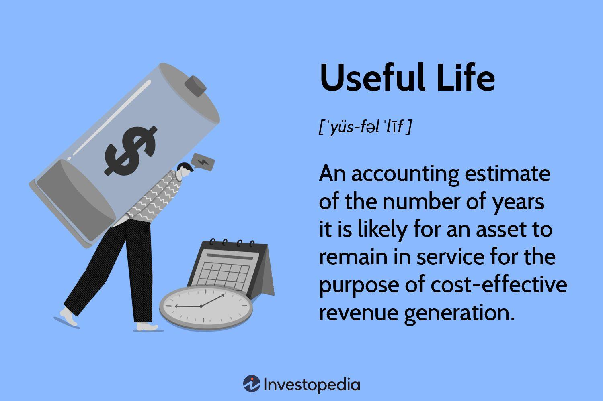

## Table of Contents

## What is useful life in the context of asset depreciation?

Useful life is the time period over which an asset is expected to be useful for the business. It's important for calculating depreciation, which is how the cost of an asset is spread out over its useful life. When a business buys an asset, like a machine or a vehicle, it doesn't count the whole cost as an expense right away. Instead, it divides the cost over the years the asset will be used.

Different assets have different useful lives. For example, a computer might have a useful life of 3 years, while a building might last for 30 years. The useful life can be affected by things like how much the asset is used, how well it's taken care of, and how quickly technology changes. Businesses need to estimate the useful life carefully because it affects their financial statements and tax calculations.

## Why is determining the useful life of an asset important for businesses?

Determining the useful life of an asset is important for businesses because it helps them figure out how to spread the cost of the asset over time. When a business buys something big like a truck or a piece of machinery, they don't want to count the whole cost as an expense right away. Instead, they divide the cost over the years they expect to use the asset. This way, the business can match the cost of the asset with the income it helps to generate, which gives a more accurate picture of how the business is doing financially.

Getting the useful life right is also important for tax reasons. The way a business calculates depreciation can affect how much tax they have to pay each year. If a business overestimates the useful life, they might pay more tax than they need to in the early years. If they underestimate it, they might pay less tax at first but more later on. So, by figuring out the useful life correctly, a business can plan better for taxes and manage their money more effectively.

## How do you estimate the useful life of an asset?

Estimating the useful life of an asset means figuring out how long you can use it before it wears out or becomes outdated. To do this, you look at things like how much you plan to use the asset, how well you take care of it, and how fast technology changes. For example, if you buy a laptop, you might think about how many hours a day you'll use it, if you'll keep it clean and protected, and if new, better laptops will come out soon.

You can also look at what other people in your industry do. If most businesses like yours say a certain type of machine lasts about 5 years, that's a good starting point for your estimate. Sometimes, there are rules or guidelines from the government or accounting groups that tell you how long to expect certain assets to last. These can help you make a more accurate guess. By considering all these things, you can come up with a good estimate for the useful life of your asset.

## What factors influence the useful life of an asset?

The useful life of an asset is influenced by several factors. One important factor is how much you use the asset. If you use a machine a lot every day, it might wear out faster than if you only used it once a week. Another factor is how well you take care of the asset. If you keep it clean, fix it when it breaks, and store it properly, it can last longer. The environment where the asset is used also matters. For example, a vehicle used in a city with rough roads might not last as long as one used on smooth highways.

Another factor that affects the useful life of an asset is how quickly technology changes. If new, better versions of the asset come out often, the one you have might become outdated faster. For example, smartphones get new models every year, so the useful life of an old model might be shorter. Also, the industry you're in can influence the useful life. Some industries use assets harder than others, so what's normal in one industry might not be in another. By thinking about all these factors, you can get a better idea of how long an asset will be useful for your business.

## Can the useful life of an asset be revised after it has been set?

Yes, the useful life of an asset can be revised after it has been set. Sometimes, you might find that an asset is lasting longer than you thought it would, or maybe it's wearing out faster. If that happens, you can change the useful life to match what's really going on. This is important because it helps keep your financial records accurate and helps with planning for the future.

When you revise the useful life, you need to update your depreciation calculations. This means you'll spread the remaining cost of the asset over the new, revised useful life. It's a good idea to keep an eye on your assets and make changes if needed, so your business can keep its financial statements correct and make better decisions about when to replace or repair assets.

## How does the useful life affect the calculation of depreciation expense?

The useful life of an asset is important because it helps figure out how much of the asset's cost you can count as an expense each year. This is called depreciation expense. When you buy an asset, you don't count the whole cost as an expense right away. Instead, you spread it out over the years you expect to use the asset. The useful life tells you how many years to spread the cost over. For example, if a machine costs $10,000 and you think it will last 5 years, you might count $2,000 as an expense each year.

If the useful life changes, the depreciation expense changes too. Let's say after 2 years, you find out that the machine will actually last 7 years instead of 5. Now, you have to spread the remaining $6,000 over the next 5 years instead of 3. So, the yearly depreciation expense would go down to $1,200 instead of $2,000. This shows how important it is to keep the useful life estimate accurate, so your financial records stay correct and help you plan better for the future.

## What are the differences between useful life and physical life of an asset?

The useful life and the physical life of an asset are two different things. The useful life is the time an asset is expected to be useful for a business. It's about how long the asset can help the business make money or do its job. For example, a computer might still work after 5 years, but if new software needs a newer model, the old computer's useful life might be over even though it still works.

The physical life, on the other hand, is how long the asset can physically keep working. It's about when the asset breaks down or stops working completely. Using the same computer example, the physical life might be 10 years if it keeps running that long. But if the business needs to upgrade to keep up with new software, the useful life might only be 3 years. So, the useful life is often shorter than the physical life because it's based on what the business needs, not just if the asset still works.

## How do different depreciation methods handle the concept of useful life?

Different depreciation methods handle the concept of useful life in their own ways, but they all use it to figure out how to spread the cost of an asset over time. The straight-line method is the simplest. It says you should divide the cost of the asset by its useful life to find out how much to count as an expense each year. For example, if a machine costs $6,000 and its useful life is 3 years, you'd count $2,000 as an expense each year. This method treats the asset as if it loses value evenly over its useful life.

The declining balance method and the sum-of-the-years'-digits method are a bit different. They both say that an asset loses more value in the early years of its useful life. The declining balance method uses a fixed rate to calculate depreciation, but it applies this rate to the asset's book value, which gets smaller each year. So, the depreciation expense is higher in the early years and gets smaller as the useful life goes on. The sum-of-the-years'-digits method also starts with higher depreciation in the early years, but it uses a formula based on the years of the asset's useful life to figure out the expense each year. Both methods still use the useful life to decide how many years to spread the cost over, but they do it in a way that reflects the idea that assets often lose value faster when they're new.

## What are the tax implications of choosing a specific useful life for an asset?

Choosing a specific useful life for an asset affects how much tax a business has to pay each year. When a business buys an asset, it can't count the whole cost as an expense right away. Instead, it spreads the cost over the years the asset will be useful, which is called depreciation. The useful life tells the business how many years to spread the cost over. If a business picks a shorter useful life, it can count more of the cost as an expense each year, which means it might pay less tax in the early years. But if it picks a longer useful life, it counts less of the cost each year, so it might pay more tax at first.

This can be important for planning how much money a business will have to pay in taxes. For example, if a business expects to make a lot of money this year but less next year, it might choose a shorter useful life to lower its taxes now when it needs it more. But it's important to pick a useful life that makes sense for the asset, not just to save on taxes. If the tax authorities think a business is choosing a useful life just to pay less tax, it could get in trouble. So, businesses need to think carefully about the useful life and how it will affect their taxes.

## How do industry standards and regulations impact the determination of useful life?

Industry standards and regulations play a big role in deciding the useful life of an asset. Different industries have their own ways of figuring out how long an asset will last. For example, in the construction industry, heavy machinery might have a standard useful life of 10 years, while in the tech industry, computers might be expected to last only 3 years because technology changes so fast. These standards help businesses make sure they're using the same rules as others in their industry, which makes it easier to compare financial results.

Regulations from the government or accounting groups can also tell businesses how long to expect certain assets to last. For instance, the IRS in the United States has rules called the Modified Accelerated Cost Recovery System (MACRS) that set specific useful lives for different types of assets for tax purposes. If a business follows these rules, it can make sure its tax calculations are correct and avoid getting in trouble with the tax authorities. So, by following industry standards and regulations, businesses can make more accurate estimates of an asset's useful life, which helps with financial planning and tax management.

## What role does technological advancement play in assessing the useful life of an asset?

Technological advancement can make the useful life of an asset shorter. When new technology comes out, older assets might not be as useful anymore, even if they still work. For example, if a business uses computers, a new model might come out that works much faster or has new features. The old computers might still run, but they can't keep up with the new software or do the job as well. So, the useful life of those old computers ends, not because they broke, but because they're outdated.

This is really important for businesses to think about. If they know technology changes quickly in their industry, they might plan to replace assets more often. For example, in the tech industry, companies might decide that their servers or software need to be updated every couple of years. By understanding how fast technology changes, businesses can make better plans for when to buy new assets and how long to expect the old ones to be useful.

## How can predictive maintenance and data analytics improve the accuracy of useful life estimates?

Predictive maintenance and data analytics can make it easier for businesses to guess how long an asset will last. Predictive maintenance uses sensors and data to watch how an asset is doing. It can tell when something might break before it actually does. This means businesses can fix things early and keep the asset working longer. Data analytics looks at all the information collected about the asset, like how much it's used and how often it needs repairs. By studying this data, businesses can see patterns and make better guesses about when the asset will wear out.

Using these tools helps businesses be more accurate about the useful life of their assets. If they know an asset needs a lot of repairs or is used a lot, they can adjust the useful life estimate to be shorter. On the other hand, if the asset is holding up well and doesn't need much fixing, they might think it will last longer. By keeping a close eye on the asset with predictive maintenance and data analytics, businesses can plan better for the future, save money on repairs, and make sure their financial records are correct.

## What is Understanding Asset Depreciation?

Asset depreciation is a fundamental accounting principle used to allocate the cost of a tangible asset over its useful lifespan. This practice acknowledges the natural decline in value that occurs from wear and tear, functional or technological obsolescence, and sometimes environmental factors. The annual depreciation expense is recognized on financial statements, impacting both the balance sheet and the income statement. 

One commonly used method is the straight-line depreciation, where the asset's cost is evenly distributed over its useful life. The formula for straight-line depreciation is:

$$
\text{Annual Depreciation Expense} = \frac{\text{Initial Cost of the Asset} - \text{Salvage Value}}{\text{Useful Life of the Asset}}
$$

This method provides a consistent expense each year, simplifying financial projections and budgeting.

In contrast, accelerated depreciation methods, such as the double declining balance or sum-of-the-years' digits, increase expense recognition in the earlier years of an asset's life. This approach acknowledges that many assets are more productive or efficient when new, thus incurring higher depreciation when they contribute more significantly to revenue generation. The double declining balance method, for example, doubles the straight-line rate:

$$
\text{Annual Depreciation Expense} = 2 \times \frac{\text{Book Value at Beginning of the Year}}{\text{Useful Life of the Asset}}
$$

The choice between these methods significantly influences financial statements. Accelerated depreciation leads to lower taxable income in early years, potentially reducing tax payments and freeing up cash flow. This can be advantageous for companies looking to reinvest early in their operations while deferring tax liabilities.

Understanding the nuances of depreciation is essential for businesses engaged in comprehensive tax planning and financial analysis. By aligning depreciation strategies with corporate financial goals, companies can optimize cash flow and accurately reflect asset valuation on their financial records. Accurate depreciation accounting not only serves compliance purposes but also aids managerial decisions, potentially influencing investment strategies and operational adjustments.

## References & Further Reading

[1]: ["Depreciation and Amortization](https://www.investopedia.com/ask/answers/06/amortizationvsdepreciation.asp) - Investopedia

[2]: ["IRS Publication 946: How to Depreciate Property"](https://www.irs.gov/publications/p946) - Internal Revenue Service

[3]: ["The Impact of Depreciation Accounting on Financial Statements"](https://www.genovationsaccounting.com/blog/understanding-depreciation-and-its-impact-on-financial-statements) - ResearchGate

[4]: Mckinsey & Company. ["The Role of Algorithmic Trading in Capital Markets."](https://www.mckinsey.com/~/media/McKinsey/Industries/Financial%20Services/Our%20Insights/Two%20routes%20to%20digital%20success%20in%20capital%20markets/Two-routes-to-digital-success-in-capital-markets.pdf)

[5]: ["The Usefulness of Depreciation in Algorithmic Trading"](https://paperswithbacktest.com/wiki/appreciation-depreciation) - CFA Institute

[6]: ["Advanced Financial Accounting"](https://herovired.com/learning-hub/blogs/advanced-financial-accounting/) by Craig Deegan, Richard Lewis & David Hamilton

[7]: ["Asset Depreciation Ranges System"](https://www.investopedia.com/terms/a/asset-depreciation-range.asp) - AccountingTools