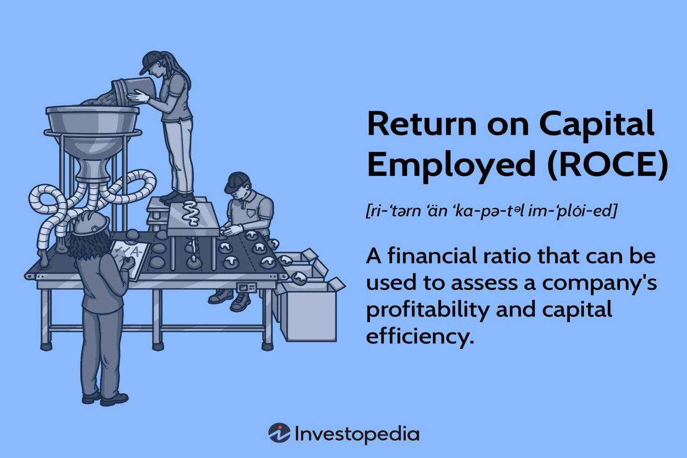

Evaluating company performance effectively requires a thorough understanding of various financial indicators. These indicators are crucial tools that assist investors and traders in making informed decisions by assessing a company's financial health and potential for future growth. Among these indicators, Return on Capital Employed (ROCE) stands out as a significant measure of a company's profitability and efficiency in using its capital.

Financial indicators are essential as they provide a quantitative basis for comparing different companies, both within the same industry and across diverse sectors. These metrics help investors to identify potential investment opportunities and measure the financial stability and growth prospects of a business. In the context of investments and trading, understanding these indicators can lead to better risk management and improved returns, making them invaluable to both individual and institutional investors.



ROCE is particularly prominent among financial indicators, offering insights into how well a company is generating profits from its total capital employed. It is calculated using the formula: \[ \text{ROCE} = \frac{\text{EBIT}}{\text{Capital Employed}}, \] where EBIT stands for Earnings Before Interest and Taxes, and Capital Employed refers to the total assets minus current liabilities. By analyzing ROCE, stakeholders can determine how efficiently a firm is utilizing its capital to generate earnings, thus aiding in the assessment of management effectiveness and operational profitability.

In recent years, algorithmic trading has played a pivotal role in modern financial markets. This approach relies on computer algorithms to execute trades at speeds and frequencies that are impossible for human traders. Algorithmic trading systems utilize financial indicators like ROCE to make data-driven trading decisions, offering benefits such as reduced transaction costs, minimized human errors, and the ability to process large volumes of data swiftly.

The purpose of this article is to examine the integration of ROCE within algorithmic trading strategies. We aim to explore how this key financial indicator can be employed in developing trading algorithms and the potential advantages it offers. By understanding the intersection of ROCE and algorithmic trading, we can uncover strategies to optimize trading performance and enhance investment decisions in today's dynamic financial markets.

## Table of Contents

## Understanding ROCE: A Key Financial Indicator

Return on Capital Employed (ROCE) is a financial metric that assesses a company's profitability in relation to its capital efficiency. It provides insights into how well a company utilizes its capital to generate earnings before interest and taxes (EBIT). The metric is a vital tool for investors and analysts as it aids in evaluating a firm's financial performance and operational efficiency.

### ROCE Formula and Calculation

The formula for calculating ROCE is:

$$
\text{ROCE} = \frac{\text{EBIT}}{\text{Capital Employed}}
$$

Where:
- **EBIT (Earnings Before Interest and Taxes)** represents a company's profit from operations, excluding the effects of financing and tax activities.
- **Capital Employed** is calculated as total assets minus current liabilities. It represents the funds that are actively used to generate profits.

### Significance of ROCE

ROCE is widely regarded as a reliable metric for several reasons. Firstly, it provides a comprehensive view of how efficiently a company is utilizing its capital resources to generate profitable outcomes. Unlike other profitability ratios that may focus solely on equity or assets, ROCE considers both debt and equity, offering a holistic view of financial performance. 

A higher ROCE indicates a more efficient use of capital, suggesting that the company is generating more profit per unit of capital employed. This can make the company attractive to investors seeking value.

### Guiding Investment Decisions

ROCE can serve as a crucial criterion for investors when comparing companies within the same industry. For example, if Company A has a ROCE of 15% and Company B has a ROCE of 10%, Company A is typically perceived to be using its capital more efficiently to generate profits. Consequently, investors might favor investments in Company A, assuming other factors are equal.

Investors also use ROCE to assess a company’s long-term growth potential. Firms with consistently high ROCE over several years may indicate sound management practices and sustainable competitive advantages, making them appealing investment opportunities.

### Limitations and Considerations

While ROCE is a potent tool, it does have limitations. One key consideration is its sensitivity to cyclical industry conditions. For industries with high capital expenditures and long depreciation periods, short-term ROCE might be distorted. Furthermore, ROCE can be misleading if used exclusively without considering other financial metrics, as it doesn't account for changes in working capital or the impact of non-operating income.

Additionally, comparing ROCE across different industries might be inappropriate due to varying capital intensity. Therefore, it is best used to compare companies within the same sector rather than across different industries.

In conclusion, ROCE is an invaluable indicator of a company's performance, guiding investment decisions and providing insights into operational efficiency. To maximize its utility, it should be used in conjunction with other analyses and metrics to provide a comprehensive evaluation of a company's financial health.

## The Importance of ROCE in Investment and Trading Strategies

Return on Capital Employed (ROCE) serves as a pivotal financial indicator for investors seeking to assess and compare the performance of companies within the same industry. ROCE provides insight into how well a company utilizes its capital to generate profits. The formula for calculating ROCE is:

$$
\text{ROCE} = \frac{\text{EBIT}}{\text{Capital Employed}}
$$

where EBIT is Earnings Before Interest and Tax, and Capital Employed refers to the total amount of capital that a company has used in order to generate profits, usually calculated as Total Assets minus Current Liabilities.

Investors often use ROCE as a critical metric because it enables them to compare the efficiency and profitability of firms operating within the same sector. A higher ROCE generally suggests that a company is making better use of its capital resources to generate earnings. For example, if two companies in the same industry have different ROCEs, the one with the higher ROCE might be more efficient in employing its capital to produce profits, making it a more attractive prospect for investment.

High ROCE can indicate a potentially profitable investment as it reflects efficient capital usage and high returns relative to the amount of capital employed. This efficiency implies that the company could have a competitive advantage, such as strong pricing power or superior cost management. Moreover, a consistently high ROCE over multiple periods often signals robust long-term growth potential, suggesting that a company not only excels in current operations but is also poised for future expansion without the need for heavy reinvestment.

Several case studies highlight ROCE's impact on trading strategies. For instance, during bull markets, companies with strong ROCE ratios often see increased investor interest, leading to higher purchase volumes and stock price appreciation. During such times, traders frequently integrate ROCE into their analysis to select companies that are likely to perform well and provide superior returns relative to their peers.

The benefits of incorporating ROCE into investment analysis extend beyond simply identifying profitable opportunities. ROCE helps in identifying firms with sustainable business models and long-term competitive advantages. It can be a tool for evaluating management effectiveness in utilising company's resources effectively. Additionally, ROCE is valuable in setting benchmarks for performance against industry averages, thus aiding in the selection of stocks that are likely to outperform the market.

In sum, ROCE is an indispensable tool in investment analysis. Its role in evaluating and comparing the financial health and operational efficiency of companies is critical for making informed investment decisions. When used effectively, ROCE can help investors and traders select investments that offer both immediate profitability and promising growth potential over the long run.

## Algorithmic Trading and Financial Indicators

Algorithmic trading refers to the use of computer algorithms to automate trading decisions, capitalizing on market opportunities at speeds unattainable by human traders. This approach has gained substantial traction since its emergence in the late 20th century, significantly influencing the dynamics of modern financial markets. The growth of [algorithmic trading](/wiki/algorithmic-trading) is driven by the quest for efficiency, accuracy, and the elimination of human emotion from trading decisions, offering a strategic edge to those who harness its capabilities.

Financial indicators, such as the Return on Capital Employed (ROCE), play a pivotal role in algorithmic trading systems. ROCE is a measure of a company's profitability and capital efficiency, calculated using the formula:

$$
\text{ROCE} = \frac{\text{EBIT}}{\text{Capital Employed}}
$$

In the context of algorithmic trading, ROCE is harnessed to evaluate company performance, aiding algorithms in identifying potentially profitable trading opportunities. Algorithms are programmed to analyze ROCE data alongside other financial metrics to make well-informed trading decisions. This integration ensures that the trading strategies are grounded in robust financial analysis, enhancing their capacity to yield favorable outcomes.

Developers of trading algorithms often enrich their systems with ROCE data to improve decision-making processes. By incorporating ROCE into their algorithms, traders can create systems that actively monitor market conditions and adjust trading strategies based on changes in company performance metrics. The use of ROCE, among other indicators, allows for nuanced algorithmic strategies that cater to long-term investment goals as well as short-term trading advantages.

Algorithmic trading systems offer several advantages, particularly in terms of speed and accuracy. They can process vast amounts of data in real-time, executing trades within milliseconds of identifying a viable market position. This high-speed execution reduces the risk of price slippage and allows traders to exploit fleeting market inefficiencies. Moreover, algorithmic trading eliminates the emotional biases often associated with human trading, such as fear and greed, ensuring that decisions are based purely on pre-defined criteria and logic. 

There are multiple strategies within algorithmic trading that leverage financial indicators like ROCE. For instance, a [momentum](/wiki/momentum)-based strategy might involve tracking ROCE trends over time to identify companies with consistently strong financial performance, thereby signaling a potential "buy" action. Another strategy may involve using ROCE in conjunction with other indicators, such as price-to-earnings ratio, to construct a multidimensional view of a company's financial health, which informs complex trading models.

In summary, algorithmic trading has revolutionized market practices by integrating robust financial indicators like ROCE into trading strategies. These systems offer unparalleled speed, accuracy, and efficiency, empowering traders to make informed decisions that align with their strategic objectives. The ability to leverage comprehensive financial data enables algorithms to identify and act upon investment opportunities with precision and minimal risk.

## Integrating ROCE into Algorithmic Trading Systems

Integrating Return on Capital Employed (ROCE) into algorithmic trading systems involves utilizing systematic processes and technical infrastructures to harness the insights gained from this financial indicator effectively. ROCE, illustrating a company's profitability in relation to its capital, can provide significant value when integrated into trading algorithms, enabling traders to make more informed decisions.

### Data Sourcing and Integration

The first step in integrating ROCE into trading algorithms is obtaining accurate and timely data. Data sourcing involves collecting financial reports, typically obtained from company filings, financial databases such as Bloomberg, or specialized financial data providers like Morningstar. Accurate calculation of ROCE requires Earnings Before Interest and Taxes (EBIT) and Capital Employed, derived from these reports.

Once sourced, integrating ROCE data involves connecting these data points to the trading algorithm. This is done through data parsing and formatting processes that enable the algorithm to read and analyze ROCE metrics efficiently. Most trading platforms can ingest this data via APIs or data feeds, which need to be structured in a machine-readable format such as CSV or JSON.

### Algorithm Utilization of ROCE

Once integrated, algorithms utilize ROCE by evaluating the profitability and efficiency across various companies or sectors. Algorithms can be designed to screen stocks or ETFs with high ROCE values, as these are often indicators of well-managed and potentially lucrative investments. An example Python snippet could look like this:

```python
def calculate_roce(ebit, capital_employed):
    return ebit / capital_employed

def screen_high_roce_stocks(data):
    screened_stocks = []
    for stock in data:
        roce = calculate_roce(stock['EBIT'], stock['Capital Employed'])
        if roce > threshold:
            screened_stocks.append(stock)
    return screened_stocks
```
This pseudo-code defines a basic structure for a screening algorithm based on ROCE values.

### Tools and Technologies

The integration of ROCE into trading algorithms relies on several technological tools. Advanced analytics platforms like Python with libraries such as Pandas or NumPy are commonly used for data manipulation and analysis. Machine learning frameworks such as TensorFlow or PyTorch can be leveraged for developing predictive models that utilize ROCE data.

For algorithm deployment, systems typically use high-frequency trading platforms that provide low-latency trading capabilities, such as QuantConnect or Alpaca, with cloud-based environments for scalability and reliability.

### Challenges and Best Practices

Challenges in integrating ROCE into algorithms include ensuring data accuracy and managing data delays due to infrequent financial reporting. ROCE is typically calculated from quarterly or annual data, which can limit its usefulness in high-frequency strategies. To mitigate this, algorithms should be designed to combine ROCE with other more frequently updated indicators.

Implementation best practices involve maintaining robust data validation protocols to ensure data integrity and regularly updating algorithm parameters to reflect changes in market conditions. Adaptive algorithms that adjust their strategies based on real-time analysis can also be more effective.

In summary, integrating ROCE into algorithmic trading systems requires meticulous data handling and strategic implementation to benefit from the profitability insights ROCE provides. By carefully designing algorithms and leveraging the right technological tools, traders can optimize their trading performance and strategy.

## Case Studies: ROCE in Action

In modern financial markets, algorithmic trading has become a cornerstone for many investment strategies, and incorporating robust financial metrics like Return on Capital Employed (ROCE) can significantly enhance trading outcomes. Several real-world case studies reveal the importance of ROCE in driving algorithmic trading success, influencing performance, and shaping strategic decision-making.

One noteworthy case study involves a quantitative [hedge fund](/wiki/hedge-fund-trading-strategies) that integrated ROCE into its trading algorithms to assess industrial sector stocks. The fund developed algorithms that screened stocks with a consistently high ROCE, considering it a proxy for operational efficiency and effective resource allocation. By targeting companies with a ROCE above 20%, the algorithms helped the fund identify high-performing stocks often undervalued by the market. Over three years, this strategy significantly outperformed the broader market index, delivering annual returns exceeding 15%. The lesson was clear: prioritizing high ROCE companies could translate into superior risk-adjusted returns, primarily due to the firm's capability to generate excess returns relative to its capital base.

Another case study involves an algorithmic trading firm focused on the consumer goods sector. The strategy employed ROCE alongside other financial indicators, such as return on equity and debt-to-equity ratio. By developing a multi-[factor](/wiki/factor-investing) model, the algorithms assessed the sustainable profitability and capital structure of potential investment targets. The initiative demonstrated that high ROCE alone was not always indicative of future performance unless supported by strong equity returns and manageable debt levels. The trading systems capitalized on this holistic approach, generating a considerable alpha by selectively investing in firms with resilient business models and optimal capital structures. From this, traders discovered the necessity of contextualizing ROCE within a broader financial framework to enhance predictive accuracy.

A third case study highlights a proprietary trading firm that automated an equity rotation strategy using ROCE as the pivot indicator. The firm programmed its algorithms to regularly rotate capital into top quartile ROCE companies within the technology sector, adjusting for industry cyclicality. This agile approach allowed the trading systems to capture sectoral trends while mitigating downside risks. Over four quarters, the strategy achieved a Sharpe ratio significantly higher than sector-specific ETFs. This outcome underscored the value of dynamic allocation strategies informed by ROCE data, particularly in technology markets characterized by rapid innovation cycles.

These cases collectively underscore the strategic advantage of leveraging ROCE-focused algorithms in trading practices. By effectively incorporating ROCE into algorithmic systems, traders can refine their stock selection processes, enhance risk management, and improve overall investment performance. The insights gained from these practices emphasize the importance of using financial indicators like ROCE not in isolation but as part of a comprehensive strategy that considers various market and sector-specific dynamics.

## Future Trends: ROCE and Algorithmic Trading

Emerging technological trends in algorithmic trading have begun to leverage financial indicators, including Return on Capital Employed (ROCE), to enhance trading strategies. With the advancements in [artificial intelligence](/wiki/ai-artificial-intelligence) and [machine learning](/wiki/machine-learning), trading systems now have the capacity to process and analyze vast amounts of financial data, potentially improving the precision of trading decisions based on ROCE evaluations.

Innovations in applying ROCE within trading systems are likely to focus on real-time data analytics and predictive modeling. Machine learning algorithms can be developed to predict changes in ROCE values based on historical data trends and other financial metrics. Such predictions can help traders pre-emptively adjust their portfolios to optimize returns. Additionally, the integration of big data frameworks can aid in capturing and analyzing unstructured data from diverse sources, providing a comprehensive view of a company’s financial health.

Looking forward, financial indicators like ROCE are expected to play a critical role in the broader financial system, particularly as the focus shifts toward more data-driven decision-making processes. The ability to quantify a firm’s effective use of capital can provide investors and traders with a deeper understanding of company performance relative to competitors. As algorithmic models become more sophisticated, they will likely incorporate a multitude of financial ratios, where ROCE figures prominently to offer nuanced insights into investment potential.

However, evolving market conditions, driven by economic shifts and regulatory changes, might influence how ROCE is utilized in trading strategies. For instance, a period of market [volatility](/wiki/volatility-trading-strategies) could require recalibrations of how ROCE is factored into risk assessments. Similarly, regulatory changes might necessitate transparent algorithmic trading models where the use of financial indicators is clear and justifiable.

To succeed in such a dynamic environment, it is essential for traders and financial analysts to stay informed about developments in algorithmic trading technologies. Engaging with online platforms, webinars, and industry publications can provide valuable insights into current trends and future possibilities. As the field of algo trading continues to evolve, staying abreast of technological and regulatory changes will be crucial for leveraging financial indicators like ROCE effectively.

## Conclusion

Return on Capital Employed (ROCE) is a critical financial indicator for evaluating company performance, providing insights into a company's profitability and efficiency in utilizing its capital. This metric stands out due to its ability to measure the returns a company generates from its capital, painting a lucid picture of the operational efficiency. By assessing the ratio of Earnings Before Interest and Taxes (EBIT) to the capital employed, investors gain a nuanced understanding of how effectively a company is deploying its resources to generate profits.

When integrated into algorithmic trading strategies, ROCE offers significant advantages. Its objectivity and reliability make it a suitable candidate for algorithmic systems focused on identifying lucrative trading opportunities. These algorithms can process vast amounts of financial data at high speeds, incorporating ROCE metrics to make informed trades without the emotional bias that can affect human traders. The speed and precision of algorithmic trading allow for capitalizing on market inefficiencies that may be indicated by solid ROCE figures, enhancing both profitability and strategic investment.

The potential of algorithmic systems to leverage ROCE insights is substantial. By computing and analyzing ROCE values across a range of companies and sectors, these systems enable traders to uncover patterns and opportunities that might otherwise go unnoticed. As financial markets continue to evolve, the incorporation of financial indicators like ROCE in algorithmic frameworks can refine trading decisions and enhance long-term investment outcomes.

Investors and traders are encouraged to consider the incorporation of ROCE in their investment and trading strategies. By leveraging this metric, they can obtain a clearer understanding of a company's financial health and make more informed investment decisions. For those interested in expanding their knowledge, resources such as financial analysis textbooks, online courses on financial modeling, and algorithmic trading platforms provide valuable insights into the effective use of ROCE in financial markets. Engaging with such materials can empower investors to harness the power of ROCE in enhancing their trading performance and achieving their financial goals.

## References & Further Reading

[1]: ["The Intelligent Investor: The Definitive Book on Value Investing"](https://www.amazon.com/Intelligent-Investor-Definitive-Investing-Essentials/dp/0060555661) by Benjamin Graham

[2]: ["Financial Modeling"](https://www.investopedia.com/terms/f/financialmodeling.asp) by Simon Benninga

[3]: Damodaran, A. (2002). ["Return on Capital (ROC), Return on Invested Capital (ROIC), and Return on Equity (ROE): Measurement and Implications"](https://pages.stern.nyu.edu/~adamodar/pdfiles/papers/returnmeasures.pdf)

[4]: ["Algorithmic Trading and DMA: An Introduction to Direct Access Trading Strategies"](https://archive.org/details/algorithmictradi0000john) by Barry Johnson

[5]: Brunnermeier, M. K. & Pedersen, L. H. (2009). ["Market Liquidity and Funding Liquidity,"](https://www.princeton.edu/~markus/research/papers/liquidity.pdf) The Review of Financial Studies, 22(6), 2201–2238.

[6]: ["Principles of Financial Modelling: Model Design and Best Practices Using Excel and VBA"](https://onlinelibrary.wiley.com/doi/book/10.1002/9781118903933) by Michael Rees

[7]: Jegadeesh, N., & Titman, S. (1993). ["Returns to Buying Winners and Selling Losers: Implications for Stock Market Efficiency,"](https://www.bauer.uh.edu/rsusmel/phd/jegadeesh-titman93.pdf) The Journal of Finance, 48(1), 65-91.