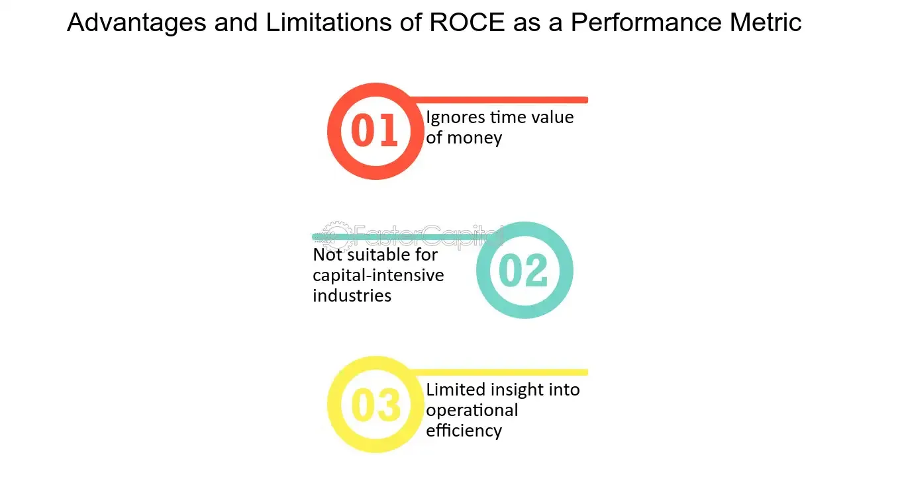

## Table of Contents

## What is ROCE and how is it calculated?

ROCE stands for Return on Capital Employed. It is a financial ratio that shows how well a company is using its capital to generate profits. Think of it as a way to see if a company is making good use of the money it has to work with.

To calculate ROCE, you take the company's earnings before interest and taxes (EBIT) and divide it by the capital employed. Capital employed is the total amount of capital that a company uses to run its business, which can be found by subtracting current liabilities from total assets. So, the formula is: ROCE = EBIT / Capital Employed. This helps investors see how efficiently a company is turning its capital into profit.

## Why is ROCE important for evaluating a company's performance?

ROCE is important because it tells us how well a company is using the money it has to make more money. Imagine you lend money to a friend. You want to know if they're using it wisely to make more money, right? ROCE does that for a company. It shows if the company is good at turning the money it has into profit. If the ROCE is high, it means the company is doing a great job with its money.

This ratio is also useful because it helps compare different companies. Even if companies are in different industries, you can still use ROCE to see which one is better at using its money. For example, if one company has a ROCE of 15% and another has 10%, the first company is probably better at using its capital. This makes ROCE a handy tool for investors who want to pick the best companies to invest in.

## How does ROCE differ from other financial ratios like ROI and ROE?

ROCE, ROI, and ROE are all ratios that help us understand how well a company is doing with its money, but they look at different things. ROCE, or Return on Capital Employed, tells us how well a company uses all the money it has to make a profit. It looks at the total capital, which is the money a company uses to run its business. ROI, or Return on Investment, is simpler. It just tells us how much money we get back from a specific investment. If you put money into a project, ROI shows if that project made money or not.

ROE, or Return on Equity, is different because it only looks at the money that shareholders put into the company. It tells us how much profit the company makes with the money from its owners. ROE is important for shareholders because it shows how well their money is being used. So, while ROCE gives a broad view of how well a company uses all its money, ROI focuses on specific investments, and ROE zeroes in on the returns for shareholders.

## Can you explain the components of ROCE and their significance?

ROCE is made up of two main parts: EBIT and Capital Employed. EBIT stands for Earnings Before Interest and Taxes. It's the money a company makes before it has to pay interest on loans or taxes to the government. EBIT is important because it shows the company's profit from its main business activities, without being affected by how it's financed or taxed. This gives a clearer picture of how well the company is doing at its core.

Capital Employed is the total amount of money a company uses to run its business. You can find it by taking the company's total assets and subtracting its current liabilities. This number represents all the money the company has to work with, whether it's from shareholders, loans, or reinvested profits. Knowing the Capital Employed helps us understand how much money the company is using to make its profits. When we divide EBIT by Capital Employed, we get ROCE, which tells us how efficiently the company is using its money to make more money.

## What industries typically have high ROCE and why?

Industries that usually have high ROCE are often those that don't need a lot of money to start and run, like software and technology companies. These businesses can make a lot of money with just a few computers and smart people. They don't need big factories or a lot of stuff to sell. So, when they make money, it's a big return on the little bit of money they used.

Another type of industry with high ROCE is financial services, like banks and insurance companies. These businesses use money to make more money. They take in money from customers and then lend it out or invest it. Because they're good at handling money, they can make a lot of profit with the money they have. This makes their ROCE high because they're using their capital really well to earn more.

## How can ROCE be used to compare companies within the same industry?

ROCE is really helpful when you want to see how companies in the same industry are doing compared to each other. Imagine you have two companies that make the same kind of product. By looking at their ROCE, you can see which one is better at using its money to make a profit. If one company has a ROCE of 20% and the other has a ROCE of 15%, the first company is doing a better job with its money. This can help investors decide which company is a better choice to put their money into.

But, it's also important to remember that even within the same industry, companies might have different ways of doing things. Some might spend more money to grow faster, which could lower their ROCE for a while. Others might be more careful with their money, leading to a higher ROCE. So, when you compare companies using ROCE, it's good to look at other things too, like how fast they're growing and what their future plans are. This way, you get a fuller picture of how well they're really doing.

## What are the limitations of using ROCE as a performance indicator?

ROCE is a good way to see how well a company uses its money, but it has some problems. One big issue is that it can be hard to compare companies that are growing fast. A company that spends a lot of money to grow might have a lower ROCE right now, but it could be a good investment for the future. So, if you only look at ROCE, you might miss out on a good company that's just in a growth phase.

Another problem with ROCE is that it doesn't tell the whole story about a company's finances. It looks at how much profit a company makes compared to the money it uses, but it doesn't show if the company has a lot of debt. A company might have a high ROCE, but if it also has a lot of debt, it could be risky. So, it's important to look at other things too, like how much debt the company has and how it's growing, to really understand how well it's doing.

## How does ROCE help in assessing the efficiency of capital utilization?

ROCE helps us see how well a company is using its money to make more money. It's like checking if a friend is using the money you lent them wisely. When you calculate ROCE, you look at the company's profit before paying interest and taxes (EBIT) and divide it by the total money the company uses to run its business (Capital Employed). If the ROCE is high, it means the company is good at turning the money it has into profit. This tells us that the company is efficient with its capital.

But ROCE isn't perfect. It doesn't tell us everything about a company. For example, a company might have a high ROCE but also a lot of debt, which can be risky. Also, if a company is spending a lot of money to grow, its ROCE might be lower for a while, even if it's a good investment for the future. So, while ROCE is a useful tool to see how well a company uses its money, it's important to look at other things too, like how much debt the company has and its growth plans.

## What impact do different accounting practices have on ROCE?

Different accounting practices can change how ROCE looks for a company. For example, how a company decides to value its assets can affect the Capital Employed part of the ROCE formula. If a company uses one method to value its assets and another company uses a different method, their ROCE might look different even if they are doing the same kind of business. Also, how a company decides to handle its depreciation can change the EBIT, which is the profit part of the ROCE formula. If one company takes bigger depreciation charges than another, it might show a lower EBIT and a lower ROCE, even if the companies are making the same amount of money.

Because of these differences in accounting practices, it's important to be careful when comparing ROCE across companies. You need to make sure you understand how each company is doing its accounting. If you don't, you might think one company is using its money better than another when really, it's just using different accounting rules. So, when you use ROCE to see how efficient a company is with its money, always check the accounting practices too.

## How can changes in ROCE over time inform investment decisions?

Looking at how a company's ROCE changes over time can help you make better choices about where to put your money. If a company's ROCE keeps going up, it means they're getting better at using their money to make more money. This is a good sign for investors because it shows the company is growing and doing well. On the other hand, if the ROCE is going down, it might mean the company is not as good at using its money anymore. This could be a warning sign that the company is not doing as well, and you might want to think twice before investing more money in it.

But, it's also important to think about why the ROCE is changing. Sometimes, a drop in ROCE might happen because the company is spending a lot of money to grow bigger. If that's the case, the lower ROCE might just be a short-term thing, and the company could still be a good investment for the future. So, when you look at changes in ROCE, it's helpful to look at other things too, like the company's growth plans and how much debt they have. This way, you can get a fuller picture of how the company is really doing and make smarter investment decisions.

## What are some advanced techniques for adjusting ROCE for more accurate analysis?

One way to make ROCE more accurate is to adjust the Capital Employed part of the formula. Sometimes, companies have a lot of money sitting in the bank that they're not using to make more money. This can make their Capital Employed look bigger than it really is, which can make their ROCE look lower. To fix this, you can take out the extra cash from the Capital Employed. This way, you're only looking at the money the company is actually using to run its business, which gives you a better idea of how well they're doing.

Another way to adjust ROCE is to think about how the company is growing. If a company is spending a lot of money to get bigger, their ROCE might go down for a while. But this doesn't mean they're doing badly. To get a better picture, you can look at what their ROCE might be in the future once they're done growing. You can do this by figuring out what their profits and capital might look like after they've finished spending on growth. This helps you see if the company is still a good investment, even if their ROCE looks low right now.

## How can ROCE be integrated into a broader financial analysis framework for expert-level decision making?

ROCE can be a key part of a bigger plan for understanding how well a company is doing. When you're making big decisions about investing, you don't want to just look at ROCE by itself. Instead, you can use it along with other important numbers like Return on Equity (ROE), Return on Assets (ROA), and the company's debt levels. For example, if a company has a high ROCE but also a lot of debt, it might be risky. So, you can look at ROCE to see how well the company is using its money, but then check other numbers to make sure the company is strong in other ways too.

Another way to use ROCE in a bigger plan is to look at how it changes over time and compare it to other companies in the same industry. If a company's ROCE is going up, it might mean they're getting better at using their money to make more money. But it's also important to see how this compares to other companies. If one company's ROCE is going up but it's still lower than others in the same business, you might want to think about why that is. By putting ROCE into a bigger picture with other numbers and trends, you can make smarter choices about where to put your money.

## What is ROCE and why is it a key financial indicator?

Return on Capital Employed (ROCE) is a financial metric that assesses a company's profitability in relation to its capital efficiency. It provides insights into how well a company utilizes its capital to generate earnings before interest and taxes (EBIT). The metric is a vital tool for investors and analysts as it aids in evaluating a firm's financial performance and operational efficiency.

### ROCE Formula and Calculation

The formula for calculating ROCE is:

$$
\text{ROCE} = \frac{\text{EBIT}}{\text{Capital Employed}}
$$

Where:
- **EBIT (Earnings Before Interest and Taxes)** represents a company's profit from operations, excluding the effects of financing and tax activities.
- **Capital Employed** is calculated as total assets minus current liabilities. It represents the funds that are actively used to generate profits.

### Significance of ROCE

ROCE is widely regarded as a reliable metric for several reasons. Firstly, it provides a comprehensive view of how efficiently a company is utilizing its capital resources to generate profitable outcomes. Unlike other profitability ratios that may focus solely on equity or assets, ROCE considers both debt and equity, offering a holistic view of financial performance. 

A higher ROCE indicates a more efficient use of capital, suggesting that the company is generating more profit per unit of capital employed. This can make the company attractive to investors seeking value.

### Guiding Investment Decisions

ROCE can serve as a crucial criterion for investors when comparing companies within the same industry. For example, if Company A has a ROCE of 15% and Company B has a ROCE of 10%, Company A is typically perceived to be using its capital more efficiently to generate profits. Consequently, investors might favor investments in Company A, assuming other factors are equal.

Investors also use ROCE to assess a company’s long-term growth potential. Firms with consistently high ROCE over several years may indicate sound management practices and sustainable competitive advantages, making them appealing investment opportunities.

### Limitations and Considerations

While ROCE is a potent tool, it does have limitations. One key consideration is its sensitivity to cyclical industry conditions. For industries with high capital expenditures and long depreciation periods, short-term ROCE might be distorted. Furthermore, ROCE can be misleading if used exclusively without considering other financial metrics, as it doesn't account for changes in working capital or the impact of non-operating income.

Additionally, comparing ROCE across different industries might be inappropriate due to varying capital intensity. Therefore, it is best used to compare companies within the same sector rather than across different industries.

In conclusion, ROCE is an invaluable indicator of a company's performance, guiding investment decisions and providing insights into operational efficiency. To maximize its utility, it should be used in conjunction with other analyses and metrics to provide a comprehensive evaluation of a company's financial health.

## What is the Importance of ROCE in Investment and Trading Strategies?

Return on Capital Employed (ROCE) serves as a pivotal financial indicator for investors seeking to assess and compare the performance of companies within the same industry. ROCE provides insight into how well a company utilizes its capital to generate profits. The formula for calculating ROCE is:

$$
\text{ROCE} = \frac{\text{EBIT}}{\text{Capital Employed}}
$$

where EBIT is Earnings Before Interest and Tax, and Capital Employed refers to the total amount of capital that a company has used in order to generate profits, usually calculated as Total Assets minus Current Liabilities.

Investors often use ROCE as a critical metric because it enables them to compare the efficiency and profitability of firms operating within the same sector. A higher ROCE generally suggests that a company is making better use of its capital resources to generate earnings. For example, if two companies in the same industry have different ROCEs, the one with the higher ROCE might be more efficient in employing its capital to produce profits, making it a more attractive prospect for investment.

High ROCE can indicate a potentially profitable investment as it reflects efficient capital usage and high returns relative to the amount of capital employed. This efficiency implies that the company could have a competitive advantage, such as strong pricing power or superior cost management. Moreover, a consistently high ROCE over multiple periods often signals robust long-term growth potential, suggesting that a company not only excels in current operations but is also poised for future expansion without the need for heavy reinvestment.

Several case studies highlight ROCE's impact on trading strategies. For instance, during bull markets, companies with strong ROCE ratios often see increased investor interest, leading to higher purchase volumes and stock price appreciation. During such times, traders frequently integrate ROCE into their analysis to select companies that are likely to perform well and provide superior returns relative to their peers.

The benefits of incorporating ROCE into investment analysis extend beyond simply identifying profitable opportunities. ROCE helps in identifying firms with sustainable business models and long-term competitive advantages. It can be a tool for evaluating management effectiveness in utilising company's resources effectively. Additionally, ROCE is valuable in setting benchmarks for performance against industry averages, thus aiding in the selection of stocks that are likely to outperform the market.

In sum, ROCE is an indispensable tool in investment analysis. Its role in evaluating and comparing the financial health and operational efficiency of companies is critical for making informed investment decisions. When used effectively, ROCE can help investors and traders select investments that offer both immediate profitability and promising growth potential over the long run.

## What is the relationship between Algorithmic Trading and Financial Indicators?

Algorithmic trading refers to the use of computer algorithms to automate trading decisions, capitalizing on market opportunities at speeds unattainable by human traders. This approach has gained substantial traction since its emergence in the late 20th century, significantly influencing the dynamics of modern financial markets. The growth of [algorithmic trading](/wiki/algorithmic-trading) is driven by the quest for efficiency, accuracy, and the elimination of human emotion from trading decisions, offering a strategic edge to those who harness its capabilities.

Financial indicators, such as the Return on Capital Employed (ROCE), play a pivotal role in algorithmic trading systems. ROCE is a measure of a company's profitability and capital efficiency, calculated using the formula:

$$
\text{ROCE} = \frac{\text{EBIT}}{\text{Capital Employed}}
$$

In the context of algorithmic trading, ROCE is harnessed to evaluate company performance, aiding algorithms in identifying potentially profitable trading opportunities. Algorithms are programmed to analyze ROCE data alongside other financial metrics to make well-informed trading decisions. This integration ensures that the trading strategies are grounded in robust financial analysis, enhancing their capacity to yield favorable outcomes.

Developers of trading algorithms often enrich their systems with ROCE data to improve decision-making processes. By incorporating ROCE into their algorithms, traders can create systems that actively monitor market conditions and adjust trading strategies based on changes in company performance metrics. The use of ROCE, among other indicators, allows for nuanced algorithmic strategies that cater to long-term investment goals as well as short-term trading advantages.

Algorithmic trading systems offer several advantages, particularly in terms of speed and accuracy. They can process vast amounts of data in real-time, executing trades within milliseconds of identifying a viable market position. This high-speed execution reduces the risk of price slippage and allows traders to exploit fleeting market inefficiencies. Moreover, algorithmic trading eliminates the emotional biases often associated with human trading, such as fear and greed, ensuring that decisions are based purely on pre-defined criteria and logic. 

There are multiple strategies within algorithmic trading that leverage financial indicators like ROCE. For instance, a [momentum](/wiki/momentum)-based strategy might involve tracking ROCE trends over time to identify companies with consistently strong financial performance, thereby signaling a potential "buy" action. Another strategy may involve using ROCE in conjunction with other indicators, such as price-to-earnings ratio, to construct a multidimensional view of a company's financial health, which informs complex trading models.

In summary, algorithmic trading has revolutionized market practices by integrating robust financial indicators like ROCE into trading strategies. These systems offer unparalleled speed, accuracy, and efficiency, empowering traders to make informed decisions that align with their strategic objectives. The ability to leverage comprehensive financial data enables algorithms to identify and act upon investment opportunities with precision and minimal risk.

## References & Further Reading

[1]: ["The Intelligent Investor: The Definitive Book on Value Investing"](https://www.amazon.com/Intelligent-Investor-Definitive-Investing-Essentials/dp/0060555661) by Benjamin Graham

[2]: ["Financial Modeling"](https://www.investopedia.com/terms/f/financialmodeling.asp) by Simon Benninga

[3]: Damodaran, A. (2002). ["Return on Capital (ROC), Return on Invested Capital (ROIC), and Return on Equity (ROE): Measurement and Implications"](https://pages.stern.nyu.edu/~adamodar/pdfiles/papers/returnmeasures.pdf)

[4]: ["Algorithmic Trading and DMA: An Introduction to Direct Access Trading Strategies"](https://archive.org/details/algorithmictradi0000john) by Barry Johnson

[5]: Brunnermeier, M. K. & Pedersen, L. H. (2009). ["Market Liquidity and Funding Liquidity,"](https://www.princeton.edu/~markus/research/papers/liquidity.pdf) The Review of Financial Studies, 22(6), 2201–2238.

[6]: ["Principles of Financial Modelling: Model Design and Best Practices Using Excel and VBA"](https://onlinelibrary.wiley.com/doi/book/10.1002/9781118903933) by Michael Rees

[7]: Jegadeesh, N., & Titman, S. (1993). ["Returns to Buying Winners and Selling Losers: Implications for Stock Market Efficiency,"](https://www.bauer.uh.edu/rsusmel/phd/jegadeesh-titman93.pdf) The Journal of Finance, 48(1), 65-91.