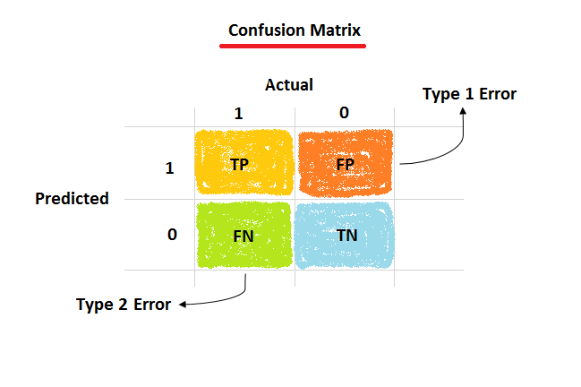

## Table of Contents

## What is a User Matrix in the context of machine learning?

In machine learning, a User Matrix is a type of data structure used to represent information about users, often in recommendation systems or collaborative filtering. It's essentially a table where each row represents a user and each column represents a feature or an item that the user has interacted with. For example, in a movie recommendation system, the columns could represent different movies, and the entries in the matrix could indicate whether a user has watched a particular movie or how they rated it.

The User Matrix is crucial for algorithms that try to predict user preferences or behaviors. By analyzing the patterns in the matrix, machine learning models can identify similarities between users or items, and make recommendations based on these patterns. For instance, if two users have similar patterns of movie ratings, the system might recommend a movie that one user liked to the other. The effectiveness of these systems often depends on the quality and completeness of the data in the User Matrix.

## How is a User Matrix constructed from raw data?

To construct a User Matrix from raw data, you start by gathering information about users and their interactions with items. This could be data like which movies users have watched, what products they've bought, or how they've rated different items. You organize this data into a table where each row represents a user and each column represents an item. The entries in the table could be binary (like 0 for not watched and 1 for watched), numerical ratings (like a scale from 1 to 5), or any other type of data that represents the user's interaction with the item.

Once you have this raw data organized, you need to clean and preprocess it. This might involve handling missing values, normalizing the data, or converting it into a format that's easier for [machine learning](/wiki/machine-learning) algorithms to work with. For example, if some users haven't rated certain movies, you might decide to fill those missing values with a neutral rating or use a more sophisticated imputation method. After cleaning, the User Matrix is ready to be used in recommendation systems or other machine learning models to find patterns and make predictions about user preferences.

## What are the common applications of User Matrix in machine learning?

One of the main uses of a User Matrix in machine learning is in recommendation systems. These systems help suggest items like movies, [books](/wiki/algo-trading-books), or products that a user might like based on their past behavior. For example, if a User Matrix shows that a person has watched a lot of action movies, the system might recommend more action movies to them. This works by finding patterns in the User Matrix, like which movies are often watched by the same users, and using those patterns to predict what a user might want to watch next.

Another common application is in collaborative filtering, which is a type of recommendation system. Collaborative filtering looks at the User Matrix to find users with similar tastes and uses their preferences to make recommendations. If two users have similar patterns in the User Matrix, like rating the same movies highly, the system might suggest a movie that one user liked to the other. This method helps in creating personalized recommendations without needing to know much about the items themselves, just how users interact with them.

User Matrices are also used in user segmentation and behavior analysis. By analyzing the data in the User Matrix, machine learning models can group users into different segments based on their behavior. For example, a company might use a User Matrix to identify groups of customers who frequently buy certain types of products. This can help in marketing, as the company can target different segments with tailored promotions or products.

## How does a User Matrix help in understanding user behavior?

A User Matrix helps us understand user behavior by showing us what users like or do in a clear way. It's like a big table where each row is a person and each column is something they can interact with, like a movie or a product. By looking at this table, we can see patterns. For example, if many people who like one movie also like another movie, we can guess that those movies are similar or that the people who like them have similar tastes. This helps us understand what different groups of users enjoy and how they behave.

Using a User Matrix, we can also see how users change over time. If we keep updating the table with new information, we can track if someone starts watching different types of movies or buying different products. This can tell us a lot about how their interests are changing. By analyzing these changes and patterns, we can learn a lot about what drives user behavior and how to better serve their needs or predict what they might do next.

## What are the differences between a User Matrix and an Item Matrix?

A User Matrix and an Item Matrix are two different ways to organize data in machine learning, especially in recommendation systems. A User Matrix focuses on users. Each row in the User Matrix represents a different user, and each column represents an item, like a movie or a product. The entries in the matrix show how each user has interacted with each item, like if they watched a movie or how they rated it. This helps us understand what each user likes or does.

On the other hand, an Item Matrix focuses on the items. In an Item Matrix, each row represents an item, and each column represents a user. The entries show how each item has been interacted with by different users. This helps us understand what each item is like and how popular it is among different users. Both matrices can be used together to make better recommendations by looking at patterns from both the user's and the item's perspective.

## What techniques are used to handle missing data in a User Matrix?

When we have missing data in a User Matrix, one common technique to handle it is called imputation. Imputation means we fill in the missing values with some estimate. A simple way to do this is to use the average rating of all the other movies a user has rated. For example, if a user has rated some movies but not others, we can fill in the missing ratings with their average rating. Another method is to use the average rating that all users gave to the missing movie. This helps keep the data complete so our machine learning models can work better.

Another technique is to use more advanced methods like matrix factorization. This method tries to find patterns in the data to guess what the missing values might be. It does this by breaking down the User Matrix into smaller matrices and then combining them back together to fill in the gaps. This can be more accurate than just using averages because it takes into account how similar users or items are to each other. For example, if two users have similar tastes in movies, matrix factorization might predict that a missing rating for one user would be similar to what the other user rated.

Sometimes, instead of filling in the missing data, we might choose to ignore it or use only the data we have. This is called "listwise deletion" where we remove any rows or columns with missing data. While this keeps our data clean, it can also mean we lose a lot of information, especially if many entries are missing. Each method has its pros and cons, and the best choice depends on how much data is missing and what we're trying to do with the User Matrix.

## How can dimensionality reduction be applied to a User Matrix?

Dimensionality reduction is a way to make a User Matrix simpler and easier to work with. It's like trying to find the most important information in the matrix and keeping only that. One common method to do this is called Principal Component Analysis (PCA). PCA looks at the User Matrix and finds new ways to describe the data using fewer columns. This can help make the data easier to understand and can also make machine learning models run faster because there's less information to process.

Another method is Singular Value Decomposition (SVD). SVD breaks down the User Matrix into three smaller matrices: one for users, one for items, and one that shows how important each new column is. By keeping only the most important columns, we can reduce the size of the User Matrix. For example, if we have a User Matrix where each row is a user and each column is a movie, SVD can help us find new columns that capture the main patterns in how users rate movies. This way, we can still understand user preferences even though we're working with less data.

## What are the challenges of scaling User Matrix computations for large datasets?

When we have a lot of users and items, the User Matrix can get very big. This makes it hard to do calculations quickly because computers need more time and memory to work with large matrices. For example, if we have millions of users and thousands of items, the User Matrix can have billions of entries. This can slow down our machine learning models and make it tough to find patterns in the data. To solve this, we need to use special techniques like distributed computing, where we split the work across many computers, or use algorithms that are designed to handle big data more efficiently.

Another challenge is keeping the User Matrix up to date. As users interact with new items or change their preferences, the matrix needs to be updated. With a large dataset, these updates can take a long time and can be hard to manage. If the updates are not done quickly, the recommendations we make might not be as good because they're based on old information. To handle this, we might need to use smart ways to update the matrix, like only updating parts of it that have changed or using algorithms that can learn from new data without needing to rebuild the whole matrix from scratch.

## How does collaborative filtering utilize a User Matrix?

Collaborative filtering uses a User Matrix to make recommendations by looking at patterns in how users interact with items. Imagine a big table where each row is a user and each column is a movie. The entries in the table show if a user watched a movie or how they rated it. Collaborative filtering looks at this table to find users who have similar tastes. If two users liked the same movies, the system might suggest a movie that one user liked to the other. This way, it can predict what a user might like based on what similar users enjoyed.

To do this, collaborative filtering can use different methods. One common method is called "user-based" collaborative filtering. It finds users with similar patterns in the User Matrix and uses their preferences to make recommendations. For example, if Alice and Bob both liked the same movies, and Alice also liked a new movie that Bob hasn't seen, the system might recommend that movie to Bob. Another method is "item-based" collaborative filtering, which looks at the items (like movies) that users have rated similarly. If many users who liked one movie also liked another, the system might recommend the second movie to someone who just watched the first. Both methods help make personalized recommendations by using the information in the User Matrix.

## What advanced algorithms can enhance the performance of a User Matrix?

One advanced algorithm that can enhance the performance of a User Matrix is Matrix Factorization. This technique breaks down the User Matrix into smaller matrices, which can help find hidden patterns in the data. For example, if we have a User Matrix where rows are users and columns are movies, Matrix Factorization can find new ways to describe users and movies that capture their main characteristics. This can make recommendations more accurate because it can predict missing ratings better than simpler methods. By using Matrix Factorization, we can reduce the size of the User Matrix while keeping the most important information, which makes calculations faster and more efficient.

Another useful algorithm is Deep Learning, specifically neural networks. These can learn complex patterns in the User Matrix that simpler algorithms might miss. A [neural network](/wiki/neural-network) can take the User Matrix as input and learn to predict what a user might like next. This is especially helpful when we have a lot of data because neural networks can handle large amounts of information well. They can also adapt to new data over time, so the recommendations stay up-to-date with changing user preferences. By using [deep learning](/wiki/deep-learning), we can make the User Matrix more powerful and improve the accuracy of our recommendations.

## How can one evaluate the effectiveness of a User Matrix in a recommendation system?

To evaluate how well a User Matrix works in a recommendation system, we look at how accurate the recommendations are. One common way to do this is by using metrics like Root Mean Square Error (RMSE) or Mean Absolute Error (MAE). These metrics measure how far off the predicted ratings are from the actual ratings users give. For example, if we predict a user will rate a movie a 4 out of 5, but they actually rate it a 3, the error is 1. By calculating the average error across all predictions, we can see if the User Matrix is doing a good job at guessing what users will like. If the error is low, it means the User Matrix is effective.

Another way to check the effectiveness is by looking at how often users actually like the recommendations they get. This can be measured with metrics like precision and recall. Precision tells us how many of the recommended items were actually liked by the user, while recall tells us how many of the items a user liked were recommended to them. If a User Matrix leads to high precision and recall, it means the recommendations are relevant and useful. By using these different ways to evaluate the User Matrix, we can make sure it's helping the recommendation system work well and give users what they want.

## What are the latest research trends involving User Matrix in machine learning?

Recent trends in machine learning research involving User Matrix focus on improving recommendation systems by incorporating more complex models and data. One trend is the use of deep learning techniques, like neural networks, to better understand patterns in User Matrices. These models can handle large amounts of data and learn from it over time, making recommendations more accurate. Researchers are also looking at ways to combine User Matrices with other types of data, like user demographics or item descriptions, to make the recommendations more personalized and relevant. This approach can lead to better understanding of user preferences and more effective recommendations.

Another trend is the development of more efficient algorithms for handling large User Matrices. With the growth of data, traditional methods can be slow and cumbersome. Researchers are working on techniques like distributed computing and advanced matrix factorization methods to speed up calculations and handle big data better. For example, using algorithms like Alternating Least Squares (ALS) for matrix factorization can help reduce the size of the User Matrix while keeping its important information. These advancements help make recommendation systems faster and more scalable, which is important as more and more data becomes available.

## References & Further Reading

[1]: Ricci, F., Rokach, L., Shapira, B., & Kantor, P. B. (Eds.). (2011). [Recommender Systems Handbook](https://www.researchgate.net/publication/227268858_Recommender_Systems_Handbook). Springer US.

[2]: Zhang, Y., & Chen, X. (2018). ["Explainable Recommendation: A Survey and New Perspectives."](https://arxiv.org/abs/1804.11192) arXiv.

[3]: Koren, Y., Bell, R., & Volinsky, C. (2009). ["Matrix Factorization Techniques for Recommender Systems."](https://ieeexplore.ieee.org/abstract/document/5197422) Computer, 42(8), 30-37.

[4]: Aggarwal, C. C. (2016). [Recommender Systems: The Textbook](https://link.springer.com/book/10.1007/978-3-319-29659-3). Springer International Publishing.

[5]: Hu, Y., Koren, Y., & Volinsky, C. (2008). ["Collaborative Filtering for Implicit Feedback Datasets."](https://ieeexplore.ieee.org/document/4781121) 2008 Eighth IEEE International Conference on Data Mining, pages 263-272.

[6]: Goldberg, D., Nichols, D., Oki, B. M., & Terry, D. (1992). ["Using Collaborative Filtering to Weave an Information Tapestry."](https://dl.acm.org/doi/10.1145/138859.138867) Communications of the ACM, 35(12), 61-70.