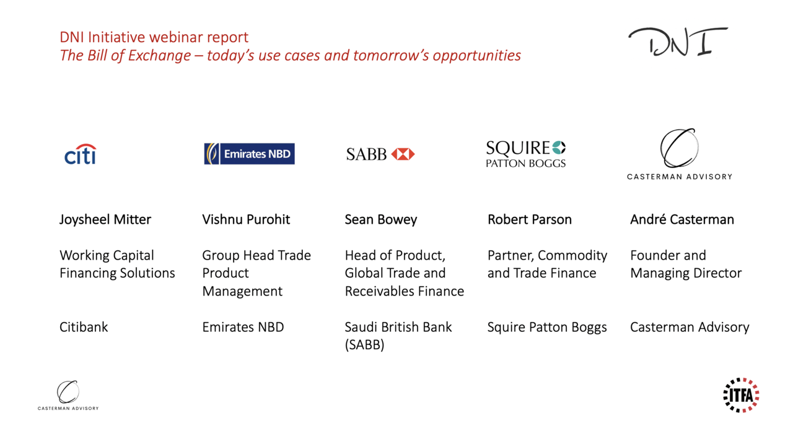

## Table of Contents

## What is a bill of exchange?

A bill of exchange is a written document used in business to promise that money will be paid. It is like an IOU, but it is more formal and often used between businesses or between a business and a bank. The person who writes the bill is called the drawer, and the person who is supposed to pay is called the drawee. The person who will receive the money is called the payee. The bill includes details like the amount of money, the date it needs to be paid, and the names of the people involved.

Bills of exchange are useful because they help businesses manage their money better. For example, if a company sells goods to another company, they can use a bill of exchange to get paid later instead of right away. This can help the buying company to have more time to sell the goods and make money before they need to pay. It also helps the selling company because they can be sure they will get paid, as long as the bill is accepted by the drawee. Bills of exchange are used all over the world and are an important part of international trade.

## Who are the primary users of bills of exchange?

The main users of bills of exchange are businesses and banks. Businesses use them a lot when they buy and sell things from each other. For example, if a company in one country sells goods to a company in another country, they might use a bill of exchange. This helps the selling company know they will get paid, and it gives the buying company more time to pay after they sell the goods.

Banks also use bills of exchange a lot. They can help businesses by accepting the bills and giving them money right away. Then, the bank waits to get paid when the bill is due. This is helpful for businesses because they don't have to wait to get their money. Banks also use bills of exchange when they lend money to businesses, as a way to make sure they get paid back.

Sometimes, people who are not businesses or banks use bills of exchange too, but this is less common. They might use them for big purchases or to borrow money from someone they trust. But mostly, it's businesses and banks that use them because they need a safe way to handle big amounts of money and make sure they get paid on time.

## How do businesses use bills of exchange in their operations?

Businesses use bills of exchange to manage their money better when they buy and sell things. When a business sells goods to another business, they might use a bill of exchange instead of getting paid right away. This helps the selling business because they know they will get paid later, and it helps the buying business because they can pay after they sell the goods and make money. This is really helpful in international trade, where it can take time to move goods from one country to another.

Banks also play a big role when businesses use bills of exchange. A business can take the bill to a bank and get money right away, even though the bill says they will be paid later. The bank then waits to get paid when the bill is due. This is good for businesses because they don't have to wait to get their money. It also helps businesses borrow money from banks more easily, because the bill of exchange acts like a promise that the bank will get paid back.

## What are the benefits of using bills of exchange for businesses?

Using bills of exchange helps businesses manage their money better. When a business sells something, they can use a bill of exchange to get paid later instead of right away. This is good because it gives the buying business more time to sell the goods and make money before they need to pay. It also helps the selling business because they know they will get paid, as long as the bill is accepted by the buyer. This makes it easier for businesses to do deals, especially when they are in different countries and it takes time to move goods.

Bills of exchange also help businesses work with banks. A business can take the bill to a bank and get money right away, even though the bill says they will be paid later. The bank then waits to get paid when the bill is due. This is good for businesses because they don't have to wait to get their money. It also makes it easier for businesses to borrow money from banks, because the bill of exchange acts like a promise that the bank will get paid back. This can help businesses grow and do more deals.

## Can individuals use bills of exchange, and if so, how?

Yes, individuals can use bills of exchange, but it's not as common as businesses using them. If an individual wants to buy something big, like a car or a house, they might use a bill of exchange to promise to pay later. They would write the bill, saying how much they will pay and when. The person selling the car or house would be the one to get paid later. This can help the individual because they don't have to pay all the money right away.

Sometimes, individuals might use bills of exchange to borrow money from someone they trust, like a friend or family member. They would write a bill saying they will pay back the money on a certain date. This makes it clear when the money needs to be paid back, and it can help keep things friendly between the borrower and the lender. But, most of the time, individuals don't use bills of exchange because they are more useful for businesses and banks.

## What are the legal requirements for a bill of exchange to be valid?

For a bill of exchange to be valid, it must meet certain legal requirements. It must be in writing and signed by the person who is promising to pay, called the drawer. The bill must clearly state the amount of money that needs to be paid and the date when it needs to be paid. It should also name the person who will receive the money, called the payee, and the person who is supposed to pay, called the drawee. The bill must be an unconditional order to pay, meaning it cannot have any conditions attached to it.

In addition to these basic requirements, the bill of exchange must be delivered to the payee or to someone acting on their behalf. This delivery is important because it shows that the payee has accepted the bill. The bill must also be payable on demand or at a fixed future date. If any of these requirements are missing, the bill of exchange might not be considered valid in a court of law. This is why it's important for anyone using a bill of exchange to make sure all these details are included and correct.

## How does the process of endorsing a bill of exchange work?

Endorsing a bill of exchange means that the person who is supposed to get the money, called the payee, can transfer the right to get that money to someone else. This is done by writing on the back of the bill. The payee signs their name and writes the name of the new person who will get the money. This new person is called the endorsee. By doing this, the payee is saying that they are giving up their right to the money and passing it on to the endorsee.

Once the bill is endorsed, the endorsee can take the bill to the person who is supposed to pay, called the drawee, and ask for the money. The endorsee can also endorse the bill again to someone else if they want to. This way, the bill can be passed from one person to another until it is finally paid. Endorsing a bill of exchange is a useful way to move money around without having to use cash or a bank transfer.

## What are the risks associated with using bills of exchange?

Using bills of exchange can be risky. One big risk is that the person who is supposed to pay, called the drawee, might not have enough money when the bill is due. If this happens, the person who is supposed to get the money, called the payee, might not get paid. This can be a big problem, especially if the payee was counting on that money to pay their own bills or to buy more things to sell.

Another risk is that the bill of exchange might get lost or stolen. If someone else finds or steals the bill, they might try to get the money. This can be a problem if the bill is not endorsed properly or if the person who lost it does not report it quickly. To help with this, some people use special ways to make sure the bill is safe, like keeping it in a safe place or using a bank to help manage it.

There can also be risks if the bill of exchange is not written correctly. If it is missing important details like the amount of money, the date it needs to be paid, or the names of the people involved, it might not be valid. This can cause problems if someone tries to use the bill to get money and finds out it is not legal. It's important to make sure all the details are right to avoid these kinds of problems.

## How do international transactions utilize bills of exchange?

In international transactions, bills of exchange help businesses buy and sell things across different countries. When a business in one country sells goods to a business in another country, they might use a bill of exchange to get paid later. This is helpful because it can take time to move goods from one place to another. The selling business knows they will get paid, and the buying business can pay after they sell the goods and make money. This makes it easier for businesses to do deals with each other, even if they are far away.

Banks also play a big role in international transactions using bills of exchange. A business can take the bill to a bank and get money right away, even though the bill says they will be paid later. The bank then waits to get paid when the bill is due. This is good for businesses because they don't have to wait to get their money. It also helps businesses borrow money from banks more easily, because the bill of exchange acts like a promise that the bank will get paid back. This can help businesses grow and do more deals around the world.

## What role do banks play in the use of bills of exchange?

Banks are very important when it comes to using bills of exchange. When a business sells something and gets a bill of exchange, they can take it to a bank to get money right away. The bank gives the business the money, and then the bank waits to get paid when the bill is due. This helps businesses because they don't have to wait to get their money. It also makes it easier for businesses to borrow money from banks, because the bill of exchange acts like a promise that the bank will get paid back.

In international trade, banks help even more with bills of exchange. When a business in one country sells goods to a business in another country, they might use a bill of exchange. The selling business can take the bill to a bank and get money right away. The bank then waits to get paid when the bill is due. This is good because it can take time to move goods from one country to another. Banks help make sure that businesses can do deals with each other, even if they are far away.

## How have digital technologies impacted the use of bills of exchange?

Digital technologies have changed the way bills of exchange are used. Now, instead of writing a bill on paper, businesses can use computers and the internet to create and send bills of exchange. This makes it faster and easier to do business. People can send bills to each other in seconds, no matter where they are in the world. This is really helpful for international trade, where it used to take a long time to send paper bills from one country to another. Also, using digital bills can be safer because they can be protected with passwords and other security measures.

Banks have also changed how they work with bills of exchange because of digital technology. Now, banks can accept and process digital bills of exchange quickly. This means businesses can get their money even faster than before. Banks can also use digital systems to keep track of bills and make sure they are paid on time. This makes everything more efficient and helps businesses manage their money better. Overall, digital technologies have made bills of exchange easier to use and more secure.

## What are some advanced strategies for managing bills of exchange in large corporations?

Large corporations often use advanced strategies to manage their bills of exchange effectively. One strategy is to use a centralized system to keep track of all their bills. This system can be digital and helps the corporation see all their bills in one place. It makes it easier to know when bills are due and who needs to pay them. This way, the corporation can make sure they get paid on time and don't miss any important dates. They can also use this system to see if they need to borrow money from a bank or if they can wait to get paid.

Another strategy is to use banks more smartly. Large corporations might work with several banks to manage their bills of exchange. They can use one bank to get money quickly when they need it and another bank to help with international deals. This helps them get the best deals and services from different banks. They can also use special financial tools, like factoring, where they sell their bills of exchange to a bank for a little less money but get paid right away. This helps them manage their cash flow better and keep their business running smoothly.

## References & Further Reading

[1]: Bills of Exchange Act 1882, UK Parliament. [https://www.legislation.gov.uk/ukpga/Vict/45-46/61](https://www.legislation.gov.uk/ukpga/Vict/45-46/61)

[2]: Taleb, N. N. (2010). "The Black Swan: The Impact of the Highly Improbable." Random House.

[3]: Williams, J. (2001). "Financial Accounting and the Law of Bills of Exchange." Law and Financial Markets Review.

[4]: ["Algorithmic Trading and DMA: An Introduction to Direct Access Trading Strategies"](https://archive.org/details/algorithmictradi0000john) by Barry Johnson

[5]: ["International Trade and Trade Finance Law"](https://www.tradefinanceglobal.com/legal/trade-finance/) by Charles Proctor