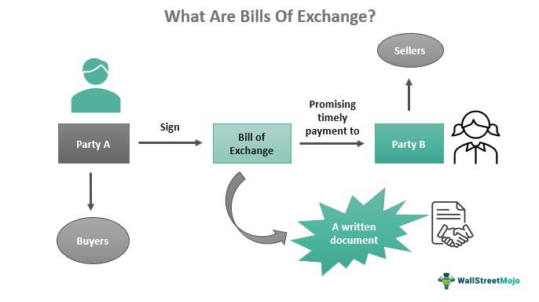

In the world of finance, various instruments play a vital role in facilitating trade and investment transactions. Bills of exchange and related financial tools in trade finance hold prominent positions due to their unique abilities to mitigate risks and provide credit in international dealings. These instruments are pivotal in guaranteeing payments, reducing uncertainties such as currency fluctuations and issues of creditworthiness. 

A significant development in modern financial systems is the intersection of trade finance, which encompasses traditional instruments like bills of exchange, with algorithmic trading technologies. Algorithmic trading—characterized by the use of pre-programmed rules to execute trades—brings enhanced efficiency and precision to financial operations. Its integration with trade finance tools allows for the rapid execution of transactions, optimized liquidity management, and improved risk assessment. This amalgamation reflects a broader trend where technological integration is reshaping established financial practices, offering new capabilities while reinforcing foundational trade structures.



As businesses navigate this evolving landscape, understanding these financial instruments becomes crucial for optimizing trade operations and managing financial risks effectively. For instance, bills of exchange, which date back to medieval trade practices, have continually evolved, providing liquidity and security to businesses across borders. These instruments are governed by legal frameworks that vary by jurisdiction, adding layers of protection and enforcement options in international trade contexts.

This article provides a comprehensive overview of bills of exchange, covering their fundamental characteristics, historical significance, and the legal environments in which they operate. Moreover, it examines the transformative impact of algorithmic trading on trade finance, underscoring the importance of these technologies in enhancing financial transactions' efficiency and security. By understanding these dynamics, businesses can better navigate the complexities of global trade while minimizing risks and capitalizing on opportunities presented by advancements in technology and financial instruments.

## Table of Contents

## Understanding Bills of Exchange

Bills of exchange are fundamental financial instruments employed in trade to ensure payment from one party to another. They play a critical role in facilitating international transactions by mitigating risks like currency fluctuations and concerns about the creditworthiness of parties involved. The utility and efficacy of bills of exchange are underscored by their structured nature, which typically involves three key parties: the drawer, the drawee, and the payee. 

The drawer is the entity that creates the bill and requests payment. The drawee, usually a financial institution or a designated party, is instructed to pay the amount specified in the bill either immediately or at a future date. The payee is the individual or organization that ultimately receives the payment. These roles are essential for the proper execution and legal validity of the transaction, ensuring that each party's rights and obligations are clear and enforceable.

Bills of exchange are versatile instruments that can be tailored to meet specific trade requirements through the use of different types. Sight bills are payable on demand, meaning the payment is due immediately when the bill is presented. In contrast, time bills stipulate a deferred payment date, providing the drawee with a specified period to settle the amount. This flexibility allows parties to choose the type that best suits their cash flow and financial strategies.

One of the key advantages of bills of exchange is their transferability. They can be endorsed and transferred to another party, thus providing an additional layer of [liquidity](/wiki/liquidity-risk-premium). This feature is particularly beneficial in international trade, where immediate cash flow is often required to sustain business operations. Furthermore, the legal enforceability of these instruments is well-established, providing assurance and security to all parties involved.

The ability to discount bills of exchange for immediate cash access is another significant benefit. Financial institutions often offer discounting services, purchasing the bill before its maturity at a value less than its face amount. This process provides immediate liquidity to businesses, enabling them to manage their cash flow more effectively.

The fundamental purpose of bills of exchange is to offer financial security and liquidity in trade. They allow businesses to participate in complex international transactions with reduced financial risks. By guaranteeing payment and offering a structured process for settlements, bills of exchange contribute significantly to the smooth functioning of global trade, fostering trust and reliability among trading partners.

## Bills of Exchange in Trade Finance

Trade finance encompasses various financial instruments that facilitate international trade by providing mechanisms for risk management, credit enhancement, and payment assurance. Among these instruments, bills of exchange and promissory notes are pivotal, each serving distinct roles depending on the nature of the trade relationship and transaction complexity.

Bills of exchange are particularly favored in international trade for their capacity to offer credit and payment guarantees. They act as a written order from the drawer (the seller) to the drawee (the buyer), mandating the payment of a specific sum of money either on demand or at a future date to the payee. This structure provides certainty and security in transactions, which is crucial in international contexts where parties operate across diverse legal jurisdictions. The enforceability of bills of exchange across these varied legal systems enhances trust and reliability, mitigating potential disputes.

Financial institutions often serve as intermediaries in transactions involving bills of exchange. They provide essential services such as guaranteeing payments, ensuring that the seller receives payment even in the event of buyer default. Moreover, these institutions offer discounting services, allowing exporters to receive immediate funds by selling the bill of exchange to a bank at a discount before its maturity date. This feature is invaluable for managing cash flows and meeting immediate financial needs, particularly for exporters who require liquidity before the actual payment comes due.

In contrast to promissory notes, which are more akin to an IOU from the buyer promising to pay the seller, bills of exchange offer a more structured and legally robust framework. While promissory notes involve a direct commitment between two parties, bills of exchange typically incorporate financial institutions as third-party participants, adding an additional layer of security and formality. This added complexity makes bills of exchange particularly suitable for intricate international trade transactions where multiple parties and jurisdictions are involved.

Overall, bills of exchange play a critical role in trade finance by enhancing the structure and security of international transactions. Their ability to manage financial risks and ensure smooth cash flows is indispensable for businesses navigating the complexities of global trade environments.

## Algorithmic Trading in Trade Finance

Algorithmic trading is transforming trade finance by leveraging pre-programmed trading instructions to enhance transaction speed and accuracy. In a landscape where timely execution is critical, [algorithmic trading](/wiki/algorithmic-trading) facilitates the efficient handling of large transaction volumes, optimizing liquidity while effectively managing risks associated with trade finance instruments such as bills of exchange.

These trading systems operate by analyzing vast amounts of market data to identify trends and patterns. By executing trades based on pre-defined criteria, firms can rapidly adjust to market fluctuations. For example, an algorithm can be programmed to track currency rates and execute buy or sell orders when certain thresholds are met, ensuring that exchange rate risks in international transactions are minimized.

The integration of algorithmic trading with trade finance tools like bills of exchange leads to more dynamic and responsive financial operations. This integration ensures that firms can manage their liquidity needs efficiently and react promptly to market conditions, thus maintaining a competitive edge. In practice, an algorithm could automate the process of bill discounting, where the cash flow needs are met by exchanging a bill of exchange for immediate payment, thereby optimizing cash management strategies.

In Python, the application of algorithmic trading principles to trade finance could involve using libraries such as Pandas for data analysis and NumPy for numerical calculations. An example script might involve:

```python
import pandas as pd
import numpy as np

# Sample dataframe representing historical exchange rates
data = {'Date': pd.date_range(start='2022-01-01', periods=100),
        'Exchange_Rate': np.random.rand(100) * 0.1 + 1.2}

df = pd.DataFrame(data)
# Define a simple moving average strategy
df['SMA_10'] = df['Exchange_Rate'].rolling(window=10).mean()
df['SMA_50'] = df['Exchange_Rate'].rolling(window=50).mean()

# Signal for buying or selling based on moving average crossover
df['Trade_Signal'] = np.where(df['SMA_10'] > df['SMA_50'], 'Buy', 'Sell')
```

Understanding the symbiotic relationship between these technological advancements and traditional trade instruments is essential for firms aspiring to maintain global market competitiveness. As algorithmic trading continues to evolve, its application within trade finance will further streamline operations, enable better risk management, and create opportunities for innovation in financial transactions. For businesses, this means an opportunity to leverage technology not only to meet current market demands but also to predict and prepare for future trends, ensuring resilient and robust trade finance strategies.

## Legal and Risk Considerations

Engaging with bills of exchange requires a comprehensive understanding of the legal frameworks that regulate them, as these frameworks can differ significantly between jurisdictions. Key among the legal aspects is the enforceability of bills of exchange, which demands strict adherence to specific formal requirements such as signatures, written records, and clear terms of payment. These elements ensure that the bills serve as reliable financial instruments in contractual obligations.

The validity of a bill of exchange hinges on its compliance with legal criteria established by international and domestic laws, including the Uniform Commercial Code (UCC) and the United Nations Convention on International Bills of Exchange and International Promissory Notes. These laws stipulate the conditions under which a bill of exchange is deemed valid and the circumstances that might render it void or unenforceable.

Dispute resolution mechanisms are crucial for addressing issues such as non-payment or dishonored bills. Typically, these mechanisms involve arbitration or litigation processes outlined in contractual agreements. The choice of jurisdiction for dispute resolution is a vital consideration, often influenced by the locations of the parties involved and the applicable governing law.

Financial institutions play a pivotal role in mitigating risks associated with bills of exchange. They provide services such as guaranteeing payment and facilitating smooth fund transfers, thereby offering a layer of security against the risk of non-payment. These institutions often engage in practices like discounting bills of exchange, offering liquidity to businesses in need of immediate cash flow.

Businesses utilizing bills of exchange must conduct rigorous assessments of counterparty risk and foreign exchange risk. Counterparty risk pertains to the possibility that the other party in the transaction may default. To mitigate such risks, businesses often seek detailed credit assessments and may require collateral or bank guarantees.

Foreign exchange risk arises from fluctuations in currency values, affecting the ultimate settlement amounts. Hedging practices, such as using currency forward contracts, can be employed to manage these risks effectively.

Additionally, compliance with international trade regulations is paramount. These regulations govern the transfer and clearance of bills of exchange across borders, necessitating that businesses stay informed of any regulatory changes impacting their operations.

Sound risk management practices are essential for businesses engaging with bills of exchange. This includes a thorough understanding of legal obligations, meticulous documentation of all transactions, and the strategic use of financial instruments to safeguard against potential defaults. In essence, the comprehensive management of legal and financial risks associated with bills of exchange is critical for ensuring their effective use in international trade finance.

## Practical Applications and Market Use

Bills of exchange serve as versatile financial tools across international markets, adapting to local economic practices and legal norms to meet diverse needs. In developed markets, these instruments are instrumental in large-scale transactions, such as real estate, where they provide robust payment structures that ensure the orderly transfer of funds. The structured payment mechanisms offered by bills of exchange reduce the risk of delayed or defaulted payments, thereby enhancing transactional integrity and efficiency.

In contrast, emerging markets utilize bills of exchange to attract international funding and investment, which is critical for economic growth and development. These instruments are employed to introduce an element of security and trust in international transactions, facilitating smoother business operations across borders. The ability to convert a bill of exchange into immediate cash flow via discounting is particularly beneficial for businesses in these markets, helping to manage liquidity and maintain financial stability.

Case studies and empirical data highlight the practical benefits of bills of exchange in enhancing liquidity and managing credit risks. For instance, when exporters discount bills with financial institutions, they gain immediate access to cash, which can then be reinvested into business operations or used to manage liabilities, thereby improving overall liquidity. Furthermore, as legally enforceable instruments, bills of exchange help parties adhere to trade agreements, reducing the incidence of disputes and enhancing compliance.

Moreover, the global acceptance of bills of exchange is underscored by their credibility as trust-bearing instruments. This universal trust facilitates their seamless integration into different economic environments, providing a consistent framework for trade operations. Consequently, businesses across various markets continue to rely on bills of exchange to secure transactions, mitigate risks, and support growth, underpinning their indispensable role in the global financial ecosystem.

## Conclusion: The Future of Trade Finance Tools

The future of trade finance is increasingly defined by the integration of traditional instruments, like bills of exchange, with emerging technologies such as algorithmic trading. This combination holds the promise of significantly enhancing efficiency and reducing the time required to execute financial transactions. By automating and optimizing trading processes, algorithmic systems can handle large volumes of transactions swiftly, thus minimizing human error and operational costs.

The strategic selection of financial instruments will become crucial as businesses strive to strike a balance between risk and flexibility to meet the strategic needs of trade partners. Companies will need to evaluate their choices based on how effectively these instruments can manage risks while providing the necessary flexibility to adapt to the changing demands of international trade.

Technological advancements will play a pivotal role in this evolution. Innovations in blockchain technology, [artificial intelligence](/wiki/ai-artificial-intelligence), and [machine learning](/wiki/machine-learning) are expected to transform the landscape of trade finance. Such technologies can enhance transparency, reduce fraud, and improve transaction security. Furthermore, advancements in regulatory frameworks will be necessary to ensure these technologies are utilized effectively and ethically, without compromising on compliance and standardization across borders.

Businesses that adopt innovative approaches will be better positioned to thrive in the evolving landscape of trade finance. For instance, by employing smart contracts on blockchain platforms, companies can automate the settlement of trade agreements, thereby increasing the reliability and speed of transactions. Additionally, maintaining a robust legal framework will assure parties of the enforceability and validity of these digital contracts, thereby building trust.

In conclusion, the synergy between traditional financial instruments and cutting-edge technology will redefine trade finance, fostering a future where enhanced operational capabilities are the norm. Businesses that capitalize on these advancements will likely gain competitive advantages, operating more efficiently and securely in the global trade environment.

## References & Further Reading

[1]: Bills of Exchange Act 1882, UK Parliament. [https://www.legislation.gov.uk/ukpga/Vict/45-46/61](https://www.legislation.gov.uk/ukpga/Vict/45-46/61)

[2]: Taleb, N. N. (2010). "The Black Swan: The Impact of the Highly Improbable." Random House.

[3]: Williams, J. (2001). "Financial Accounting and the Law of Bills of Exchange." Law and Financial Markets Review.

[4]: ["Algorithmic Trading and DMA: An Introduction to Direct Access Trading Strategies"](https://archive.org/details/algorithmictradi0000john) by Barry Johnson

[5]: ["International Trade and Trade Finance Law"](https://www.tradefinanceglobal.com/legal/trade-finance/) by Charles Proctor