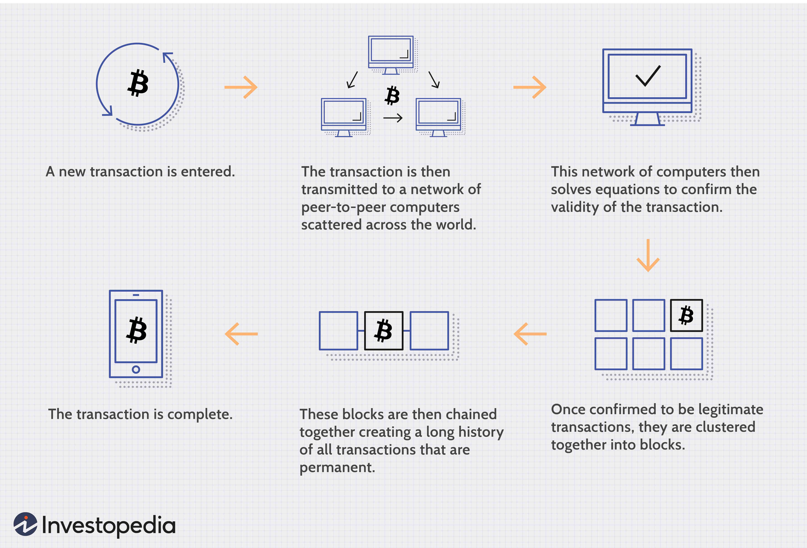

In recent years, the landscape of finance and technology has experienced a profound transformation through the integration of digital currencies and cryptocurrencies. Digital currencies, encompassing both cryptocurrencies and other forms of electronic money, have revolutionized how financial transactions are conducted. Cryptocurrencies, underpinned by blockchain technology, have become essential components of modern financial systems, offering numerous applications owing to their decentralized nature and cryptographic security.

The rise of cryptocurrencies like Bitcoin and Ethereum has presented alternatives to traditional fiat currencies, enabling faster, more secure transactions without the need for intermediaries. This new financial ecosystem not only enhances convenience but also cultivates an environment conducive to innovation and efficiency in financial operations. By harnessing the capabilities of blockchain technology, cryptocurrencies facilitate transparency and immutability, qualities highly sought after in various sectors.



This article aims to examine the myriad applications of digital currencies, the complexities inherent to cryptocurrencies, and how algorithmic trading affects the future of finance. Together, these elements are reshaping traditional economic systems by offering solutions that challenge and redefine decades-old transaction methods on a global scale. Businesses and individuals stand to benefit significantly from these advancements, as embracing these technologies paves the way for enhanced financial operations and strategic growth. Through strategic adoption and application, stakeholders can optimize financial processes, reduce costs, and innovate in ways previously deemed impossible.

## Table of Contents

## Understanding Digital Currency and Cryptocurrency

Digital currencies are financial assets that exist in a digital format, distinguishing them from physical currency such as banknotes and coins. They can be accessed, stored, and transacted online without requiring a physical form. One of the most prominent subsets of digital currency is cryptocurrency, which utilizes cryptography to secure transactions and control the creation of new units. Unlike traditional currencies issued by governments, cryptocurrencies are typically decentralized and operate on technology such as blockchain.

Cryptocurrencies are designed with several key characteristics that differentiate them from conventional money. These include transparency, where transactions are recorded on a public ledger that can be accessed by anyone. This transparency is facilitated by the blockchain technology underlying many cryptocurrencies. Furthermore, transactions in cryptocurrencies are immutable, meaning that once a transaction is recorded on the blockchain, it cannot be altered or deleted, enhancing security and trust.

Another core feature of cryptocurrencies is the absence of intermediaries. Traditional financial systems often require banks or payment processors to facilitate transactions. In contrast, cryptocurrencies allow for peer-to-peer transactions, reducing the need for third-party involvement. This not only speeds up transactions but also lowers transaction costs.

Bitcoin and Ethereum are among the most well-known and widely used cryptocurrencies, often considered alternatives to traditional fiat currencies. Bitcoin, introduced in 2009, was the first decentralized [cryptocurrency](/wiki/cryptocurrency) and utilizes a decentralized system to allow transactions between users without a central authority. Ethereum, launched in 2015, extends the concept by enabling programmable smart contracts, which are self-executing contracts with the terms of the agreement directly written into code.

The foundational concepts of digital currencies revolve around digital availability, decentralization, encryption, and peer-to-peer transactions. Unlike conventional money, which is controlled by central banks, digital currencies can be managed by decentralized networks using distributed ledger technology.

Digital currencies differ from conventional money in several ways. While traditional currencies are issued and regulated by governments and central banks, digital currencies can be created and managed without a central authority. This decentralization can offer increased privacy and security, but it also raises questions regarding regulation and stability. Conventional money is often subject to monetary policies that aim to control inflation and ensure economic stability, whereas digital currencies are generally not subject to such controls.

In summary, digital currencies and cryptocurrencies represent a significant shift from traditional monetary systems, offering a new paradigm for financial transactions that emphasizes security, decentralization, and efficiency. As these technologies continue to evolve, they promise to reshape the financial landscape and challenge existing economic structures.

## Applications of Digital Currency

Digital currencies have rapidly become a cornerstone for enhancing the speed, security, and efficiency of financial transactions. Their application across various domains has transformed how financial activities are conducted, offering distinct advantages over traditional financial systems.

One of the primary applications of digital currencies is in facilitating fast cross-border payments. Traditional banking systems often necessitate several intermediaries, leading to delays and higher transaction fees. In contrast, digital currencies enable almost instantaneous transactions across borders by eliminating these intermediaries. For instance, the use of blockchain technology in cryptocurrencies like Bitcoin and Ripple allows for real-time processing of transactions with minimized fees. According to a report by PwC, cross-border transactions using blockchain can reduce transaction costs by up to 40% [1].

Peer-to-peer (P2P) transactions represent another significant application of digital currencies. These transactions empower individuals to conduct transactions directly without the need for a third-party institution. Cryptocurrencies such as Litecoin and Bitcoin offer platforms where users can transact directly with one another. The absence of intermediaries not only reduces transaction fees but also enhances privacy and security, as transactions are encrypted and recorded on the blockchain ledger.

In the corporate world, digital currencies are impacting enterprise operations. Many companies have integrated digital currency solutions into their payroll systems, allowing for timely and cost-effective salary payments. Multinational companies, in particular, find this beneficial when compensating employees in different countries, as it mitigates the costs and inefficiencies associated with currency conversion and cross-border transfers. Moreover, digital currencies are being used in supply chain management to improve transparency and traceability. The immutable ledger of blockchain technology ensures that every transaction or change in the supply chain is recorded, enhancing accountability and reducing fraud.

A real-world example of these applications can be seen in the collaboration between IBM and Maersk with their blockchain initiative, TradeLens. This platform uses blockchain technology to digitize and streamline the global shipping process. By integrating digital currencies, participants can transact smoothly, ensuring payment transparency and reducing fraud risks.

In summary, the applications of digital currencies are manifold, with the potential to revolutionize how transactions are conducted globally. They provide solutions that enhance transaction speed, reduce costs, improve transparency, and offer privacy, supporting both individuals and enterprises in optimizing their financial operations.

[1] PwC. "Blockchain: The $10 billion opportunity for financial services." Available from: https://www.pwc.com/gx/en/issues/blockchain.html

## The Role of Cryptocurrency in Modern Finance

Cryptocurrencies have been transformative in reshaping how financial transactions are executed, offering viable alternatives to traditional banking systems. These digital assets, underpinned by blockchain technology, provide a decentralized framework that mitigates the need for central authorities, such as banks or financial institutions, to validate and authorize transactions.

A prime example of this transformation is the rise of Decentralized Finance (DeFi) projects. DeFi leverages cryptocurrencies and smart contracts to develop financial products and services that operate without a central control. These platforms facilitate lending, borrowing, and trading without intermediaries, enhancing financial accessibility and autonomy for users. With blockchain's transparency, users can track transactions in real time, bolstering trust and reducing the risk of fraud.

Initial Coin Offerings (ICOs) have emerged as a popular method for blockchain projects to raise capital. Through ICOs, companies can bypass traditional venture capital routes by issuing their own digital tokens to investors. This democratizes the investment process, enabling wider participation from a global audience. However, the unregulated nature of ICOs also poses risks, as fraudulent schemes can exploit investors.

Cryptocurrencies' impact on global financial markets is palpable. They contribute to a more inclusive financial system, offering services to the unbanked population in regions where conventional banking infrastructure is lacking. Moreover, they allow for frictionless international transactions, mitigating the inefficiencies associated with cross-border payments in traditional finance.

Despite the opportunities, cryptocurrency adoption is accompanied by challenges. Regulatory uncertainty remains a significant hurdle, as policymakers strive to balance innovation with consumer protection and financial stability. The volatile nature of cryptocurrency markets can deter mainstream adoption and poses risks to investors. Additionally, concerns over security, privacy, and environmental sustainability of the energy-intensive mining processes need to be addressed.

In conclusion, cryptocurrencies continue to revolutionize financial systems, offering innovative solutions and significant efficiencies. The potential for more profound impacts exists, provided that challenges are managed effectively to ensure stability and security while fostering innovation.

 to Algorithmic Trading

Algorithmic trading involves the use of automated systems to execute trades in financial markets. These systems rely on complex algorithms to decide the optimal moments to buy or sell assets. In the context of the cryptocurrency market, [algorithmic trading](/wiki/algorithmic-trading) proves particularly useful due to the inherent characteristics of this market—high [volatility](/wiki/volatility-trading-strategies) and continuous, 24/7 trading hours.

Cryptocurrency markets are known for their rapid price fluctuations, which can be challenging for human traders to navigate manually. Algorithmic trading systems can process vast volumes of market data in real-time, allowing traders to capitalize on minute price movements. This capability is achieved by leveraging technologies such as [machine learning](/wiki/machine-learning), [artificial intelligence](/wiki/ai-artificial-intelligence), and statistical models to recognize patterns and predict price trends. By doing so, these algorithms can execute trades with remarkable speed and accuracy, often outperforming human capabilities.

One of the key advantages of algorithmic trading is its ability to manage large datasets efficiently. Algorithms can analyze trading signals derived from various sources, including historical price data, market sentiment, and even social media trends. This multi-faceted analysis enables the detection of profitable trading opportunities that may be overlooked by human traders, who are limited by cognitive biases and processing speed.

Furthermore, algorithmic trading reduces the impact of human emotions on trading decisions. Emotional reactions, such as fear and greed, can lead to irrational decision-making during extreme market conditions. Automated algorithms, however, operate based on pre-defined rules and conditions, ensuring more consistent and objective trading practices.

In practical terms, algorithmic trading in cryptocurrency can be implemented through platforms that support the creation and deployment of trading bots. These bots are programmed with strategies that can range from simple moving averages to complex predictive models. An example of a basic strategy is a moving average crossover algorithm:

```python
# Python example of a simple moving average crossover
def moving_average(data, window_size):
    return data.rolling(window=window_size).mean()

def crossover_signal(short_window, long_window, data):
    short_avg = moving_average(data, short_window)
    long_avg = moving_average(data, long_window)
    signal = short_avg - long_avg
    return signal

# Example usage:
import pandas as pd

# Assuming 'price_data' is a pandas DataFrame with cryptocurrency price data
short_window = 20
long_window = 50
price_data = pd.DataFrame({'price': [ ... ]})
signal = crossover_signal(short_window, long_window, price_data['price'])
```

In this simplistic example, the crossover between short-term and long-term moving averages generates buy or sell signals as the short average crosses above or below the long average, respectively. More sophisticated strategies involve intricate models and require computational power and data analysis skills.

As algorithmic trading continues to evolve, it is significantly transforming the cryptocurrency market, offering enhanced efficiency and opening up new possibilities for traders and investors.

## Impact of Algo Trading on Cryptocurrency Markets

Algorithmic trading has drastically transformed cryptocurrency markets, enhancing both the efficiency and speed of trading operations. High-frequency trading ([HFT](/wiki/high-frequency-trading-strategies)) algorithms, which implement decisions at millisecond or even microsecond levels, operate continuously in these markets that function 24/7, capitalizing on their high volatility. This capability has led to several notable impacts on the cryptocurrency space.

Firstly, algorithmic trading contributes to greater market [liquidity](/wiki/liquidity-risk-premium). Liquidity, a measure of how quickly assets can be bought or sold without causing a drastic change in price, is crucial for market stability. Algorithms continuously provide buy and sell orders, ensuring that there is always a counterparty available, thus maintaining stable prices and reducing the bid-ask spread. This increased liquidity can also make markets more competitive, as better pricing and execution quality draw in more participants.

Secondly, algorithmic trading can reduce trading costs. By automating tasks that would otherwise require manual intervention, such systems minimize the time and errors associated with human trading. This reduction in operational costs benefits traders, particularly in environments where profit margins are already slim due to intense competition.

However, this automation carries inherent risks—including heightened market volatility. Algorithms based on similar strategies can act simultaneously, exacerbating price swings and leading to volatility spikes. A notable concern is the potential for flash crashes, where rapid selling drives down asset prices sharply, often triggered by an algorithmic malfunction or unintended feedback loops within the software.

To illustrate these principles, consider the following example: Assume an algorithm detects a profitable [arbitrage](/wiki/arbitrage) opportunity between two cryptocurrency exchanges for Bitcoin, priced at $20,000 on Exchange A and $20,050 on Exchange B. The algorithm executes a buy order on Exchange A and a sell order on Exchange B to capture the price discrepancy. 

```python
def arbitrage_opportunity(exchange_a_price, exchange_b_price):
    if exchange_b_price > exchange_a_price:
        return "Execute arbitrage: Buy on Exchange A, Sell on Exchange B"
    else:
        return "No arbitrage opportunity"

exchange_a_price = 20000
exchange_b_price = 20050
arbitrage_result = arbitrage_opportunity(exchange_a_price, exchange_b_price)
print(arbitrage_result)
```

Such an operation, when carried out by numerous participants, can amplify market efficiency but might also increase short-term volatility due to rapid order execution.

Case studies from historical events provide further evidence of the impacts. The flash crash of May 19, 2021, saw Bitcoin's price sharply dropping by approximately 30% in a single day, largely attributed to algorithm-driven sell-offs. These instances underscore the need for robust risk management practices and improved algorithms capable of adapting to real-time market conditions.

In conclusion, while algorithmic trading offers substantial benefits, it also introduces complexities that need careful handling to ensure stable and fair cryptocurrency markets. Through informed use and continuous refinement of these algorithms, traders can mitigate risks while capitalizing on the advantages offered by technological advancements.

## Future Trends in Crypto Applications and Trading

The future of digital currency and cryptocurrency applications is increasingly positioned around constant innovation and wider adoption. A few key trends are anticipated to shape this future, including the tokenization of assets, the development of central bank digital currencies (CBDCs), and the use of artificial intelligence (AI) in trading strategies.

### Tokenization of Assets

Tokenization involves converting ownership rights of an asset into a digital token on a blockchain. This trend is expected to broaden access to investment opportunities by enabling fractional ownership and enhancing liquidity for traditionally illiquid assets. For instance, real estate, art, and even commodities can be tokenized, allowing them to be traded in much smaller quantities. This not only democratizes investment but also creates a vast range of novel financial products that can enhance the efficiency of capital markets.

### Central Bank Digital Currencies (CBDCs)

Central banks globally are exploring CBDCs, which represent a digital form of a country's sovereign currency. Unlike cryptocurrencies, CBDCs are designed to retain the central authority of monetary policy while leveraging the benefits of digitalization. They promise improvements in payment system efficiency, cross-border transaction costs, and financial inclusion. For example, the European Central Bank and the People's Bank of China have advanced initiatives towards launching their digital currencies. The development of CBDCs also brings with it significant regulatory implications, necessitating robust frameworks to manage privacy, security, and interoperability issues.

### Integration of AI in Trading Strategies

AI and machine learning algorithms are progressively being integrated into trading strategies, offering enhanced predictive analytics and autonomous decision-making capabilities. In the context of cryptocurrency trading, AI can efficiently process large datasets from diverse sources, identify patterns, and execute trades at optimal prices. The continuous learning capability of AI models improves adaptability to market dynamics, potentially leading to greater profitability. Python, with libraries like TensorFlow and PyTorch, is commonly used to develop these models. An example function showcasing a simple AI-based trading rule might look like this:

```python
def ai_trade_strategy(data):
    # data is an array of historical prices
    model = train_model(data)  # Hypothetical function to train a predictive model
    prediction = model.predict(data[-1])

    if prediction > data[-1]:
        return "Buy"
    else:
        return "Sell"
```

### Environmentally Friendly Cryptocurrencies

Concerns over the environmental impact of cryptocurrencies, particularly those utilizing proof-of-work consensus mechanisms, have prompted interest in more sustainable alternatives. This includes transitioning to proof-of-stake mechanisms, which significantly reduce energy consumption. Cryptocurrencies like Ethereum are already undergoing such transformations, with Ethereum 2.0 representing a shift to a more sustainable framework.

### Implications for the Global Financial Ecosystem

These emerging trends [carry](/wiki/carry-trading) significant implications for global finance. Tokenization and CBDCs challenge existing regulatory paradigms and necessitate new legal frameworks to ensure stability and security. AI in trading emphasizes the need for transparency and controllability in automated decision-making systems. Meanwhile, the shift towards environmentally sustainable cryptocurrencies aligns with global climate goals and pressures industries to adopt greener practices.

Regulatory landscapes are adapting in response to these developments, requiring collaboration between stakeholders to create balanced, forward-looking policies. As these trends mature, they are expected to redefine market dynamics, fostering a more interconnected and resilient financial infrastructure. The ability of institutions to adapt to these trends will be crucial in determining their roles within the evolving financial ecosystem.

## Conclusion

Digital currencies and cryptocurrencies are fundamentally changing the financial landscape. They present various advantages, including enhanced security, transparency, and efficiency compared to traditional systems. The emergence of algorithmic trading, which uses automated decision-making algorithms to execute trades, has played a crucial role in tackling the inherent complexity and volatility of cryptocurrency markets. By enabling rapid data analysis and execution speeds, algorithmic trading ensures that market participants can achieve optimal trading outcomes.

For businesses and individuals, understanding and adopting these technologies provides a strategic advantage in a rapidly evolving financial environment. As cryptocurrencies offer decentralized and often more inclusive financial solutions, stakeholders can capitalize on opportunities previously unavailable within conventional banking systems.

However, as with any revolutionary technology, there are inherent risks. Recognizing potential challenges such as regulatory uncertainties, cybersecurity threats, and market manipulation is essential for anyone seeking to participate actively. Proactive risk management and informed decision-making are necessary to navigate these waters successfully.

As digital finance continues to expand, the necessity for ongoing education and adaptation becomes paramount. By staying informed about technological advances and regulatory changes, businesses and individuals can effectively harness the full potential of digital currencies and cryptocurrencies. This evolving ecosystem demands agile thinkers who are prepared to integrate cutting-edge technological solutions into their financial strategies for sustained growth and success.

## References & Further Reading

[1]: PWC. ["Blockchain: The $10 billion opportunity for financial services."](https://www.pwc.com/us/en/services/digital-assets/blockchain-services.html)

[2]: Narayanan, A., Bonneau, J., Felten, E., Miller, A., & Goldfeder, S. (2016). ["Bitcoin and Cryptocurrency Technologies."](https://press.princeton.edu/books/hardcover/9780691171692/bitcoin-and-cryptocurrency-technologies) Princeton University Press.

[3]: Lopez de Prado, M. (2018). ["Advances in Financial Machine Learning."](https://www.amazon.com/Advances-Financial-Machine-Learning-Marcos/dp/1119482089) Wiley.

[4]: Jansen, S. (2018). ["Machine Learning for Algorithmic Trading."](https://github.com/stefan-jansen/machine-learning-for-trading) Packt Publishing.

[5]: Chan, E. P. (2008). ["Quantitative Trading: How to Build Your Own Algorithmic Trading Business."](https://github.com/ftvision/quant_trading_echan_book) John Wiley & Sons.

[6]: Aronson, D. (2006). ["Evidence-Based Technical Analysis: Applying the Scientific Method and Statistical Inference to Trading Signals."](https://www.amazon.com/Evidence-Based-Technical-Analysis-Scientific-Statistical/dp/0470008741) Wiley.