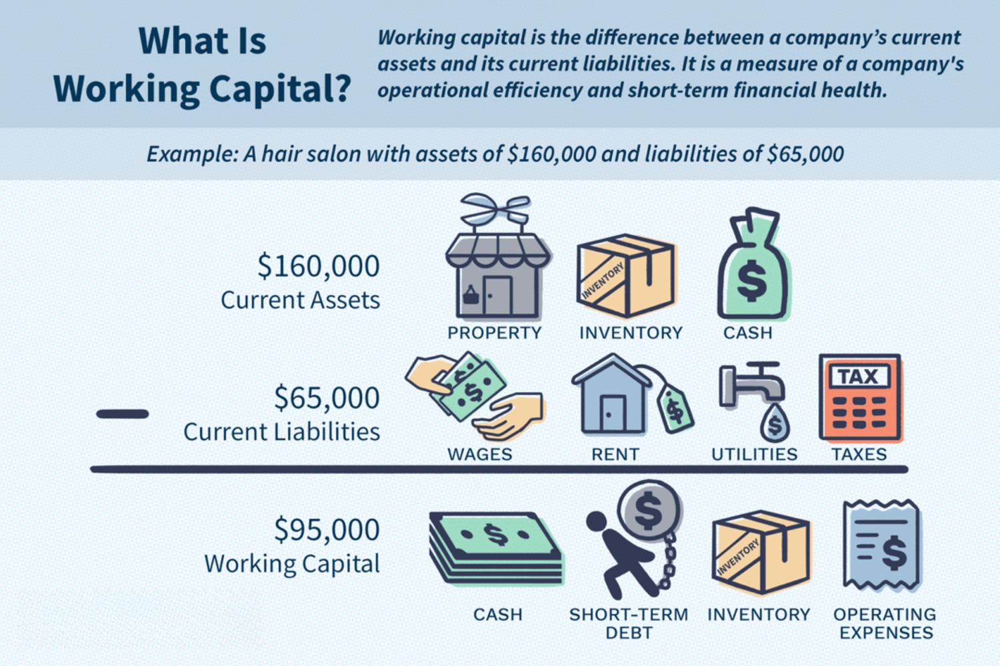

The intersection of finance and technology has significantly transformed the way businesses handle their financial and investment activities. This evolution has given rise to a multifaceted field known as business finance, which encompasses various strategies aimed at optimizing cash flow, managing investments, and leveraging technological solutions for trading. 

Fund management, a critical aspect of business finance, involves the strategic oversight and administration of a company's investment portfolios and financial assets. It requires a holistic understanding of financial markets, allowing for informed decision-making to achieve investment goals and risk management.



Understanding working capital is fundamental, as it represents the capital available for day-to-day operations. Calculated as the difference between current assets and current liabilities, effective management of working capital ensures that a business can meet its short-term obligations and continue to invest in operational needs. The formula for calculating working capital is straightforward: 

$$
\text{Working Capital} = \text{Current Assets} - \text{Current Liabilities}
$$

The advent of algorithmic trading has introduced a technological dimension to business finance. By utilizing computer algorithms, businesses can automate trading strategies, aiming for better speed and precision, and minimizing the emotional biases inherent in human trading decisions. This technology plays a crucial role, especially in high-frequency trading environments where rapid execution of trades is essential.

As businesses adopt these financial strategies, they gain the ability to streamline their operations and enhance their competitive edge. The synergy of finance and technology not only aids in optimizing current financial performance but also prepares businesses to adapt to future challenges in an ever-evolving economic landscape. This article will explore these significant components of business finance, providing a comprehensive overview of the tools and techniques that modern businesses use to thrive.

## Table of Contents

## Understanding Business Finance

Business finance is a critical discipline involving the management of a company's financial resources, including cash flow, investments, and overall economic assets. This field ensures that a business can effectively meet its financial obligations, seize investment opportunities, and sustain long-term profitability.

At the core of business finance are several key components:

1. **Working Capital Management**: This involves managing the short-term assets and liabilities of a company. Working capital, calculated as the difference between current assets and current liabilities, is crucial for maintaining liquidity and operational efficiency. By optimizing working capital, businesses can ensure they have enough cash flow to cover day-to-day expenses without compromising their investment potential.
$$
   \text{Working Capital} = \text{Current Assets} - \text{Current Liabilities}

$$

2. **Investment Strategies**: Investment strategy formulation and implementation are vital for deploying financial resources into profitable avenues. Businesses must evaluate numerous investment opportunities, considering factors such as risk tolerance, expected return, and alignment with strategic objectives. Successful investment strategies often require diversification to mitigate risks and leverage market conditions effectively.

3. **Cost Control Measures**: Effective cost control is essential for maintaining financial health and enhancing profit margins. By analyzing expenses and implementing cost-saving initiatives, companies can allocate resources more efficiently, reduce waste, and increase profitability. Budgeting, forecasting, and variance analysis are common techniques used in cost control to monitor and adjust spending according to strategic goals.

In conclusion, understanding and efficiently managing these components of business finance allows organizations to achieve financial stability and growth. By focusing on optimizing cash flow, making informed investment decisions, and controlling costs, businesses can thrive in competitive environments, ensuring sustained operational success and profitability.

## Fund Management in Business Finance

Fund management in business finance involves the meticulous oversight and handling of a company's financial assets and investment portfolios. The process requires strategic decision-making to accomplish specific investment goals while effectively managing associated risks. This strategic framework incorporates several key elements, including asset allocation, risk assessment, and active management, all of which are central to successful fund management.

Asset allocation is a fundamental component, involving the distribution of investments across various asset classes such as equities, bonds, and cash equivalents. The primary objective is to maximize returns while minimizing risk, achieved through diversification—spreading investments to reduce exposure to any single asset's [volatility](/wiki/volatility-trading-strategies).

Successful fund management also demands a profound understanding of the financial markets. It necessitates staying abreast of economic trends and employing investment principles that guide decision-making. A thorough analysis of market conditions allows fund managers to adjust their strategies in response to macroeconomic shifts, such as changes in interest rates, inflation, and economic growth forecasts.

Risk management is integral to fund management. It entails identifying, assessing, and mitigating risks that could impact investment portfolios. Techniques such as stress testing, scenario analysis, and the use of financial derivatives are employed to hedge against potential losses and ensure the resilience of the investment portfolio.

Incorporating technology into fund management has become increasingly vital, with the advent of tools such as [algorithmic trading](/wiki/algorithmic-trading) and financial analytics software. These tools enable more precise and data-driven investment decisions, enhancing the capability of fund managers to achieve their investment goals.

Effective fund management requires a strategic approach characterized by informed decision-making, comprehensive market analysis, and risk mitigation strategies. This framework provides businesses with the ability to optimize financial performance and achieve sustainable growth in a competitive economic environment.

## Working Capital: A Lifeline for Businesses

Working capital is the financial means a company utilizes to support its short-term operational needs. It is a measure of a company's [liquidity](/wiki/liquidity-risk-premium), operational efficiency, and short-term financial health. Working capital is determined by calculating the difference between current assets (such as cash, accounts receivable, and inventory) and current liabilities (like accounts payable, short-term debt, and other obligations due within a year). This can be expressed by the formula:

$$
\text{Working Capital} = \text{Current Assets} - \text{Current Liabilities}
$$

A positive working capital indicates that a company has sufficient assets to cover its short-term liabilities, while a negative working capital suggests potential liquidity issues, implying that the company might struggle to meet its short-term obligations.

Effective working capital management is essential for maintaining a smooth operation and avoiding liquidity crises. By efficiently managing accounts receivable, inventory levels, and accounts payable, businesses can ensure they have adequate cash flow to fund daily operations and unexpected expenses. Companies often employ strategies such as negotiating better payment terms with suppliers, optimizing inventory to avoid overstocking or stockouts, and speeding up the collection of receivables to enhance working capital.

Balancing these elements allows businesses not just to meet their immediate obligations but also to invest in growth opportunities. Effective management of working capital can lead to improved profitability by reducing borrowing costs and capitalizing on vendor discounts. It also represents a company's ability to exploit emerging business opportunities without having to resort to external financing, which can be critical in maintaining competitive advantage.

In summary, working capital acts as the lifeline of a business by ensuring it can operate efficiently and react flexibly to market changes, ultimately contributing to its overall financial stability and success.

## The Role of Algorithmic Trading in Modern Finance

Algorithmic trading, also referred to as automated trading, involves the use of computer algorithms to execute trading strategies with minimal human intervention. By leveraging pre-defined sets of rules and mathematical models, algorithmic trading systems are designed to perform transactions at speeds and frequencies that would be impossible for human traders. The primary goal is to enhance efficiency by maximizing execution speed, minimizing costs, and reducing human error.

One of the key advantages of algorithmic trading is the removal of emotion from decision-making processes. Human traders can often succumb to psychological biases, such as fear or greed, which can negatively impact trading outcomes. Algorithms, however, operate purely on logic and statistical inference, providing consistent and objective execution of strategies.

Algorithmic trading is particularly prevalent in high-frequency trading ([HFT](/wiki/high-frequency-trading-strategies)) environments. In these settings, the capacity to execute thousands of orders in fractions of a second is crucial. The algorithms employed assess a multitude of market conditions, including price, timing, and [volume](/wiki/volume-trading-strategy) simultaneously. They utilize complex formulas and can be programmed to perform tasks ranging from basic order execution to sophisticated strategies, such as [arbitrage](/wiki/arbitrage), market-making, or trend-following.

Let's consider a simple example of a moving average crossover strategy, which is commonly used in algorithmic trading:

```python
import pandas as pd
import numpy as np

# Function to calculate moving average
def moving_average(data, window_size):
    return data.rolling(window=window_size).mean()

# Sample historical stock price data
data = pd.Series([100, 102, 101, 105, 110, 108, 112, 115, 113, 116])

# Calculate moving averages with different window sizes
short_window = moving_average(data, 3)
long_window = moving_average(data, 5)

# Generate buy/sell signals based on moving average crossover
signals = np.where(short_window > long_window, 1, 0)
```

In this example, the algorithm calculates short-term and long-term moving averages of stock prices. When the short-term average crosses above the long-term average, a buy signal is generated, indicative of a potential upward trend. Conversely, when the short-term average crosses below the long-term average, a sell signal is indicated.

The employment of such strategies in HFT allows traders to capitalize on minute price discrepancies across different market platforms, often only lasting for milliseconds. Algorithmic trading's widespread adoption has profoundly transformed financial markets, making them more efficient and liquid. However, it also requires robust technological infrastructure and constant monitoring due to the complexities and risks associated with system failures or unexpected market reactions.

## Benefits and Challenges of Algorithmic Trading

Algorithmic trading has become an integral part of modern financial markets, offering numerous benefits that can enhance trading efficiency and effectiveness. One of its primary advantages is the reduction of transaction costs. By automating trading strategies, algorithmic systems can execute trades more efficiently than human traders, minimizing the costs associated with manual processing. This financial efficiency is crucial for businesses looking to maximize their investment returns.

Another significant benefit of algorithmic trading is the improvement in execution speed. Automated systems are capable of processing vast amounts of market data and executing trades in real time, which is particularly advantageous in fast-paced, high-frequency trading environments. This swift execution allows traders to capitalize on fleeting market opportunities and price discrepancies that human traders might miss.

Furthermore, algorithmic trading provides the capacity to exploit market inefficiencies, which are temporary and often small pricing errors in financial markets. Algorithms are designed to recognize these inefficiencies and execute trades that profit from them, enhancing the potential for financial gain.

However, along with these benefits come several challenges. Technological failures are a significant concern, as they can lead to unintended trading losses. Systems must be robust, with fail-safes in place to prevent or mitigate such occurrences. Market volatility presents another challenge, as unpredictable market movements can lead to losses if algorithms are not designed to account for sudden changes.

Additionally, there is a continual need for algorithm updates and monitoring. Financial markets are dynamic, and trading strategies must evolve to maintain effectiveness. Algorithms require regular refinement to adapt to new market conditions, trends, and regulatory requirements.

Despite these challenges, when effectively implemented, algorithmic trading can significantly enhance investment outcomes. Traders and institutions that successfully navigate the complexities and invest in robust algorithmic systems can achieve superior performance in managing financial assets. As such, the strategic use of algorithmic trading continues to offer considerable promise for businesses aiming to optimize their trading strategies.

## Integrating Finance and Technology: The Future Outlook

The integration of finance and technology—often referred to as FinTech—is dramatically transforming how businesses approach financial management and trading strategies. One of the most notable advancements is in algorithmic trading, which leverages sophisticated algorithms and high-speed computing to execute trades with precision and reduced latency. This technology is essential for capitalizing on market opportunities that may only exist for fractions of a second. Algorithmic trading systems utilize historical data, statistical analysis, and advanced [machine learning](/wiki/machine-learning) techniques to predict price movements and execute trades automatically. The automation reduces human error and allows for strategies to be tested against historical data before live execution.

In addition to algorithmic trading, technology is revolutionizing fund management. Tools like [artificial intelligence](/wiki/ai-artificial-intelligence) (AI) and blockchain are being deployed to enhance transparency, reduce costs, and improve decision-making processes. AI can analyze vast datasets quickly, offering insights into market trends and investment opportunities that are beyond human capability. Blockchain technology, with its decentralized and immutable ledger, ensures more secure and transparent financial transactions, which can streamline processes like settlement and custody.

Working capital management is another area benefiting from technological advancements. By utilizing data analytics and AI, businesses can optimize cash flow management, predict cash shortages, and enhance liquidity planning. Modern software solutions enable real-time tracking of receivables and payables, helping companies maintain the necessary balance between current assets and liabilities. For instance, predictive analytics can forecast seasonal variations in working capital needs, allowing businesses to plan ahead and secure the necessary funding.

As technology continues to evolve, businesses must adapt by embracing these tools to maintain a competitive edge. The rapid pace of technological advancement necessitates continuous learning and adaptation. Companies that are proactive in integrating technology into their financial operations will be better positioned to harness new opportunities and mitigate emerging risks. To stay competitive, businesses need to invest in skill development and technological infrastructure, ensuring that they are not only updated on current tools but are also capable of innovating new ones.

Overall, the fusion of finance and technology signals a shift towards more efficient, transparent, and strategic business finance management. The ability to leverage new technologies like algorithmic trading and real-time data analytics can significantly streamline operations, improve decision-making, and ultimately drive better financial performance in a rapidly changing economic environment.

## Conclusion

Effective business finance management, encompassing fund management, working capital, and algorithmic trading, is essential for sustaining long-term business success. By strategically governing these elements, organizations can enhance their financial resilience and adaptability.

Fund management involves the careful stewardship of financial assets and investment portfolios. Businesses that excel in fund management can achieve specific investment objectives and effectively navigate risks. This includes understanding financial markets and economic trends, which are critical for optimizing investment strategies.

Working capital management, defined as the difference between current assets and current liabilities, is vital for ensuring that a business can meet its short-term obligations and operational needs. Businesses that maintain adequate working capital can avoid financial distress and capitalize on growth opportunities.

Algorithmic trading introduces a technological edge by using computer algorithms to automate trading strategies, prioritizing speed and precision. This approach minimizes human error and emotion-driven decisions, offering a systematic method to execute trades. In high-frequency trading environments, the swift execution capabilities provided by algorithmic trading are indispensable.

Modern financial strategies and technologies offer businesses the opportunity to optimize their financial performance. By adopting such innovations, companies can better navigate market complexities, maintain competitiveness, and exploit market inefficiencies. However, leveraging these tools requires continuous learning and adaptation. As financial technologies evolve, businesses must stay informed and agile to remain competitive and responsive to emerging challenges.

In conclusion, effective management of finance through fund management, working capital optimization, and algorithmic trading is crucial for achieving and sustaining long-term success. Businesses that embrace these modern financial tools and strategies can enhance their market positioning, optimize operations, and secure their profitability in an ever-changing economic landscape.

## References & Further Reading

[1]: Gelsomino, F., La Regina, M., & Pisati, M. (2020). ["The impact of algorithmic trading on financial markets' efficiency."](https://www.semanticscholar.org/paper/The-(un)sustainable-mix%3A-supply-chain-finance%2C-and-Gelsomino-Riekerink/6c226da983ef813e171ff34c2b0ea19ccfe39364) Quantitative Finance, 20(11), 1867-1888.

[2]: Hull, J. (2018). ["Options, Futures, and Other Derivatives"](https://www.semanticscholar.org/paper/Options%2C-Futures%2C-and-Other-Derivatives-Hull/89bdee500c8623864fc9eb7a471546aa713acc44) (9th ed.). Pearson.

[3]: ["Algorithmic and High-Frequency Trading"](https://www.cambridge.org/us/universitypress/subjects/mathematics/mathematical-finance/algorithmic-and-high-frequency-trading) by Álvaro Cartea, Sebastian Jaimungal, and José Penalva

[4]: Harris, L. (2003). ["Trading and Exchanges: Market Microstructure for Practitioners"](https://academic.oup.com/book/52292) Oxford University Press.

[5]: Bragg, S. (2018). ["Financial Management: Theory & Practice"](https://www.cengage.com/c/financial-management-theory-practice-15e-brigham-ehrhardt/9781305632295/?searchIsbn=978-1-305-63229-5) Cengage Learning.

[6]: Dhanani, A. (2003). ["Working Capital Management: Teaching and Practice."](https://www.bizapedia.com/tx/dhanani-gp-llc.html) Business Review, 5(2), 29-37.

[7]: ["Algorithmic Trading: Winning Strategies and Their Rationale"](https://onlinelibrary.wiley.com/doi/pdf/10.1002/9781118676998.fmatter) by Ernie Chan