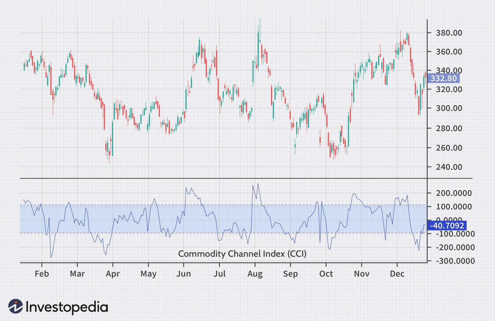

The Commodity Channel Index (CCI) is a well-regarded technical indicator employed by traders to discern cyclical patterns within financial markets. Originally crafted by Donald Lambert in 1980, the CCI was initially intended to scope out trading opportunities in commodities by comparing current price levels with historical averages. Over time, its application has expanded significantly, and it is now routinely used across a broad spectrum of financial markets, including stocks, exchange-traded funds (ETFs), and currencies.

The principal utilization of the CCI involves identifying overbought or oversold conditions of an asset, where overbought typically points to a potential sell signal and oversold, a possible buy opportunity. This is achieved by quantifying the relationship between an asset's price, its moving average, and the normal deviations from that average. The CCI produces values that commonly oscillate between -100 and +100, with movements beyond this range serving as potential indicators of upcoming price reversals.



This article aims to explore various trading strategies that leverage the CCI, with a particular focus on algorithmic trading. Algorithmic trading, which involves automating trading decisions using computer algorithms, can benefit significantly from the inclusion of the CCI. By automating the buy and sell signals dictated by the CCI readings, traders can enhance the efficiency and effectiveness of their trading strategies.

Moreover, the article will delve into the advantages and limitations associated with the CCI, discussing how this indicator can be integrated within broader trading systems to optimize decision-making processes. Through a comprehensive examination of these factors, the article seeks to provide traders with a robust framework for utilizing the CCI effectively in their trading ventures.

## Table of Contents

## Understanding the Commodity Channel Index (CCI)

The Commodity Channel Index (CCI) serves as a technical indicator designed to identify cyclical trends within financial markets. It is classified as an oscillator, quantifying the relationship between an asset's price, its moving average, and deviations from that average. By measuring the difference between a security's price change and its average price change, the CCI provides traders with an indication of the market's momentum.

Typically, the CCI oscillates between -100 and +100. When the indicator moves above +100, it suggests that the asset is potentially overbought, indicating a possible downward correction or trend reversal. Conversely, when the CCI falls below -100, it signals that the asset may be oversold, hinting at a possible upward correction or trend reversal.

The CCI was introduced by Donald Lambert in 1980, with the primary goal of forecasting market trends through the comparison of current price levels against historical averages. Lambert's objective was to provide traders with a reliable tool to understand whether an asset was exhibiting unusual strength or weakness over a specified period.

To calculate the CCI, traders follow these steps:

1. **Typical Price (TP)**: Calculate the typical price for each period. The typical price is the average of the high, low, and close prices:
$$
   TP = \frac{(High + Low + Close)}{3}

$$

2. **Simple Moving Average (SMA)**: Compute the simple moving average of the typical price over a chosen number of periods (n):
$$
   SMA = \frac{\sum TP}{n}

$$

3. **Mean Deviation (MD)**: Compute the mean deviation from the SMA:
$$
   MD = \frac{\sum |TP - SMA|}{n}

$$

4. **CCI Formula**: Finally, calculate the CCI using the formula:
$$
   CCI = \frac{(TP - SMA)}{0.015 \times MD}

$$

The [factor](/wiki/factor-investing) of 0.015 is used to ensure that approximately 70-80% of the CCI values lie within the -100 to +100 range, aiding in the identification of potential market conditions. The choice of period length (n) for the SMA significantly influences the sensitivity and responsiveness of the CCI, with shorter periods offering increased sensitivity at the cost of potential false signals and vice versa.

The CCI's ability to capture deviations from an asset's trading norm makes it a valuable tool across various markets, giving traders insight into potential entry and [exit](/wiki/exit-strategy) points by highlighting overbought or oversold conditions.

## Setting Up CCI in Algorithmic Trading

Algorithmic trading utilizes the Commodity Channel Index (CCI) by automating buy and sell signals based on its readings. This automation hinges on the CCI’s ability to highlight periods of potential overbought or oversold conditions, making it a valuable tool for traders seeking to capitalize on cyclical market trends.

### Optimal CCI Calculation Period 
Selecting the optimal period for calculating the CCI is essential and directly influences the accuracy and reliability of the trading signals generated. The CCI is computed as follows:

$$
CCI = \frac{{\text{Typical Price} - \text{SMA}}}{{0.015 \times \text{Mean Deviation}}}
$$

where the Typical Price is the average of the high, low, and close prices, the SMA is the Simple Moving Average of the Typical Price, and the Mean Deviation is the average of the absolute deviations from the SMA over a set period. Traders often experiment with different periods, such as 14, 20, or even 50 days, depending on the asset class and trading strategy, to align with market volatilities and their own risk tolerance.

### Importance of Backtesting
Backtesting is an essential step in assessing the performance of a CCI-based strategy. It involves applying the strategy to historical market data to understand its potential effectiveness and risks. By analyzing key metrics like drawdowns, profit factors, and win-loss ratios, traders can refine their strategies, ensuring they perform robustly under various market conditions. This process helps in optimizing parameters, such as adjusting the CCI period, thereby enhancing the predictive power of the trading signals.

### Python Libraries for CCI Computation and Backtesting
Python offers powerful libraries such as pandas and [backtrader](/wiki/backtrader), which facilitate the computation and [backtesting](/wiki/backtesting) of CCI strategies. Using pandas, traders can efficiently calculate the CCI:

```python
import pandas as pd

def calculate_cci(data, period):
    data['TP'] = (data['High'] + data['Low'] + data['Close']) / 3
    data['SMA'] = data['TP'].rolling(window=period).mean()
    data['Mean Deviation'] = data['TP'].rolling(window=period).apply(lambda x: (abs(x - x.mean())).mean())
    data['CCI'] = (data['TP'] - data['SMA']) / (0.015 * data['Mean Deviation'])
    return data['CCI']

# Example usage
# Assuming 'df' is a pandas DataFrame with columns 'High', 'Low', 'Close'
cci = calculate_cci(df, 20)
```

Backtrader can be utilized for backtesting, allowing traders to simulate their strategies and optimize performance:

```python
import backtrader as bt

class CciStrategy(bt.Strategy):
    params = dict(period=20)

    def __init__(self):
        self.cci = bt.indicators.CommodityChannelIndex(self.data, period=self.params.period)

    def next(self):
        if self.cci > 100:
            if not self.position:
                self.buy()
        elif self.cci < -100:
            if self.position:
                self.sell()

cerebro = bt.Cerebro()
cerebro.addstrategy(CciStrategy)
# Add data feed, configure broker, etc.
cerebro.run()
```

By integrating these tools, traders can automate the execution of their strategies, maintain consistent performance, and adapt to evolving market conditions. In conclusion, the effective setup of the CCI in [algorithmic trading](/wiki/algorithmic-trading) requires careful period selection, thorough backtesting, and proficient use of computational tools, all of which contribute to enhanced trading outcomes.

## Strategies Utilizing the CCI Indicator

The Commodity Channel Index (CCI) is a versatile technical indicator enabling traders to apply various strategies based on market conditions. Among the most prominent CCI-based strategies are [trend following](/wiki/trend-following), mean reversion, and divergence strategies. Each strategy exploits different aspects of market behavior and requires specific implementations and considerations.

### Trend Following with CCI

Trend following is a widely-used strategy that leverages the CCI's ability to indicate the strength and direction of price movements. In this approach, traders interpret CCI readings above +100 as a signal of a strong bullish trend, prompting them to enter long positions. Conversely, CCI readings below -100 suggest a bearish trend, signaling traders to consider short positions. The effectiveness of this strategy relies on identifying sustained trends rather than short-term price fluctuations. 

To implement this in algorithmic trading using Python, traders can utilize libraries such as pandas for data operations and backtrader for strategy execution. Here is a simple Python code snippet outlining a trend following strategy using CCI:

```python
import pandas as pd
import backtrader as bt

class CCIStrategy(bt.Strategy):
    def __init__(self):
        self.cci = bt.indicators.CommodityChannelIndex(period=20)

    def next(self):
        if self.cci > 100:
            self.buy()
        elif self.cci < -100:
            self.sell()

# Assuming `data` is a pandas DataFrame with historical price data
cerebro = bt.Cerebro()
cerebro.addstrategy(CCIStrategy)
cerebro.adddata(bt.feeds.PandasData(dataname=data))
cerebro.run()
```

### Mean Reversion

The mean reversion strategy capitalizes on the assumption that asset prices tend to revert to their historical averages over time. This approach involves buying when the CCI indicates strong oversold conditions (typically when the CCI is below -100) and selling when the CCI suggests overbought conditions (generally above +100). The strategy aims to profit from market corrections as prices adjust back to their mean.

Successful implementation requires robust risk management and an understanding of market [volatility](/wiki/volatility-trading-strategies), as deviations from the mean may continue longer than anticipated. Optimizing the period parameter for the CCI and adjusting thresholds based on backtested performance can enhance strategy reliability.

### Divergence

Divergence strategies focus on discrepancies between CCI readings and price movements, which can signal potential market reversals. Bullish divergence occurs when prices form lower lows while the CCI forms higher lows, suggesting a potential upward reversal. Bearish divergence is identified when prices make higher highs but the CCI registers lower highs, indicating a possible downward reversal.

Identifying divergence requires skill and experience, as it may not always lead to immediate reversals. Therefore, traders often combine divergence detection with other indicators or confirmatory signals to increase accuracy.

In summary, CCI-based trading strategies require careful optimization and testing to align with specific market conditions and trader objectives. Employing statistical techniques and backtesting frameworks can refine these strategies, ensuring their robustness and adaptability in dynamic trading environments.

## Advantages and Limitations of the CCI Indicator

The Commodity Channel Index (CCI) is a widely utilized technical indicator in trading due to its versatility across various markets, including commodities, stocks, and [forex](/wiki/forex-system). One of the primary advantages of the CCI is its ability to provide clear entry and exit points. By highlighting overbought and oversold conditions, traders can make informed decisions about when to enter or exit a trade. These conditions are typically signaled when the CCI moves beyond a specific threshold, commonly +100 for overbought and -100 for oversold. 

Despite its utility, the CCI is not without limitations. As a lagging indicator, it reacts to past price movements, which may result in delayed signals. This delay can be problematic in volatile or non-trending markets, where prices may change quickly and unpredictably. In such scenarios, the CCI may generate false signals, leading to potential losses if traders act on them without additional confirmation.

To mitigate the risk of false signals, traders often pair the CCI with other indicators. Combining it with moving averages can help smooth out price data, providing a clearer picture of the underlying trend. Using the Relative Strength Index (RSI) alongside the CCI is another common approach. The RSI, which measures the speed and change of price movements, can offer additional insights into the strength of a trend. By confirming CCI signals with RSI readings, traders can enhance the predictive power of their strategies, reducing the likelihood of entering or exiting trades based on erroneous information. 

Ultimately, while the Commodity Channel Index offers distinct advantages, its effective use requires understanding its limitations and strategic integration with complementary indicators.

## Backtesting CCI Strategies

Backtesting CCI strategies involves applying the Commodity Channel Index (CCI) indicator to historical market data to assess the potential performance of trading strategies. This process is crucial in refining and validating strategies before applying them in live trading environments.

A fundamental aspect of backtesting is the analysis of key metrics. Drawdowns, which measure the peak-to-trough decline during a specific period, are critical for understanding the risk exposure of a strategy. The profit factor, defined as the ratio of gross profits to gross losses, assesses the profitability of a strategy. A profit factor greater than 1 indicates a profitable strategy, while values below 1 suggest losses. Additionally, the win-loss ratio, which calculates the number of profitable trades relative to unprofitable ones, provides further insight into the strategy's effectiveness.

Using backtesting frameworks, such as `backtrader` in Python, facilitates the automation and analysis of CCI strategies. These frameworks help in optimizing strategy parameters to improve performance metrics. For instance, varying the CCI period length can significantly impact the outcomes, and backtesting allows traders to determine the optimal settings. Optimization also involves minimizing the risk of overfitting, which occurs when a strategy performs exceptionally well on historical data but fails to generalize to unseen data. Cross-validation techniques can be employed to mitigate these risks, ensuring that the strategy's success is not merely a result of chance but rather a reflection of its robustness.

In practice, setting up a backtesting environment involves importing historical data, defining trading rules based on CCI signals, and computing performance metrics. Here's a simple example using Python and `backtrader`:

```python
import backtrader as bt
import datetime

class CCIStrategy(bt.Strategy):
    params = (('cci_period', 14), )

    def __init__(self):
        self.cci = bt.indicators.CommodityChannelIndex(self.data, period=self.params.cci_period)

    def next(self):
        if self.cci > 100 and not self.position:
            self.buy()
        elif self.cci < -100 and self.position:
            self.sell()

data = bt.feeds.YahooFinanceData(dataname='AAPL',
                                 fromdate=datetime.datetime(2020, 1, 1),
                                 todate=datetime.datetime(2021, 1, 1))
cerebro = bt.Cerebro()
cerebro.addstrategy(CCIStrategy)
cerebro.adddata(data)
cerebro.run()
```

This code sets up a simple strategy that generates buy signals when the CCI exceeds 100 and sell signals when it falls below -100, using historical data for Apple Inc. (`AAPL`) over the year 2020. By running this backtest, traders can evaluate the strategy's performance metrics and make informed adjustments for improved results.

## Conclusion

The Commodity Channel Index (CCI) is a valuable tool for traders looking to discern market trends and make informed trading decisions. Its utility spans across various markets, including commodities, stocks, and forex, offering traders the ability to pinpoint potential buy and sell signals based on overbought or oversold conditions. By identifying these conditions, traders can better time their entry and exit points, enhancing their chances of capitalizing on market movements.

Integrating the CCI into algorithmic trading systems necessitates a thorough understanding of its mechanics. Traders must not only comprehend how to calculate and interpret the CCI but also develop thoughtful strategies that align with specific market conditions. Successful application within an algorithmic framework often involves automating buy and sell actions driven by CCI readings. This automation can improve trading efficiency and reduce human error, but it also requires meticulous parameter setting and strategy testing. Python, with its libraries such as pandas and backtrader, serves as a powerful tool for calculating the CCI and backtesting strategies to evaluate their potential effectiveness.

While the CCI offers distinct advantages, its implementation in trading systems also highlights the importance of comprehensive risk management. Being a lagging indicator, the CCI can produce false signals, particularly in volatile or non-trending markets. Therefore, reliance solely on the CCI without considering other market factors can lead to suboptimal trading outcomes. To mitigate such risks, traders often combine the CCI with other technical indicators, such as moving averages or the Relative Strength Index (RSI), enhancing its predictive power.

Moreover, successful trading strategies require ongoing refinement. Market conditions are dynamic, and strategies that perform well in one market environment may not be as effective in another. Consequently, continuous testing and adjustment of the CCI-based strategies are crucial for maintaining their relevance and performance. By regularly backtesting strategies against historical data and analyzing key metrics like drawdowns and profit factors, traders can optimize their approach, reducing the likelihood of overfitting and improving long-term trading success.

In summary, while the CCI is a valuable indicator for capturing market trends, integrating it effectively into trading systems demands a well-rounded approach, incorporating strategic development, comprehensive risk management, and consistent strategy refinement.

## References & Further Reading

Lambert, D. R. (1980). "The Commodity Channel Index: Tools for Trading Cycles." Commodities (August issue), 62-64. This paper is a seminal work by Donald Lambert, introducing the Commodity Channel Index (CCI) as a tool for identifying cyclical trends in commodity trading. It forms the foundation for understanding CCI calculation and application in various financial markets.

Murphy, J. J. (1999). "Technical Analysis of the Financial Markets: A Comprehensive Guide to Trading Methods and Applications." This comprehensive guide provides an extensive overview of technical analysis, including the use of CCI alongside other indicators. It is widely regarded as an essential reference for traders and analysts seeking to understand and apply technical analysis effectively.

Pring, M. J. (2002). "Technical Analysis Explained". This book offers an in-depth explanation of technical analysis concepts, with a focus on practical applications. It covers a wide array of technical indicators, including the CCI, providing insights into their use in various trading strategies.

Jansen, Stefan. (2021). "Machine Learning for Algorithmic Trading: Predictive models to extract signals from market and [alternative data](/wiki/best-alternative-data) for systematic trading strategies with Python". This resource bridges the gap between [machine learning](/wiki/machine-learning) and algorithmic trading. It includes techniques for implementing CCI-based strategies using Python, showcasing how machine learning can enhance traditional technical analysis methods.

Kaufman, P. J. (2013). "Trading Systems and Methods", Wiley Trading. Kaufman's work is a comprehensive resource for developing and testing trading systems. It provides detailed explanations of various technical indicators, including the CCI, and offers guidance on integrating these tools into systematic trading strategies.

