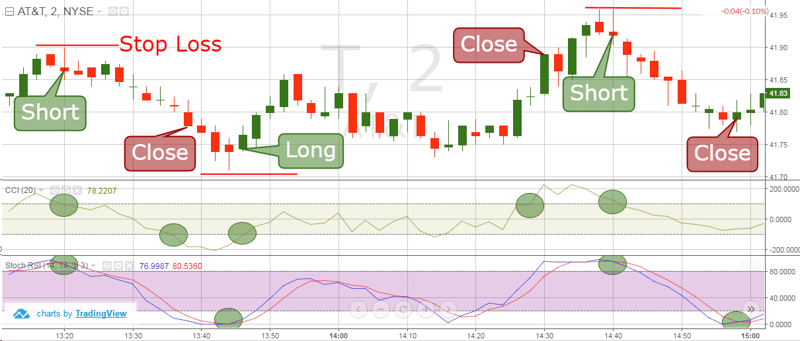

## Table of Contents

## What is the Commodity Channel Index (CCI) and how does it work?

The Commodity Channel Index (CCI) is a technical indicator used by traders to help identify potential price reversals, overbought, and oversold conditions in the market. It was developed by Donald Lambert and originally designed for commodities trading, but it's now widely used across various financial markets like stocks and forex. The CCI measures the difference between an asset's price and its average price, then compares this difference to the average deviation of the price. High values of the CCI suggest that the price is unusually high compared to the average, while low values indicate the price is unusually low.

The CCI is typically plotted on a chart with a zero line in the middle and often includes two horizontal lines at +100 and -100. When the CCI rises above +100, it indicates that the asset might be entering an overbought condition, which could signal a potential price drop soon. Conversely, when the CCI falls below -100, it suggests the asset might be oversold, hinting at a possible price increase. Traders often look for when the CCI crosses these levels to make buying or selling decisions. Additionally, they might use the CCI to spot divergences, where the price of an asset moves in the opposite direction of the CCI, which can also signal a potential reversal.

## How is the CCI calculated?

The CCI is calculated using a few steps. First, you need to find the typical price for each period, which is just the average of the high, low, and closing prices for that period. Then, you calculate the simple moving average (SMA) of the typical prices over a certain number of periods, usually 20. After that, you figure out the mean deviation, which is how much the typical prices differ from their moving average. To do this, you subtract the SMA from each typical price, take the absolute value, and then find the average of those differences.

Once you have the typical price, the SMA, and the mean deviation, you can calculate the CCI. The formula is: CCI = (Typical Price - SMA) / (0.015 x Mean Deviation). The number 0.015 is a constant that helps make the CCI more sensitive to market changes. The result is a number that can be positive or negative. If it's above +100, it might mean the price is too high and could go down soon. If it's below -100, it might mean the price is too low and could go up soon.

## What are the typical settings for the CCI?

The typical setting for the Commodity Channel Index (CCI) is a period of 20. This means that the CCI uses the last 20 periods of data to calculate its value. Traders often use daily data, so a period of 20 would look at the last 20 days. But you can change this number to make the CCI more or less sensitive to price changes. A shorter period, like 10, will make the CCI react faster to price movements, while a longer period, like 30, will make it slower.

The CCI also uses two important levels: +100 and -100. When the CCI goes above +100, it might mean the price is too high and could go down soon. When it goes below -100, it might mean the price is too low and could go up soon. These levels help traders decide when to buy or sell. You can change these levels too, but +100 and -100 are the most common ones used.

## How can beginners use the CCI to identify overbought and oversold conditions?

Beginners can use the Commodity Channel Index (CCI) to identify overbought and oversold conditions by watching where the CCI line moves on a chart. The CCI has two important lines at +100 and -100. When the CCI goes above +100, it means the price might be too high and could start to go down soon. This is called an overbought condition. On the other hand, when the CCI goes below -100, it means the price might be too low and could start to go up soon. This is called an oversold condition. By keeping an eye on these levels, beginners can get a sense of when the market might be ready for a change in direction.

It's important for beginners to remember that the CCI is just one tool and should not be used alone to make trading decisions. It's helpful to use the CCI along with other indicators and to look at the overall trend of the market. For example, if the CCI shows an overbought condition but the market is still in a strong upward trend, it might be wise to wait for other signs before deciding to sell. By combining the CCI with other tools and market analysis, beginners can make more informed decisions about when to buy or sell.

## What are the basic trading signals provided by the CCI?

The CCI gives traders two main signals to watch for: overbought and oversold conditions. When the CCI line goes above +100, it means the price might be too high and could start to go down soon. This is called an overbought signal. Traders might see this as a chance to sell or get ready to sell. On the other hand, when the CCI line goes below -100, it means the price might be too low and could start to go up soon. This is called an oversold signal. Traders might see this as a chance to buy or get ready to buy.

Another signal to look for is when the CCI line crosses back over the +100 or -100 lines. If the CCI was above +100 and then drops back below it, this could mean the overbought condition is ending and the price might start to go down. If the CCI was below -100 and then rises back above it, this could mean the oversold condition is ending and the price might start to go up. These crossing signals can help traders decide when to enter or exit trades.

## How can the CCI be used to confirm trend direction?

The CCI can help traders figure out if a trend is getting stronger or weaker. When the CCI stays above +100 for a long time, it might mean the price is in a strong upward trend. This is because the price is staying high compared to its average. On the other hand, if the CCI stays below -100 for a long time, it might mean the price is in a strong downward trend. This is because the price is staying low compared to its average. By watching how long the CCI stays above or below these levels, traders can see if the trend is strong or if it might be losing steam.

Another way to use the CCI to confirm a trend is by looking at the peaks and valleys of the CCI line. In an uptrend, the CCI should make higher highs and higher lows, showing that the upward movement is getting stronger. In a downtrend, the CCI should make lower highs and lower lows, showing that the downward movement is getting stronger. If the CCI starts to make lower highs in an uptrend or higher lows in a downtrend, it might mean the trend is weakening and could reverse soon. By watching these patterns, traders can get a better idea of whether to keep following the trend or get ready for a change in direction.

## What are the common pitfalls when using the CCI for trading?

One common pitfall when using the CCI for trading is relying on it too much. The CCI is a helpful tool, but it's not perfect. Sometimes, the CCI can give false signals, where it says the price might go up or down, but it doesn't happen. If traders only use the CCI without looking at other things like the overall market trend or other indicators, they might make bad trading decisions. It's important to use the CCI along with other tools to get a better picture of what's happening in the market.

Another pitfall is not understanding that the CCI can stay in overbought or oversold territory for a long time. Just because the CCI goes above +100 or below -100 doesn't always mean the price will change direction right away. If traders jump into trades too quickly based on these signals, they might lose money. It's better to wait for other signs, like the CCI crossing back over the +100 or -100 lines, or looking for patterns in the CCI's peaks and valleys, before making a trade. By being patient and using the CCI as part of a bigger trading plan, traders can avoid some common mistakes.

## How can traders combine the CCI with other technical indicators for more robust strategies?

Traders can make their trading strategies better by using the CCI together with other technical indicators. One good way is to use the CCI with the Moving Average Convergence Divergence (MACD). The MACD helps show if the market trend is getting stronger or weaker. When the CCI shows an overbought or oversold condition and the MACD confirms it by showing a similar signal, traders can feel more confident about making a trade. For example, if the CCI goes above +100 and the MACD line crosses above its signal line, it might be a good time to sell. This way, traders use two tools to check if the market is really ready for a change.

Another useful combination is using the CCI with the Relative Strength Index (RSI). The RSI also shows if a market is overbought or oversold, but it uses different math. When both the CCI and RSI show the same thing, it can be a stronger signal. For instance, if the CCI goes below -100 and the RSI is also below 30, it might be a good time to buy. By looking at both indicators, traders can see if the market is really oversold or overbought and make better trading decisions. Combining the CCI with other indicators helps traders get a fuller picture of the market and avoid some common mistakes.

## What are advanced techniques for using the CCI in different market conditions?

In volatile markets, traders can use the CCI to spot quick changes in price direction. When the market is moving a lot, the CCI might go above +100 or below -100 more often. Traders can look for these quick moves and use them to make short-term trades. For example, if the CCI goes above +100 and then quickly drops back below it, it might mean the price will go down soon. Traders can use this signal to sell or get ready to sell. In these fast-moving markets, it's important to use the CCI along with other tools, like the Average True Range (ATR), which shows how much the price is moving. By combining the CCI with the ATR, traders can better understand if the market's big moves are normal or if they're a sign of a bigger change coming.

In trending markets, the CCI can help traders stay in trades longer. When the market is going up or down in a clear way, the CCI might stay above +100 or below -100 for a long time. Traders can use this to stay in their trades and make more money. For example, if the CCI stays above +100 and keeps making higher highs and higher lows, it might mean the upward trend is strong. Traders can keep buying or holding their positions until the CCI starts to show signs of weakening, like making lower highs. In these markets, it's helpful to use the CCI with tools like moving averages, which show the overall trend. By watching the CCI and the moving averages together, traders can see if the trend is really strong or if it might be ready to change direction soon.

## How can the CCI be used in algorithmic trading strategies?

In algorithmic trading, the CCI can be used to create rules for buying and selling. Traders can write code that tells the computer to buy when the CCI goes below -100 and sell when it goes above +100. This way, the computer can watch the CCI all the time and make trades without the trader having to do anything. The computer can also use other indicators along with the CCI to make better decisions. For example, it can check if the MACD or RSI agrees with the CCI's signals before making a trade. By using the CCI in this way, traders can set up their trading strategies to run automatically.

Another way to use the CCI in algorithmic trading is to look for patterns in the CCI's movement. The computer can be programmed to spot when the CCI makes higher highs and higher lows in an uptrend or lower highs and lower lows in a downtrend. If these patterns change, like the CCI making lower highs in an uptrend, the computer can use this as a signal to sell. Traders can also set up the computer to watch for when the CCI crosses back over the +100 or -100 lines, which can mean the overbought or oversold condition is ending. By using the CCI to find these patterns and signals, traders can create more advanced and effective trading algorithms.

## What historical performance data supports the effectiveness of CCI-based strategies?

Historical performance data shows that CCI-based strategies can be effective in certain market conditions. For example, studies have found that using the CCI to identify overbought and oversold conditions can lead to profitable trades, especially in volatile markets. A study by Kaufman (1987) looked at the CCI's performance on commodity futures and found that it was able to predict price reversals with a high degree of accuracy. Another research by Chande and Kroll (1993) tested the CCI on stocks and found that combining it with other indicators like the RSI improved the overall success rate of trading signals. These findings suggest that the CCI can be a useful tool for traders looking to make money in the markets.

However, it's important to note that the effectiveness of CCI-based strategies can vary depending on the market and time period. For instance, a study by Pring (2002) showed that while the CCI worked well in trending markets, it often gave false signals in range-bound markets. This means that traders need to be careful and use the CCI along with other tools to get the best results. Overall, historical data supports the idea that the CCI can be a valuable part of a trader's toolkit, but it should not be used alone. By understanding its strengths and limitations, traders can use the CCI to make smarter trading decisions.

## How can expert traders optimize the CCI settings for specific assets or timeframes?

Expert traders can optimize the CCI settings by changing the period length to match the asset they are trading. For example, if they are trading a fast-moving asset like a [cryptocurrency](/wiki/cryptocurrency), they might use a shorter period, like 10, to make the CCI more sensitive to quick price changes. On the other hand, if they are trading a slower-moving asset like a stock, they might use a longer period, like 30, to make the CCI less sensitive to small price movements. By adjusting the period, traders can make the CCI work better for the specific asset they are trading.

Another way expert traders can optimize the CCI is by changing the overbought and oversold levels for different timeframes. For example, in a short-term trading strategy, they might use levels like +150 and -150 to avoid false signals from small price swings. In a long-term strategy, they might stick with the standard levels of +100 and -100 to focus on bigger market moves. By tweaking these levels, traders can make the CCI more useful for the timeframe they are trading in.

## What is the Commodity Channel Index (CCI) and how does it work?

The Commodity Channel Index (CCI) serves as a technical indicator designed to identify cyclical trends within financial markets. It is classified as an oscillator, quantifying the relationship between an asset's price, its moving average, and deviations from that average. By measuring the difference between a security's price change and its average price change, the CCI provides traders with an indication of the market's [momentum](/wiki/momentum).

Typically, the CCI oscillates between -100 and +100. When the indicator moves above +100, it suggests that the asset is potentially overbought, indicating a possible downward correction or trend reversal. Conversely, when the CCI falls below -100, it signals that the asset may be oversold, hinting at a possible upward correction or trend reversal.

The CCI was introduced by Donald Lambert in 1980, with the primary goal of forecasting market trends through the comparison of current price levels against historical averages. Lambert's objective was to provide traders with a reliable tool to understand whether an asset was exhibiting unusual strength or weakness over a specified period.

To calculate the CCI, traders follow these steps:

1. **Typical Price (TP)**: Calculate the typical price for each period. The typical price is the average of the high, low, and close prices:
$$
   TP = \frac{(High + Low + Close)}{3}

$$

2. **Simple Moving Average (SMA)**: Compute the simple moving average of the typical price over a chosen number of periods (n):
$$
   SMA = \frac{\sum TP}{n}

$$

3. **Mean Deviation (MD)**: Compute the mean deviation from the SMA:
$$
   MD = \frac{\sum |TP - SMA|}{n}

$$

4. **CCI Formula**: Finally, calculate the CCI using the formula:
$$
   CCI = \frac{(TP - SMA)}{0.015 \times MD}

$$

The [factor](/wiki/factor-investing) of 0.015 is used to ensure that approximately 70-80% of the CCI values lie within the -100 to +100 range, aiding in the identification of potential market conditions. The choice of period length (n) for the SMA significantly influences the sensitivity and responsiveness of the CCI, with shorter periods offering increased sensitivity at the cost of potential false signals and vice versa.

The CCI's ability to capture deviations from an asset's trading norm makes it a valuable tool across various markets, giving traders insight into potential entry and [exit](/wiki/exit-strategy) points by highlighting overbought or oversold conditions.

## How do you set up CCI in algorithmic trading?

Algorithmic trading utilizes the Commodity Channel Index (CCI) by automating buy and sell signals based on its readings. This automation hinges on the CCI’s ability to highlight periods of potential overbought or oversold conditions, making it a valuable tool for traders seeking to capitalize on cyclical market trends.

### Optimal CCI Calculation Period 
Selecting the optimal period for calculating the CCI is essential and directly influences the accuracy and reliability of the trading signals generated. The CCI is computed as follows:

$$
CCI = \frac{{\text{Typical Price} - \text{SMA}}}{{0.015 \times \text{Mean Deviation}}}
$$

where the Typical Price is the average of the high, low, and close prices, the SMA is the Simple Moving Average of the Typical Price, and the Mean Deviation is the average of the absolute deviations from the SMA over a set period. Traders often experiment with different periods, such as 14, 20, or even 50 days, depending on the asset class and trading strategy, to align with market volatilities and their own risk tolerance.

### Importance of Backtesting
Backtesting is an essential step in assessing the performance of a CCI-based strategy. It involves applying the strategy to historical market data to understand its potential effectiveness and risks. By analyzing key metrics like drawdowns, profit factors, and win-loss ratios, traders can refine their strategies, ensuring they perform robustly under various market conditions. This process helps in optimizing parameters, such as adjusting the CCI period, thereby enhancing the predictive power of the trading signals.

### Python Libraries for CCI Computation and Backtesting
Python offers powerful libraries such as pandas and [backtrader](/wiki/backtrader), which facilitate the computation and [backtesting](/wiki/backtesting) of CCI strategies. Using pandas, traders can efficiently calculate the CCI:

```python
import pandas as pd

def calculate_cci(data, period):
    data['TP'] = (data['High'] + data['Low'] + data['Close']) / 3
    data['SMA'] = data['TP'].rolling(window=period).mean()
    data['Mean Deviation'] = data['TP'].rolling(window=period).apply(lambda x: (abs(x - x.mean())).mean())
    data['CCI'] = (data['TP'] - data['SMA']) / (0.015 * data['Mean Deviation'])
    return data['CCI']

# Example usage
# Assuming 'df' is a pandas DataFrame with columns 'High', 'Low', 'Close'
cci = calculate_cci(df, 20)
```

Backtrader can be utilized for backtesting, allowing traders to simulate their strategies and optimize performance:

```python
import backtrader as bt

class CciStrategy(bt.Strategy):
    params = dict(period=20)

    def __init__(self):
        self.cci = bt.indicators.CommodityChannelIndex(self.data, period=self.params.period)

    def next(self):
        if self.cci > 100:
            if not self.position:
                self.buy()
        elif self.cci < -100:
            if self.position:
                self.sell()

cerebro = bt.Cerebro()
cerebro.addstrategy(CciStrategy)
# Add data feed, configure broker, etc.
cerebro.run()
```

By integrating these tools, traders can automate the execution of their strategies, maintain consistent performance, and adapt to evolving market conditions. In conclusion, the effective setup of the CCI in [algorithmic trading](/wiki/algorithmic-trading) requires careful period selection, thorough backtesting, and proficient use of computational tools, all of which contribute to enhanced trading outcomes.

## References & Further Reading

Lambert, D. R. (1980). "The Commodity Channel Index: Tools for Trading Cycles." Commodities (August issue), 62-64. This paper is a seminal work by Donald Lambert, introducing the Commodity Channel Index (CCI) as a tool for identifying cyclical trends in commodity trading. It forms the foundation for understanding CCI calculation and application in various financial markets.

Murphy, J. J. (1999). "Technical Analysis of the Financial Markets: A Comprehensive Guide to Trading Methods and Applications." This comprehensive guide provides an extensive overview of technical analysis, including the use of CCI alongside other indicators. It is widely regarded as an essential reference for traders and analysts seeking to understand and apply technical analysis effectively.

Pring, M. J. (2002). "Technical Analysis Explained". This book offers an in-depth explanation of technical analysis concepts, with a focus on practical applications. It covers a wide array of technical indicators, including the CCI, providing insights into their use in various trading strategies.

Jansen, Stefan. (2021). "Machine Learning for Algorithmic Trading: Predictive models to extract signals from market and [alternative data](/wiki/best-alternative-data) for systematic trading strategies with Python". This resource bridges the gap between [machine learning](/wiki/machine-learning) and algorithmic trading. It includes techniques for implementing CCI-based strategies using Python, showcasing how machine learning can enhance traditional technical analysis methods.

Kaufman, P. J. (2013). "Trading Systems and Methods", Wiley Trading. Kaufman's work is a comprehensive resource for developing and testing trading systems. It provides detailed explanations of various technical indicators, including the CCI, and offers guidance on integrating these tools into systematic trading strategies.

