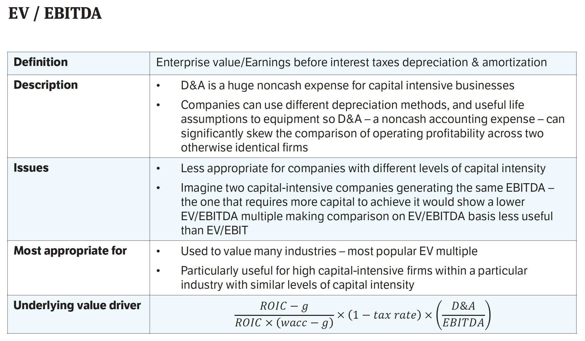

The world of investing is abundant with financial metrics designed to help investors assess company value. Among the most significant are the Price-to-Earnings (P/E) ratio and the EV/EBITDA ratio. These ratios offer deep insights into a company's financial health and its potential as an investment. The P/E ratio provides a snapshot of what the market is willing to pay today for a stock, based on its past or future earnings. This metric serves as a barometer of market sentiment, reflecting expectations of growth and risk. Meanwhile, the EV/EBITDA ratio goes deeper, comparing a company's enterprise value to its earnings before interest, taxes, depreciation, and amortization. It offers a clearer picture of operational profitability, providing investors with a comprehensive assessment that considers the company's debt.

Understanding these metrics is crucial for making informed investment decisions. Investors and traders can leverage these ratios in algorithmic trading, where automated systems are tasked with executing trades based on predefined criteria. By incorporating such financial metrics into their algorithms, traders can swiftly identify opportunities that align with their strategies, potentially gaining an edge in today's competitive and fast-paced financial markets. This article will outline the significance of the P/E and EV/EBITDA ratios, how they can be effectively used in financial analysis, and their application in automated trading platforms, underscoring the importance of these tools in modern investing.



## Table of Contents

## Understanding Price-to-Earnings (P/E) Ratio

The Price-to-Earnings (P/E) ratio remains a key metric for investors when assessing a company's valuation compared to its earnings. Defined by the formula:

$$
\text{P/E Ratio} = \frac{\text{Share Price}}{\text{Earnings Per Share (EPS)}}
$$

this ratio offers a straightforward approach to gauge how much investors are willing to pay per dollar of earnings. Generally, a high P/E ratio might imply that the stock is overvalued, suggesting that investors expect high growth rates in the future. Conversely, a low P/E ratio could indicate that the stock is undervalued or that the company is experiencing difficulties. However, these interpretations can vary widely depending on industry standards and economic contexts.

When comparing companies within the same industry, the P/E ratio provides a more balanced view. Industries have different average P/E ratios due to varying growth potentials and capital requirements. For example, technology companies often showcase higher P/E ratios compared to industries like utilities, which may have more stable but slower growth prospects.

Despite its widespread use, the P/E ratio has notable limitations. One of the primary issues is its dependency on past earnings, which may not accurately represent a company's future performance. Moreover, earnings can be manipulated through accounting practices, leading to misleading P/E ratios. This is why it's essential for investors to critically evaluate the context and contributing factors to a company's earnings before making decisions based solely on the P/E ratio.

## Exploring the EV/EBITDA Ratio

EV/EBITDA is a critical financial metric that compares a company's enterprise value (EV) to its earnings before interest, taxes, depreciation, and amortization (EBITDA). This ratio offers investors a clearer picture of a company's operational profitability by excluding non-cash expenses like depreciation and amortization. By focusing on EBITDA, the ratio provides insights into the actual performance of a company's core operations without the influence of accounting choices or financial structure.

Calculating the EV/EBITDA ratio involves two key components: enterprise value and EBITDA. Enterprise value is the sum of a company's market capitalization, debt, minority interest, and preferred shares, minus total cash and cash equivalents. EBITDA, on the other hand, is calculated by adding back interest, taxes, depreciation, and amortization to the net income:

$$
\text{Enterprise Value (EV)} = \text{Market Capitalization} + \text{Total Debt} + \text{Minority Interest} + \text{Preferred Shares} - \text{Cash and Cash Equivalents}
$$

$$
\text{EBITDA} = \text{Net Income} + \text{Interest} + \text{Taxes} + \text{Depreciation} + \text{Amortization}
$$

The resulting EV/EBITDA ratio is especially useful in takeover scenarios. A lower ratio may indicate that a company is undervalued, making it an attractive target for acquisition. This is because the valuation accounts for debt, providing a comprehensive view that includes the company's capital structure. In contrast, the P/E ratio does not account for debt, making EV/EBITDA particularly valuable for understanding the full economic cost of acquiring a firm.

However, it is important to consider industry-specific adjustments when applying the EV/EBITDA ratio. Different industries have varying capital structure needs and operational frameworks, which can affect the interpretation of the ratio. For instance, industries with high capital expenditure requirements or substantial debt levels may show skewed ratios that do not necessarily indicate poor performance or valuation anomalies.

Overall, while the EV/EBITDA ratio provides significant insights, it is most effective when used alongside other financial metrics and within the context of the industry and specific company scenarios.

## Challenges and Limitations of Financial Ratios

Financial ratios such as the Price-to-Earnings (P/E) ratio and the Enterprise Value to Earnings Before Interest, Taxes, Depreciation, and Amortization (EV/EBITDA) ratio are indispensable tools for investors seeking to gauge a company's market valuation and operational performance. However, they are not devoid of challenges and limitations, which necessitate a careful and contextual application.

The P/E ratio, computed as the market value per share divided by the earnings per share (EPS), can be misleading if not interpreted correctly. One significant limitation arises from its sensitivity to non-operating earnings or temporary gains and losses. For instance, a company might report unusually high earnings due to the sale of an asset, artificially inflating the P/E ratio and misleading investors about the company’s core operational performance. This sensitivity underscores the importance of scrutinizing the composition of earnings to ensure that the P/E ratio reflects sustainable business operations.

Another challenge with the P/E ratio is its retrospective nature, as it often relies on past earnings influenced by market cycles and economic conditions. Consequently, the P/E ratio might not accurately represent future performance potential, making it crucial to integrate forward-looking assessments in financial analyses.

Conversely, the EV/EBITDA ratio offers insights by considering a company’s enterprise value relative to its operational earnings, excluding interest, taxes, depreciation, and amortization. This method addresses some of the pitfalls associated with earnings manipulation found in the P/E ratio. Despite its advantages, the EV/EBITDA ratio also carries inherent limitations, particularly its exclusion of capital expenditures. In industries heavy on capital investments, such as manufacturing or telecommunications, ignoring capital expenditures can present an overly optimistic view of operational efficiency and profitability. 

To exemplify, consider a capital-intensive company that depreciates its assets over a long period, resulting in a high EV/EBITDA ratio due to substantial underlying asset usage. This can mislead investors regarding true economic performance if capital renewal is not factored into the analysis.

Given these limitations, reliance on a single financial ratio presents incomplete and potentially skewed company assessments. Comprehensive analysis often requires parallel consideration of other financial metrics and qualitative factors. For instance, integrating cash flow analysis, balance sheet strength, market conditions, and management effectiveness into evaluations provides a more balanced and robust company insight.

Incorporating multiple metrics into investment assessments, ideally through analytical frameworks or algorithmic systems, enhances the depth and accuracy of investment decisions. The diverse perspectives offered by combining financial ratios can illuminate discrepancies and potential misalignments between market perceptions and operational realities, enabling more informed investment strategies.

## Algorithmic Trading and Financial Metrics

Algorithmic trading utilizes computer algorithms to execute investment decisions based on predefined criteria, including financial metrics such as the Price-to-Earnings (P/E) ratio and the EV/EBITDA ratio. These financial ratios serve as essential filters, enabling algorithms to identify stocks that align with specific financial health standards.

The integration of P/E and EV/EBITDA ratios into [algorithmic trading](/wiki/algorithmic-trading) systems can significantly enhance the speed and precision of investment decisions. In contemporary financial markets, characterized by rapid information flow and high [volatility](/wiki/volatility-trading-strategies), the ability to quickly analyze and act on financial data is crucial. Algorithms leverage these ratios to swiftly assess a company's valuation and operational efficiency, providing traders with a data-driven approach to identify investment opportunities.

Python, a widely used programming language in algorithmic trading, allows for the efficient implementation of such strategies. For instance, using libraries like Pandas or NumPy, traders can filter stocks by calculating the P/E and EV/EBITDA ratios and compare them against industry benchmarks.

```python
import pandas as pd

# Example data
data = {
    'Company': ['A', 'B', 'C'],
    'Share_Price': [100, 200, 300],
    'Earnings_Per_Share': [5, 10, 15],
    'Enterprise_Value': [500, 1000, 1500],
    'EBITDA': [50, 80, 100]
}

df = pd.DataFrame(data)

# Calculating P/E and EV/EBITDA ratios
df['P/E_Ratio'] = df['Share_Price'] / df['Earnings_Per_Share']
df['EV/EBITDA_Ratio'] = df['Enterprise_Value'] / df['EBITDA']

# Filtering stocks based on P/E and EV/EBITDA
filtered_stocks = df[(df['P/E_Ratio'] < 20) & (df['EV/EBITDA_Ratio'] < 10)]
```

Incorporating financial ratios into trading algorithms offers several advantages. It renders the investment process more systematic by applying consistent criteria across all evaluated stocks. Additionally, these algorithms can execute trades at a speed and [volume](/wiki/volume-trading-strategy) unmanageable by human traders, capitalizing on fleeting market inefficiencies. By effectively utilizing P/E and EV/EBITDA ratios, traders stand to gain a competitive edge, improving their market analysis accuracy and optimizing portfolio performance.

Ultimately, the use of these metrics in algorithmic trading extends beyond simple valuation assessment, facilitating a deeper financial analysis and more nuanced investment strategies.

## Combining Metrics for Enhanced Analysis

Investors should not rely on a single metric when analyzing stocks. Combining the Price-to-Earnings (P/E) ratio with the Enterprise Value to Earnings Before Interest, Taxes, Depreciation, and Amortization (EV/EBITDA) ratio provides a more comprehensive understanding of a company’s valuation. The P/E ratio offers insights into the market's expectations regarding a company's future earnings potential. However, it often overlooks the capital structure and debt levels, which are accounted for by the EV/EBITDA ratio. This ratio takes into consideration both equity and debt, allowing for a more complete view of a company’s financial health.

Cross-analyzing these ratios enables investors to identify stocks that have high market potential but may suffer from operational inefficiencies, as well as those with strong operational metrics but lower perceived market value. For example, a company with a low P/E ratio and a high EV/EBITDA ratio may indicate strong earnings performance but poor operational efficiency due to high debt levels or significant non-cash expenses. Conversely, a high P/E ratio paired with a low EV/EBITDA could signify overvaluation from a market perspective, despite strong underlying operations.

In addition to these ratios, a diversified approach that considers external factors such as market conditions, management performance, and industry trends is vital. For instance, economic downturns or changes in industry regulations can significantly affect a company’s financial outcomes, irrespective of the intrinsic value suggested by its financial ratios.

Such comprehensive analyses, utilizing both P/E and EV/EBITDA ratios alongside other financial and market data, can lead to more informed decision-making processes. It can empower investors to discern subtleties in company valuations, anticipate potential risks, and seize opportunities that single-metric analyses might overlook. By employing a multi-faceted evaluation strategy, investors can better navigate the complexities of financial markets, thus enhancing their investment strategies.

## Conclusion

Both Price-to-Earnings (P/E) and Enterprise Value to Earnings Before Interest, Taxes, Depreciation, and Amortization (EV/EBITDA) ratios are indispensable tools for evaluating a company's potential and determining its fair market value. The P/E ratio, calculated as the current share price divided by the earnings per share (EPS), offers insights into how a company's current earnings stack up against its stock price. Conversely, the EV/EBITDA ratio provides a more comprehensive view by taking into account the debt and operational profitability expressed through earnings before non-cash expenses. 

When employed effectively, these metrics can significantly enhance algorithmic trading systems. By integrating these financial ratios into algorithms, investors can more quickly and systematically identify undervalued stocks, potential growth opportunities, and also detect market inefficiencies. This automation leads to data-driven investment decisions that are crucial in financial markets characterized by rapid information flow and high-frequency trading.

Investors are advised to incorporate these ratios within broader analytical frameworks and algorithms for more balanced investment decisions. A single metric often fails to capture the full picture, hence combining both P/E and EV/EBITDA ratios alongside other financial and non-financial metrics ensures a comprehensive evaluation. This approach assists in managing risks and seizing opportunities effectively, optimizing the investment strategy within a diversified portfolio management process.

## References & Further Reading

[1]: Fernandez, P. (2001). ["Valuation Using Multiples. How Do Analysts Reach their Conclusions?"](https://econpapers.repec.org/RePEc:ebg:iesewp:d-0450) IESE Business School - University of Navarra.

[2]: ["Valuation: Measuring and Managing the Value of Companies, University Edition,"](https://www.amazon.com/Valuation-Measuring-Managing-Companies-Finance/dp/1119610885) by McKinsey & Company Inc, Tim Koller, Marc Goedhart, David Wessels

[3]: ["Financial Statement Analysis & Valuation"](https://courses.business.columbia.edu/B8009) by Peter D. Easton et al.

[4]: ["Investment Valuation: Tools and Techniques for Determining the Value of Any Asset, University Edition"](https://archive.org/details/investmentvaluat0000damo_n6k9) by Aswath Damodaran

[5]: Damodaran, A. (2007). ["Valuation Approaches and Metrics: A Survey of the Theory and Evidence,"](https://people.stern.nyu.edu/adamodar/pdfiles/papers/valuesurvey.pdf) Stern School of Business, New York University.