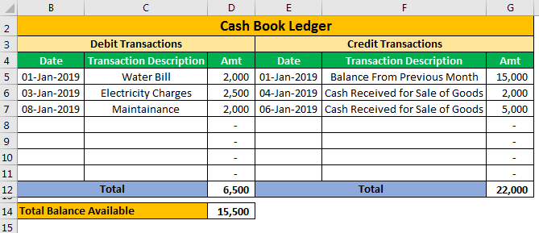

In today's digital age, Microsoft Excel remains a crucial tool for financial management and analysis. Far beyond being a simple spreadsheet software, it serves as a versatile platform for an array of accounting and finance-related tasks. Among its numerous applications, Excel is adept at managing a general ledger, facilitating accounting procedures, and even executing algorithmic trading. Excel's utility stems from its powerful suite of features, including formulas, pivot tables, and data visualization tools, which are favored by financial professionals for their efficiency and precision.

The capabilities of Excel in the financial sector are extensive. Its robust computational functions allow for complex operations such as intricate financial modeling, budgeting, and forecasting. This breadth of function makes Excel a vital tool for businesses of varying sizes, particularly for small to medium enterprises that may opt for it as a cost-effective alternative to specialized accounting software. Additionally, Excel can handle vast datasets, deliver quick computations, and represent data visually, which enables financial managers to glean actionable insights and make informed decisions.



For advanced financial operations, Excel can be expanded with macros and Visual Basic for Applications (VBA), extending its functionality into realms such as algorithmic trading. The ability to write custom scripts and automate repetitive tasks enhances productivity and accuracy in financial workflows.

This article will explore the essential techniques, formulas, and tools that make Microsoft Excel indispensable for financial professionals, covering applications from general ledger management to algorithmic trading and financial analysis. Whether you are a small business owner or a financial analyst, mastering the extensible features of Excel can significantly advance financial management and strategic decision-making.

## Table of Contents

## Understanding the Role of Excel in Financial Management

Microsoft Excel is a highly favored tool among finance professionals, largely owing to its adaptability and robust computational capacities. Its functionality spans a broad spectrum, from financial tasks like budgeting and forecasting to detailed financial modeling and asset management. This versatility is particularly beneficial for small to medium enterprises that might not have the resources to invest in specialized accounting software.

Excel's ability to manage large datasets is enhanced by its powerful calculation features and the ability to automate repeated tasks. This enables users to perform complex computations that aid in creating detailed financial projections and models. Excel supports a variety of functions and formulas pivotal in financial analysis, such as financial functions (e.g., PV, FV, NPV), statistical functions (e.g., AVERAGE, STDEV), and logical functions (e.g., IF, AND, OR). For example, the Net Present Value can be calculated using the NPV function:

```excel
=NPV(rate, value1, [value2, ...])
```

These functions facilitate the analysis of financial data by allowing finance professionals to manipulate the data and extract meaningful insights.

Moreover, Excel's data presentation capabilities are another key feature that makes it an invaluable tool for financial management. By employing tools such as charts and PivotTables, users can transform raw data into visual representations, making it easier to interpret trends, patterns, and insights. PivotTables, for instance, are used to summarize, sort, reorganize, group, count, total, or average data stored in a spreadsheet, offering a different perspective on the dataset:

```python
import pandas as pd

# Example of creating a pivot table in Python with pandas
data = {
    'Category': ['A', 'B', 'A', 'C'],
    'Values': [10, 20, 15, 10]
}
df = pd.DataFrame(data)
pivot_table = df.pivot_table(values='Values', index='Category', aggfunc='sum')
print(pivot_table)
```

The use of Excel for financial management is also particularly appealing to small to medium businesses due to its cost-effectiveness. It serves as a practical solution for companies that require comprehensive financial analysis capabilities but cannot justify the investment in more expensive, specialized software. By leveraging Excel's robust features, these businesses can effectively conduct financial analysis and decision-making processes in a streamlined and accessible manner. 

Through its wide-ranging functionalities and ease of use, Microsoft Excel continues to be an essential asset for finance professionals seeking a flexible computing tool that aids in comprehensive financial management.

## Creating a General Ledger in Excel

One of Excel's primary roles in accounting is setting up the general ledger, the fundamental accounting record that employs the double-entry bookkeeping system. Establishing a general ledger in Excel involves several systematic steps that ensure meticulous financial management and reporting.

First, begin by organizing your Excel workbook. Start with creating an 'Accounts' sheet where you systematically list all necessary accounts divided among assets, liabilities, and equity. Each of these categories is crucial for maintaining a comprehensive overview of business finances. Common accounts might include Cash, Accounts Receivable, Inventory, Accounts Payable, and Owner's Equity.

Once the accounts are established, proceed to create the general ledger itself. This involves drafting a table with essential columns like Date, Account, Description, Debit, Credit, and Balance. Here’s a brief explanation of each column:

1. **Date**: When a transaction occurs.
2. **Account**: The account affected by the transaction.
3. **Description**: A brief explanation of the transaction.
4. **Debit/Credit**: Depending on the nature of the transaction, indicate the amount in either the Debit or Credit column.
5. **Balance**: Reflects the running total post-transaction.

Using Excel's built-in functions is vital to efficiently manage and maintain the ledger's accuracy. The `SUM` function and `IF` statements facilitate the automatic updating of balances. For instance, the formula `=SUM(D2:D100)` can total the Debit column, ensuring that figures are up-to-date.

Moreover, Excel's `VLOOKUP` function can be leveraged to streamline data retrieval. Suppose transactions span multiple accounts, and you need to reference account-specific information. Using a formula such as `=VLOOKUP(A2, Accounts!A:B, 2, FALSE)` allows you to pull corresponding data based on account numbers or names, thus ensuring accuracy and coherence throughout your ledger.

An essential component of double-entry bookkeeping is ensuring that all transactions balance, meaning the total debits equal the total credits. Regularly verifying the balance can prevent financial discrepancies and errors. Additionally, setting up conditional formatting rules in Excel can highlight any mismatches between debits and credits, promptly alerting to potential issues.

In essence, creating a general ledger in Excel requires a structured approach and careful utilization of Excel functions. By maintaining organized records and employing Excel’s automated capabilities, one can ensure accurate and efficient financial management tailored to the specific needs of businesses. The versatility of Excel in handling such tasks makes it an indispensable tool for accountants worldwide.

## Excel Accounting Techniques for Small Businesses

For small businesses, Excel serves as a highly effective and budget-conscious alternative to specialized accounting software. Setting up a basic accounting ledger within Excel involves creating structured columns for key financial data: date, account, description, debit, and credit. This simple yet systematic approach aids in organizing and tracking financial transactions, ensuring that all fiscal activities are thoroughly documented.

**Date**: This column captures the specific date of each transaction, establishing a chronological order crucial for accurate record-keeping and subsequent analysis.

**Account**: Here, categorize each transaction under a relevant account name. This could include categories like “Office Supplies,” “Sales Revenue,” or “Utilities,” reflecting the purpose of the financial activity.

**Description**: This section should provide a brief but informative description of the transaction. This clarity simplifies tracking and auditing processes by detailing the nature and context of each entry.

**Debit and Credit**: These columns are essential for implementing double-entry bookkeeping. Each transaction will require one or more entries to debit accounts and one or more entries to credit accounts, ensuring the accounting equation (Assets = Liabilities + Equity) remains balanced. The sum of debits should always equal the sum of credits for accurate financial management.

To maintain precision within this framework, small businesses can leverage Excel's built-in features. Conditional formatting is particularly useful, as it allows for automatic highlighting of potential errors, such as unbalanced transactions, by applying specific colors or symbols to cells that meet predefined criteria. For instance, if the totals of debits and credits do not match, the respective cells could be highlighted in red, immediately signaling the need for review.

Additionally, protecting critical cells is a key strategy to prevent unauthorized or accidental changes. By securing cells that contain formulas or vital data used in calculations, businesses can safeguard their accuracy. To implement this, users can go to the ‘Review’ tab and select ‘Protect Sheet,’ allowing them to lock specific cells while still permitting access to others as needed.

Through these practices, small businesses effectively utilize Excel not only for recording financial data but also for constructing a reliable and accurate accounting system that meets their unique needs without incurring significant costs.

## Algorithmic Trading with Excel

Excel can serve as a robust platform for [algorithmic trading](/wiki/algorithmic-trading) by utilizing Visual Basic for Applications (VBA) to automate trading strategies and perform complex calculations. To set up a basic trading algorithm, real-time data feeds from financial markets are essential. These data feeds can be integrated into Excel using third-party tools or APIs, allowing the spreadsheet to capture live market prices, volumes, and other relevant metrics.

### Setting Up a Basic Trading Algorithm

1. **Getting Real-Time Data**: Real-time data can be imported into Excel by using APIs or data feeds from financial service providers. Software like Bloomberg or Alpha Vantage provides interfaces for connecting Excel to real-time trading data. With these, you can periodically refresh data to ensure your spreadsheet captures the latest market movements.

2. **Developing the Algorithm**: The trading strategy can be coded using VBA. For example, a simple moving average crossover strategy could be implemented. This involves creating two moving averages—a short-term one and a long-term one—on your price data. The buy signal is generated when the short-term average crosses above the long-term average, and similarly, a sell signal occurs when the short-term average falls below the long-term average. This logic can be encoded in VBA to trigger trades automatically.

   Here's a basic example outline in VBA:
   ```vba
   Sub TradeStrategy()
       Dim shortMA As Double
       Dim longMA As Double
       Dim currentPrice As Double
       Dim position As String

       ' Calculate moving averages based on historical data
       shortMA = Application.WorksheetFunction.Average(Range("B2:B12"))
       longMA = Application.WorksheetFunction.Average(Range("B2:B22"))

       ' Get the current price
       currentPrice = Range("B1").Value

       ' Decision logic
       If shortMA > longMA And position <> "Long" Then
           ' Enter long position
           position = "Long"
           MsgBox "Enter long position"
       ElseIf shortMA < longMA And position <> "Short" Then
           ' Enter short position
           position = "Short"
           MsgBox "Enter short position"
       End If
   End Sub
   ```

3. **Automation of Trades**: Once the trading signals are determined, the next step can be interfacing with a trading platform to automate order execution. This typically requires APIs from brokerage services which can be triggered using VBA or external integration tools.

### Backtesting Trading Strategies

Backtesting involves using historical market data to evaluate the effectiveness of a trading strategy. Excel can efficiently handle [backtesting](/wiki/backtesting):

1. **Import Historical Data**: Gather historical data such as stock prices, which can be sourced from financial data websites or directly imported into Excel via online databases or APIs.

2. **Strategy Simulation**: Implement the strategy rules in Excel formulas or VBA to simulate potential trades over the historical data set. Calculate key performance metrics such as return, volatility, and maximum drawdown to determine the strategy’s effectiveness over the chosen period.

3. **Analyze Results**: Generate reports using Excel's pivot tables or charts to visualize the backtest outcomes. Compare different strategies or parameter settings to optimize future performance.

In conclusion, while Excel may not be as powerful as dedicated trading platforms, its flexibility and computational functions make it a practical tool for experimenting with algorithmic trading strategies and understanding their dynamics before deploying them in live environments.

## Advanced Excel Tools for Financial Analysis

Microsoft Excel offers a suite of robust tools that significantly enhance financial analysis capabilities, with PivotTables, Solver, and Power Query being among the most prominent. These advanced features enable finance professionals to perform detailed data analysis, streamline processes, and gain valuable insights from complex datasets.

### PivotTables

PivotTables in Excel are essential tools for summarizing and analyzing large volumes of data. They allow users to automatically sort, count, and average data stored within one table or across multiple tables. This functionality is particularly powerful for financial analysis because it enables the extraction of significant trends and patterns without the need for complex formulas.

For example, a financial analyst can use PivotTables to quickly generate reports, breaking down revenue streams by product line or region, which aids in identifying high-performing segments. The drag-and-drop interface simplifies the arrangement of data fields, enabling dynamic adjustments to reports with minimal effort.

### Solver

Excel's Solver add-in is a valuable resource for optimization tasks in financial analysis. Solver uses mathematical algorithms to find the optimal solution for a problem defined with constraints. This is particularly useful in finance for tasks such as portfolio optimization, capital budgeting, and resource allocation.

For instance, a finance professional might use Solver to determine the optimal mix of investments that maximizes returns while adhering to budgetary and risk constraints. By setting the objective of maximizing or minimizing a specific cell (such as total portfolio return), alongside constraints (such as maximum allowable risk), Solver can efficiently compute the best possible solution. The ease of setting these parameters through Solver makes it a versatile tool for complex financial decision-making processes.

### Power Query

Power Query is an Excel feature designed for data discovery, transformation, and enrichment. It allows users to connect, combine, and refine data across a wide variety of sources, such as databases, online services, and files. This capability is crucial for financial analysts who often have to deal with disparate data that require cleaning and unification.

One of the advantages of Power Query is its ability to automate repetitive data manipulation tasks. Financial analysts can set up queries that transform and update data with a simple refresh, which reduces errors and saves time. This automation is vital in maintaining up-to-date financial models that reflect the latest data, supporting accurate and timely decision-making.

### Conclusion

The integration of these advanced Excel tools into financial analysis workflows allows for greater efficiency and precision. By mastering PivotTables, Solver, and Power Query, finance professionals can transform raw data into actionable insights, supporting strategic financial decisions and business improvements. As businesses continue to leverage data-driven strategies, the importance of these tools in gaining competitive advantages remains significant.

## Conclusion

Excel remains a remarkably versatile tool, capable of handling a multitude of financial tasks, despite the availability of dedicated software solutions for large-scale financial operations. Its flexibility and powerful computation capabilities make it an indispensable resource for small business owners and financial analysts alike. The ability to customize and extend its functionality with formulas, macros, and add-ins positions Excel as more than just a spreadsheet application; it is a comprehensive financial management platform.

For small business owners, Excel provides a cost-effective solution for managing financial records. Its simplicity and accessibility allow users to easily create and maintain accounting ledgers, budget sheets, and cash flow statements without incurring the costs associated with specialized software. With the added benefits of conditional formatting, data validation, and protection features, users can ensure data accuracy and integrity efficiently.

Financial analysts benefit from Excel's advanced data analysis tools, such as PivotTables, Solver, and Power Query, which enable sophisticated data manipulation and insight generation. These features support in-depth financial modeling and facilitate strategic planning, providing the means to interpret complex datasets and forecast future financial scenarios.

Mastering Excel, therefore, not only enhances the proficiency of financial analysis but also empowers users to make informed and strategic decisions that drive business success. Whether it's for crafting detailed financial reports or implementing algorithmic trading strategies, Excel remains a crucial asset that bridges the gap between raw data and actionable insights.

## Further Resources

### Links to Excel Training Courses and Tutorials

1. **Microsoft Excel Online Training:** Microsoft provides a comprehensive set of online training resources through their official website. These tutorials cover everything from basic navigation to advanced data analysis techniques.
   - [Microsoft Excel Training](https://support.microsoft.com/en-us/excel)

2. **Excel Easy:** A free online guide providing tutorials and exercises on basic Excel skills as well as advanced features such as macros and VBA.
   - [Excel Easy Tutorial](https://www.excel-easy.com/)

3. **Coursera - Excel Skills for Business Specialization:** Offered by Macquarie University, this is a series of courses aimed at helping learners gain essential Excel skills through practical exercises and real-world examples.
   - [Excel Skills for Business](https://www.coursera.org/specializations/excel)

4. **LinkedIn Learning - Excel Essential Training:** This course is targeted at learning how to use Excel efficiently for data analysis, visualization, and automation of tasks.
   - [Excel Essential Training](https://www.linkedin.com/learning/excel-essential-training-office-365)

### Recommendations for Additional Reading on Excel Financial Modeling and Basic Accounting Principles

1. **"Financial Modeling in Excel For Dummies" by Danielle Stein Fairhurst:** This book provides a step-by-step guide to building financial models in Excel, explaining the key concepts and techniques for those who wish to perform financial analysis and forecast financial outcomes.
   - [Find it on Amazon](https://www.amazon.com/Financial-Modeling-Excel-Dummies-Fairhurst/dp/1119357543)

2. **"Excel Modeling in Investments" by Craig W. Holden:** This book introduces advanced modeling techniques in Excel essential for finance professionals, focusing on investment analysis and portfolio management.
   - [Find it on Amazon](https://www.amazon.com/Excel-Modeling-Investments-Craig-Holden/dp/0136078597)

3. **"Principles of Accounting" by Belverd E. Needles Jr. and Marian Powers:** Known for its focus on one of the cornerstones of business, this text prepares learners with the accounting basics necessary before leveraging Excel for financial management.
   - [Find it on Amazon](https://www.amazon.com/Principles-Accounting-Belverd-Needles/dp/0538478509)

4. **"Excel for Finance Professionals" on Investopedia:** This resource provides various articles and tutorials specifically catered to using Excel for financial calculations, including tips on financial functions and formulas.
   - [Excel for Finance - Investopedia](https://www.investopedia.com/excel-for-finance-5183880) 

These resources provide a solid foundation for both new users and seasoned professionals seeking to enhance their Excel skills for financial management and strategic decision-making.

## References & Further Reading

[1]: Fairhurst, Danielle Stein (2017). ["Financial Modeling in Excel For Dummies."](https://www.amazon.com/Financial-Modeling-Excel-Dummies-Danielle/dp/8126569182) For Dummies.

[2]: Holden, Craig W. (2020). ["Excel Modeling in Investments"](https://www.amazon.com/Excel-Modeling-Investments-Prentice-Finance/dp/0132497875) Pearson.

[3]: Needles, Belverd E., & Powers, Marian (2012). ["Principles of Accounting"](https://www.amazon.com/Principles-Accounting-Financial-Belverd-Needles/dp/1439037744) Cengage Learning.

[4]: Microsoft. ["Microsoft Excel Training."](https://support.microsoft.com/en-us/office/excel-video-training-9bc05390-e94c-46af-a5b3-d7c22f6990bb) Microsoft Support.

[5]: Excel Easy. ["Excel Easy Tutorial."](https://www.excel-easy.com/) Excel Easy.

[6]: Investopedia. ["Excel for Finance Professionals."](https://www.investopedia.com/ask/answers/052115/how-do-i-perform-financial-analysis-using-excel.asp) Investopedia.

[7]: Coursera - Macquarie University. ["Excel Skills for Business Specialization."](https://www.coursera.org/specializations/excel) Coursera.

[8]: LinkedIn Learning. ["Excel Essential Training."](https://www.linkedin.com/learning/excel-essential-training-microsoft-365-17231101) LinkedIn Learning.