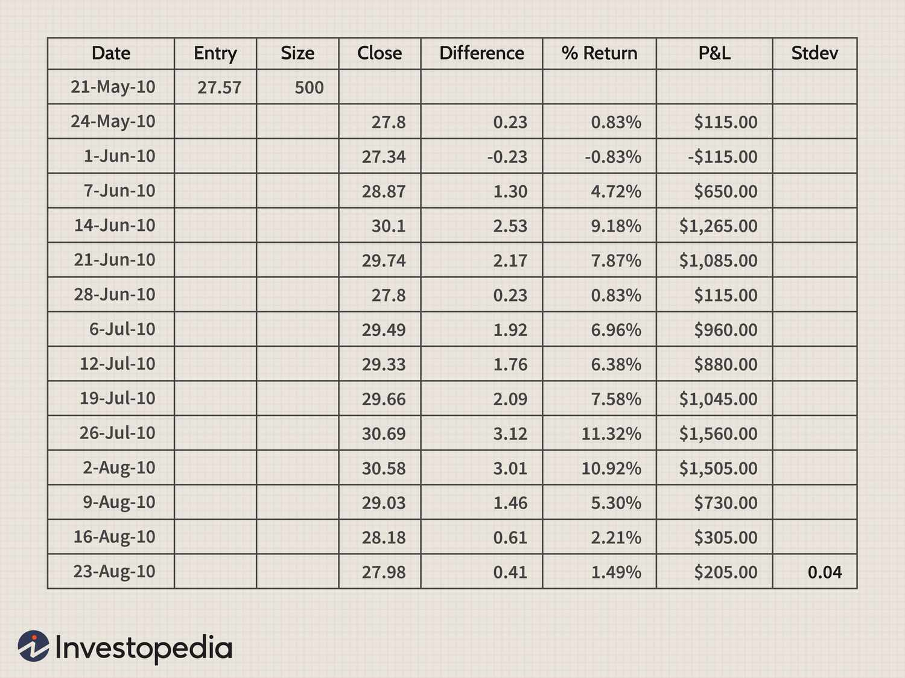

In the rapidly evolving landscape of investment, technology has become an indispensable tool, reshaping the way investors develop and manage their portfolios. Among these technological advancements, Microsoft Excel has emerged as a pivotal platform for creating sophisticated investment strategies and automating trading systems. Its robust functionalities and user-friendly interface have made it a favored choice not only for individual investors but also for institutional traders.

Excel's strength lies in its versatility and capability to manage extensive datasets, perform intricate financial calculations, and visualize information through charts and graphs. By leveraging Excel, investors can efficiently track and analyze various asset classes such as stocks, bonds, and exchange-traded funds (ETFs), thereby gaining critical insights necessary for making informed investment decisions. For example, Excel functions like `VLOOKUP`, `INDEX`, and `MATCH` allow users to perform quick lookups and cross-referenced data analysis, crucial for actively managing investment portfolios.



Furthermore, the software's compatibility with Visual Basic for Applications (VBA) enhances its utility by enabling users to automate repetitive tasks, backtest trading strategies, and execute trades based on predefined criteria. This level of automation reduces manual errors and enhances the speed and reliability of trading operations, making it an integral tool for both novice and seasoned traders. Additionally, Excel can be integrated with various Application Programming Interfaces (APIs) to access real-time market data, thus supporting dynamic decision-making processes.

While Excel is powerful on its own, it complements advanced software solutions used in algorithmic trading and risk management. Tools such as Bloomberg Terminal and MATLAB can be integrated with Excel, allowing investors to refine their models and optimize portfolio performance. This synergy between Excel and specialized trading platforms creates a more holistic approach to investment management.

In this article, we will explore how Excel can be applied to enhance investment strategies and support algorithmic trading activities. We will examine the software's functionalities and provide practical examples demonstrating its use in the financial sector. Moreover, we will discuss how Excel can be utilized alongside advanced software to develop comprehensive and efficient trading systems. Through understanding these dynamics, investors can better harness Excel's potential to maximize investment performance and adapt to the fast-paced financial landscape.

## Table of Contents

## Investment Strategies Using Excel

Excel is more than just a spreadsheet tool; it's a dynamic platform for developing investment strategies. Investors can utilize Excel for tracking and analyzing various asset classes, such as stocks, bonds, and ETFs. This involves the systematic collection and assessment of market data to make informed decisions. By setting up a structured spreadsheet, investors can input and monitor pertinent financial information, such as historical prices, trading volumes, and dividend yields. Excel's cell-based structure facilitates the efficient organization and updating of data, laying the groundwork for more sophisticated analyses.

Data management and visualization are critical elements in the decision-making process. Excel provides robust features like pivot tables, charts, and conditional formatting to convert raw data into actionable insights. Pivot tables allow users to summarize large datasets, facilitating quick analysis of trends and performance metrics across different time intervals or market conditions. With its charting tools, Excel enables the graphical representation of data, helping identify patterns and anomalies that might not be apparent in raw numbers.

Excel is also a powerful tool for calculating and assessing key performance metrics like returns and standard deviation. Users can calculate historical returns using the formula:

$$
\text{Return} = \frac{{\text{Ending Price} - \text{Starting Price} + \text{Dividends}}}{\text{Starting Price}}
$$

By calculating returns over time, investors can assess the performance of their investments relative to benchmarks or indices. Standard deviation, a measure of [volatility](/wiki/volatility-trading-strategies), provides insights into the risk associated with an asset or portfolio. It can be computed in Excel using the built-in function:

$$
\text{STDEV.P(range)}
$$

where the range specifies the dataset for which the standard deviation needs to be calculated. This metric helps investors understand the degree of variation in their investment returns, which is crucial for risk management.

Moreover, Excel allows investors to simulate various investment scenarios using historical data. This capability supports forecasting future performance and optimizing asset allocation. By leveraging its dynamic formulas and What-If Analysis tools, users can model how changes in market conditions or investment strategies might impact their portfolios.

In summary, Excel offers a comprehensive suite of tools for tracking, analyzing, and optimizing investment strategies across different asset classes. Its ability to manage data, facilitate visual analysis, and compute critical financial metrics makes it an indispensable resource for investors seeking to enhance their decision-making capabilities.

## Excel Formulas for Trading Analysis

Excel's versatility in evaluating trading strategies is demonstrated through its ability to create custom formulas. These formulas are integral for analyzing various aspects of trading, such as price differences, percent returns, and profits/losses. For example, to calculate the price difference between two trading periods, the formula `=B2-B1` can be used, where `B2` and `B1` represent the consecutive prices of an asset. Percent returns, which indicate the profitability of a trade, can be computed using the formula `=((B2-B1)/B1)*100`, providing insight into the percentage change in asset value.

In addition to basic calculations, Excel is highly capable of performing complex operations like standard deviation analysis, which is crucial for assessing investment risk. Standard deviation can be calculated in Excel using the `=STDEV.P(range)` function, where `range` represents the dataset under analysis. This function enables traders to measure the volatility of asset prices, helping in making informed decisions.

Automating these calculations is another key feature of Excel, allowing traders to maintain real-time tracking of their trading positions and performance. By using Excel’s built-in capabilities such as macros or Visual Basic for Applications (VBA), repetitive tasks can be automated, enhancing efficiency. For instance, a VBA script can be created to automatically update data and recalculate metrics whenever new market data is available.

For continuous monitoring and updating of trading data, Excel's AutoFill and Table functions can be employed. The AutoFill feature helps in extending formulas across multiple cells, ensuring consistent application across datasets, while the Table function automatically updates formulas when new data is appended.

Ultimately, Excel’s powerful formula capabilities and automation tools present a robust platform for traders seeking to develop precise and dynamic trading strategies. These functionalities support traders in maintaining a competitive edge in the fast-paced world of trading by providing timely and accurate financial analysis.

## Algorithmic Trading with Excel

With the advent of [algorithmic trading](/wiki/algorithmic-trading), Excel remains a relevant and powerful tool for developing and testing simple trading algorithms. One of Excel’s key strengths lies in its flexibility and the ability to automate trading processes through Visual Basic for Applications (VBA). VBA is a programming language built into Excel that allows users to execute repetitive tasks, perform complex calculations, and manage large datasets efficiently. By using VBA, traders can automate the process of [backtesting](/wiki/backtesting) trading strategies and even executing trades without manual intervention.

The use of VBA in Excel involves writing scripts that can control how trading data is processed and evaluated. For instance, a trader might create a VBA script to automatically update financial data, compute technical indicators, and generate buy or sell signals based on predefined criteria. Backtesting strategies with VBA is made possible by simulating trades on historical data to evaluate how a strategy would have performed. This can involve running loops over a dataset, applying trading logic, and recording the results of these simulated trades to analyze profitability and risk.

Excel’s ability to integrate with trading platforms via Application Programming Interfaces (APIs) enhances its functionality in algorithmic trading. APIs allow Excel to connect with external data sources, enabling the real-time import and export of market data and trades. By leveraging APIs, users can configure Excel to receive live price feeds and execute trades directly from their spreadsheets. This integration facilitates a seamless flow of information, ensuring that trading strategies are based on the most current market data.

Understanding the basics of algorithmic design is essential for implementing trading systems in Excel. Algorithmic trading involves the use of computer algorithms to automatically make trading decisions. Key components of a trading algorithm include entry and [exit](/wiki/exit-strategy) conditions, position sizing, and risk management protocols. Excel can be employed to model these components, using functions and formulas to define conditions and parameters. For example, traders can use Excel functions to calculate moving averages, which are commonly used in crossover strategies to generate buy or sell signals.

Here is an example of a simple moving average crossover strategy implemented in VBA:

```vba
Sub MovingAverageCrossover()
    Dim i As Integer
    Dim shortMA As Double
    Dim longMA As Double

    ' Loop through data
    For i = 11 To Cells(Rows.Count, 1).End(xlUp).Row
        ' Calculate the short and long moving averages
        shortMA = WorksheetFunction.Average(Range(Cells(i - 9, 2), Cells(i, 2)))
        longMA = WorksheetFunction.Average(Range(Cells(i - 19, 2), Cells(i, 2)))

        ' Generate buy/sell signals
        If shortMA > longMA And Cells(i - 1, 3) <> "Buy" Then
            Cells(i, 3) = "Buy"
        ElseIf shortMA < longMA And Cells(i - 1, 3) <> "Sell" Then
            Cells(i, 3) = "Sell"
        Else
            Cells(i, 3) = "Hold"
        End If
    Next i
End Sub
```

In this code, the short and long moving averages are calculated over 10-day and 20-day periods, respectively. Buy and sell signals are generated when the short moving average crosses above or below the long moving average. The results are placed in the third column of the Excel worksheet. 

By mastering these techniques, Excel users can effectively harness the power of algorithmic trading, using VBA and APIs to create robust trading systems tailored to their investment strategies. Excel, therefore, serves as a bridge between manual trading and fully automated systems, offering an accessible platform for traders to enhance their algorithmic trading skills.

## Enhancing Excel's Capabilities

Excel is a widely used tool in finance, yet its potential can be significantly amplified through integration with various software solutions and plugins, creating a more powerful ecosystem for professional trading and investment analysis.

### Plugins and Additional Tools

Several plugins can be used to extend Excel's inherent capabilities. One popular option is **Power Query**, which allows for data extraction, transformation, and loading from various sources—essential for managing large datasets common in trading activities. **Power Pivot** is another tool that enhances Excel's data modeling capabilities with in-memory analytics, optimal for complex calculations across numerous data points.

**Bloomberg Terminal** provides a plugin for Excel, enabling users to pull real-time financial data directly into spreadsheets. This capability is crucial for traders who need constant data updates to make informed decisions. The Bloomberg API allows for customizing data retrieval, setting alerts, and automating workflows within Excel.

Another valuable tool is **Solver**, which is particularly effective for optimization problems in portfolio management. Solver can help determine the optimal asset allocation by minimizing risk (variance) for a given level of expected return, utilizing complex algorithms to achieve efficient frontier solutions.

### Advanced Portfolio Management Software and Trading Platforms

While Excel provides a robust platform for many trading activities, advanced users might consider integrating it with more specialized software. Portfolio management software like **Morningstar Direct** or **FactSet** offers comprehensive analytical capabilities tailored for asset management, including risk analysis, performance attribution, and scenario modeling.

Trading platforms such as **MetaTrader 4/5** provide APIs that can interface with Excel, enabling automated trading systems. Python scripts can facilitate data exchange between these platforms and Excel:

```python
import pandas as pd
from MT5API import MT5API

mt5 = MT5API()
data = mt5.get_historical_data('EURUSD', timeframe='H1', start_time='2023-01-01', end_time='2023-06-01')
df = pd.DataFrame(data)
df.to_excel('historical_data.xlsx', index=False)
```

This Python snippet demonstrates how data can be imported from MetaTrader into Excel, allowing for further analysis or visualization using Excel's powerful charting tools.

### Communities and Resources

For those seeking to expand their Excel skills and trading expertise, numerous online communities and resources offer support and learning opportunities. Websites like **Stack Overflow** and **MrExcel Forum** are excellent places for troubleshooting and advice on specific Excel issues. 

Platforms such as **Coursera** and **Udemy** provide structured courses on Excel for finance and trading, catering to both beginners and advanced users. Moreover, **Kaggle** can be a valuable resource for exploring data science projects and competitions that involve financial datasets, offering a practical approach to learning through challenges.

To keep informed about the latest developments in Excel and its use in investment management, joining groups on LinkedIn and attending webinars hosted by financial analysts and Excel experts can also be beneficial. These resources can provide insights into advanced techniques, updates on new tools, and advice from experienced professionals in the field.

## Practical Case Studies and Examples

Excel's diverse capabilities have rendered it a reliable platform for designing and implementing investment strategies, as evidenced by several practical case studies. These examples illustrate how investors and traders use Excel to analyze data, forecast market trends, and develop algorithmic trading strategies tailored to specific market scenarios.

One notable case involves the implementation of a [momentum](/wiki/momentum)-based trading strategy. By leveraging Excel's data processing and visualization functionalities, traders tracked historical price movements of stocks to identify assets showing upward or downward momentum. The strategy involved calculating the rate of price changes over specified periods, like 50-day or 200-day moving averages. Excel's built-in formulas, such as `=AVERAGE()`, allowed practitioners to automate these calculations and plot results for deeper insights. This case demonstrated how Excel could be used to identify potential entry and exit points, thereby optimizing trading decisions across varying market conditions.

Another example highlights the use of Excel in developing a simple algorithmic trading strategy employing the Relative Strength Index (RSI). Traders programmed Excel to automate the calculation of RSI using historical price data. By setting threshold levels, such as 70 for overbought conditions and 30 for oversold conditions, users effectively identified potential trade signals. The following pseudo-code exemplifies how an Excel-based algorithm could operate:

```python
import pandas as pd

def calculate_rsi(data, period=14):
    delta = data['Close'].diff()
    gain = (delta.where(delta > 0, 0)).rolling(window=period).mean()
    loss = (-delta.where(delta < 0, 0)).rolling(window=period).mean()
    rs = gain / loss
    rsi = 100 - (100 / (1 + rs))
    return rsi

# Load historical data
data = pd.read_csv('historical_data.csv')
data['RSI'] = calculate_rsi(data)

# Define trading signals
data['Signal'] = 0
data.loc[data['RSI'] < 30, 'Signal'] = 1  # Buy signal
data.loc[data['RSI'] > 70, 'Signal'] = -1 # Sell signal
```

Furthermore, Excel has been used to rigorously backtest trading strategies. A prominent case study demonstrated the efficacy of backtesting a pairs trading strategy for equities using historical price data. By harnessing Excel's statistical functions, such as `=CORREL()` for correlation analysis, traders paired stocks exhibiting high historical correlation. The pairs trading strategy capitalized on the premise of mean reversion, entering long and short positions when the price spread diverged from the historical mean. Such methodologies allowed traders to evaluate past performance and refine trading strategies to adapt to a volatile marketplace.

The experiences of successful practitioners provide valuable lessons in deploying Excel for trading and investment management. Key takeaways include the importance of structured data management, maintaining flexibility to adjust formulas and models in response to dynamic markets, and the continual refining of analytical acumen to optimize strategy performance. Excel's adaptability allows it to be consistently tailored to meet the evolving needs of financial analysts and traders, underscoring its enduring relevance in the landscape of investment management.

## Conclusion

Excel continues to be a versatile and invaluable tool in investing and algorithmic trading. Despite challenges such as the limitations in handling very large datasets and advanced statistical analysis, the ability to customize and automate processes makes Excel a robust choice for strategic investment management. Its adaptability allows users to design bespoke solutions tailored to specific investment needs. Whether through developing customized formulas or employing Visual Basic for Applications (VBA) for automation, Excel provides a platform that is both accessible and powerful.

To maximize investment performance and enhance trading strategies, embracing the full potential of Excel is crucial. Users can leverage its extensive range of functionalities, including data visualization and performance metric calculations, to gain comprehensive insights into market trends and investment opportunities. Excel’s integration capabilities with other software and trading platforms further extend its utility, offering real-time data feeds and seamless order execution.

Staying updated with additional training and tools can significantly increase the efficiency and effectiveness of using Excel in finance. Engaging with online communities and continuously exploring new plugins and extensions ensures that users remain at the forefront of technological advancements in financial analysis and trading. This proactive approach not only enhances financial acumen but also fosters a culture of continuous improvement, essential in the fast-paced world of investment and trading.

## References & Further Reading

[1]: Bergstra, J., Bardenet, R., Bengio, Y., & Kégl, B. (2011). ["Algorithms for Hyper-Parameter Optimization."](https://dl.acm.org/doi/10.5555/2986459.2986743) Advances in Neural Information Processing Systems 24.

[2]: ["Advances in Financial Machine Learning"](https://www.amazon.com/Advances-Financial-Machine-Learning-Marcos/dp/1119482089) by Marcos Lopez de Prado

[3]: ["Evidence-Based Technical Analysis: Applying the Scientific Method and Statistical Inference to Trading Signals"](https://www.amazon.com/Evidence-Based-Technical-Analysis-Scientific-Statistical/dp/0470008741) by David Aronson

[4]: ["Machine Learning for Algorithmic Trading"](https://github.com/stefan-jansen/machine-learning-for-trading) by Stefan Jansen

[5]: ["Quantitative Trading: How to Build Your Own Algorithmic Trading Business"](https://www.amazon.com/Quantitative-Trading-Build-Algorithmic-Business/dp/1119800064) by Ernest P. Chan