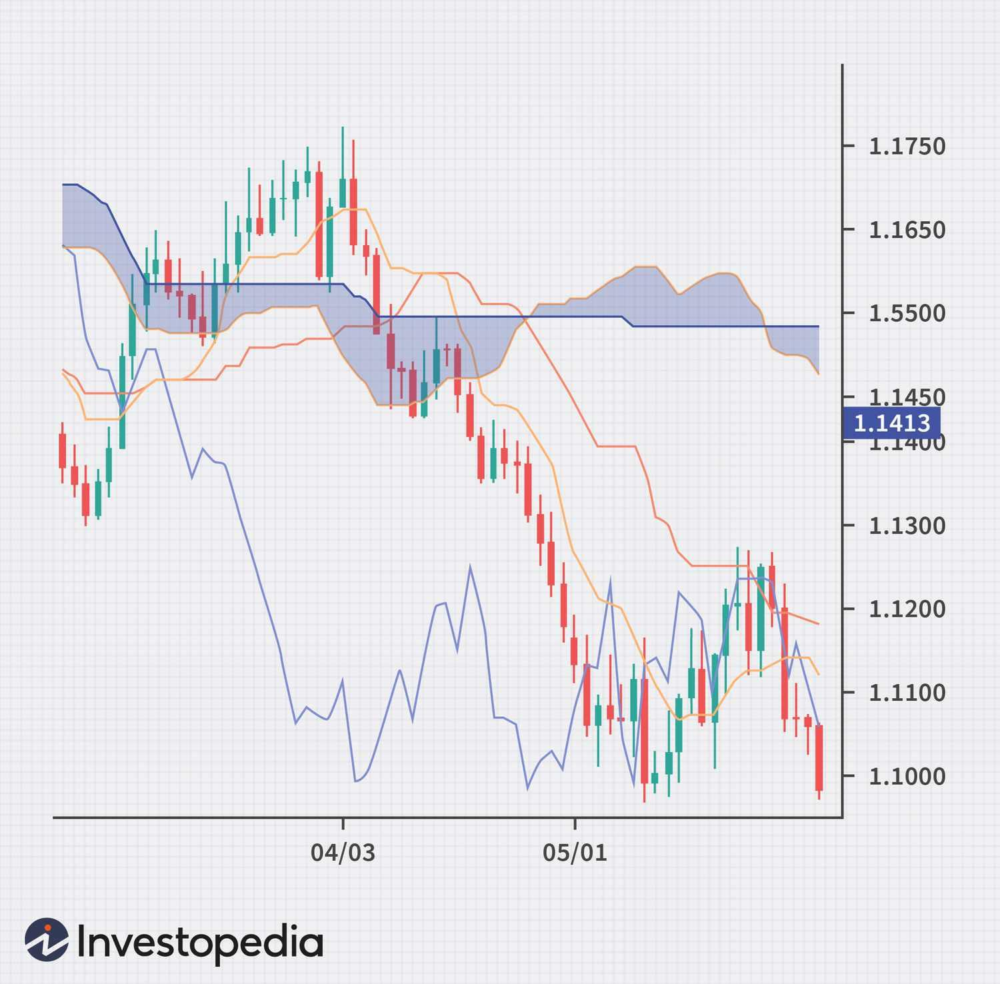

Forex trading, also known as foreign exchange trading, involves the exchange of currencies on a global market, which is the largest and most liquid financial market in the world. The market's size and liquidity provide traders with unique opportunities to profit from currency fluctuations. Technical analysis plays a critical role in Forex trading, aiding traders in making informed decisions by evaluating past price movements through charts and statistical indicators. A popular tool within technical analysis is the Ichimoku Kinko Hyo, or Ichimoku charts, which offer a comprehensive view of market trends, providing insights into support and resistance levels, potential reversals, and momentum.

Ichimoku charts, developed by Japanese journalist Goichi Hosoda in the late 1930s, are designed to help traders analyze currency movements at a glance. These charts incorporate five key components: the Tenkan-sen, Kijun-sen, Senkou Span A, Senkou Span B, and Chikou Span, which together form the Ichimoku cloud. This cloud is particularly useful for identifying potential buy and sell signals.



Algo trading, or algorithmic trading, involves the use of automated and high-speed mathematical models to execute trades in financial markets. This trading approach has gained prominence in Forex markets due to its ability to process vast amounts of data quickly and execute trades without the emotional bias that often affects human traders. The integration of Ichimoku charts within algorithmic trading systems can enhance trading strategies by combining the holistic insights provided by Ichimoku indicators with the precision and speed of automated trading.

The purpose of this article is to explore the potential advantages of incorporating Ichimoku charts into algorithmic trading strategies within the Forex market. The article aims to provide a detailed understanding of how these charts can be utilized effectively in automated systems, offering traders robust tools to navigate the complexities of currency trading.

The rise of algorithmic trading in Forex markets has been driven by advancements in technology and the increased accessibility of trading algorithms to retail traders. As competition intensifies and market dynamics evolve, the adoption of sophisticated trading tools and strategies, such as those involving Ichimoku charts, becomes increasingly important. By merging traditional charting techniques with modern algorithmic systems, traders can potentially increase their success rates in an ever-changing market landscape.

## Table of Contents

## Understanding Ichimoku Charts

Ichimoku Charts, a popular and comprehensive technical analysis tool, were developed by the Japanese journalist Goichi Hosoda in the late 1930s and introduced publicly in his 1969 book. Ichimoku translates to "one glance" in Japanese, aptly named as the charts allow traders to identify potential signals quickly, providing a holistic view of market trends, momentum, and support/resistance levels.

**Components of Ichimoku Charts Explained**

Ichimoku Charts consist of five key components, each serving a specific purpose in market analysis:

1. **Tenkan-sen (Conversion Line):** Calculated as the average of the highest high and the lowest low over the past nine periods:
$$
   \text{Tenkan-sen} = \frac{(\text{Highest High} + \text{Lowest Low})}{2}

$$

2. **Kijun-sen (Base Line):** A moving average similar to the Tenkan-sen but covers the past 26 periods:
$$
   \text{Kijun-sen} = \frac{(\text{Highest High} + \text{Lowest Low})}{2}

$$

3. **Senkou Span A (Leading Span A):** Averages the Tenkan-sen and Kijun-sen and is plotted 26 periods ahead:
$$
   \text{Senkou Span A} = \frac{(\text{Tenkan-sen} + \text{Kijun-sen})}{2}

$$

4. **Senkou Span B (Leading Span B):** The midpoint of the highest high and lowest low over the past 52 periods, plotted 26 periods ahead:
$$
   \text{Senkou Span B} = \frac{(\text{Highest High} + \text{Lowest Low})}{2}

$$

5. **Chikou Span (Lagging Span):** Closes price plotted 26 periods behind.

**How Ichimoku Charts Provide a Comprehensive Market View**

Ichimoku charts offer a full view of market sentiment and [momentum](/wiki/momentum) through the combination of these elements. The "Kumo" or cloud, defined by Senkou Span A and B, acts as a dynamic support and resistance area. The width and placement of the cloud relative to price action also offer insights into market [volatility](/wiki/volatility-trading-strategies) and potential reversals.

**Interpreting Cloud, Lines, and Crossovers**

1. **Cloud (Kumo):** A thick cloud hints at strong resistance, whereas a thin cloud suggests weak resistance. A bullish signal is indicated when the price is above the cloud, while a bearish signal occurs when the price lingers below.

2. **Lines and Crossovers:** A crossover of the Tenkan-sen above the Kijun-sen can signal a buy, while the opposite indicates a sell signal. The lines can also suggest momentum; the angle and separation of the lines reflect the strength of the market trend.

**Comparing Ichimoku with Other Technical Indicators**

Ichimoku charts stand distinct from other indicators due to their ability to project potential support and resistance levels ahead. Unlike simple moving averages or oscillators like the Relative Strength Index (RSI), Ichimoku charts incorporate time aspects by visualizing future projections with the Kumo ahead and historical price patterns with the Kumo and Chikou Span. This unique feature allows Ichimoku charts to provide a balanced picture of current, historical, and future market sentiments, offering advantages over traditional indicators in predicting potential price movements and establishing more robust trading setups.

In conclusion, Ichimoku Charts provide a multifaceted approach to technical analysis, combining elements that help traders assess market trends, strength, momentum, and points of equilibrium all in a singular visual. This integrative capability underscores the charts' continued relevance and popularity in modern trading contexts.

## Basics of Forex Trading and Technical Analysis

The Forex (foreign exchange) market is a global decentralized marketplace where currencies are traded. It is the largest financial market globally, with daily trading volumes exceeding $6 trillion. This market operates 24 hours a day across five major time zones, enabling traders to participate at any time. The structure of the Forex market is complex, involving various participants such as banks, financial institutions, corporations, governments, and individual traders, each contributing to the currency exchange dynamics.

Forex trading strategies stem from various methodologies that traders use to analyze price movements and make informed decisions. Some of the key strategies include:

1. **Trend Following**: Traders capitalizing on the momentum of market trends aim to enter positions at the start of a trend and exit when it reverses. They rely on tools such as moving averages and trend lines to identify these trends.

2. **Range Trading**: This strategy involves identifying stable price ranges within which a currency pair oscillates and trading within the confines of these levels until a breakout occurs. Support and resistance levels are critical to this approach.

3. **Carry Trade**: Involves borrowing funds in a currency with a low-interest rate and investing them in a currency with a higher rate. The profit derives from the interest rate differential, known as the 'carry'.

4. **Breakout Trading**: Traders who implement this approach identify periods of market consolidation and place trades based on the anticipation of price breakouts, capitalizing on subsequent price volatility.

Technical analysis is an essential aspect of Forex trading, serving as a method for forecasting future price movements based on historical price data and market sentiment. Unlike [fundamental analysis](/wiki/fundamental-analysis), which considers economic indicators and geopolitical events, technical analysis focuses on price charts and patterns.

Common indicators in Forex technical analysis include:

- **Moving Averages (MA)**: Used to smooth out price data to identify the direction of the trend. Examples include Simple Moving Average (SMA) and Exponential Moving Average (EMA).

- **Relative Strength Index (RSI)**: A momentum oscillator that measures the speed and change of price movements, useful for identifying overbought or oversold conditions.

- **MACD (Moving Average Convergence Divergence)**: A trend-following momentum indicator showing the relationship between two moving averages, often used to spot changes in strength, direction, momentum, and duration of a trend.

- **Bollinger Bands**: Provides a relative definition of high and low price levels by taking standard deviations above and below a simple moving average, assisting traders in identifying overbought or oversold markets.

The benefits of technical analysis for traders are manifold. It provides a structured framework for evaluating Forex markets, helping eliminate emotional biases and focus on data-driven decisions. Technical analysis can be applied to any trading timeframe and is adaptable to various trading styles, from [scalping](/wiki/gamma-scalping) to position trading.

In conclusion, technical analysis equips Forex traders with essential tools and strategies to interpret market behavior, identify opportunities, and manage risk. Understanding its role and application in Forex trading can be a decisive advantage for achieving consistent trading performance.

## Algorithmic Trading in Forex

Algorithmic trading, commonly referred to as algo trading, involves using computer algorithms to execute trades with minimal human intervention. In [forex](/wiki/forex-system) (foreign exchange) trading, algorithms are programmed to identify trading opportunities based on predefined criteria such as price movements, technical indicators, timing, and other market conditions. This method relies on rapid data processing and complex mathematical models to make informed trading decisions.

### Advantages of Using Algorithms in Forex Markets

The use of algorithms offers several advantages in forex markets:

1. **Speed and Efficiency**: Algorithms can analyze and execute trades much faster than human traders, allowing them to capitalize on short-lived market opportunities. This speed is crucial in forex trading, where currency prices can change rapidly.

2. **Consistency and Discipline**: Algorithms remove emotional factors associated with human trading, which can lead to inconsistent decision-making. They ensure that trading strategies are executed consistently according to the predefined rules.

3. **Ability to Process Large Volumes of Data**: Algorithms can process large datasets to identify trends and make predictions, leveraging information that would be overwhelming for human traders to analyze manually.

4. **Backtesting and Optimization**: Traders can backtest their algorithms against historical data to evaluate performance and optimize strategies before deploying them in live markets.

### Components and Tools Necessary for Algo Trading

Several components and tools are essential for successful [algorithmic trading](/wiki/algorithmic-trading):

- **Algorithmic Trading Software**: This is used to develop, test, and execute trading strategies. Popular platforms include MetaTrader, TradeStation, and custom-built solutions in programming languages like Python.

- **Data Feed**: Real-time market data is crucial for making trading decisions. Reliable data providers such as Bloomberg, Reuters, or exchange feeds are often integrated into trading systems.

- **Execution Platform**: This is responsible for sending orders to the forex market. Many brokers offer APIs that allow algorithms to communicate directly with their trading platforms.

- **Risk Management Tools**: Effective risk management algorithms are essential to minimize potential losses by adjusting trade sizes, implementing stop-loss orders, and diversifying trades.

Here is a simple Python example of how an algorithmic trading strategy might be implemented. This basic script uses a moving average crossover strategy:

```python
import pandas as pd

# Example DataFrame of forex prices
data = pd.DataFrame({
    'close': [1.30, 1.32, 1.31, 1.33, 1.34, 1.35, 1.36, 1.32, 1.33, 1.37]
})

# Calculate moving averages
data['short_ma'] = data['close'].rolling(window=3).mean()
data['long_ma'] = data['close'].rolling(window=5).mean()

# Generate trading signals
data['signal'] = 0
data['signal'][3:] = np.where(data['short_ma'][3:] > data['long_ma'][3:], 1, 0)

# Display the result
print(data)
```

### Common Algorithms and Strategies Utilized

- **Trend Following**: These algorithms attempt to capture gains through the analysis of an asset's momentum in a particular direction. They utilize indicators such as moving averages and trend lines.

- **Arbitrage**: This involves exploiting price differentials between currency pairs in different markets or forms. Arbitrage algorithms quickly identify and execute trades to profit from these discrepancies.

- **Market Making**: Algorithms are used to provide liquidity to the market by placing buy and sell orders simultaneously, profiting from the bid-ask spread.

- **Statistical Arbitrage**: These strategies use mathematical models to identify correlations or anomalies between currency pairs to make trades that exploit these statistical relationships.

### Challenges and Considerations in Algo Trading

Despite the advantages, algorithmic trading also presents challenges:

1. **Market Dynamics**: Forex markets are highly volatile and can render a previously successful algorithm ineffective. Continuous monitoring and adjustments are necessary.

2. **Data Quality and Latency**: Accurate and timely data is crucial. Any delays or inaccuracies in data can lead to suboptimal trading decisions.

3. **Complexity of Strategy Development**: Developing effective algorithms requires a deep understanding of market mechanics, technical analysis, and programming.

4. **Technical Failures**: Dependence on technology means that algo traders are vulnerable to technical issues such as connectivity failures or software bugs.

5. **Regulatory Concerns**: Traders must ensure their algorithms comply with the relevant financial regulations, which can vary significantly across jurisdictions.

In conclusion, algorithmic trading in forex leverages sophisticated models and technology to enhance trading efficiency and effectiveness, though it requires careful design, testing, and ongoing maintenance to manage risks and adapt to evolving market conditions.

## Integrating Ichimoku Charts in Forex Algo Trading

### Integrating Ichimoku Charts in Forex Algo Trading

The integration of Ichimoku charts in forex algorithmic trading involves leveraging its indicators to automate and refine trading strategies. This process brings a systematic approach to decision-making and can enhance trading efficiency and accuracy.

#### Combining Ichimoku Indicators with Automated Strategies

Ichimoku charts provide a comprehensive set of indicators that can be codified into algorithmic strategies. These indicators include the Tenkan-sen (conversion line), Kijun-sen (base line), Senkou Span A and B (leading spans), and the Chikou Span (lagging span). By interpreting these metrics, traders can create automated strategies to predict and capitalize on price movements.

To effectively integrate Ichimoku charts into automated systems, traders must first translate the visual signals into algorithmic instructions. This typically involves the development of rules based on conditions like crossovers or cloud behavior. For instance, a common automated rule can be to initiate a buy order when the Tenkan-sen crosses above the Kijun-sen.

#### Steps to Develop Ichimoku-Based Algo Trading Systems

1. **Define Objectives**: Clearly outline the trading goals and the risk tolerance levels.
2. **Data Collection and Preparation**: Gather historical forex market data and preprocess it for algorithmic analysis.
3. **Indicator Calculation**: Use the collected data to calculate Ichimoku indicators as input for the trading algorithm.
4. **Algorithm Design**: Design trading rules using the Ichimoku indicators. For example, a potential strategy could trigger trades when price action occurs above or below the cloud (Kumo).
5. **Backtesting**: Evaluate the algorithm's performance on historical data to ensure its viability. Python libraries such as `Backtrader` or `Zipline` can facilitate this process.
6. **Optimization**: Fine-tune the parameters and rules within the algorithm to improve its performance.
7. **Deployment**: Implement the algorithm in a live trading environment while monitoring its performance and adjusting as necessary.

#### Advantages of Using Ichimoku in Automated Trading

Ichimoku indicators offer distinct benefits, including the ability to identify trend directions, support, and resistance levels with fewer false signals. In automated trading, these features result in systems that can quickly adapt to market changes, reduce emotional bias, and consistently execute trades with precision.

Moreover, by providing a multi-dimensional view of market activity, Ichimoku-based algorithms can enhance predictive accuracy. The complexity and depth of analysis provided by the Ichimoku system can lead to more informed decisions compared to simpler indicators.

#### Case Studies or Examples of Successful Integration

Several case studies highlight the successful application of Ichimoku charts in automated trading systems. For instance, a study might demonstrate the enhanced profitability of a forex bot that integrates Ichimoku indicators with [machine learning](/wiki/machine-learning) techniques, resulting in a system capable of dynamic strategy adjustment based on evolving market conditions.

Furthermore, proprietary trading firms may showcase increased trading frequency and reduced execution times through automation that leverages Ichimoku's predictive capabilities.

#### Pitfalls to Avoid When Using Ichimoku in Algorithms

While the potential advantages are significant, there are challenges and pitfalls to consider. Over-reliance on Ichimoku without accounting for broader market conditions can lead to suboptimal outcomes. Traders should avoid using the Ichimoku system in isolation, particularly in volatile market conditions where it may generate misleading signals.

Additionally, the interpretation of Ichimoku indicators can differ, and overfitting an algorithm to historical data without considering forward-testing can result in underperformance in live markets. To mitigate such risks, the use of complementary indicators and rigorous testing techniques is recommended. 

In conclusion, the integration of Ichimoku charts in forex algo trading, when executed with precision and strategic oversight, can provide a robust framework for automated decision-making and enhance a trader's ability to capitalize on market opportunities.

## Advanced Strategies with Ichimoku and Algo Trading

### Exploring Advanced Pattern Recognition with Ichimoku

Ichimoku charts, renowned for providing a holistic view of financial markets, open up opportunities for advanced pattern recognition that can be leveraged in algorithmic trading. Traders can explore the nuanced interplay between its components - namely, the Tenkan-sen, Kijun-sen, Senkou Span A, Senkou Span B, and Chikou Span. Patterns such as the Kumo twist, when the Senkou Span A crosses Senkou Span B, signify potential trend reversals, while the crossing of Tenkan-sen and Kijun-sen lines offer signals for momentum and entry points.

The thickness of the Kumo cloud itself can indicate levels of volatility, with thicker clouds representing stronger support and resistance levels. Algorithmic systems can be developed to recognize these patterns, triggering trades when certain conditions or combinations of patterns align. The key is programming algorithms to detect these configurations reliably, utilizing historical data to ensure the patterns' significance.

### Risk Management Techniques with Algo and Ichimoku

Incorporating risk management into algo trading with Ichimoku involves balancing potential returns with controlled exposure to losses. Strategies such as incorporating stop-loss orders based on support and resistance levels identified by the Ichimoku cloud can be advantageous. For instance, traders can set stop-loss orders just outside the Kumo cloud, allowing for fluctuation within expected bounds while minimizing risk from adverse market movement.

Moreover, position sizing rules can be integrated into the algorithm to adjust trade sizes according to the cloud thickness, which indicates volatility and potential risk levels. Trades executed during market conditions where the cloud is thin might warrant smaller sizes due to lower volatility, thereby managing exposure.

### Backtesting and Optimization of Ichimoku Algo Strategies

Backtesting is a crucial step in developing any trading strategy, serving as the foundation for assessing its potential performance. When applied to Ichimoku-based algorithms, [backtesting](/wiki/backtesting) involves analyzing historical data to measure how well strategies would have performed in the past. This process requires accurate historical data inputs and a reliable execution framework to simulate trades and evaluate outcomes.

Optimization follows backtesting, in which parameters of the Ichimoku components, such as time periods for Tenkan-sen and Kijun-sen, are fine-tuned to improve strategy performance. This involves running simulations with varied parameter settings and analyzing the results to identify optimal configurations. Care should be taken to avoid overfitting, ensuring that the strategy remains robust across different market conditions.

### Innovations and Trends in Ichimoku Algorithmic Trading

Recent innovations have seen the integration of Ichimoku components with other technical indicators and strategies to enhance predictive accuracy. Combining Ichimoku signals with machine-learning models is a growing trend, allowing for more complex pattern recognition and nuanced decision-making processes.

Furthermore, the advent of high-frequency trading has encouraged the adoption of Ichimoku in shorter time frames, enabling traders to capitalize on smaller price movements more effectively. To keep pace with evolving markets, traders are continuously exploring cross-market strategies, applying insights gained from Ichimoku analysis in one market to another, thus diversifying opportunities.

### Leveraging AI and Machine Learning with Ichimoku

Artificial intelligence and machine learning introduce sophisticated capabilities to enhance trading strategies based on Ichimoku charts. AI can process vast datasets, identifying patterns and correlations that elude human analysis. Algorithms trained using machine learning can refine and adapt Ichimoku-based strategies by learning from historical market behavior and improving over time.

Python, for example, can be used to implement machine learning models that incorporate Ichimoku indicators:

```python
import pandas as pd
from sklearn.model_selection import train_test_split
from sklearn.ensemble import RandomForestClassifier

# Load financial data
data = pd.read_csv('historical_data.csv')

# Prepare Ichimoku indicators
# Assuming `calculate_ichimoku` is a custom function to add Ichimoku columns to the data
data = calculate_ichimoku(data)

# Define features and target
features = data[['Tenkan_sen', 'Kijun_sen', 'Senkou_Span_A', 'Senkou_Span_B', 'Chikou_Span']]
target = data['target']

# Split data set
X_train, X_test, y_train, y_test = train_test_split(features, target, test_size=0.2, random_state=42)

# Train a Random Forest Classifier
model = RandomForestClassifier(n_estimators=100, random_state=42)
model.fit(X_train, y_train)

# Evaluate model performance
accuracy = model.score(X_test, y_test)
print(f"Model Accuracy: {accuracy:.2f}")
```

Integrating machine learning with Ichimoku indicators offers a pathway for continual improvement and adaptability in trading strategies, positioning traders at the forefront of technological advancements in forex markets.

## Conclusion

The integration of Ichimoku charts within forex algorithmic trading represents a significant advancement in technical analysis and automated strategies. This article's discussion highlights several key points regarding this integration.

First, Ichimoku charts, introduced by Japanese journalist Goichi Hosoda in the late 1960s, offer a comprehensive market view through its components: the Kumo (cloud), Tenkan-sen, Kijun-sen, Senkou Span A and B, and the Chikou Span. Understanding these elements and their interactions is essential for traders seeking to gain insights into support and resistance levels, trend direction, and potential future price movements.

In addition, algorithmic trading in the forex market has gained popularity due to its ability to remove human emotion from trading, speed up decision-making processes, and simultaneously analyze multiple markets. Integrating Ichimoku charts into algo trading capitalizes on these advantages, allowing for the development of robust trading systems tailored to specific market conditions.

As Ichimoku-based algorithms offer advantages, they also require careful consideration concerning implementation. Developing an effective Ichimoku-based trading algorithm involves combining its indicators with automated strategies, optimizing parameters through backtesting, and ensuring thorough risk management practices. This approach creates a strategic balance between asset protection and return maximization.

Looking to the future, the potential for Ichimoku and algo trading in the forex market is promising. Innovations in AI and machine learning complement traditional technical indicators like Ichimoku, enabling more sophisticated pattern recognition and predictive capabilities. These advancements provide traders with the potential to enhance strategy effectiveness and adapt dynamically to changing market conditions.

In conclusion, the effectiveness of the Ichimoku strategy within algorithmic trading frameworks is significant, offering traders a powerful tool for navigating the complexities of the forex market. As the landscape of trading continues to evolve, embracing and experimenting with Ichimoku strategies in automated systems can lead to improved trading outcomes. Forex traders, whether seasoned or novice, are encouraged to explore the depths of Ichimoku and algorithmic techniques, leveraging their potential to identify opportunities and manage risks in an increasingly competitive market environment.

## References & Further Reading

[1]: Hosoda, G. (1969). ["Ichimoku Kinko Hyo."](https://en.wikipedia.org/wiki/Ichimoku_Kink%C5%8D_Hy%C5%8D) Ichimoku Study. (Note: An original work on Ichimoku Charts by its developer)

[2]: Murphy, J. J. (1999). ["Technical Analysis of the Financial Markets: A Comprehensive Guide to Trading Methods and Applications"](https://archive.org/details/technicalanalysi0000murp). New York Institute of Finance.

[3]: Elder, A. (1993). ["Trading for a Living: Psychology, Trading Tactics, Money Management"](https://www.amazon.com/Trading-Living-Psychology-Tactics-Management/dp/0471592242). Wiley.

[4]: Lopez de Prado, M. (2018). ["Advances in Financial Machine Learning"](https://www.amazon.com/Advances-Financial-Machine-Learning-Marcos/dp/1119482089). Wiley.

[5]: Chan, E. P. (2013). ["Algorithmic Trading: Winning Strategies and Their Rationale"](https://github.com/ftvision/quant_trading_echan_book). Wiley.