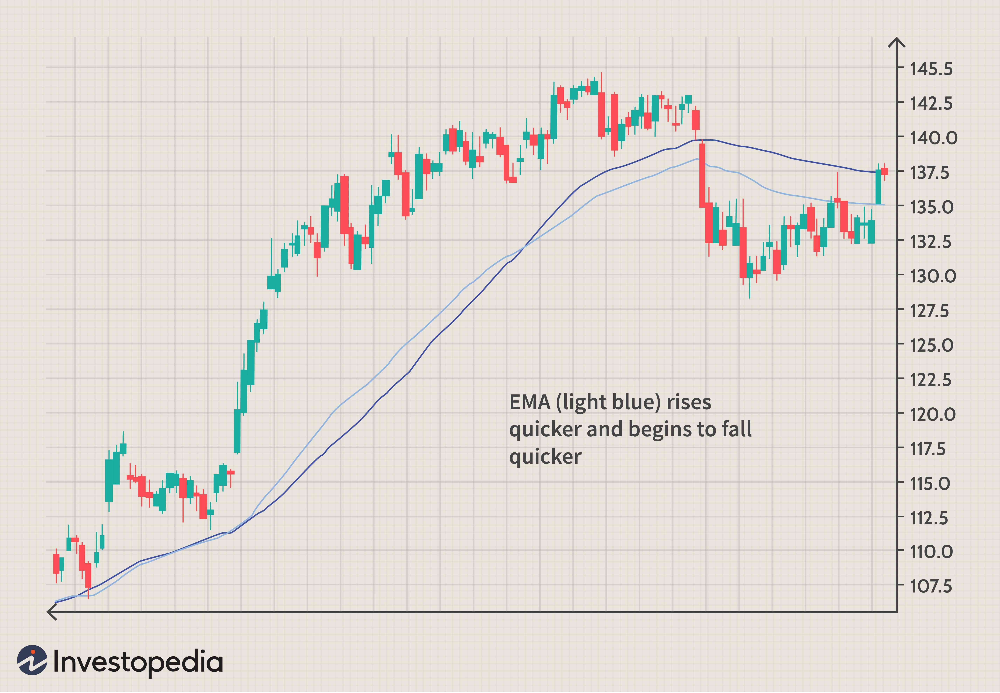

The financial market remains a dynamic and constantly changing arena, with stocks emerging as one of the most actively traded assets worldwide. This intense activity stems from the continuous pursuit by investors and traders for reliable methodologies to inform their trading decisions. Among various tools and techniques, moving averages have become a cornerstone in stock investment, particularly enhancing algorithmic trading strategies.

Moving averages are mathematical calculations that smooth out price data over a specific period, enabling traders to identify trends and potential reversals in the market efficiently. By applying moving averages, investors can transform volatile price fluctuations into more stable indicators of market direction. This method not only provides clarity but also lays a solid foundation for algorithmic trading strategies, where decision-making can be systematically automated based on historical data.



Algorithmic trading leverages these mathematical constructs to program trading systems that execute buy or sell orders under predefined conditions, thereby reducing the impact of human emotions and enhancing execution speed. Moving averages are pivotal in this regard, as they help establish critical entry and exit points in the trading algorithm.

Understanding moving averages is crucial for investors aiming to optimize their portfolio performance. By mastering core concepts and techniques related to moving averages, traders can significantly increase their potential for making profitable stock investments. This article aims to provide a comprehensive exploration of moving averages and their application in modern trading strategies, emphasizing their importance in creating a robust framework for technical analysis.

## Table of Contents

## Understanding Moving Averages

Moving averages are statistical tools extensively used in data analysis, particularly in the context of financial markets such as stock trading. They are designed to smooth out short-term fluctuations and highlight longer-term trends or cycles in data, essentially creating a simpler trend line from a complex data set. In stock trading, moving averages are used to observe and predict trends by creating a series of averages from different time periods of price data.

There are various moving averages types, with the Simple Moving Average (SMA) and Exponential Moving Average (EMA) being among the most commonly used. 

The Simple Moving Average (SMA) calculates the arithmetic mean of a specified number of prices (usually closing prices) over a defined period. It is computed by summing up all the data points within a given window and then dividing by the number of periods in that window. The formula for SMA is:

$$
\text{SMA} = \frac{P_1 + P_2 + \cdots + P_n}{n}
$$

where $P_1, P_2, \ldots, P_n$ are the prices at each period in the window, and $n$ is the total number of periods in the window. The SMA is straightforward but has the drawback of weighting each price equally, which can be less responsive to current market conditions.

In contrast, the Exponential Moving Average (EMA) places greater weight on more recent prices, making it more responsive to new information compared to the SMA. The EMA is calculated using a smoothing [factor](/wiki/factor-investing), which applies a constant weight to current prices. The formula for EMA is often represented recursively:

$$
\text{EMA}_t = (P_t \times \frac{2}{n+1}) + \text{EMA}_{t-1} \times (1 - \frac{2}{n+1})
$$

where $P_t$ is the current price, $\text{EMA}_{t-1}$ is the EMA of the previous period, and $n$ is the number of periods over which the EMA is calculated. This weighted calculation means that the EMA gives more significance to the most recent data, reacting more quickly to price changes than the SMA.

Both SMA and EMA are used by traders to create strategies that potentially capitalize on market trends. While SMA is simpler and provides a basic understanding of trend direction, EMA responds more swiftly to price changes, which can be advantageous in dynamic market environments. Understanding these moving averages is crucial for traders looking to analyze market trends effectively and develop strategies to execute trades based on statistical insights.

## Importance of Moving Averages in Stock Trading

Moving averages play a vital role in stock trading by helping traders identify market trends and define support and resistance levels. A moving average smooths out price fluctuations, revealing the underlying direction of price movements over a specified period. This smoothing effect is crucial for cutting through market noise, providing a clearer picture of prevailing trends and helping traders make informed decisions based on past price actions.

Moving averages hold significant importance in technical analysis. As one of the most utilized indicators, they offer critical insights into the profitability of stocks by enabling traders to forecast potential future movements. Due to the lagging nature of moving averages, traders interpret them as dynamic trend lines that assist in recognizing trends' sustainability and reversal points.

Incorporating moving averages into [algorithmic trading](/wiki/algorithmic-trading) strategies further underscores their importance. Through programming, traders can automate entry and [exit](/wiki/exit-strategy) points based on specific conditions defined by moving averages. For example, an algorithm can be set to trigger a buy order when a short-term moving average surpasses a long-term moving average, signaling a potential upward trend. This systematic approach provides a consistent method to execute trades, minimizing emotional bias and enabling quick decision-making.

Python libraries such as Pandas and NumPy can be employed to implement moving averages in a trading algorithm. A simple implementation might look like this:

```python
import pandas as pd

# Load stock data
data = pd.read_csv('stock_data.csv')
data['Date'] = pd.to_datetime(data['Date'])
data.set_index('Date', inplace=True)

# Calculate moving averages
short_term_window = 20
long_term_window = 50
data['Short_MA'] = data['Close'].rolling(window=short_term_window).mean()
data['Long_MA'] = data['Close'].rolling(window=long_term_window).mean()

# Determine buy/sell signals
data['Signal'] = 0
data['Signal'][short_term_window:] = \
    np.where(data['Short_MA'][short_term_window:] > data['Long_MA'][short_term_window:], 1, -1)

# Execute trades based on signals
data['Position'] = data['Signal'].shift()
```

This code snippet demonstrates setting up a basic moving average crossover strategy to buy or sell a stock based on the interaction between a short-term and long-term moving average. By [backtesting](/wiki/backtesting) and refining these strategies, traders can optimize their algorithms to improve trading outcomes.

Overall, moving averages are indispensable tools in stock trading. They provide traders with a better understanding of market trends and facilitate the development of robust, algorithm-driven strategies for executing trades efficiently and effectively.

## How to Use Moving Averages for Buying Stocks

Moving averages are widely utilized as technical indicators in stock trading due to their ability to smooth price data and identify potential buy and sell signals. One prevalent approach is using moving average crossovers. This method involves comparing short-term and long-term moving averages to generate buy or sell signals based on their interactions.

### Moving Average Crossovers

#### Bullish Crossover (Buy Signal)
A bullish crossover occurs when a shorter-term moving average crosses above a longer-term moving average. This event suggests a potential upward shift in a stock's [momentum](/wiki/momentum), signaling traders to consider buying the stock. For instance, if a 10-day simple moving average (SMA) surpasses a 30-day SMA, it is generally interpreted as a buy signal. 

Mathematically, for two moving averages $MA_{\text{short}}$ and $MA_{\text{long}}$, a bullish crossover can be represented as:
$$

MA_{\text{short}}(t) > MA_{\text{long}}(t) 
$$
where $t$ denotes the current time period.

#### Bearish Crossover (Sell Signal)
Conversely, a bearish crossover takes place when a shorter-term moving average drops below a longer-term moving average. This pattern often indicates a downturn in momentum, suggesting it may be time to sell the asset. For example, if the same 10-day SMA declines below the 30-day SMA, it would typically signal readiness to sell.

In mathematical terms, a bearish crossover is:
$$

MA_{\text{short}}(t) < MA_{\text{long}}(t) 
$$

### Chart Visualization

Incorporating moving averages into stock charts allows investors to visually track price trends. Charting software often highlights these crossovers, providing clear visual cues for potential buy or sell points. This enhances decision-making by enabling traders to swiftly acknowledge market trends and adjust their investment strategies accordingly.

### Implementing in Python

To implement moving average crossovers in Python, one can utilize the pandas library to compute moving averages and identify crossover points:

```python
import pandas as pd

# Assuming 'df' is a DataFrame containing stock price data with a 'Close' column
df['SMA_10'] = df['Close'].rolling(window=10).mean()
df['SMA_30'] = df['Close'].rolling(window=30).mean()

# Identifying crossovers
df['Signal'] = 0
df['Signal'][10:] = np.where(df['SMA_10'][10:] > df['SMA_30'][10:], 1, 0)
df['Position'] = df['Signal'].diff()

# 'Position' == 1 indicates a buy signal; 'Position' == -1 indicates a sell signal
buy_signals = df[df['Position'] == 1]
sell_signals = df[df['Position'] == -1]
```

### Conclusion

Using moving average crossovers is a fundamental strategy in stock trading, offering clear signals for entry and exit points. While these signals are not foolproof, their integration with other technical indicators and sound risk management can enhance the effectiveness of trading strategies. Understanding how to leverage moving averages can play a pivotal role in crafting systematic, disciplined approaches to stock investing.

## Algorithmic Trading with Moving Averages

Algorithmic trading, also known as algo trading, leverages computer programs to execute trades at high speeds and volumes based on established criteria. Moving averages are a key component in these algorithms, and they help automate the decision-making process for entering and exiting trades. Traders build algorithms that use moving averages to recognize potential buy or sell signals, minimizing the need for manual intervention.

A typical application of moving averages in algorithmic trading is using crossover strategies. For example, when a shorter-term moving average, such as a 50-day moving average, crosses above a longer-term moving average, like a 200-day moving average, it may signal a buying opportunity. Conversely, the crossover below may indicate a selling opportunity. These conditions can be coded into algorithms to automate trades. Below is a simple Python example using the pandas library to identify moving average crossovers:

```python
import pandas as pd

def moving_average_crossover_strategy(data, short_window=50, long_window=200):
    data['Short_MA'] = data['Close'].rolling(window=short_window, min_periods=1).mean()
    data['Long_MA'] = data['Close'].rolling(window=long_window, min_periods=1).mean()
    data['Signal'] = 0
    data['Signal'][short_window:] = np.where(data['Short_MA'][short_window:] > data['Long_MA'][short_window:], 1, -1)
    data['Position'] = data['Signal'].diff()

    return data

# Example usage:
# data is a DataFrame with historical stock closing prices
signal_data = moving_average_crossover_strategy(data)
```

Traders can enhance the effectiveness of their algorithms by combining moving averages with other technical indicators such as Moving Average Convergence Divergence (MACD) or Relative Strength Index (RSI). These indicators can provide additional context to price movements and refine trade signals further.

Backtesting is an essential phase in algorithmic trading. It involves testing the algorithm on historical data to evaluate its performance and profitability before applying it to live markets. This step helps refine strategies and assess potential risks and returns.

One significant advantage of algorithmic trading with moving averages is the reduction in emotional bias. By relying on predefined conditions, traders are less likely to make impulsive decisions based on emotional reactions to market fluctuations. Additionally, algorithms can execute high-frequency trades rapidly, capitalizing on transient market inefficiencies beyond the capabilities of manual trading.

Algorithmic trading with moving averages streamlines trading operations, speeds up execution, and allows traders to systematically engage with the market while managing risk effectively. However, traders must remain vigilant and continuously adapt their algorithms to evolving market conditions.

## Pros and Cons of Using Moving Averages

Moving averages are a fundamental tool in stock trading, offering both advantages and disadvantages for investors and traders. One of the primary benefits of using moving averages is their simplicity. They offer a clear, straightforward means of identifying trends in price data, making it easier for traders to understand market movements without requiring extensive calculations or complex models. Moving averages can be applied across various time frames, providing versatility to traders who may have different investment horizons.

Another significant advantage is the ability of moving averages to smooth out price data. By calculating the average of a selected range of prices, they effectively filter out short-term noise and fluctuations. This smoothing effect helps traders focus on the underlying trend rather than being distracted by volatile price swings.

Moving averages also integrate seamlessly with trading software, allowing for easy incorporation into trading algorithms. Their simplicity and efficiency make them ideal for automated trading systems that rely on technical indicators to execute trades systematically.

However, moving averages have their limitations, notably their lagging nature. Since moving averages are calculated based on historical data, they inherently react more slowly to recent market movements. This lag can be problematic in fast-moving markets, where timely decision-making is crucial. Traders may find themselves reacting too late to changes in trend direction, potentially impacting profitability.

Moreover, in sideways or range-bound markets, moving averages can generate false signals. When prices are not trending significantly in either direction, moving averages might lead traders to anticipate a trend change that does not materialize, resulting in unwarranted trades. This tendency to produce misleading signals in non-trending environments is a significant drawback, highlighting the importance of using moving averages in conjunction with other technical indicators to improve accuracy. 

Overall, while moving averages offer valuable insights into market trends and are a vital component of many trading strategies, traders must be aware of their limitations and employ them judiciously alongside other analytical tools.

## Advanced Strategies with Moving Averages

Traders seeking to refine their strategies often employ advanced techniques with moving averages. One such approach involves multi-time frame analysis. By assessing moving averages across different time frames, traders can gain a broader perspective on market trends. This holistic view helps in identifying alignments or divergences between short-term and long-term trends, aiding in more informed decision-making.

A common practice to validate these trends is combining moving averages with [volume](/wiki/volume-trading-strategy) indicators. Volume provides insight into the strength and reliability of a trend. For instance, a substantial change in price accompanied by high volume can confirm the significance of a price movement. Therefore, by pairing moving averages with volume signals, traders can enhance the robustness of trend validation.

Another advanced strategy involves customizing moving average periods based on security [volatility](/wiki/volatility-trading-strategies). Securities exhibit different levels of volatility, influencing the choice of moving average periods. More volatile markets might require shorter-period moving averages for timely responses to price changes, whereas stable markets might benefit from longer periods to filter out noise and prevent overtrading. This customization process allows traders to adapt their strategies to the unique characteristics of the securities they trade.

Understanding the risk profile associated with different moving averages is essential for tailored investment approaches. Short-term moving averages tend to react more quickly to price changes, which can be advantageous in capturing early signals in trending markets but may lead to false signals in choppy markets. Conversely, long-term moving averages are slower to respond, possibly resulting in lagged entries and exits but offering greater stability and fewer false signals. Traders must assess their risk tolerance and investment goals to choose the appropriate moving average strategy, ensuring alignment with their overall trading objectives.

By integrating these advanced techniques, traders can optimize their use of moving averages, leading to a more nuanced and effective trading strategy.

## Conclusion

Incorporating moving averages into stock trading strategies offers a robust framework for technical analysis by smoothing out price data and revealing trends that are critical for decision-making. The essence of moving averages is their simplicity and efficiency in providing a clear view of the market's direction, which is crucial for traders looking to base their decisions on historical price movements. Despite their lagging nature, which can lead to delayed signals, moving averages remain invaluable due to their capacity to filter out market noise and highlight genuine trends.

Traders can effectively harness the power of moving averages through technology to optimize their trading strategies. By integrating moving averages into automated algorithms, traders can facilitate systematic trading strategies that minimize emotional bias and increase execution efficiency. For example, coding a moving average crossover strategy in Python could involve using libraries like `Pandas` for handling data and `Matplotlib` for visualization. Consider this basic implementation:

```python
import pandas as pd
import matplotlib.pyplot as plt

# Assuming 'data' is a DataFrame containing stock prices with a 'Close' column
data['SMA_50'] = data['Close'].rolling(window=50).mean()
data['SMA_200'] = data['Close'].rolling(window=200).mean()

plt.figure(figsize=(14,7))
plt.plot(data['Close'], label='Stock Price')
plt.plot(data['SMA_50'], label='50-day SMA', alpha=0.7)
plt.plot(data['SMA_200'], label='200-day SMA', alpha=0.7)
plt.title('Stock Price and Moving Averages')
plt.legend()
plt.show()
```

This script plots the stock price alongside its 50-day and 200-day Simple Moving Averages (SMA), providing a visual tool to assess potential crossover signals. Such tools demonstrate the practicality of moving averages in developing robust trading systems.

Educating oneself on the effective use of moving averages can lead to more informed investment decisions and potentially better trade outcomes. Understanding different types of moving averages, such as Simple Moving Average (SMA) and Exponential Moving Average (EMA), and how they react to market conditions allows traders to tailor their strategies to current market dynamics. Although not without flaws, when combined with other technical indicators, moving averages form a cornerstone of comprehensive technical analysis strategies. By continually refining these strategies and staying informed about market conditions, traders can enhance their ability to capitalize on market trends and improve their investment performance.

## References & Further Reading

[1]: Bergstra, J., Bardenet, R., Bengio, Y., & Kégl, B. (2011). ["Algorithms for Hyper-Parameter Optimization."](https://papers.nips.cc/paper/4443-algorithms-for-hyper-parameter-optimization) Advances in Neural Information Processing Systems 24.

[2]: ["Advances in Financial Machine Learning"](https://www.amazon.com/Advances-Financial-Machine-Learning-Marcos/dp/1119482089) by Marcos Lopez de Prado

[3]: ["Evidence-Based Technical Analysis: Applying the Scientific Method and Statistical Inference to Trading Signals"](https://www.amazon.com/Evidence-Based-Technical-Analysis-Scientific-Statistical/dp/0470008741) by David Aronson

[4]: ["Machine Learning for Algorithmic Trading"](https://github.com/stefan-jansen/machine-learning-for-trading) by Stefan Jansen

[5]: ["Quantitative Trading: How to Build Your Own Algorithmic Trading Business"](https://www.amazon.com/Quantitative-Trading-Build-Algorithmic-Business/dp/1119800064) by Ernest P. Chan