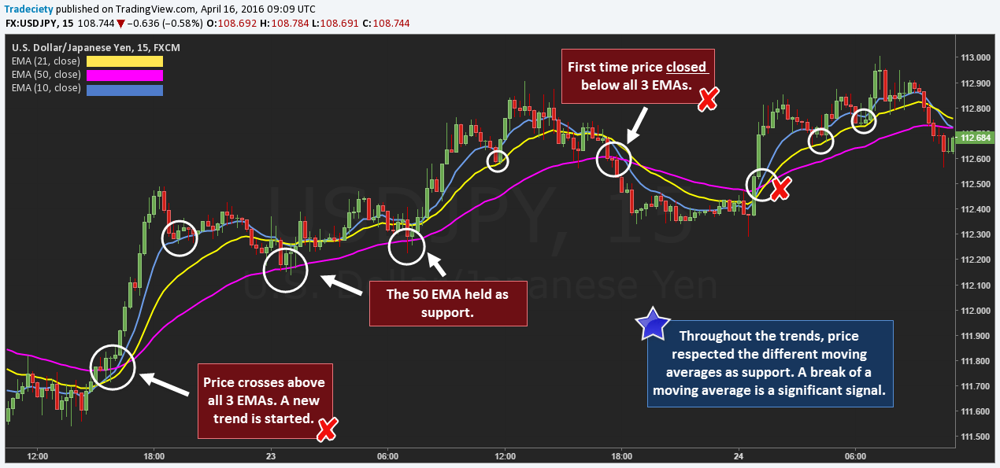

## Table of Contents

## What is a moving average and how is it calculated?

A moving average is a way to smooth out data over time. It helps to see trends by averaging a set of numbers from a certain period. This is useful in many areas, like finance, where it can show the general direction of stock prices without the ups and downs of daily changes.

To calculate a moving average, you pick a time period, like 10 days. Then, you add up the data for those 10 days and divide by 10. Each day, you drop the oldest data point and add the newest one, then recalculate the average. This keeps the average "moving" as new data comes in, showing how the trend is changing over time.

## What are the different types of moving averages?

There are mainly two types of moving averages: simple moving averages (SMA) and exponential moving averages (EMA). A simple moving average is the most basic type. It's calculated by adding up a set of numbers, like the closing prices of a stock over a certain number of days, and then dividing by the number of days. For example, if you want a 10-day SMA, you add up the closing prices of the last 10 days and divide by 10. Each day, you drop the oldest price and add the newest one, then recalculate the average.

An exponential moving average is a bit more complex but gives more weight to recent data. This means it reacts faster to new information. To calculate an EMA, you start with an SMA for the first calculation. After that, you use a formula that includes a smoothing factor, which is usually based on the number of periods you're using. For example, for a 10-day EMA, the formula would give more importance to the most recent day's price than to the price from 10 days ago. This makes the EMA more sensitive to recent changes in the data.

Both types of moving averages are useful, but they serve slightly different purposes. SMAs are good for seeing the overall trend over a longer period, while EMAs are better for traders who want to react quickly to new trends. Choosing between them depends on what you're trying to achieve with your analysis.

## How can moving averages help in identifying trends in stock prices?

Moving averages help spot trends in stock prices by smoothing out the ups and downs. Imagine you're looking at a stock's price every day. It can jump around a lot, making it hard to see if the price is really going up or down over time. By using a moving average, you can take the average price over a certain number of days, like 50 or 200 days. This average line is smoother and helps you see the general direction the stock is moving. If the moving average line is going up, it suggests the stock's price is trending upwards. If it's going down, the trend is downwards.

There are two common types of moving averages: simple and exponential. A simple moving average (SMA) is just the average price over a set number of days. It's easy to understand but can be slow to react to new price changes. An exponential moving average (EMA) is more complicated because it gives more weight to recent prices. This means it can show you new trends faster than an SMA. By looking at both types of moving averages, you can get a better sense of whether a stock is starting a new trend or if the current trend is continuing. This can help you decide when to buy or sell a stock based on the direction of the trend.

## What is the significance of the 50-day and 200-day moving averages in stock analysis?

The 50-day and 200-day moving averages are important tools in stock analysis because they help investors see the bigger picture of a stock's price movement. The 50-day moving average looks at the average price of a stock over the past 50 days. This gives a short-term view of where the stock is heading. If the stock's price is above the 50-day moving average, it might mean the stock is doing well in the short term. On the other hand, if the price is below this average, it could be a sign that the stock is struggling in the short term.

The 200-day moving average looks at the average price over the past 200 days, giving a longer-term view of the stock's trend. This average is often used to see if a stock is in a long-term uptrend or downtrend. If the stock price is above the 200-day moving average, it's generally seen as a good sign for the stock's long-term health. If it's below, it might suggest the stock is in a long-term downtrend. Many investors pay close attention to when the 50-day moving average crosses above or below the 200-day moving average, as this can signal major shifts in the stock's trend.

## How can moving averages be used to generate buy and sell signals?

Moving averages can help you decide when to buy or sell a stock by showing you when the stock's price is changing direction. One common way to use moving averages for this is called the "crossover" method. In this method, you look at two moving averages, like the 50-day and 200-day moving averages. If the shorter-term moving average (like the 50-day) goes above the longer-term moving average (like the 200-day), it's called a "golden cross." This can be a sign that it's a good time to buy the stock because it might mean the stock is starting a new upward trend.

On the other hand, if the shorter-term moving average goes below the longer-term moving average, it's called a "death cross." This could be a signal to sell the stock because it might mean the stock is starting a new downward trend. Besides the crossover method, you can also use a single moving average to make decisions. For example, if the stock's price goes above its moving average, it might be a good time to buy. If the price goes below the moving average, it might be time to sell. These signals help you spot changes in the stock's trend and make better choices about when to buy or sell.

## What is the difference between a simple moving average (SMA) and an exponential moving average (EMA)?

A simple moving average (SMA) is a basic way to smooth out data over time. To calculate it, you add up the values for a certain number of days and divide by that number. For example, a 10-day SMA is the total of the last 10 days' prices divided by 10. Each day, you drop the oldest price and add the newest one, then recalculate the average. This method treats all the days equally, so it's slower to react to new changes in the data. It's good for seeing the overall trend over a longer period.

An exponential moving average (EMA) is more complex because it gives more importance to recent data. This means it can react faster to new changes in the stock price. To calculate an EMA, you start with an SMA for the first calculation. Then, you use a formula that includes a smoothing factor, which is usually based on the number of days you're using. For example, a 10-day EMA will give more weight to the most recent day's price than to the price from 10 days ago. This makes the EMA more sensitive to recent changes, which can be helpful for traders who want to spot new trends quickly.

## How do moving average crossovers work, and what do they indicate?

Moving average crossovers are a way to spot when a stock's trend might be changing. You use two moving averages, like a short-term one (such as a 50-day moving average) and a long-term one (like a 200-day moving average). When the short-term moving average crosses above the long-term one, it's called a "golden cross." This can mean the stock is starting to go up, and it might be a good time to buy. On the other hand, if the short-term moving average crosses below the long-term one, it's called a "death cross." This can mean the stock is starting to go down, and it might be a good time to sell.

These crossovers help you see big changes in the stock's direction. A golden cross shows that the short-term trend is getting stronger than the long-term trend, which can signal the start of a new upward trend. A death cross shows that the short-term trend is getting weaker than the long-term trend, which can signal the start of a new downward trend. By watching these crossovers, you can make better choices about when to buy or sell a stock based on where you think the price is heading.

## Can moving averages be used effectively in volatile markets?

Moving averages can be used in volatile markets, but they have some challenges. In a volatile market, stock prices can swing a lot from day to day. This can make moving averages less reliable because they are meant to smooth out these swings and show the overall trend. If the market is too jumpy, the moving average might not give a clear picture of what's going on. For example, a short-term moving average like a 50-day one might react too quickly to price changes, making it hard to see the bigger trend.

Despite these challenges, moving averages can still be helpful in volatile markets if you use them the right way. One trick is to use longer-term moving averages, like a 200-day one, which can give a smoother view of the trend and help you ignore the daily ups and downs. Another approach is to use multiple moving averages together, like a 50-day and a 200-day, to see when they cross over each other. This can help you spot when the trend might be changing, even in a volatile market. By understanding these tools and how they work, you can make better decisions even when the market is unpredictable.

## What are the limitations and potential pitfalls of using moving averages for stock investment?

Moving averages can help you see trends in stock prices, but they have some problems. One big problem is that they can be slow to react to changes in the market. If a stock's price starts to change quickly, the moving average might not show this right away. This means you might miss out on buying or selling at the best time. Also, moving averages can give you false signals. Sometimes, the price might cross over the moving average, making you think the trend is changing, but then it goes back to where it was before. This can lead to bad decisions if you rely too much on these signals.

Another issue is that moving averages can be affected by big price swings in the market. If the market is very volatile, the moving average might not give you a clear picture of what's happening. This can make it hard to tell if the stock is really going up or down. Also, different people use different time periods for their moving averages, like 50 days or 200 days. What works for one person might not work for another, so it can be tricky to know which one to use. Because of these problems, it's a good idea to use moving averages along with other tools and not depend on them alone when making choices about buying or selling stocks.

## How can moving averages be combined with other technical indicators to improve investment decisions?

Moving averages can be made more useful when you use them with other tools called technical indicators. One common way is to use them with something called the Relative Strength Index (RSI). The RSI helps you see if a stock is overbought or oversold. If the RSI shows a stock is overbought and the price goes below the moving average, it might be a good time to sell. If the RSI shows a stock is oversold and the price goes above the moving average, it might be a good time to buy. By looking at both, you get a better idea of when to make your move.

Another helpful tool to use with moving averages is the Moving Average Convergence Divergence (MACD). The MACD helps you see the difference between two moving averages and can show you when the trend might be changing. When the MACD line crosses above the signal line, it might be a good time to buy, especially if the price is also above the moving average. If the MACD line crosses below the signal line, it might be a good time to sell, especially if the price is below the moving average. Using the MACD with moving averages can give you a clearer picture of what's happening with the stock and help you make better choices about when to buy or sell.

## What advanced strategies involve using multiple moving averages simultaneously?

One advanced strategy that uses multiple moving averages is called the "triple moving average" method. In this strategy, you use three moving averages with different time periods, like a short-term one (such as a 10-day), a medium-term one (like a 20-day), and a long-term one (such as a 50-day). When the short-term moving average crosses above both the medium and long-term ones, it might be a strong signal to buy the stock because it shows a strong upward trend. On the other hand, if the short-term moving average crosses below both the medium and long-term ones, it could be a strong signal to sell because it shows a strong downward trend. By using three moving averages, you get a more detailed view of the trend and can make better decisions.

Another strategy is the "ribbon" method, where you use several moving averages with time periods that are close to each other, like 10-day, 15-day, 20-day, and so on. When these moving averages are plotted on a chart, they create a "ribbon" effect. If all the moving averages are moving up and spreading out, it can show a strong upward trend, which might be a good time to buy. If they are moving down and spreading out, it can show a strong downward trend, which might be a good time to sell. If the moving averages start to cross over each other and get tangled, it might mean the market is getting choppy and it's harder to see the trend. This method helps you see the strength and direction of the trend more clearly by looking at how these lines move together.

## How can historical data and backtesting be used to refine moving average strategies for stock investment?

Historical data and [backtesting](/wiki/backtesting) are important tools that help you make your moving average strategies better for stock investment. By looking at old stock prices, you can see how well your moving average strategy would have worked in the past. This is called backtesting. You take your strategy, like using a 50-day and 200-day moving average crossover, and apply it to past data to see if it would have told you to buy or sell at the right times. If you find that your strategy worked well in the past, you might feel more confident using it now. But if it didn't work well, you can change your strategy, maybe by using different time periods for your moving averages or adding other indicators to help make better decisions.

Backtesting also helps you see the strengths and weaknesses of your moving average strategy. You can find out if your strategy makes more money than it loses, how often it gives you good signals, and how often it gives you bad signals. This can help you tweak your strategy to make it better. For example, if you see that your strategy works better in certain types of markets, like when the market is going up, you might decide to use it only in those conditions. By using historical data and backtesting, you can fine-tune your moving average strategy to fit the way the stock market moves and make smarter choices about when to buy and sell stocks.

## What is Understanding Moving Averages?

Moving averages are statistical tools extensively used in data analysis, particularly in the context of financial markets such as stock trading. They are designed to smooth out short-term fluctuations and highlight longer-term trends or cycles in data, essentially creating a simpler trend line from a complex data set. In stock trading, moving averages are used to observe and predict trends by creating a series of averages from different time periods of price data.

There are various moving averages types, with the Simple Moving Average (SMA) and Exponential Moving Average (EMA) being among the most commonly used. 

The Simple Moving Average (SMA) calculates the arithmetic mean of a specified number of prices (usually closing prices) over a defined period. It is computed by summing up all the data points within a given window and then dividing by the number of periods in that window. The formula for SMA is:

$$
\text{SMA} = \frac{P_1 + P_2 + \cdots + P_n}{n}
$$

where $P_1, P_2, \ldots, P_n$ are the prices at each period in the window, and $n$ is the total number of periods in the window. The SMA is straightforward but has the drawback of weighting each price equally, which can be less responsive to current market conditions.

In contrast, the Exponential Moving Average (EMA) places greater weight on more recent prices, making it more responsive to new information compared to the SMA. The EMA is calculated using a smoothing [factor](/wiki/factor-investing), which applies a constant weight to current prices. The formula for EMA is often represented recursively:

$$
\text{EMA}_t = (P_t \times \frac{2}{n+1}) + \text{EMA}_{t-1} \times (1 - \frac{2}{n+1})
$$

where $P_t$ is the current price, $\text{EMA}_{t-1}$ is the EMA of the previous period, and $n$ is the number of periods over which the EMA is calculated. This weighted calculation means that the EMA gives more significance to the most recent data, reacting more quickly to price changes than the SMA.

Both SMA and EMA are used by traders to create strategies that potentially capitalize on market trends. While SMA is simpler and provides a basic understanding of trend direction, EMA responds more swiftly to price changes, which can be advantageous in dynamic market environments. Understanding these moving averages is crucial for traders looking to analyze market trends effectively and develop strategies to execute trades based on statistical insights.

## References & Further Reading

[1]: Bergstra, J., Bardenet, R., Bengio, Y., & Kégl, B. (2011). ["Algorithms for Hyper-Parameter Optimization."](https://papers.nips.cc/paper/4443-algorithms-for-hyper-parameter-optimization) Advances in Neural Information Processing Systems 24.

[2]: ["Advances in Financial Machine Learning"](https://www.amazon.com/Advances-Financial-Machine-Learning-Marcos/dp/1119482089) by Marcos Lopez de Prado

[3]: ["Evidence-Based Technical Analysis: Applying the Scientific Method and Statistical Inference to Trading Signals"](https://www.amazon.com/Evidence-Based-Technical-Analysis-Scientific-Statistical/dp/0470008741) by David Aronson

[4]: ["Machine Learning for Algorithmic Trading"](https://github.com/stefan-jansen/machine-learning-for-trading) by Stefan Jansen

[5]: ["Quantitative Trading: How to Build Your Own Algorithmic Trading Business"](https://www.amazon.com/Quantitative-Trading-Build-Algorithmic-Business/dp/1119800064) by Ernest P. Chan