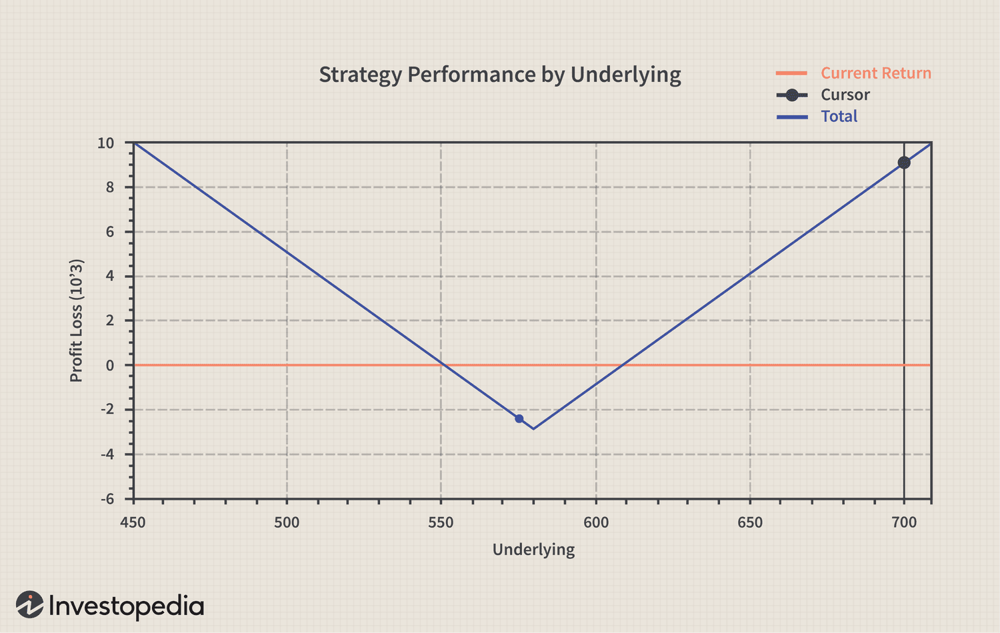

The landscape of financial trading is experiencing significant transformation, largely due to the rapid advancements in technology and data science. These innovations are reshaping the way investors and traders engage with financial markets. Central to this evolution are options trading, earnings predictions, and financial forecasting, which have become critical in the decision-making processes for market participants.

Options trading provides a versatile approach to investing, allowing traders to speculate on asset price movements without the need for direct ownership of the assets. This flexibility opens up numerous strategic possibilities, enabling traders to navigate market volatility with precision.



Earnings predictions, which involve forecasting a company's financial performance, are especially pivotal during earnings season. The anticipation of earnings results can lead to significant stock price fluctuations, offering traders opportunities to profit from volatility. Accurately predicting these earnings outcomes enhances the efficacy of trading strategies.

Financial forecasting, on the other hand, employs a mix of statistical models and economic indicators to project future market conditions. This analytical approach equips traders with insights into potential market trends, aiding in strategic planning and risk management.

Algorithmic trading has emerged as a transformative tool that leverages the integration of options trading, earnings predictions, and financial forecasting. By utilizing automated systems, algorithmic trading optimizes decision-making through pre-defined criteria and predictive models. The incorporation of machine learning and artificial intelligence further strengthens these systems, enhancing their accuracy and operational efficiency.

In summary, the convergence of options trading, earnings predictions, and financial forecasting within algorithmic trading represents a revolution in the financial sector. This synergy is creating unprecedented opportunities and efficiencies, empowering traders to navigate the complexities of modern financial markets more effectively.

## Table of Contents

## The Basics of Options Trading

Options trading is a crucial part of the financial markets, serving as a derivative instrument that gets its value from the price movement of an underlying asset. These instruments offer investors the ability to speculate on price movements without the necessity of owning the actual asset, thereby providing a level of leverage and risk management that can be strategically utilized in diverse market conditions.

### Derivative Nature of Options

Options are categorized into two main types: call options and put options. A call option provides the holder the right, but not the obligation, to purchase an asset at a predetermined price (the strike price) within a certain time frame. Conversely, a put option grants the holder the right, but not the obligation, to sell an asset at the strike price before the option's expiration date.

$$
\text{Intrinsic Value of a Call} = \max(0, \text{S} - \text{K})
$$

$$
\text{Intrinsic Value of a Put} = \max(0, \text{K} - \text{S})
$$

Where:
- $\text{S}$ is the current price of the underlying asset.
- $\text{K}$ is the strike price of the option.

### Strategic Applications

Options can be used in various strategic capacities in trading. One basic strategy is using options for hedging, which involves protecting an existing portfolio against downside risk. For instance, an investor holding a stock portfolio might purchase put options as a form of insurance against potential losses. This mitigates the risk exposure without directly selling the underlying assets.

Another strategy is speculation, where traders aim to profit from anticipated moves in an asset's price. A trader expecting a rise in the price of a stock might purchase call options, seeking a leveraged return from an upward move. Conversely, if a price decline is expected, buying put options might be more appropriate.

The flexibility of options also allows for more sophisticated strategies, such as straddles and spreads, which can be employed based on [volatility](/wiki/volatility-trading-strategies) predictions and other market conditions. For example, a straddle involves buying both a call and a put option at the same strike price and expiration, allowing profits to be made irrespective of price direction, provided there is significant movement.

### Considerations in Options Trading

While offering substantial opportunities, options come with inherent risks and complexities. Factors such as time decay, volatility levels, and market sentiment must be continuously assessed. The options pricing models, like the Black-Scholes model, are critical in determining the fair value of options. This model factors in variables such as the underlying asset's price, strike price, time to expiration, risk-free rate, and volatility.

Python can be utilized for calculating options pricing and executing trades. Here’s a simple implementation using Python’s libraries to calculate the theoretical price of a European call option using the Black-Scholes formula:

```python
from scipy.stats import norm
import numpy as np

def black_scholes_call(S, K, T, r, sigma):
    d1 = (np.log(S / K) + (r + 0.5 * sigma**2) * T) / (sigma * np.sqrt(T))
    d2 = d1 - sigma * np.sqrt(T)
    call_price = S * norm.cdf(d1) - K * np.exp(-r * T) * norm.cdf(d2)
    return call_price

# Example parameters
S = 100  # Current stock price
K = 100  # Strike price
T = 1    # Time to expiration in years
r = 0.05 # Risk-free interest rate
sigma = 0.2 # Volatility

print("Call Option Price: ", black_scholes_call(S, K, T, r, sigma))
```

This highlights how a methodical approach to options trading, supported by mathematical models and technology, can provide significant potential for profit while managing risk.

## Earnings Predictions: A Key Driver

Earnings predictions are a crucial aspect of financial analysis, involving the estimation of a company's financial performance over a specific period. These predictions primarily focus on metrics such as revenue, earnings per share (EPS), and net income, which serve as indicators of a company's profitability and financial health. Accurate earnings predictions can lead to substantial movements in stock prices, particularly during earnings season, a period marked by increased volatility as companies release their quarterly results.

Stock prices are sensitive to earnings announcements because they offer insights into a company's operational efficiency and future growth prospects. As a result, investors and traders closely monitor these predictions to adjust their portfolios accordingly. A company's actual earnings that exceed or fall short of market expectations can lead to significant price adjustments. Hence, traders frequently capitalize on these movements through options trading strategies.

Options, being derivative instruments, offer strategic flexibility to traders seeking to profit from the anticipated volatility associated with earnings announcements. By employing specific strategies like straddles, strangles, or earnings trades, traders can speculate on potential stock price movements without directly owning the underlying asset. Such strategies allow traders to benefit from both upward and downward price shifts, depending on the prediction's accuracy and market reaction.

The relationship between earnings predictions and option pricing is substantial. Implied volatility, a critical component in the pricing of options, often surges around earnings announcements due to the uncertainty surrounding the event. Traders who anticipate a larger-than-usual movement in a stock's price may invest in options to exploit these volatility spikes. For instance, purchasing a straddle involves buying both a call and a put option with the same strike price and expiry date. This strategy profits from significant price movement, regardless of direction, provided the movement is substantial enough to cover the cost of the options.

In summary, accurate earnings predictions are vital for traders looking to optimize returns and manage risks effectively. They leverage these predictions through sophisticated options strategies to navigate the heightened volatility characteristic of earnings season, thereby enhancing their financial success.

## Financial Forecasting Techniques

Financial forecasting is an essential component in predicting future market conditions, leveraging statistical models and economic indicators to inform decision-making strategies in the financial domain. The techniques are diverse, each offering distinct approaches and insights, making them valuable for both traditional and [algorithmic trading](/wiki/algorithmic-trading).

**Fundamental Analysis**

Fundamental analysis is a method of evaluating securities by attempting to measure the intrinsic value of a stock. It involves examining related economic, financial, and other qualitative and quantitative factors. Analysts who follow this method seek to scrutinize everything that can affect the value of a security, including macroeconomic factors (like the overall economy and industry conditions) and microeconomic factors (like the financial conditions and management of companies). The goal is to derive a value for the stock that can be compared to the current price to determine whether the stock is undervalued or overvalued.

**Time Series Analysis**

Time series analysis involves forecasting future values based on previously observed values. It is a crucial part of financial forecasting, and its applications extend to stock price prediction, interest rates forecasting, and other financial metrics. This method relies heavily on data that is collected over consistent intervals of time, such as daily stock prices. Techniques such as moving averages, exponential smoothing, and autoregressive integrated moving average (ARIMA) models are employed to identify trends and patterns in the data. 

A simple example of a time series model is the ARIMA model, which employs differencing to make the time series stationary and can be expressed as:

$$
Y(t) = c + \phi_1 Y(t-1) + \theta_1 \epsilon(t-1) + \epsilon(t)
$$

Where:
- $Y(t)$ is the prediction for time t,
- $c$ is a constant,
- $\phi_1$ and $\theta_1$ are parameters,
- $\epsilon(t)$ is the error term.

Tools like Python’s `statsmodels` library are often used to implement these models.

```python
from statsmodels.tsa.arima.model import ARIMA

# Sample data
data = [112, 118, 132, 129, 121, 135, 148, 148, 136, 119, 104, 118]

# Fit ARIMA model
model = ARIMA(data, order=(1, 1, 1))
model_fit = model.fit()

# Make prediction
forecast = model_fit.forecast(steps=3)
print(forecast)
```

**Regression Modeling**

Regression modeling is another critical technique in financial forecasting, used to describe the relationship between a dependent variable and one or more independent variables. This method can uncover significant insights about how changes in certain features or predictors affect a financial metric, such as stock prices or bond yields. Linear regression, logistic regression, and polynomial regression are common forms, with each model providing a different approach to analyzing data.

In the context of algorithmic trading, [machine learning](/wiki/machine-learning) algorithms, harnessing linear regression, provide a data-driven approach to making predictions and managing trades in real-time environments.

**Applications in Trading**

In both traditional and algorithmic trading, these forecasting techniques are integral in shaping strategies and optimizing outcomes. Traditional traders employ these methods to guide buying and selling decisions based on expected market shifts, while algorithmic traders harness the power of advanced models and computational capabilities to automate trade execution based on predictive data.

The application of these methodologies in algorithmic trading utilizes high-frequency data, allowing for the rapid adjustment to market changes and the enhancement of profitability through the precise timing of trades. This detailed and methodical approach to forecasting continues to transform how trading strategies are developed and implemented across financial markets.

## Algorithmic Trading and Predictive Analytics

Algorithmic trading utilizes computer algorithms to execute trades based on a set of predefined rules and criteria, thereby eliminating human error and increasing transaction speed. These automated systems can process large volumes of data at an unparalleled pace, analyzing market prices, trends, and other financial indicators to optimize trading decisions. The algorithms employed can range from simple rule-based systems — which might execute a buy or sell order based on a basic signal — to complex models incorporating machine learning and [artificial intelligence](/wiki/ai-artificial-intelligence), thereby providing a profound advantage in the trading landscape.

Machine learning and artificial intelligence (AI) play a pivotal role in enhancing the precision and efficacy of algorithmic trading systems. Machine learning, particularly data-intensive approaches such as supervised, unsupervised learning, and [reinforcement learning](/wiki/reinforcement-learning), has become instrumental in predictive modeling. These models can predict future price movements by learning from historical market data. For example, using previous earnings reports, stock prices, and other financial data, a machine learning algorithm can be trained to predict the probability of a stock price increase following a quarterly earnings announcement.

Artificial intelligence extends these capabilities further by incorporating natural language processing (NLP) to analyze news articles, social media feeds, and [earning](/wiki/earning-announcement) call transcripts to gauge investor sentiment and how it might affect stock performance. This sentiment analysis can be critical for options trading where volatility is a key component of strategy formulation.

The integration of predictive analytics in algorithmic trading enables systems to anticipate market trends and respond preemptively. For options traders, predictive analytics can determine expected future volatility by analyzing historical volatility patterns and synthesizing this with current market conditions. This expectation is often represented through the implied volatility calculated from options pricing models such as the Black-Scholes model:

$$
C = S_0 N(d_1) - Xe^{-rT}N(d_2),
$$

where:
- $C$ is the call option price,
- $S_0$ is the current stock price,
- $X$ is the strike price,
- $r$ is the risk-free interest rate,
- $T$ is the time to expiration,
- $N$ represents the cumulative distribution function of a standard normal distribution,
- $d_1$ and $d_2$ are calculated values based on $S_0$, $X$, $r$, $T$, and implied volatility.

The advancements in AI and machine learning allow these systems to not only calculate these values with greater accuracy but also adjust strategies dynamically as market conditions change.

A practical implementation example, particularly relevant for earnings predictions, involves using options pricing to verify traders' market expectations. By analyzing the options chain of a particular stock, along with its implied volatility, traders can infer market predictions about forthcoming earnings announcements and make informed decisions regarding their trading positions. This real-time data analysis provides traders a significant edge in entering and exiting trades optimally.

Overall, the convergence of algorithmic trading with predictive analytics, underpinned by machine learning and AI, streamlines operations and maximizes gains by comprehensively analyzing market data to preemptively identify opportunities. This technological synergy reduces risk and increases efficiency, ensuring that modern traders retain a competitive advantage in a continuously evolving financial market.

## Case Study: Leveraging Options for Earnings Predictions

In this case study, we examine a practical example that demonstrates the use of options trading to enhance earnings predictions. The process involves three key steps: analyzing the options chain, assessing implied volatility with straddles, and deciding on hedging or leveraging strategies.

### Step 1: Analyzing the Options Chain

The options chain provides a comprehensive listing of all available options for a particular underlying asset, including details such as strike prices, expiration dates, and premium costs. Analyzing the options chain enables traders to gauge the market sentiment and identify potential opportunities. 

When analyzing an options chain, traders might focus on the Open Interest (OI) and [volume](/wiki/volume-trading-strategy) data, which indicate the number of open contracts and the trading activity respectively. A substantial increase in OI and volume near a specific strike price often suggests that market participants expect significant price movements around that level. Using this information, traders can identify potential forecasts of stock movements associated with upcoming earnings releases.

### Step 2: Assessing Implied Volatility with Straddles

Implied volatility (IV) is a crucial metric in options trading as it reflects the market's expectation of future volatility in the underlying asset's price. High implied volatility is typically associated with significant expected price movements and is thus closely monitored during earnings announcements.

A straddle is an options strategy that involves purchasing both a call and a put option with the same strike price and expiration date, allowing traders to profit from significant price movements in either direction. By assessing implied volatility through the pricing of these straddles, traders can infer the anticipated impact of upcoming earnings.

Consider the Python code snippet below that calculates implied volatility using the Black-Scholes model:

```python
from scipy.stats import norm
from math import log, sqrt, exp

def bs_implied_vol(S, K, T, r, market_price, option_type='call'):
    for sigma in [i * 0.001 for i in range(1, 1000)]:
        if option_type == 'call':
            d1 = (log(S/K) + (r + sigma**2 / 2) * T) / (sigma * sqrt(T))
            d2 = d1 - sigma * sqrt(T)
            theo_price = (S * norm.cdf(d1) - K * exp(-r * T) * norm.cdf(d2))
        else:  # Put option
            d1 = (log(S/K) + (r + sigma**2 / 2) * T) / (sigma * sqrt(T))
            d2 = d1 - sigma * sqrt(T)
            theo_price = (-S * norm.cdf(-d1) + K * exp(-r * T) * norm.cdf(-d2))

        if abs(theo_price - market_price) < 0.01:
            return sigma
    return None

S = 100  # Current stock price
K = 100  # Strike price
T = 0.5  # Time to expiration in years
r = 0.01  # Risk-free interest rate
market_price = 5  # Market price of the option

implied_vol = bs_implied_vol(S, K, T, r, market_price)
```

In this scenario, traders can adjust the parameters to match their particular case, deriving insights on anticipated stock volatility during earnings season.

### Step 3: Deciding on Hedging or Leveraging Strategies

The final step in leveraging options for earnings predictions involves determining whether to hedge against potential losses or leverage positions to maximize gains. This decision often depends on the trader's risk tolerance and market expectations.

Traders might use delta hedging to protect against adverse price movements while maintaining upside potential. Conversely, if they predict a significant earnings-induced move, they might choose to leverage their position by purchasing additional options or entering into more speculative strategies like butterflies or condors for nuanced positioning.

By effectively analyzing options chains, assessing implied volatility, and choosing appropriate strategies, traders can significantly enhance the precision of their earnings predictions, ultimately leading to more informed and potentially profitable trading decisions.

## Challenges and Future Trends

Options trading and earnings prediction, while potent tools in the trader's toolkit, face several challenges that can impact their effectiveness and reliability. Chief among these challenges is data quality. Accurate and timely data are paramount for making informed trading decisions, yet traders often encounter issues with data integrity, inconsistency, and latency. Poor data quality can lead to erroneous predictions and significant financial losses. For example, a flawed dataset can skew a trader's analysis of earnings reports, leading to misguided options strategies.

Market volatility presents another hurdle. Options prices are heavily influenced by market fluctuations, and sudden changes can upend even the most robust trading strategies. During periods of high volatility, the uncertainty surrounding asset prices increases, making it difficult to predict their future path accurately. This unpredictability necessitates advanced models and adaptive strategies to manage risks effectively.

Regulatory concerns also pose significant challenges. Compliance with a growing body of international financial regulations can be burdensome, requiring traders to navigate complex legal landscapes. Regulations concerning data privacy, trade transparency, and market manipulation require that algorithmic systems are designed with rigorous compliance features. In addition, regulatory changes can have immediate impacts on trading dynamics, necessitating rapid adaptation by traders.

Looking to the future, artificial intelligence (AI) and big data are poised to transform financial forecasting and trading. AI techniques such as machine learning enable the analysis of vast datasets to detect patterns and make predictions with unprecedented accuracy. These technologies can enhance trading algorithms, providing more reliable insights into market movements and improving decision-making processes.

Big data offers the ability to analyze large volumes of diverse information from multiple sources, uncovering correlations that traditional methods might miss. This capability is particularly useful for earnings predictions, where understanding nuanced market signals can give traders a competitive edge.

Moreover, the integration of AI with big data analytics holds the promise of creating more adaptive and responsive trading systems. These systems can adjust to market changes in real-time, refining their strategies based on the latest information to capture opportunities and mitigate risks.

In conclusion, while challenges remain in options trading and earnings predictions, advances in AI and big data are paving the way for more innovative and effective approaches. Traders who can leverage these technologies will be well-positioned to navigate the complexities of modern financial markets and capitalize on emerging opportunities.

## Conclusion

Options trading, earnings predictions, and financial forecasting are powerful tools enabling modern traders to navigate the complexities of financial markets effectively. Together, these elements form an integral part of a trader’s strategy, providing flexibility, foresight, and a better understanding of market dynamics. Algorithmic trading serves as a bridge, integrating these components and offering unprecedented opportunities and efficiencies.

Options trading provides traders the ability to speculate on the price movements of underlying assets without actually owning them. This flexibility allows for sophisticated strategies such as hedging against potential losses or leveraging significant market shifts for profit. The use of options in tandem with earnings predictions creates a potent combination for traders. By accurately forecasting a company's financial performance, traders can make informed decisions on options positions, potentially maximizing gains during periods of volatility.

Financial forecasting complements these efforts by employing statistical models and economic indicators to predict market conditions. Techniques such as [fundamental analysis](/wiki/fundamental-analysis) and time series analysis equip traders with the necessary insights to anticipate market trends, enabling more proactive and effective trading strategies.

Algorithmic trading systems enhance these components by employing automation and predictive analytics to execute trades with precision and speed. By utilizing machine learning and artificial intelligence, these systems continuously refine models based on real-time data, improving the accuracy of earnings predictions and optimizing trading strategies for options.

Through the effective integration of options trading, earnings predictions, and financial forecasting, algorithmic trading not only enhances decision-making but also allows traders to exploit market opportunities more efficiently. As the financial landscape continues to evolve, embracing these tools will be crucial for traders seeking to maintain a competitive edge and achieve sustained success. Leveraging the full potential of these powerful components ensures that traders remain adaptable and resilient amidst the ever-changing market dynamics.

## References & Further Reading

[1]: Bergstra, J., Bardenet, R., Bengio, Y., & Kégl, B. (2011). ["Algorithms for Hyper-Parameter Optimization."](https://dl.acm.org/doi/10.5555/2986459.2986743) Advances in Neural Information Processing Systems 24.

[2]: ["Advances in Financial Machine Learning"](https://www.amazon.com/Advances-Financial-Machine-Learning-Marcos/dp/1119482089) by Marcos Lopez de Prado

[3]: Black, F., & Scholes, M. (1973). ["The Pricing of Options and Corporate Liabilities."](https://www.cs.princeton.edu/courses/archive/fall09/cos323/papers/black_scholes73.pdf) Journal of Political Economy, 81(3), 637-654.

[4]: ["Options, Futures, and Other Derivatives"](https://www.amazon.com/Options-Futures-Other-Derivatives-10th/dp/013447208X) by John C. Hull

[5]: ["Quantitative Trading: How to Build Your Own Algorithmic Trading Business"](https://www.amazon.com/Quantitative-Trading-Build-Algorithmic-Business/dp/1119800064) by Ernest P. Chan

[6]: ["Python for Finance: Analyze Big Financial Data"](https://books.google.com/books/about/Python_for_Finance.html?id=E93SBQAAQBAJ) by Yves Hilpisch

[7]: Jorion, P. (2007). ["Value at Risk: The New Benchmark for Managing Financial Risk."](https://link.springer.com/article/10.1007/s11408-007-0057-3) McGraw-Hill.

[8]: ["Machine Learning for Algorithmic Trading"](https://github.com/stefan-jansen/machine-learning-for-trading) by Stefan Jansen