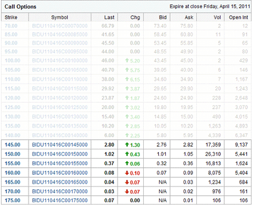

## Table of Contents

## What are options and how do they work in the context of stock trading?

Options are financial tools that give you the right, but not the obligation, to buy or sell a stock at a specific price before a certain date. They are like tickets that let you make a move on a stock without having to own it right away. There are two main types of options: calls and puts. A call option lets you buy a stock at a set price, while a put option lets you sell it at a set price. You pay a fee, called a premium, to get these options.

When you trade options, you're betting on where you think the stock price will go. If you think the price will go up, you might buy a call option. This means you can buy the stock later at today's lower price, which could make you money if the stock goes up. If you think the price will go down, you might buy a put option. This lets you sell the stock at today's higher price, even if the stock drops later. Options can be risky because if the stock doesn't move the way you expect, you could lose the money you paid for the option. But they can also help you make money or protect your investments if used wisely.

## How can options be used to predict earnings?

Options can be used to predict earnings by looking at how much people are willing to pay for them before a company reports its earnings. This is called the options market's "implied volatility." When a lot of people think a stock's price might jump a lot after earnings, they'll pay more for options. This shows they expect big news, good or bad. So, if the price of options goes up a lot before earnings, it might mean people think the earnings will be surprising.

Traders also look at something called the "put-call ratio." This is the number of put options (which bet on the stock going down) compared to call options (which bet on the stock going up). If more people are buying puts than calls before earnings, it might mean they expect bad news. If more people are buying calls, it might mean they expect good news. By watching these signs, traders try to guess what the earnings report might say before it comes out.

## What are the basic types of options strategies for earnings predictions?

One basic options strategy for earnings predictions is buying call options. If you think a company will report good earnings and the stock price will go up, you can buy a call option. This gives you the right to buy the stock at a set price, which could be lower than the price after the earnings come out. If the stock goes up like you thought, you can make money by buying the stock at the lower price and then selling it at the higher price. But if the earnings are bad and the stock goes down, you only lose the money you paid for the option.

Another strategy is buying put options. If you think a company will report bad earnings and the stock price will go down, you can buy a put option. This gives you the right to sell the stock at a set price, which could be higher than the price after the earnings come out. If the stock goes down like you thought, you can make money by selling the stock at the higher price and then buying it back at the lower price. But if the earnings are good and the stock goes up, you only lose the money you paid for the option.

A third strategy is selling options, also known as writing options. If you think the stock won't move much after earnings, you can sell call or put options to other people. They pay you a premium for the option, and if the stock stays steady, you keep that money. But if the stock moves a lot, you might have to buy or sell the stock at a loss. This strategy can be riskier because your potential losses can be bigger than the premium you get.

## How do implied volatility and options pricing relate to earnings announcements?

Implied volatility and options pricing are closely tied to earnings announcements because they show how much uncertainty or excitement traders feel about a company's upcoming earnings. Before an earnings report comes out, traders might think the stock price could jump a lot, either up or down. This makes them willing to pay more for options, which increases the options' prices. The higher price of options before earnings is because of something called implied volatility. It's like a guess of how much the stock price might move after the earnings are announced. If traders think the earnings will be a big surprise, the implied volatility goes up, and so do the prices of options.

When the earnings announcement actually happens, the implied volatility usually drops quickly. This is because the uncertainty about the earnings is gone once the news is out. If the earnings are better or worse than expected, the stock price might jump, but the options' prices might not go up as much as the stock because the implied volatility has gone down. Traders need to be careful about this because buying options right before earnings can be risky. The options might be expensive because of high implied volatility, and if the stock doesn't move as much as expected, the options could lose value quickly after the earnings are announced.

## What are the risks associated with using options for earnings predictions?

Using options to predict earnings can be risky. One big risk is that options are like bets on what the stock will do. If you guess wrong about the earnings, you could lose all the money you paid for the option. The price you pay for an option, called the premium, is gone if the stock doesn't move the way you thought it would. Also, options have an expiration date. If the earnings don't happen before your option expires, it becomes worthless, no matter how good your guess was.

Another risk comes from something called implied volatility. Before earnings, options can be expensive because traders think the stock might jump a lot. If you buy an option when it's pricey and the stock doesn't move much, you could lose money even if your guess about the earnings was right. The price of the option might drop fast after the earnings because the uncertainty is gone, and this can hurt your wallet. So, it's important to think carefully about these risks before using options to predict earnings.

## How can a beginner start using options to predict earnings?

If you're a beginner and want to use options to predict earnings, start by learning the basics. Options give you the right to buy or sell a stock at a set price before a certain date. There are two types: calls, which you buy if you think the stock will go up, and puts, which you buy if you think it will go down. Before an earnings report, look at the options' prices. If they're high, it might mean people expect big news. You can buy a call if you think the news will be good, or a put if you think it will be bad. But remember, you might lose the money you paid for the option if you guess wrong.

It's important to start small and understand the risks. Options can be tricky because they're like bets on what the stock will do. If the stock doesn't move the way you thought, you could lose all the money you spent on the option. Also, options have an expiration date, so if the earnings don't happen before your option expires, it becomes worthless. To get better at using options for earnings predictions, practice with small amounts of money and keep learning about how the options market works.

## What are some common indicators or signals to look for when using options for earnings predictions?

When you're trying to predict earnings using options, one important thing to look at is the price of the options themselves. Before a company reports its earnings, if the options are getting more expensive, it might mean that a lot of people think the stock price will jump a lot after the news comes out. This is because of something called implied volatility, which is like a guess of how much the stock might move. If the options are really pricey, it could be a sign that traders expect the earnings to be a big surprise, either good or bad.

Another thing to watch is the put-call ratio. This is just the number of put options (which bet on the stock going down) compared to call options (which bet on the stock going up). If you see more people buying puts than calls right before earnings, it might mean they think the news will be bad and the stock will drop. On the other hand, if more people are buying calls, it could mean they expect good news and the stock to go up. By paying attention to these signals, you can get a better idea of what other traders think will happen with the earnings report.

## How do experienced traders adjust their options strategies around earnings?

Experienced traders often adjust their options strategies around earnings to manage risk and take advantage of potential price movements. One common approach is to buy options before the earnings announcement if they think the stock will move a lot. They might buy call options if they expect good news, or put options if they expect bad news. They know that options can be expensive before earnings because of high implied volatility, so they're careful about how much they pay. They also understand that the options' prices can drop quickly after the earnings are out, even if the stock moves in the right direction, because the uncertainty is gone.

Another strategy experienced traders use is to sell options, or write options, if they think the stock won't move much after the earnings. They collect the premium from selling the options, and if the stock stays steady, they keep that money. This can be riskier because if the stock does move a lot, they might have to buy or sell the stock at a loss. But experienced traders might use this strategy to make some money from the high option prices before earnings, while also being ready to handle any big moves in the stock price. They always keep an eye on the put-call ratio and other indicators to help them decide what to do.

## What advanced options strategies can be used for more accurate earnings predictions?

Experienced traders might use a strategy called a straddle to predict earnings. A straddle means buying both a call option and a put option at the same price and expiration date. They do this because they think the stock will move a lot after the earnings come out, but they're not sure if it will go up or down. If the stock moves a lot in either direction, they can make money from one of the options. But if the stock doesn't move much, they could lose the money they paid for both options. It's a way to bet on big moves without guessing which way the stock will go.

Another advanced strategy is called a strangle. It's similar to a straddle, but instead of buying the call and put at the same price, you buy them at different prices. The call option has a higher price, and the put option has a lower price. This makes the strangle cheaper than a straddle, but the stock has to move even more for you to make money. Traders use this when they think the stock will have a really big reaction to the earnings, but they're still not sure which way it will go. Both straddles and strangles are ways to try to make money from big moves in the stock price, no matter which direction it goes.

## How can historical options data be analyzed to improve earnings predictions?

Historical options data can help you make better guesses about earnings by showing you how the stock and options acted in the past. If you look at what happened to the stock price and the options' prices around past earnings, you might see patterns. For example, if the stock usually goes up a lot after good earnings, you might want to buy a call option before the next earnings come out. Or if the options get really expensive before earnings every time, you might wait until after the earnings to buy options when they're cheaper.

You can also look at how much the stock moved after past earnings to guess how much it might move this time. If the stock usually jumps a lot, you might think about using a straddle or strangle to bet on a big move without guessing which way it will go. By studying the past, you can get a better idea of what might happen next time and make smarter choices about which options to buy or sell.

## What role do market sentiment and sector performance play in options-based earnings predictions?

Market sentiment and sector performance are important when you're trying to predict earnings using options. Market sentiment is what people think about the stock market in general. If everyone feels good about the market, they might expect good earnings from a lot of companies. This can make options more expensive because people are willing to pay more for them, thinking the stock prices will go up. On the other hand, if people are worried about the market, they might expect bad earnings, and options might be cheaper because they think the stock prices will go down.

Sector performance also matters a lot. If the whole sector a company is in is doing well, people might expect that company to have good earnings too. For example, if tech stocks are going up and doing well, people might buy call options on a tech company before its earnings come out, thinking it will do well too. But if the sector is doing badly, people might buy put options, expecting the company's earnings to be bad. By looking at how the market feels and how the sector is doing, you can make better guesses about what might happen with a company's earnings and choose the right options strategy.

## How can one integrate options data with other financial analysis tools for comprehensive earnings forecasts?

To make good guesses about a company's earnings, you can use options data along with other financial tools. Options data can tell you how much people think the stock might move after earnings, which is called implied volatility. If options are expensive before earnings, it might mean people expect big news. You can combine this with other financial tools like looking at the company's past earnings, what experts are saying about the company, and how the whole market is doing. By putting all this information together, you can get a better idea of what might happen with the earnings.

Another way to use options data with other tools is to look at how the stock and options acted in the past around earnings. This can help you see patterns and make better predictions. For example, if the stock usually goes up a lot after good earnings, you might want to buy a call option. You can also check how the sector the company is in is doing, because if the whole sector is doing well, the company might do well too. By mixing options data with these other pieces of information, you can make smarter choices about which options to buy or sell and get a more complete picture of what might happen with the earnings.

## What are the Basics of Options Trading?

Options trading is a crucial part of the financial markets, serving as a derivative instrument that gets its value from the price movement of an underlying asset. These instruments offer investors the ability to speculate on price movements without the necessity of owning the actual asset, thereby providing a level of leverage and risk management that can be strategically utilized in diverse market conditions.

### Derivative Nature of Options

Options are categorized into two main types: call options and put options. A call option provides the holder the right, but not the obligation, to purchase an asset at a predetermined price (the strike price) within a certain time frame. Conversely, a put option grants the holder the right, but not the obligation, to sell an asset at the strike price before the option's expiration date.

$$
\text{Intrinsic Value of a Call} = \max(0, \text{S} - \text{K})
$$

$$
\text{Intrinsic Value of a Put} = \max(0, \text{K} - \text{S})
$$

Where:
- $\text{S}$ is the current price of the underlying asset.
- $\text{K}$ is the strike price of the option.

### Strategic Applications

Options can be used in various strategic capacities in trading. One basic strategy is using options for hedging, which involves protecting an existing portfolio against downside risk. For instance, an investor holding a stock portfolio might purchase put options as a form of insurance against potential losses. This mitigates the risk exposure without directly selling the underlying assets.

Another strategy is speculation, where traders aim to profit from anticipated moves in an asset's price. A trader expecting a rise in the price of a stock might purchase call options, seeking a leveraged return from an upward move. Conversely, if a price decline is expected, buying put options might be more appropriate.

The flexibility of options also allows for more sophisticated strategies, such as straddles and spreads, which can be employed based on [volatility](/wiki/volatility-trading-strategies) predictions and other market conditions. For example, a straddle involves buying both a call and a put option at the same strike price and expiration, allowing profits to be made irrespective of price direction, provided there is significant movement.

### Considerations in Options Trading

While offering substantial opportunities, options come with inherent risks and complexities. Factors such as time decay, volatility levels, and market sentiment must be continuously assessed. The options pricing models, like the Black-Scholes model, are critical in determining the fair value of options. This model factors in variables such as the underlying asset's price, strike price, time to expiration, risk-free rate, and volatility.

Python can be utilized for calculating options pricing and executing trades. Here’s a simple implementation using Python’s libraries to calculate the theoretical price of a European call option using the Black-Scholes formula:

```python
from scipy.stats import norm
import numpy as np

def black_scholes_call(S, K, T, r, sigma):
    d1 = (np.log(S / K) + (r + 0.5 * sigma**2) * T) / (sigma * np.sqrt(T))
    d2 = d1 - sigma * np.sqrt(T)
    call_price = S * norm.cdf(d1) - K * np.exp(-r * T) * norm.cdf(d2)
    return call_price

# Example parameters
S = 100  # Current stock price
K = 100  # Strike price
T = 1    # Time to expiration in years
r = 0.05 # Risk-free interest rate
sigma = 0.2 # Volatility

print("Call Option Price: ", black_scholes_call(S, K, T, r, sigma))
```

This highlights how a methodical approach to options trading, supported by mathematical models and technology, can provide significant potential for profit while managing risk.

## What are Financial Forecasting Techniques?

Financial forecasting is an essential component in predicting future market conditions, leveraging statistical models and economic indicators to inform decision-making strategies in the financial domain. The techniques are diverse, each offering distinct approaches and insights, making them valuable for both traditional and [algorithmic trading](/wiki/algorithmic-trading).

**Fundamental Analysis**

Fundamental analysis is a method of evaluating securities by attempting to measure the intrinsic value of a stock. It involves examining related economic, financial, and other qualitative and quantitative factors. Analysts who follow this method seek to scrutinize everything that can affect the value of a security, including macroeconomic factors (like the overall economy and industry conditions) and microeconomic factors (like the financial conditions and management of companies). The goal is to derive a value for the stock that can be compared to the current price to determine whether the stock is undervalued or overvalued.

**Time Series Analysis**

Time series analysis involves forecasting future values based on previously observed values. It is a crucial part of financial forecasting, and its applications extend to stock price prediction, interest rates forecasting, and other financial metrics. This method relies heavily on data that is collected over consistent intervals of time, such as daily stock prices. Techniques such as moving averages, exponential smoothing, and autoregressive integrated moving average (ARIMA) models are employed to identify trends and patterns in the data. 

A simple example of a time series model is the ARIMA model, which employs differencing to make the time series stationary and can be expressed as:

$$
Y(t) = c + \phi_1 Y(t-1) + \theta_1 \epsilon(t-1) + \epsilon(t)
$$

Where:
- $Y(t)$ is the prediction for time t,
- $c$ is a constant,
- $\phi_1$ and $\theta_1$ are parameters,
- $\epsilon(t)$ is the error term.

Tools like Python’s `statsmodels` library are often used to implement these models.

```python
from statsmodels.tsa.arima.model import ARIMA

# Sample data
data = [112, 118, 132, 129, 121, 135, 148, 148, 136, 119, 104, 118]

# Fit ARIMA model
model = ARIMA(data, order=(1, 1, 1))
model_fit = model.fit()

# Make prediction
forecast = model_fit.forecast(steps=3)
print(forecast)
```

**Regression Modeling**

Regression modeling is another critical technique in financial forecasting, used to describe the relationship between a dependent variable and one or more independent variables. This method can uncover significant insights about how changes in certain features or predictors affect a financial metric, such as stock prices or bond yields. Linear regression, logistic regression, and polynomial regression are common forms, with each model providing a different approach to analyzing data.

In the context of algorithmic trading, [machine learning](/wiki/machine-learning) algorithms, harnessing linear regression, provide a data-driven approach to making predictions and managing trades in real-time environments.

**Applications in Trading**

In both traditional and algorithmic trading, these forecasting techniques are integral in shaping strategies and optimizing outcomes. Traditional traders employ these methods to guide buying and selling decisions based on expected market shifts, while algorithmic traders harness the power of advanced models and computational capabilities to automate trade execution based on predictive data.

The application of these methodologies in algorithmic trading utilizes high-frequency data, allowing for the rapid adjustment to market changes and the enhancement of profitability through the precise timing of trades. This detailed and methodical approach to forecasting continues to transform how trading strategies are developed and implemented across financial markets.

## What is Algorithmic Trading and Predictive Analytics?

Algorithmic trading utilizes computer algorithms to execute trades based on a set of predefined rules and criteria, thereby eliminating human error and increasing transaction speed. These automated systems can process large volumes of data at an unparalleled pace, analyzing market prices, trends, and other financial indicators to optimize trading decisions. The algorithms employed can range from simple rule-based systems — which might execute a buy or sell order based on a basic signal — to complex models incorporating machine learning and [artificial intelligence](/wiki/ai-artificial-intelligence), thereby providing a profound advantage in the trading landscape.

Machine learning and artificial intelligence (AI) play a pivotal role in enhancing the precision and efficacy of algorithmic trading systems. Machine learning, particularly data-intensive approaches such as supervised, unsupervised learning, and [reinforcement learning](/wiki/reinforcement-learning), has become instrumental in predictive modeling. These models can predict future price movements by learning from historical market data. For example, using previous earnings reports, stock prices, and other financial data, a machine learning algorithm can be trained to predict the probability of a stock price increase following a quarterly earnings announcement.

Artificial intelligence extends these capabilities further by incorporating natural language processing (NLP) to analyze news articles, social media feeds, and [earning](/wiki/earning-announcement) call transcripts to gauge investor sentiment and how it might affect stock performance. This sentiment analysis can be critical for options trading where volatility is a key component of strategy formulation.

The integration of predictive analytics in algorithmic trading enables systems to anticipate market trends and respond preemptively. For options traders, predictive analytics can determine expected future volatility by analyzing historical volatility patterns and synthesizing this with current market conditions. This expectation is often represented through the implied volatility calculated from options pricing models such as the Black-Scholes model:

$$
C = S_0 N(d_1) - Xe^{-rT}N(d_2),
$$

where:
- $C$ is the call option price,
- $S_0$ is the current stock price,
- $X$ is the strike price,
- $r$ is the risk-free interest rate,
- $T$ is the time to expiration,
- $N$ represents the cumulative distribution function of a standard normal distribution,
- $d_1$ and $d_2$ are calculated values based on $S_0$, $X$, $r$, $T$, and implied volatility.

The advancements in AI and machine learning allow these systems to not only calculate these values with greater accuracy but also adjust strategies dynamically as market conditions change.

A practical implementation example, particularly relevant for earnings predictions, involves using options pricing to verify traders' market expectations. By analyzing the options chain of a particular stock, along with its implied volatility, traders can infer market predictions about forthcoming earnings announcements and make informed decisions regarding their trading positions. This real-time data analysis provides traders a significant edge in entering and exiting trades optimally.

Overall, the convergence of algorithmic trading with predictive analytics, underpinned by machine learning and AI, streamlines operations and maximizes gains by comprehensively analyzing market data to preemptively identify opportunities. This technological synergy reduces risk and increases efficiency, ensuring that modern traders retain a competitive advantage in a continuously evolving financial market.

## References & Further Reading

[1]: Bergstra, J., Bardenet, R., Bengio, Y., & Kégl, B. (2011). ["Algorithms for Hyper-Parameter Optimization."](https://dl.acm.org/doi/10.5555/2986459.2986743) Advances in Neural Information Processing Systems 24.

[2]: ["Advances in Financial Machine Learning"](https://www.amazon.com/Advances-Financial-Machine-Learning-Marcos/dp/1119482089) by Marcos Lopez de Prado

[3]: Black, F., & Scholes, M. (1973). ["The Pricing of Options and Corporate Liabilities."](https://www.cs.princeton.edu/courses/archive/fall09/cos323/papers/black_scholes73.pdf) Journal of Political Economy, 81(3), 637-654.

[4]: ["Options, Futures, and Other Derivatives"](https://www.amazon.com/Options-Futures-Other-Derivatives-10th/dp/013447208X) by John C. Hull

[5]: ["Quantitative Trading: How to Build Your Own Algorithmic Trading Business"](https://www.amazon.com/Quantitative-Trading-Build-Algorithmic-Business/dp/1119800064) by Ernest P. Chan

[6]: ["Python for Finance: Analyze Big Financial Data"](https://books.google.com/books/about/Python_for_Finance.html?id=E93SBQAAQBAJ) by Yves Hilpisch

[7]: Jorion, P. (2007). ["Value at Risk: The New Benchmark for Managing Financial Risk."](https://link.springer.com/article/10.1007/s11408-007-0057-3) McGraw-Hill.

[8]: ["Machine Learning for Algorithmic Trading"](https://github.com/stefan-jansen/machine-learning-for-trading) by Stefan Jansen