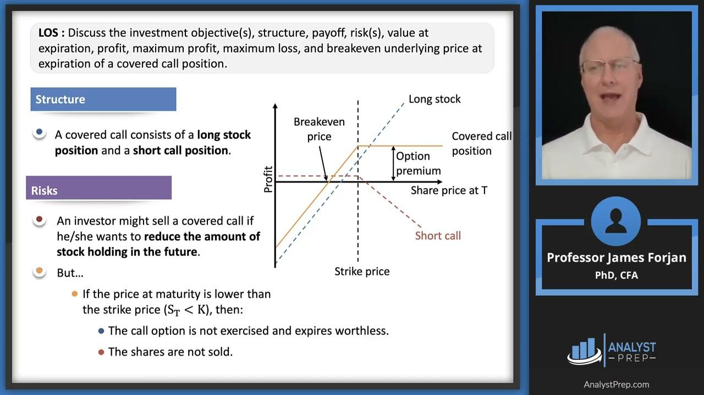

## Table of Contents

## What is a short position in trading?

A short position in trading is when someone sells a stock or other asset they don't own, hoping to buy it back later at a lower price. This is done with the expectation that the price of the asset will go down. For example, if you think the price of a stock will drop, you can sell it now and buy it back later at a lower price, making a profit from the difference.

However, short selling can be risky. If the price of the asset goes up instead of down, the person with the short position will lose money. They will have to buy back the asset at a higher price than they sold it for. This can lead to big losses, especially if the price goes up a lot. Because of this risk, short selling is usually done by experienced traders who understand the market well.

## What are options and how do they work?

Options are financial contracts that give you the right, but not the obligation, to buy or sell an asset at a specific price before a certain date. They are like tickets that let you decide if you want to make a trade later on. There are two main types of options: calls and puts. A call option gives you the right to buy an asset, while a put option gives you the right to sell it. The price at which you can buy or sell the asset is called the strike price, and the date by which you must decide is called the expiration date.

When you buy an option, you pay a fee called a premium. This is the cost of having the right to make the trade later. If the price of the asset moves in your favor, you can use the option to buy or sell the asset at the strike price, which could be better than the current market price. If the price doesn't move in your favor, you can just let the option expire and you only lose the premium you paid. Options can be used for many things, like betting on whether a stock's price will go up or down, or to protect other investments from big losses.

## Why would someone want to hedge a short position?

Someone would want to hedge a short position to protect themselves from losing too much money if the price of the asset goes up instead of down. When you short sell, you are betting that the price will drop. If it goes up, you have to buy back the asset at a higher price, which means you lose money. By hedging, you can limit these potential losses. Hedging is like buying insurance for your short position, so you don't lose as much if things don't go as planned.

One way to hedge a short position is by using options. For example, you could buy a call option on the same asset you shorted. If the price goes up, the call option will increase in value, which can help offset the losses from your short position. This way, even if you lose money on the short sale, the gains from the call option can help make up for it. Hedging doesn't make your short position risk-free, but it can help manage the risk and give you more peace of mind.

## What types of options can be used to hedge a short position?

To hedge a short position, you can use call options. A call option gives you the right to buy the asset at a set price, called the strike price, before a certain date. If you have a short position and the price of the asset starts to go up, buying a call option can help. If the price keeps going up, the call option will become more valuable. You can then use the money you make from the call option to cover some of the losses from your short position. This way, even if you lose money on the short sale, the gains from the call option can help make up for it.

Another option to hedge a short position is using put options, but in a different way. You can buy put options on a different asset that you think will go down in value if the asset you shorted goes up. This is called a pairs trade. If the asset you shorted goes up, but the other asset goes down, the put option on the other asset will become more valuable. You can then use the gains from the put option to offset the losses from your short position. This method can be more complex, but it's another way to manage the risk of a short position.

## How do put options help in hedging a short position?

Put options can help hedge a short position by using what's called a pairs trade. This means you buy a put option on a different asset that you think will go down in value if the asset you shorted goes up. For example, if you shorted a tech stock, you might buy a put option on a different tech stock that usually moves in the opposite direction. If the stock you shorted goes up, but the other stock goes down, the put option on the other stock will become more valuable. You can then use the money you make from the put option to cover some of the losses from your short position.

This method can be a bit tricky because it depends on how two different assets move in relation to each other. But it's a way to manage the risk of your short position. If you get it right, the gains from the put option can help offset the losses from your short sale. This doesn't make your short position risk-free, but it can help you lose less money if things don't go as planned.

## Can call options be used to hedge a short position, and if so, how?

Yes, call options can be used to hedge a short position. When you have a short position, you are betting that the price of an asset will go down. If it goes up instead, you lose money because you have to buy it back at a higher price. To hedge this risk, you can buy a call option on the same asset. A call option gives you the right to buy the asset at a set price, called the strike price, before a certain date.

If the price of the asset goes up, the call option will become more valuable. You can then sell the call option for a profit, which can help cover some of the losses from your short position. This way, even if you lose money on the short sale, the gains from the call option can help make up for it. Hedging with call options doesn't make your short position risk-free, but it can help you manage the risk and lose less money if the price moves against you.

## What is the cost associated with using options to hedge a short position?

When you use options to hedge a short position, you have to pay a cost called the premium. The premium is the price you pay to buy the option. This cost can vary based on things like how long the option lasts, how much the asset's price moves, and how far the strike price is from the current price of the asset. The premium is like an insurance fee you pay upfront, hoping that it will save you money if the price of the asset goes up.

If the price of the asset goes up and you use the option to hedge, the gains from the option can help cover some of the losses from your short position. But if the price doesn't go up, you still lose the premium you paid for the option. So, you need to think about whether the cost of the premium is worth the protection it offers. It's a trade-off between spending money now to protect yourself from bigger losses later.

## How does the choice of strike price and expiration date affect the hedging strategy?

The choice of strike price and expiration date for an option can really change how well it works as a hedge for a short position. The strike price is the price at which you can buy or sell the asset. If you pick a strike price that's close to the current price of the asset, the option will be more expensive because it's more likely to be used. But it will also give you better protection if the price goes up a lot. On the other hand, if you pick a strike price that's far away from the current price, the option will be cheaper but won't protect you as much if the price only goes up a little.

The expiration date is also important. It's the date by which you have to decide whether to use the option. If you pick a short expiration date, the option will be cheaper, but you'll have less time to be right about the price going up. If you pick a longer expiration date, the option will cost more, but you'll have more time for the price to move in your favor. So, you need to balance the cost of the option with how much protection and time you need. It's all about finding the right mix to manage your risk without spending too much.

## What are the potential risks and limitations of using options to hedge a short position?

Using options to hedge a short position can help protect you from big losses, but it also comes with risks. One big risk is that you might lose the money you paid for the option, called the premium, if the price of the asset doesn't go up like you thought it would. This means you spend money on the option, but you don't get anything back if the price stays the same or goes down. Also, options have an expiration date, so if the price doesn't move in your favor before that date, the option becomes worthless. This can be a problem if you need more time for the price to go up.

Another limitation is that options can be tricky to use. You have to pick the right strike price and expiration date, and if you get it wrong, the option might not protect you as much as you need. It's like trying to guess the future, which is hard to do. Plus, options can be expensive, and the cost can eat into any profits you make from your short position. So, while options can help you manage risk, they also add their own set of challenges and costs that you need to think about carefully.

## How can an investor determine the right amount of options to use for effective hedging?

To figure out how many options to use for hedging a short position, an investor needs to think about how much risk they want to take and how much they're willing to spend on the options. A good starting point is to look at how much the asset's price might go up and how much you want to protect against that. If you think the price could go up a lot, you might want to buy more options to cover more of your potential losses. But remember, the more options you buy, the more you'll have to pay for them.

Another thing to consider is the size of your short position. If you've shorted a lot of shares, you might need more options to hedge effectively. You can use something called a "delta" to help you decide. Delta tells you how much the option's price will change for every dollar change in the asset's price. If you know the delta, you can figure out how many options you need to hedge your short position well. It's all about balancing the cost of the options with the amount of protection you need, so you don't spend too much but still feel safe.

## What advanced strategies can be employed to enhance the hedging of a short position using options?

One advanced strategy to enhance the hedging of a short position is to use a collar. A collar involves buying a call option to protect against the asset's price going up, while also selling a put option to help pay for the call option. This can make the hedge cheaper, but it limits how much you can gain if the price goes down a lot. You need to pick the right strike prices for both the call and put options. If you get it right, you can protect your short position without spending too much money.

Another strategy is to use a dynamic hedge. This means you keep changing how many options you have based on how the asset's price is moving. If the price starts to go up, you might buy more call options to get more protection. If the price goes down, you might sell some of your options to save money. This takes more work and you need to watch the market closely, but it can help you adjust your hedge as things change. It's like constantly tweaking your plan to make sure you're always protected as much as you need to be.

## How do market conditions and volatility impact the effectiveness of options as a hedging tool for short positions?

Market conditions and how much the price of an asset moves around, called volatility, can really change how well options work to hedge a short position. When the market is calm and prices don't change much, options might be cheaper because there's less chance the price will move a lot. But if the market gets wild and prices start jumping around, options can get more expensive. This is because there's a bigger chance the price will move a lot, and people want to pay more for the chance to protect themselves. So, in a volatile market, you might have to spend more money on options to hedge your short position, but they can also give you better protection if the price moves against you.

Volatility also affects how likely it is that your options will be worth something when you need them. If the market is calm, the price might not move enough for your options to be useful. But if the market is volatile, there's a better chance the price will move enough for your options to help you. This means you need to think about how much the price might move when you pick your options. If you think the market will be calm, you might not need as many options. But if you think it will be volatile, you might want to buy more options to make sure you're protected. It's all about guessing how the market will act and picking the right options to match that guess.

## What is Understanding Hedging in Trading?

Hedging is an integral risk management strategy in trading, primarily aimed at reducing potential losses rather than maximizing profits. This strategy is especially significant in the domain of options trading, where traders and investors seek to protect their portfolios from adverse market movements. Hedging involves the use of various financial instruments such as options, futures, and other derivatives to mitigate risks associated with price fluctuations.

In the context of options trading, hedging provides a mechanism to safeguard investments against unexpected market downturns. An option gives the investor the right, but not the obligation, to buy or sell an underlying asset at a predetermined price before the contract expires. By employing hedging strategies, traders can effectively shield their portfolios from significant losses if the market moves unfavorably.

Several techniques are commonly utilized for hedging options, each with specific applications and outcomes:

1. **Protective Puts**: This involves purchasing put options to hedge against potential declines in the price of an asset owned by the trader. A put option provides the right to sell the asset at a specified price, thus limiting the losses if the asset's market price plummets. The formula for calculating the breakeven point in a protective put strategy is:
$$
   \text{Breakeven Price} = \text{Stock Purchase Price} + \text{Premium Paid for the Put}

$$

2. **Covered Calls**: This strategy entails writing call options against shares that the trader already owns. While it caps the upside potential, it allows the trader to earn a premium, which can offset some losses if the stock price declines. It's a popular strategy for generating additional income from assets held in a portfolio.

3. **Collars**: Collars combine protective puts and covered calls. Here, an investor holds the underlying asset, buys a put option to protect against price drops, and simultaneously writes a call option to finance the purchase of the put option. This strategy effectively locks in a range of possible outcomes, providing a safety net with limited risk and capped gains.

4. **Futures Contracts**: Futures can also be used in hedging strategies. By agreeing to buy or sell an asset at a future date for a set price, traders can hedge against the risk of price movements, especially useful in volatile markets. For instance, an investor exposed to foreign exchange risk can use currency futures to protect against unfavorable currency movements.

The essence of hedging lies in its ability to balance the potential risks and rewards associated with investment. It does not eliminate risk entirely but offers a more controlled exposure to market [volatility](/wiki/volatility-trading-strategies). Traders must consider transaction costs, the suitability of the hedging instrument, and the correlation between the hedging instrument and the underlying asset to ensure effective hedging.

Incorporating hedging techniques appropriately requires a thorough understanding of the underlying assets and market conditions. Each strategy has trade-offs that should align with the trader's objectives, risk tolerance, and market outlook.

## References & Further Reading

[1]: Hull, J. C. (2017). ["Options, Futures, and Other Derivatives"](https://www.semanticscholar.org/paper/Options%2C-Futures%2C-and-Other-Derivatives-Hull/89bdee500c8623864fc9eb7a471546aa713acc44) (9th ed.). Pearson Education.

[2]: Natenberg, S. (1994). ["Option Volatility and Pricing: Advanced Trading Strategies and Techniques"](https://www.amazon.com/Option-Volatility-Pricing-Strategies-Techniques/dp/0071818774) (2nd ed.). McGraw-Hill Education.

[3]: Chan, E. P. (2009). ["Quantitative Trading: How to Build Your Own Algorithmic Trading Business"](https://github.com/ftvision/quant_trading_echan_book). Wiley.

[4]: Jansen, S. (2018). ["Machine Learning for Algorithmic Trading: Predictive Models to Extract Signals from Market and Alternative Data for Systematic Trading Strategies"](https://github.com/stefan-jansen/machine-learning-for-trading). Packt Publishing.

[5]: Lopez de Prado, M. (2018). ["Advances in Financial Machine Learning"](https://books.google.com/books/about/Advances_in_Financial_Machine_Learning.html?id=oU9KDwAAQBAJ). Wiley.

[6]: Kissell, R. (2013). ["The Science of Algorithmic Trading and Portfolio Management"](https://www.sciencedirect.com/book/9780124016897/the-science-of-algorithmic-trading-and-portfolio-management). Academic Press.