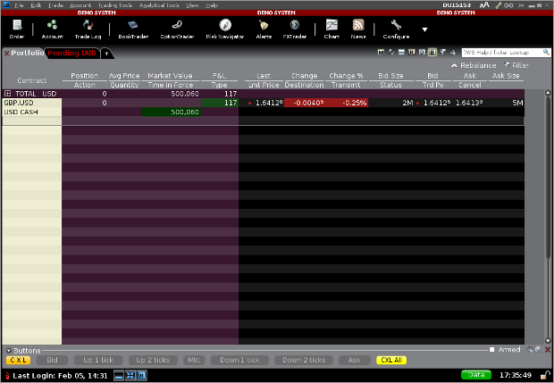

Algorithmic trading, a cornerstone of modern financial markets, utilizes computer algorithms to conduct trading decisions and orders at speeds and frequencies that humans cannot match. By leveraging quantitative models and complex mathematical formulas, algorithmic trading can analyze market data, identify patterns, and execute trades with unparalleled precision. This technological advancement not only enhances trading efficiency but also plays a pivotal role in maintaining market liquidity and reducing transaction costs. In recent decades, algorithmic trading has gained prominence, accounting for a significant portion of trading volume across major exchanges globally.

Interactive Brokers, a key player in the brokerage industry, has emerged as a popular choice for individuals and institutions engaging in algorithmic trading. Renowned for its competitive pricing, extensive market access, and robust trading platforms, Interactive Brokers offers a suite of tools conducive to developing and deploying sophisticated trading strategies. A notable feature of Interactive Brokers is its comprehensive API offerings, which are critical in facilitating automated trading.



Interactive Brokers' API suite is designed to cater to the needs of both novice and seasoned traders seeking automation in their trading processes. The API offerings enable direct access to account management, market data, and trade order functionalities. These utilities are pivotal for harnessing algorithmic trading capabilities, allowing users to implement strategies ranging from basic order execution to intricate, multi-layered algorithms designed to exploit arbitrage opportunities or perform high-frequency trades. By providing flexible and powerful API solutions, Interactive Brokers empowers traders to seamlessly integrate custom trading algorithms with its platform, fostering innovation and adaptability in a competitive trading environment.

## Table of Contents

## Understanding the Interactive Brokers API

Interactive Brokers (IB) is a prominent brokerage firm that supports algorithmic trading through its robust API offerings. These APIs are crucial for traders looking to automate their strategies and efficiently manage trades without manual intervention. The Interactive Brokers API facilitates direct communication with the company's trading systems, allowing users to implement sophisticated trading algorithms and conduct operations at scale.

The Interactive Brokers API provides several interfaces, each with distinct functionalities and use cases. The primary interfaces include:

1. **Trader Workstation (TWS)**: An all-in-one trading platform that offers a comprehensive suite of tools for both manual and automated trading. The TWS API allows for programmatic control over the platform, enabling users to automate orders and access account data.

2. **IB Gateway**: A lighter alternative to TWS, designed explicitly for automated trading. It provides an API interface without the graphical elements of TWS, making it suitable for server-based applications where resources need to be conserved.

3. **API Platforms**: Interactive Brokers offers APIs in various programming languages including Java, C++, and Python. These allow traders to build custom applications tailored to their specific trading strategies. The APIs support real-time market data retrieval, trade execution, and portfolio management.

When it comes to implementing these interfaces, users can choose between the native API provided by [Interactive Brokers](/wiki/interactive-brokers-api) or leverage third-party libraries such as IbPy and IBridgePy. The native API offers comprehensive access to IB's functionalities, but may require more in-depth programming knowledge. On the other hand, third-party libraries often provide simplified interfaces that are especially beneficial for users who prefer developing in Python.

- **IbPy** is a Python wrapper for the Interactive Brokers API, enabling Python users to seamlessly implement trading strategies without needing to directly interact with the original Java API. However, IbPy is no longer actively maintained, which can present challenges in keeping up with updates from Interactive Brokers.

- **IBridgePy** acts as an alternative to IbPy, offering more active support and additional features. It provides an even higher-level abstraction, making it easier to implement strategies, and supports integration with the Quantopian algorithm development environment. This allows users to backtest their strategies efficiently before going live.

In summary, the Interactive Brokers API is central to enabling automated trading, providing the flexibility and power needed to implement complex trading strategies across various asset classes. Choosing between the native API and third-party libraries like IbPy and IBridgePy depends on the trader's programming proficiency and specific trading requirements.

## Getting Started with Interactive Brokers API

To begin utilizing the Interactive Brokers (IB) API for [algorithmic trading](/wiki/algorithmic-trading), one must first establish a trading account with Interactive Brokers. There are two types of accounts available: demo and live. A demo account, also known as a paper trading account, allows users to simulate trades without financial risk, making it ideal for testing strategies. A live account, on the other hand, enables actual trading with real funds. Both accounts can be created on the Interactive Brokers website by following a registration process that involves providing personal information, agreeing to terms and conditions, and completing any necessary financial suitability assessments.

Once an account is in place, the next step is to set up the Interactive Brokers API, which involves two primary components: the Trader Workstation (TWS) or the IB Gateway, and API software. The TWS is a trading platform that provides a graphical interface, whereas the IB Gateway is a lighter option without a user interface, more suitable for automated trading environments. Both options allow for API access and must be downloaded and installed on your system.

With the trading platform operational, setting up the API involves configuring API settings within TWS or IB Gateway. This includes navigating to the API section in the platform’s configuration settings and enabling socket clients, which are necessary for programmatic access to IB’s services. It is also crucial to set the local host port number, which will be used during API connection.

For programming the automation of trading strategies, familiarity with programming languages such as Python is advantageous. Python provides libraries that simplify interaction with the Interactive Brokers API. One such library is `IbPy`, a third-party Python library that facilitates communication with the IB API. Though IbPy simplifies tasks, recent versions of Python and the API have deprecated this library, and alternatives such as `IBridgePy` or native API implementations, such as the ibapi package, are recommended.

To begin using these tools, a typical setup requires installing Python and the chosen API library (such as `ibapi` or `IBridgePy`). Python installations can be obtained from the Python Software Foundation's website, while the API libraries can be installed through package managers like `pip`. For instance, the ibapi package can be installed via the command:

```bash
pip install ibapi
```

Once the necessary software is installed, an API connector must be implemented to integrate with Interactive Brokers. This connector serves as the bridge between your algorithmic program and the broker’s platform. Initial API scripts typically include importing the API library, establishing a connection to the TWS or IB Gateway using the host and port, and handling events. A simple code snippet to establish a connection might resemble:

```python
from ibapi.client import EClient
from ibapi.wrapper import EWrapper

class IBapi(EWrapper, EClient):
    def __init__(self):
        EClient.__init__(self, self)

app = IBapi()
app.connect("127.0.0.1", 7497, clientId=1)
app.run()
```

This code creates a basic API client, connects to the local host at port 7497 (the default port for TWS), and initiates the event loop. An essential practice involves keeping your API components modular and ensuring that your code structure effectively manages trading logic, risk parameters, and error handling for efficient and reliable automated trading.

## Implementing Algorithmic Strategies

Algorithmic trading involves the use of computer programs to execute trades based on predefined criteria, which can include market data parameters and advanced mathematical models. Interactive Brokers (IB) provides a robust API that allows traders to develop and implement these automated strategies. Here's a concise guide to implementing a simple trading strategy using the Interactive Brokers API, focusing on how to buy 100 shares of Google (GOOGL) programmatically using Python.

### 1. Establishing a Connection

Before executing any trading strategy, it is crucial to establish a connection between your trading script and the Interactive Brokers Trade Workstation (TWS) or IB Gateway. This involves using the API to handle the communication. Assuming you have a working environment with Python and an Interactive Brokers account setup, you need to begin by importing necessary libraries such as `ibapi`, a native Python package for the IB API, or third-party connectors like `IbPy` or `IBridgePy`.

```python
from ibapi.client import EClient
from ibapi.wrapper import EWrapper
from ibapi.contract import Contract

class IBTradingApp(EWrapper, EClient):
    def __init__(self):
        EClient.__init__(self, self)

app = IBTradingApp()
app.connect("127.0.0.1", 7497, clientId=1)  # Connect to TWS or Gateway
app.run()
```

### 2. Defining the Trading Contract

To interact with the market, a contract object must be defined for the security you wish to trade. For buying Google shares, you need to specify the contract details.

```python
def create_contract():
    contract = Contract()
    contract.symbol = "GOOGL"
    contract.secType = "STK"
    contract.exchange = "SMART"
    contract.currency = "USD"
    return contract

googl_contract = create_contract()
```

### 3. Placing an Order

With the contract defined, the next step is to create an order object specifying the buy action and quantity. Interactive Brokers API handles numerous order types, but for simplicity, a Market Order is used here.

```python
from ibapi.order import Order

def create_order():
    order = Order()
    order.action = "BUY"
    order.orderType = "MKT"
    order.totalQuantity = 100  # Number of shares
    return order

buy_order = create_order()
```

Using these objects, the order can then be placed to buy 100 shares of Google:

```python
app.placeOrder(app.nextOrderId(), googl_contract, buy_order)
```

### 4. Monitoring and Closing Trades

After executing the order, monitoring the trades involves using callback methods within the `EWrapper` class that the IB API provides. These include methods like `orderStatus`, `position`, and `completedOrder`. To ensure completeness, handle these callbacks to monitor the trade execution and account status continuously.

To close or modify trades programmatically, create and transmit a new order with the appropriate action and parameters (e.g., a sell order to close open positions).

### Example Summary

The above Python script establishes a connection, defines a Google stock contract, places a market order to buy, and includes monitoring capabilities to log trade execution. Proper handling of API callbacks is essential for receiving real-time updates on order status and portfolio changes.

This example demonstrates the flexibility and power of the Interactive Brokers API in implementing automated algorithmic trading strategies. While this is a basic example focused on executing a simple buy order, the IB API supports complex order types and comprehensive market data access, facilitating sophisticated strategy development.

## Market Data and Execution

Interactive Brokers (IB) provides a robust API that allows traders and developers to access extensive market data and execute trades efficiently. Two crucial aspects of this API are the retrieval of market data and the execution of trades through features such as smart order routing.

### Retrieving Market Data

The Interactive Brokers API offers access to both real-time and historical market data. This data is essential for developing and executing algorithmic trading strategies. Real-time data includes live quotes, bid/ask spreads, and transaction volumes, whereas historical data helps in [backtesting](/wiki/backtesting) strategies by providing insights into past market behaviors.

To access market data through the API, a user needs a data subscription. This subscription is required because real-time data feeds incur costs due to exchanges charging fees for data distribution. The cost varies depending on the exchanges and the types of data the user subscribes to. For example, subscribing to level I data typically involves current bid/ask prices, whereas level II data includes additional details like market depth.

The following Python example demonstrates how to connect to the Interactive Brokers API and fetch real-time data:

```python
from ibapi.client import EClient
from ibapi.wrapper import EWrapper
from ibapi.contract import Contract

class IBApi(EWrapper, EClient):
    def __init__(self):
        EClient.__init__(self, self)

    def error(self, reqId, errorCode, errorString):
        print(f"Error: {reqId} - {errorCode} - {errorString}")

    def tickPrice(self, reqId, tickType, price, attrib):
        print(f"Tick Price. Ticker Id: {reqId}, tickType: {tickType}, Price: {price}")

def main():
    app = IBApi()
    app.connect("127.0.0.1", 7497, 0)

    contract = Contract()
    contract.symbol = "AAPL"
    contract.secType = "STK"
    contract.exchange = "SMART"
    contract.currency = "USD"

    app.reqMktData(1, contract, "", False, False, [])
    app.run()

if __name__ == "__main__":
    main()
```

This code sets up a connection to the Interactive Brokers Trader Workstation (TWS) or IB Gateway and requests market data for Apple Inc. (AAPL) stock.

### Smart Order Routing

Smart order routing is a fundamental feature of Interactive Brokers, designed to enhance trade execution. It automatically assesses various market conditions and routes orders to the most favorable venues, thus optimizing factors such as price, speed, and likelihood of execution.

The smart order router aims to achieve the best possible execution by considering numerous factors, including the [order book](/wiki/order-book-trading-strategies) depth, [liquidity](/wiki/liquidity-risk-premium) at different venues, and current market conditions. This may result in splitting a single order into multiple smaller ones to be executed across various exchanges or dark pools, thereby improving execution quality and reducing market impact.

For example, when executing a trade for a large number of shares, the smart order router might choose to execute portions of the trade across several lit exchanges to avoid moving the market price unfavorably.

By leveraging market data and smart order routing, traders can execute algorithmic strategies with improved precision and efficiency, gaining a competitive edge in high-frequency and traditional trading scenarios.

This integration of real-time market data, historical analysis, and advanced execution techniques forms the backbone of a sophisticated trading platform, allowing traders to harness the full potential of their algorithmic trading systems through Interactive Brokers' API.

## Advanced Features of the API

Interactive Brokers' API offers a suite of advanced features that cater to seasoned traders and developers looking to implement sophisticated trading strategies. One of the standout capabilities is the support for advanced order types, which can significantly enhance trading flexibility and execution efficiency. Among these order types are conditional orders, bracket orders, and algorithms like VWAP (Volume-Weighted Average Price) and TWAP (Time-Weighted Average Price). These allow traders to set specific conditions under which trades should be executed, manage risk, and execute large orders with minimal market impact.

Integrating custom indicators and data analysis tools with the Interactive Brokers API is straightforward and offers substantial benefits. Traders can construct custom indicators by leveraging the extensive historical and real-time data available. By using analysis libraries in Python, such as Pandas and NumPy, traders can create complex data models and indicators. For example, a custom moving average crossover strategy might be implemented by fetching historical price data using the `reqHistoricalData` method, computing the moving averages, and deciding trading actions based on crossovers:

```python
# Sample Python code for a moving average crossover strategy

from ibapi.client import EClient
from ibapi.wrapper import EWrapper
from ibapi.contract import Contract
import pandas as pd

class TestApp(EWrapper, EClient):
    def __init__(self):
        EClient.__init__(self, self)
        self.data = []  # To store response from reqHistoricalData
        self.df = pd.DataFrame()  # To save historical data for indicator computation

    def historicalData(self, reqId, bar):
        self.data.append([bar.date, bar.open, bar.high, bar.low, bar.close])

    def stop(self):
        self.done = True
        self.disconnect()

def main():
    app = TestApp()
    app.connect("127.0.0.1", 7496, clientId=1)
    contract = Contract()
    contract.symbol = 'AAPL'
    contract.secType = 'STK'
    contract.exchange = 'SMART'
    contract.currency = 'USD'

    app.reqHistoricalData(1, contract, '', '1 M', '1 day', 'MIDPOINT', 1, 1, False, [])
    # Waiting for data retrieval
    app.run()

    # Converting to DataFrame for analysis
    app.df = pd.DataFrame(app.data, columns=['Date', 'Open', 'High', 'Low', 'Close'])
    app.df.set_index('Date', inplace=True)

    # Calculating Moving Averages
    app.df['SMA_50'] = app.df['Close'].rolling(window=50).mean()
    app.df['SMA_200'] = app.df['Close'].rolling(window=200).mean()

    # Implementing a sample crossover strategy
    app.df['Signal'] = 0
    app.df['Signal'][app.df['SMA_50'] > app.df['SMA_200']] = 1
    app.df['Position'] = app.df['Signal'].diff()

    print(app.df.tail())  # Check the computed indicators and signals

if __name__ == "__main__":
    main()
```

This script outlines the basics of setting up a connection, fetching historical data, calculating moving averages, and generating trading signals.

Automation in trading strategies goes beyond simple execution. By leveraging the advanced features of the API, traders can implement comprehensive risk management frameworks. For instance, using conditional orders, it's possible to automate stop-loss and take-profit levels, dynamically adjust position sizes, and hedge portfolios against market [volatility](/wiki/volatility-trading-strategies). Furthermore, custom scripts and models can evaluate market conditions and automatically modify strategy parameters, ensuring adaptive trading in response to changing market dynamics.

These advanced features not only provide traders with the capability to execute complex strategies but also emphasize the importance of rigorous testing and simulation to ensure these strategies perform as expected under various market scenarios. Integrating robust backtesting systems and continuously refining algorithms based on performance and market feedback becomes critical for success in automated trading environments.

## Challenges and Considerations

Interactive Brokers API is a powerful tool for automated trading, but its use comes with various challenges that traders need to be aware of. Understanding these challenges can significantly enhance the efficiency and reliability of trading strategies.

One of the primary challenges is connectivity and latency. Since the API interactions are heavily dependent on network quality, any disruptions can result in missed trading opportunities. Ensuring a stable and fast internet connection is essential. Latency can be particularly problematic during periods of high market volatility, where swift execution of trades is crucial. Traders should continuously monitor their systems and, if feasible, seek to colocate their servers closer to the Interactive Brokers data center to minimize latency.

Another common issue is handling the vast amount of data that can be retrieved via the API. Traders need to efficiently process and store this data to make real-time decisions. The effectiveness of an algorithmic strategy can significantly diminish if there is a lag in data processing, thereby emphasizing the need for robust data management systems.

Testing and deploying algorithmic trading strategies pose additional challenges. Traders should adopt rigorous testing protocols that include backtesting strategies over historical data and using paper trading accounts to simulate trades without financial risks. These steps help in identifying potential flaws and refining the algorithms before they are deployed in live markets.

Furthermore, implementing automated trading systems requires a strong understanding of error handling and exception management within the codebase. Given the unpredictable nature of markets, it is crucial to have mechanisms in place that can handle errors without disrupting the trading strategy. Utilizing logging and monitoring tools can provide insights into the system’s performance and help in quickly diagnosing and resolving issues.

For instance, Python code for error handling might look like this:

```python
try:
    # Code to execute trading strategy
except NetworkError as e:
    print(f"Network error occurred: {e}")
    # Reattempt connection or switch to backup server
except Exception as e:
    print(f"An unexpected error occurred: {e}")
    # Log the error and send alerts
```

Lastly, traders should be aware of the regulatory implications of automated trading. Each trading bot and strategy must comply with relevant financial regulations, and traders should ensure that their configurations are consistent with these rules to avoid any legal repercussions.

In summary, while the Interactive Brokers API offers compelling capabilities for algorithmic trading, it is imperative to be cognizant of the challenges related to connectivity, data management, testing, and error handling. By addressing these considerations, traders can optimize their strategies and enhance the robustness of their trading operations.

## Conclusion

The use of the Interactive Brokers API offers substantial advantages for those engaged in algorithmic trading. Its robust and flexible structure enables traders to implement complex strategies while maintaining direct control over their trading operations. The API, with its ability to automate multiple functions, significantly reduces the time and effort required for manual trading. By integrating the API with various programming languages, traders can leverage automated systems to execute trades, manage risk, and access real-time market data efficiently.

The Interactive Brokers API invites traders and developers alike to experiment and innovate, fostering the creation of sophisticated trading algorithms. This adaptability is particularly beneficial in a fast-paced financial market, where having a well-tailored strategy can make a significant difference in performance outcomes.

Looking ahead, the role of APIs in algorithmic trading is poised for growth. As markets continue to evolve, the demand for automation, accuracy, and speed will drive further enhancements in API functionalities. These advancements promise more seamless integration with analytical tools, providing users with deeper insights and improved decision-making capabilities. As technology continues to advance, APIs will undoubtedly remain pivotal in shaping the future landscape of algorithmic trading, empowering traders to explore new strategies and maintain a competitive edge in the global financial markets.

## References & Further Reading

[1]: ["Using Interactive Brokers API for Algorithmic Trading"](https://www.interactivebrokers.com/campus/ibkr-quant-news/algo-trading-using-python-via-ibkr-api/) - Interactive Brokers Official API Guide

[2]: Lopez de Prado, M. (2018). ["Advances in Financial Machine Learning"](https://www.amazon.com/Advances-Financial-Machine-Learning-Marcos/dp/1119482089) - A guide to machine learning in finance

[3]: Chan, E. (2009). ["Quantitative Trading: How to Build Your Own Algorithmic Trading Business"](https://github.com/ftvision/quant_trading_echan_book) - A practical guide to running a trading business

[4]: Jansen, S. (2020). ["Machine Learning for Algorithmic Trading"](https://github.com/stefan-jansen/machine-learning-for-trading) - A comprehensive introduction to using machine learning in trading

[5]: Lien, K. (2008). ["Day Trading and Swing Trading the Currency Market"](https://onlinelibrary.wiley.com/doi/book/10.1002/9781119212997) - Insight into trading strategies in the forex market