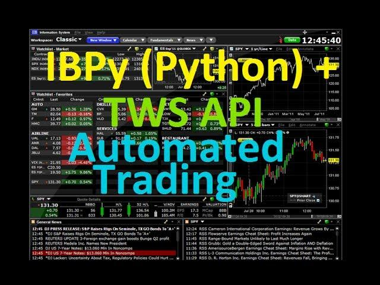

## Table of Contents

## What is Python and why is it used for trading automation?

Python is a computer programming language that is easy to learn and use. It is popular because it can do many different things, like making websites, analyzing data, and even controlling robots. In trading automation, Python is used because it can handle numbers and data very well. Traders use Python to write programs that can automatically buy and sell stocks, cryptocurrencies, or other financial products without needing a person to do it manually.

One reason Python is great for trading automation is that it has many special tools, called libraries, that are made just for working with financial data. These libraries help traders quickly get information about stock prices, analyze market trends, and make smart trading decisions. Because Python is easy to read and write, even people who are new to programming can start using it to automate their trading strategies. This makes it a favorite choice for both professional traders and beginners who want to try out automated trading.

## What is IBPy and how does it relate to the Interactive Brokers API?

IBPy is a Python package that makes it easier to use the Interactive Brokers API. The Interactive Brokers API is a set of tools that lets you connect your computer programs to the Interactive Brokers trading platform. This means you can write programs to automatically trade stocks, options, and other financial products through Interactive Brokers. IBPy helps by providing a simpler way to send commands and receive data from the Interactive Brokers API, making it easier for people who use Python to automate their trading.

IBPy is especially useful because it translates the more complex commands of the [Interactive Brokers](/wiki/interactive-brokers-api) API into simpler Python code. This makes it easier for people who are new to programming or trading to start using the Interactive Brokers platform for automated trading. By using IBPy, you can focus more on developing your trading strategies and less on figuring out how to communicate with the Interactive Brokers system.

## How do you set up an account with Interactive Brokers?

To set up an account with Interactive Brokers, first go to their website. Look for a button that says "Open Account" and click it. You'll need to fill out some forms with your personal information, like your name, address, and social security number. Make sure you have all your details ready, because you'll also need to provide some documents to prove who you are, like a driver's license or passport.

After you submit your application, Interactive Brokers will review it. This might take a few days. Once they approve your application, you'll get an email with instructions on how to fund your account. You can add money by bank transfer or other methods they accept. Once your account is funded, you can start trading. If you need help at any point, Interactive Brokers has customer support to guide you through the process.

## What are the basic steps to install and configure IBPy?

To install IBPy, first make sure you have Python installed on your computer. You can download Python from its official website if you don't have it yet. Once Python is set up, open a command prompt or terminal window. Type in the command `pip install ibpy` and press enter. This will download and install IBPy from the Python package repository. Wait for the installation to finish, and you'll have IBPy ready to use.

After installing IBPy, you need to configure it to work with the Interactive Brokers API. Start by downloading the Interactive Brokers Trader Workstation (TWS) or the IB Gateway from the Interactive Brokers website. Install and open TWS or the IB Gateway on your computer. In your Python script, you'll need to import the IBPy module and set up a connection to the TWS or IB Gateway. You do this by creating an instance of the `IBConnection` class and calling the `connect` method with the right parameters, like the IP address and port number where TWS or the IB Gateway is running. Once connected, you can start sending trading commands and receiving market data through IBPy.

## How do you connect to the Interactive Brokers API using IBPy?

To connect to the Interactive Brokers API using IBPy, you first need to make sure you have IBPy installed on your computer. You can do this by opening a command prompt or terminal window and typing `pip install ibpy`. Once IBPy is installed, you'll need to download and set up the Interactive Brokers Trader Workstation (TWS) or the IB Gateway from the Interactive Brokers website. After installing TWS or the IB Gateway, open it on your computer.

Next, in your Python script, you'll import the IBPy module. Then, you create an instance of the `IBConnection` class and use its `connect` method to establish a connection to TWS or the IB Gateway. You need to provide the right parameters like the IP address and port number where TWS or the IB Gateway is running. For example, if TWS is running on your local computer, you might use `localhost` as the IP address and `7496` as the port number. Once you call the `connect` method with these details, your Python script will be able to send trading commands and receive market data through IBPy.

## What are some basic trading functions you can automate with IBPy?

With IBPy, you can automate simple tasks like buying and selling stocks. You can write a Python script that tells IBPy to send a command to Interactive Brokers to buy a certain number of shares of a stock at a specific price. Once the order is placed, IBPy can keep an eye on the order and let you know when it's filled or if there's a problem. You can also set up the script to sell stocks automatically when they reach a certain price, helping you make money without watching the market all the time.

Another thing you can do with IBPy is to get real-time market data. Your script can ask IBPy to fetch the latest stock prices, trading volumes, and other important information from Interactive Brokers. This data can help you make better trading decisions. For example, if you see that a stock's price is going up fast, your script can automatically buy more of that stock. This way, you can react to market changes quickly, even when you're not looking at your computer.

## How do you handle real-time data streaming with IBPy?

To handle real-time data streaming with IBPy, you first need to set up a connection to the Interactive Brokers Trader Workstation (TWS) or the IB Gateway. Once you're connected, you can use IBPy to ask for real-time data on stocks, options, or other financial products. You do this by telling IBPy to start streaming data for a specific stock or market. IBPy will then keep sending you the latest prices, trading volumes, and other important information as it changes.

After you start the data stream, your Python script needs to be ready to handle the incoming data. You can set up your script to do something with this data, like showing it on your screen, saving it to a file, or using it to make trading decisions. For example, if the price of a stock goes up, your script can automatically buy more of that stock. This way, you can react to market changes quickly, even when you're not watching the market all the time.

## What are common errors when using IBPy and how do you troubleshoot them?

When using IBPy, you might run into some common errors. One error could be a connection problem, where your Python script can't connect to the Interactive Brokers Trader Workstation (TWS) or the IB Gateway. This might happen if TWS or the IB Gateway isn't running, or if you've entered the wrong IP address or port number. Another common error is when your script tries to send a trading command, but it doesn't work because the command is not formatted correctly or you don't have enough money in your account to make the trade.

To troubleshoot these errors, start by checking if TWS or the IB Gateway is running and that you've used the right IP address and port number in your script. If you're still having trouble, make sure your internet connection is working well. For trading command errors, double-check that your commands are written correctly and that you have enough funds in your account. If you're still stuck, you can look at the error messages IBPy gives you, which often tell you what went wrong. If all else fails, you can reach out to Interactive Brokers' customer support for help.

## How can you implement advanced trading strategies using IBPy?

With IBPy, you can create advanced trading strategies by using real-time data and setting up complex rules for buying and selling. For example, you can write a script that looks at many different stocks at the same time and decides which ones to buy or sell based on their prices and how they're moving. You can also use IBPy to set up stop-loss orders, which automatically sell a stock if its price drops too much, helping you avoid big losses. Another advanced strategy is to use IBPy to trade options, which are contracts that give you the right to buy or sell a stock at a certain price. By using IBPy, you can create a strategy that buys options when you think a stock's price will go up or down a lot.

Another way to use IBPy for advanced trading is to combine it with other tools and data sources. For example, you can use IBPy to get real-time data from Interactive Brokers and then use another program to analyze that data and make predictions about where stock prices might go next. You can also use IBPy to automate trading based on news events or economic reports. For instance, if a big news story comes out that might affect stock prices, your script can automatically buy or sell stocks based on that news. By combining IBPy with other tools and data, you can create very smart and flexible trading strategies that can react quickly to changes in the market.

## What are the best practices for managing risk when automating trades with IBPy?

When automating trades with IBPy, it's important to manage risk carefully. One good way to do this is by setting up stop-loss orders. These are orders that automatically sell a stock if its price drops too much, helping you avoid big losses. You can also use IBPy to set up take-profit orders, which sell a stock when its price goes up to a certain level, helping you lock in your gains. Another important thing is to not put all your money into one stock or trade. Instead, spread your money across different stocks and trades, which is called diversification. This way, if one trade goes bad, you won't lose all your money.

Another practice for managing risk is to always test your trading strategies before using real money. You can do this by using a demo account or [backtesting](/wiki/backtesting) your strategies with past data. This helps you see if your strategy works well without risking your money. Also, keep an eye on how much you're trading. Don't trade too much or too often, because this can lead to big losses. Lastly, make sure you understand the market and the stocks you're trading. The more you know, the better you can manage your risks and make smart trading decisions.

## How do you optimize the performance of your trading algorithms in IBPy?

To make your trading algorithms work better with IBPy, you need to make them run faster and use less computer power. One way to do this is by using less data. Instead of looking at every single piece of information, you can pick out the most important parts. For example, if you're trading stocks, you might only need to know the price and how much it's changed, not every little detail. Another way is to make your code simpler. If your code has a lot of steps, try to cut down on them or make them shorter. This can help your computer run your trading strategy more quickly.

Another important thing is to test your algorithms a lot. You can use past data to see how your strategy would have worked before. This is called backtesting. By doing this, you can find out what works well and what doesn't, and then make your strategy better. Also, think about how often you're trading. If you're trading too much, it can slow down your computer and make your strategy less effective. Try to find a good balance so your trades happen at the right times without overloading your system. By doing these things, you can make your trading algorithms in IBPy work better and help you make smarter trades.

## What are the latest updates to the Interactive Brokers API and how do they affect IBPy usage?

Interactive Brokers keeps updating their API to make it better and add new features. Some of the latest updates include better ways to handle options trading and new tools for getting real-time data. These updates can make trading easier and faster. For example, they've added new ways to manage orders and get more detailed information about the market. This means that if you're using IBPy, you might need to update your code to use these new features and make sure it works well with the latest version of the API.

These updates can affect how you use IBPy because you might need to change your scripts to take advantage of the new tools. If you're using an older version of IBPy, it might not work with the newest features of the Interactive Brokers API. You'll need to check if IBPy has been updated to support these new features. If it hasn't, you might need to wait for an update or find another way to use the new tools. Keeping your IBPy and Interactive Brokers software up to date will help you make the most of your trading strategies.

## References & Further Reading

[1]: ["Using Interactive Brokers API for Algorithmic Trading"](https://www.interactivebrokers.com/campus/ibkr-quant-news/algo-trading-using-python-via-ibkr-api/) - Interactive Brokers Official API Guide

[2]: Lopez de Prado, M. (2018). ["Advances in Financial Machine Learning"](https://www.amazon.com/Advances-Financial-Machine-Learning-Marcos/dp/1119482089) - A guide to machine learning in finance

[3]: Chan, E. (2009). ["Quantitative Trading: How to Build Your Own Algorithmic Trading Business"](https://github.com/ftvision/quant_trading_echan_book) - A practical guide to running a trading business

[4]: Jansen, S. (2020). ["Machine Learning for Algorithmic Trading"](https://github.com/stefan-jansen/machine-learning-for-trading) - A comprehensive introduction to using machine learning in trading

[5]: Lien, K. (2008). ["Day Trading and Swing Trading the Currency Market"](https://onlinelibrary.wiley.com/doi/book/10.1002/9781119212997) - Insight into trading strategies in the forex market