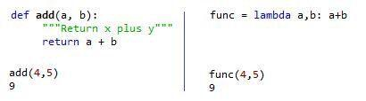

## Table of Contents

## What is a lambda function in Python?

A lambda function in Python is a small, anonymous function that can have any number of arguments but can only have one expression. It's often used when you need a simple function for a short period of time. You can think of it as a quick way to create a function without giving it a name or using the `def` keyword.

Lambda functions are commonly used with functions like `map()`, `filter()`, and `sorted()` where you need to pass a function as an argument. For example, if you want to sort a list of numbers in reverse order, you can use a lambda function with the `sorted()` function. Lambda functions make your code more concise and can help make it easier to read when used appropriately.

## How can lambda functions be used in trading algorithms?

Lambda functions can be really helpful in trading algorithms because they let you write short, simple functions quickly. In trading, you often need to do quick calculations or sort data. For example, if you want to sort a list of stocks based on their price-to-earnings ratio, you can use a lambda function to tell the sorting function how to compare the stocks. This makes your code cleaner and easier to understand because you don't need to write a whole new function just for sorting.

Another way lambda functions can be used in trading algorithms is with filtering data. Let's say you want to find all the stocks in your list that have a price above a certain value. You can use a lambda function with the `filter()` function to go through your list and pick out only the stocks that meet your criteria. This is much faster and simpler than writing a longer function to do the same job. So, lambda functions help traders make quick decisions by simplifying the code they need to write.

## What are the basic syntax and components of a lambda function?

The basic syntax of a lambda function in Python is `lambda arguments: expression`. This means you start with the word `lambda`, then you list the arguments the function will use, separated by commas if there's more than one, and then after a colon, you write the single expression that the function will return. For example, `lambda x: x * 2` is a lambda function that takes one argument `x` and returns `x` multiplied by 2.

The components of a lambda function are the `lambda` keyword, the arguments, and the expression. The `lambda` keyword tells Python that you're creating a lambda function. The arguments are the inputs the function will use, and you can have as many as you need. The expression is what the function does with those inputs and what it returns. Since a lambda function can only have one expression, it's perfect for simple tasks that don't need a lot of steps.

## Can you provide a simple example of using a lambda function for a trading decision?

Imagine you're a trader and you want to decide which stocks to buy based on their price-to-earnings (P/E) ratio. You have a list of stocks and their P/E ratios, and you want to buy stocks with a P/E ratio less than 15. You can use a lambda function to help you make this decision quickly. The lambda function can be used with the `filter()` function to go through your list and pick out only the stocks that meet your criteria.

For example, if your list of stocks is called `stocks` and each stock is a dictionary with a 'pe_ratio' key, you can write `filtered_stocks = list(filter(lambda stock: stock['pe_ratio'] < 15, stocks))`. This line of code uses a lambda function to check if each stock's P/E ratio is less than 15. The `filter()` function then creates a new list, `filtered_stocks`, that only includes the stocks that meet this condition. This way, you can quickly see which stocks you might want to buy without writing a long, complicated function.

## How do lambda functions compare to regular functions in trading applications?

In trading applications, lambda functions are great for quick, simple tasks. They let you write short functions without giving them a name, which can make your code cleaner and easier to read. For example, if you want to sort a list of stocks by their price or filter them based on a certain condition, a lambda function can do this in just one line of code. This is really helpful when you're making quick decisions and don't want to write a whole new function for something simple.

On the other hand, regular functions are better for more complex tasks in trading applications. If you need to do a lot of calculations or have multiple steps in your trading logic, a regular function with a name and multiple lines of code is easier to understand and maintain. Regular functions can also be reused in different parts of your trading algorithm, which can save you time and make your code more organized. So, while lambda functions are great for quick, simple jobs, regular functions are better for bigger, more complicated tasks.

## What are the limitations of using lambda functions in complex trading strategies?

Lambda functions are great for quick and simple tasks in trading, but they have some limitations when it comes to complex trading strategies. One big limitation is that lambda functions can only have one expression. This means you can't write a lot of steps or do complicated calculations in a lambda function. If your trading strategy needs to do a lot of different things, like checking multiple conditions or doing several calculations, a lambda function won't be able to handle it all in one go.

Another limitation is that lambda functions can't have statements like `if`, `for`, or `while` inside them. These statements are often needed in complex trading strategies to make decisions or loop through data. Without them, you can't build the detailed logic that complex trading strategies often require. So, while lambda functions are handy for simple tasks, they're not the best choice for building the more detailed and intricate strategies that some traders need.

## How can lambda functions be integrated with popular trading libraries like Pandas or NumPy?

Lambda functions can be really helpful when you're using popular trading libraries like Pandas or NumPy. In Pandas, you can use lambda functions with methods like `apply()` to do quick calculations on your data. For example, if you have a DataFrame with stock prices and you want to calculate the percentage change from one day to the next, you can use a lambda function with `apply()` to do this in just one line of code. This makes it easy to add new columns to your DataFrame without writing a whole new function.

In NumPy, lambda functions can be used with functions like `np.vectorize()` to apply a simple operation to an entire array. Let's say you have an array of stock prices and you want to find out which ones are above a certain threshold. You can use a lambda function with `np.vectorize()` to quickly check each price and return a new array with the results. This is much faster and simpler than writing a loop to go through each element of the array. So, lambda functions make it easier to work with data in both Pandas and NumPy, helping you make quick decisions in your trading strategies.

## What performance considerations should be taken into account when using lambda functions in high-frequency trading?

When using lambda functions in high-frequency trading, it's important to think about how fast they run. Lambda functions are quick because they're small and don't need a lot of memory. But, if you use them too much or in the wrong way, they might slow down your trading system. High-frequency trading needs to happen very fast, so even a tiny delay can make a big difference. So, make sure you're using lambda functions for simple tasks that don't take up too much time.

Another thing to consider is how often you're creating new lambda functions. In high-frequency trading, you might be doing a lot of calculations over and over. If you're making a new lambda function each time, this can slow things down. It's better to use lambda functions for tasks that you only need to do once or a few times. If you need to do something many times, it might be better to use a regular function that you can reuse, which can help keep your trading system running smoothly and quickly.

## How can lambda functions be used to process real-time market data?

Lambda functions can be really helpful for processing real-time market data because they let you do quick calculations without writing a lot of code. Imagine you're watching stock prices change every second, and you want to know when a stock's price goes above a certain level. You can use a lambda function with a tool like Pandas to check each new price as it comes in. For example, if you have a DataFrame that updates with new stock prices, you can use a lambda function with the `apply()` method to see if the latest price is higher than your target. This way, you can make quick decisions without slowing down your system.

Another way lambda functions can help with real-time market data is by filtering out the information you don't need. Let's say you're only interested in stocks that have moved a lot in the last minute. You can use a lambda function with the `filter()` function to go through your data and pick out only the stocks that meet your criteria. This makes it easier to focus on the most important information without getting overwhelmed by all the data coming in. So, lambda functions are great for keeping your real-time trading system fast and efficient.

## Can lambda functions help in optimizing trading algorithms, and if so, how?

Lambda functions can help optimize trading algorithms by making them faster and simpler. In trading, you often need to do quick calculations or sort data. Lambda functions are perfect for this because they let you write short, simple functions without giving them a name. For example, if you want to sort a list of stocks by their price-to-earnings ratio, you can use a lambda function with the `sorted()` function. This makes your code cleaner and easier to read, which can help your trading algorithm run faster.

Another way lambda functions can help optimize trading algorithms is by making it easier to process real-time data. When you're watching stock prices change every second, you need to make quick decisions. Lambda functions can be used with tools like Pandas to check each new price as it comes in. For example, you can use a lambda function with the `apply()` method to see if a stock's price has gone above a certain level. This way, you can focus on the most important information without slowing down your system. So, lambda functions can help make your trading algorithms more efficient and effective.

## What are some advanced use cases of lambda functions in algorithmic trading?

In [algorithmic trading](/wiki/algorithmic-trading), lambda functions can be used for advanced tasks like creating custom indicators. Imagine you want to create a new indicator that combines several pieces of data, like moving averages and [volume](/wiki/volume-trading-strategy). You can use a lambda function to quickly calculate this new indicator and add it to your trading strategy. This makes it easy to test new ideas without writing a lot of code. For example, you could use a lambda function with Pandas to apply your custom indicator to a DataFrame of stock prices, helping you make better trading decisions.

Another advanced use of lambda functions in algorithmic trading is for real-time risk management. When you're trading, you need to keep an eye on how much risk you're taking. Lambda functions can help you quickly calculate risk metrics, like the maximum drawdown or the [volatility](/wiki/volatility-trading-strategies) of your portfolio. You can use a lambda function with NumPy to apply these calculations to your data in real-time. This way, you can adjust your trading strategy on the fly to manage risk better, making your trading more effective and safer.

## How can lambda functions be combined with machine learning models for predictive trading?

Lambda functions can be really helpful when you're using [machine learning](/wiki/machine-learning) models for predictive trading. Imagine you have a machine learning model that predicts stock prices. You can use a lambda function to quickly process the data before it goes into the model. For example, if you need to normalize the data or calculate some new features, a lambda function can do this in just one line of code. This makes your trading system faster and easier to understand because you don't need to write a whole new function for these simple tasks.

Another way lambda functions can help with machine learning in trading is by processing the model's predictions. Let's say your model gives you a prediction for each stock, but you want to make a trading decision based on these predictions. You can use a lambda function to quickly turn these predictions into buy or sell signals. For example, you could use a lambda function with the `apply()` method in Pandas to go through your predictions and decide which stocks to buy or sell. This way, you can make quick trading decisions based on your machine learning model's output, making your trading strategy more effective.

## References & Further Reading

[1]: McKinney, W. (2012). ["Python for Data Analysis: Data Wrangling with Pandas, NumPy, and IPython."](https://wesmckinney.com/book/) O'Reilly Media.

[2]: VanderPlas, J. (2016). ["Python Data Science Handbook: Essential Tools for Working with Data."](https://jakevdp.github.io/PythonDataScienceHandbook/) O'Reilly Media.

[3]: Lopez de Prado, M. (2018). ["Advances in Financial Machine Learning."](https://www.amazon.com/Advances-Financial-Machine-Learning-Marcos/dp/1119482089) Wiley.

[4]: Hilpisch, Y. (2020). ["Python for Finance: Mastering Data-Driven Finance."](https://books.google.com/books/about/Python_for_Finance.html?id=2qd9DwAAQBAJ) O'Reilly Media.

[5]: Jansen, S. (2020). ["Machine Learning for Algorithmic Trading: Predictive models to extract signals from market and alternative data for systematic trading strategies with Python."](https://www.amazon.com/Machine-Learning-Algorithmic-Trading-alternative/dp/1839217715) Packt Publishing.