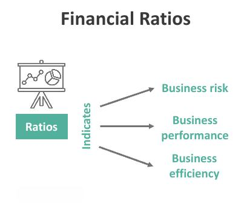

The modern financial landscape is characterized by complex mechanisms that drive investment decisions in stock markets. Investors are navigating a multifaceted environment where various tools and strategies intersect to optimize returns and mitigate risks. Key among these tools are financial ratios, stock valuation, and algorithmic trading, each playing a pivotal role in shaping investment strategies.

Financial ratios serve as essential indicators, providing insights into a company’s operational health and potential for future performance. These ratios, derived from financial statement analysis, offer a quantitative foundation for evaluating a company's worth and inform decisions regarding stock purchases or sales. Stock valuation techniques, on the other hand, delve deeper into determining the intrinsic value of stocks, allowing investors to assess whether a security is fairly priced by the market. This assessment is crucial for making informed investment decisions in the highly dynamic stock market environment.



Algorithmic trading represents a significant shift from traditional human-led trading. By leveraging sophisticated algorithms and computational power, investors can execute trades with increased efficiency and precision. Algorithmic trading offers new opportunities by allowing high-frequency trading and real-time decision-making, minimizing human error and emotional biases that often affect trading outcomes.

Understanding these concepts is essential for anyone looking to engage in advanced financial strategies. As algorithmic trading and data analysis become more intertwined with financial metrics, the traditional models of investment are transformed, offering both opportunities and challenges. This article aims to demystify financial ratios and elucidate their critical role in stock valuation and algorithmic trading, providing investors with the knowledge they need to navigate the complexities of modern finance effectively.

## Table of Contents

## Understanding Financial Ratios

Financial ratios are quantitative measures derived from a company’s financial statements, offering valuable insights into its performance, efficiency, and stability. These ratios are essential tools for investors, analysts, and stakeholders to evaluate and compare companies across different sectors and industries. By condensing vast amounts of complex financial data into simple, comparative figures, ratios facilitate the assessment of a company's financial health and viability.

**Valuation Ratios**

Valuation ratios are critical indicators utilized to assess whether a stock is overvalued, undervalued, or fairly valued in comparison to its peers. The primary valuation ratios include:

1. **Price-to-Earnings (P/E) Ratio**: This ratio is calculated as the market price per share divided by the earnings per share (EPS). It helps investors evaluate the market’s pricing of a company's earnings potential.
$$
   \text{P/E Ratio} = \frac{\text{Market Price per Share}}{\text{Earnings per Share}}

$$

2. **Price-to-Book (P/B) Ratio**: The P/B ratio compares a stock's market value to its book value, offering insights into the intrinsic value of the assets.
$$
   \text{P/B Ratio} = \frac{\text{Market Price per Share}}{\text{Book Value per Share}}

$$

3. **Price-to-Sales (P/S) Ratio**: This ratio measures a company’s stock price relative to its revenue per share, providing an indication of value against sales.
$$
   \text{P/S Ratio} = \frac{\text{Market Price per Share}}{\text{Revenue per Share}}

$$

These ratios enable investors to contextualize a company's valuation relative to its industry counterparts, supporting informed investment decisions.

**Other Key Ratios**

Beyond valuation ratios, other critical financial ratios include:

- **Debt-to-Equity (D/E) Ratio**: This leverage ratio indicates the proportion of company financing that comes from debt versus shareholder equity. It serves as a measure of financial risk, with higher ratios suggesting greater leverage.
$$
  \text{D/E Ratio} = \frac{\text{Total Liabilities}}{\text{Shareholders' Equity}}

$$

- **Return on Equity (ROE)**: ROE measures the profitability and efficiency of a company in generating profit from shareholders' equity. It is a fundamental indicator of financial performance.
$$
  \text{ROE} = \frac{\text{Net Income}}{\text{Shareholders' Equity}}

$$

Financial ratios distill intricate financial information into accessible metrics that support rapid evaluation. For investors aspiring to conduct thorough stock analyses, mastering these ratios is indispensable. Accurate interpretation of financial ratios ensures a well-rounded perspective on a company’s financial dynamics, enhancing strategic decision-making and investment evaluation.

## Stock Valuation Techniques

Stock valuation involves determining the intrinsic value of a stock, which helps investors ascertain whether the stock is fairly priced by the market. This process is crucial for making informed buying and selling decisions. Valuation typically incorporates both quantitative and qualitative factors, creating a comprehensive assessment of a stock's worth.

Quantitative aspects rely heavily on financial ratios derived from a company's financial statements. These ratios offer insights into the company's financial health, efficiency, and market performance. Ratios such as Price-to-Earnings (P/E), Price-to-Book (P/B), and Price-to-Sales (P/S) are instrumental in evaluating whether a stock is overvalued or undervalued relative to its industry peers.

Qualitative factors add another layer of depth, examining elements like management quality, the company's competitive position in the market, and overall business model. These factors, while not easily quantifiable, provide crucial context that can influence a stock's perceived value.

Stock valuation employs several widely recognized methods, each offering a different perspective on intrinsic value. The Discounted Cash Flow (DCF) analysis is a cornerstone method that estimates a company's value based on its expected future cash flows, which are adjusted to present value using an appropriate discount rate. The formula used in DCF is:

$$
\text{DCF} = \sum \frac{CF_t}{(1 + r)^t}
$$

where $CF_t$ represents the cash flow at time $t$, and $r$ is the discount rate.

Another technique, Comparable Company Analysis (CCA), involves analyzing financial metrics of similar companies within the same industry to derive a valuation benchmark. This method assumes that similar companies will have similar market valuations, making industry peers a reference point for valuing the target company.

Precedent Transactions Analysis examines past merger and acquisition deals involving similar companies. This approach helps establish a range of potential values based on historical transactions, with the understanding that market conditions and valuation multiples from these deals can offer insights into a company's worth.

Fundamental analysis is integral to these valuation techniques. It focuses on understanding a company’s financials in-depth to identify the stock's intrinsic value, thereby guiding investment decisions. Fundamental analysis combines the elements of financial statement analysis, economic conditions, and industry trends to provide a holistic view of a company's potential.

Ultimately, stock valuation is a core aspect of investment analysis. By incorporating both quantitative ratios and qualitative assessments, and employing various methods like DCF, CCA, and precedent transactions, investors can establish a robust valuation model. This thorough approach informs sound investment strategies, reflecting an intricate understanding of both the company's financial performance and its position in the overarching market landscape.

## Algorithmic Trading and Its Impact

Algorithmic trading employs computer algorithms to automate the process of trading, which significantly improves both efficiency and precision in executing trades. Relying on historical data, these algorithms forecast future market trends by employing complex models that analyze myriad data points much faster than a human could. This computational power enables high-frequency trading, where trades are executed at speeds that minimize market impact and capture [arbitrage](/wiki/arbitrage) opportunities, all with minimal human intervention.

One of the primary attractions of [algorithmic trading](/wiki/algorithmic-trading) is its ability to perform multiple transactions in a fraction of a second, capitalizing on opportunities arising from price discrepancies. Common strategies employed in algorithmic trading include [trend following](/wiki/trend-following), where algorithms identify and trade along market trends; mean reversion, which assumes asset prices will revert to their long-term average; and [statistical arbitrage](/wiki/statistical-arbitrage), which seeks to exploit price differentials between correlated assets.

To illustrate, consider a simple moving average crossover strategy, a type of trend-following strategy. Here, the algorithm might be designed to buy a stock when a short-term moving average (e.g., 50-day) crosses above a long-term moving average (e.g., 200-day), signaling a potential upward trend:

```python
def moving_average(prices, window_length):
    return sum(prices[-window_length:]) / window_length

def should_buy(short_ma, long_ma):
    return short_ma > long_ma

prices = [...]  # list of historical prices
short_term = 50
long_term = 200

short_ma = moving_average(prices, short_term)
long_ma = moving_average(prices, long_term)

if should_buy(short_ma, long_ma):
    print("Buy Signal")
```

Furthermore, the incorporation of [machine learning](/wiki/machine-learning) techniques is revolutionizing algorithmic trading by enabling algorithms to adapt and optimize trading strategies based on real-time analysis. Machine learning models can discern intricate patterns in vast datasets, which are otherwise overlooked by traditional statistical models. For example, [reinforcement learning](/wiki/reinforcement-learning), a type of machine learning, allows algorithms to learn optimal strategies through trial and error, refining themselves with each trade.

The widespread adoption of algorithmic trading is reshaping market practices. It demands a heightened level of technological proficiency, as market participants must not only understand traditional finance but also possess knowledge in computer science and data analytics. To this end, significant investment in technology infrastructure is essential to maintain competitive advantage in markets where speed and data-driven insights dictate success. 

With the continuous advancement of algorithmic trading, market participants must adjust to an environment where adaptability and technological adeptness have become crucial components of successful trading strategies.

## Integration of Ratios, Valuation, and Algo Trading

Integrating financial ratios, valuation techniques, and algorithmic trading constitutes a comprehensive investment evaluation framework. Financial ratios and valuation methods offer foundational insights that can significantly enhance algorithmic trading models, leading to more informed and responsive trading strategies.

Financial ratios, such as the Price-to-Earnings (P/E) ratio, serve as critical indicators of a company's valuation state. For instance, a low P/E ratio might suggest an undervalued stock, justifying a 'buy' decision, whereas a high P/E could indicate an overvalued position and a potential 'sell'. Meanwhile, these financial metrics can set specific thresholds in automated trading systems, triggering predefined responses based on valuation discrepancies.

Algorithmic trading stands to gain from these metrics, as integrating fundamental data with trading algorithms improves predictive accuracy and trading decisions. Automated systems can exploit these insights by executing trades in response to specific financial thresholds or valuation irregularities. For example, a trading algorithm could be designed to initiate purchases when the P/E ratio falls below a certain threshold, signaling a potentially undervalued investment opportunity.

Moreover, the intersection of macroeconomic indicators with algorithmic systems enhances market responsiveness. By updating algorithms to reflect trends in key financial ratios, traders can adjust strategies to align with evolving economic conditions. This adaptive capability ensures that trading strategies maintain a balance between technical efficiency and economic fundamentals.

Aligning these components fosters an investment strategy that is both robust and adaptive. By integrating the precision and speed of algorithms with the depth of [fundamental analysis](/wiki/fundamental-analysis), investors can effectively navigate complex market environments. Such alignment allows for the development of hybrid strategies that leverage the strengths of both quantitative models and qualitative insights. This fusion aids investors in maintaining a competitive edge in the ever-evolving landscape of finance.

## Future Trends and Conclusion

As the financial landscape evolves, the methods for stock analysis and trading are undergoing significant transformations. Artificial intelligence (AI) and data science are becoming pivotal in refining financial ratios and valuation models. With advances in machine learning algorithms, AI can analyze vast datasets with remarkable efficiency, providing insights that were previously unattainable. Sophisticated models can now predict market movements and optimize investment portfolios, allowing for a more data-driven approach to stock analysis. Techniques such as natural language processing (NLP) facilitate the inclusion of qualitative data, such as market sentiment from news articles and social media, into these models, enhancing their predictive power.

Investment strategies are increasingly incorporating advanced analytics to improve decision-making processes. Tools like predictive analytics allow investors to identify trends and make more informed predictions about future stock performances. Quantitative strategies are also being enhanced by big data technologies, which can process and analyze information at unprecedented speeds and volumes. This integration of technology epitomizes a shift towards more dynamic and adaptable investment methodologies.

The regulatory landscape is also evolving, presenting both challenges and opportunities for algorithmic trading and investment analysis. Financial regulators are progressively scrutinizing algorithmic and high-frequency trading practices to ensure fair and transparent market conditions. This regulatory shift necessitates that traders and investment firms remain compliant while continuing to innovate. Meanwhile, technological advancements, including improvements in computing power and data transmission speeds, support the further development and refinement of trading algorithms.

To effectively leverage these advances, investors must maintain a comprehensive understanding of emerging technologies and regulatory frameworks. Staying informed and adaptable will be crucial in maximizing the benefits of AI and data-driven strategies. Continuous learning and adaptation will enable investors to capitalize on technological innovations while navigating regulatory modifications.

Comprehending the interconnected nature of these concepts offers a strategic advantage in today's fast-paced financial environment. As AI, data science, and technology shape the future of stock analysis and trading, investors who harness these tools effectively will be better positioned to achieve superior investment outcomes. Recognizing the importance of these trends and adapting accordingly ensures that investors remain competitive and successful.

## References & Further Reading

[1]: ["Wiley Finance: Quantitative Value"](https://onlinelibrary.wiley.com/doi/book/10.1002/9781119205456) by Wesley R. Gray and Tobias E. Carlisle

[2]: ["The Little Book of Valuation: How to Value a Company, Pick a Stock, and Profit"](https://www.amazon.com/Little-Book-Valuation-Company-Profits/dp/1394244401) by Aswath Damodaran

[3]: Bühler, A., Teichmann, J., & Wood, B. (2019). ["Deep hedging."](https://arxiv.org/abs/1802.03042) Quantitative Finance.

[4]: Patel, J., Shah, S., Thakkar, P., & Kotecha, K. (2015). ["Predicting stock market index using fusion of machine learning techniques."](https://www.sciencedirect.com/science/article/abs/pii/S0957417414006551) Expert Systems with Applications, 42(4), 2162-2172.

[5]: ["Financial Statement Analysis and Security Valuation"](https://www.mheducation.com/highered/product/financial-statement-analysis-security-valuation-penman/M9780078025310.html) by Stephen H. Penman