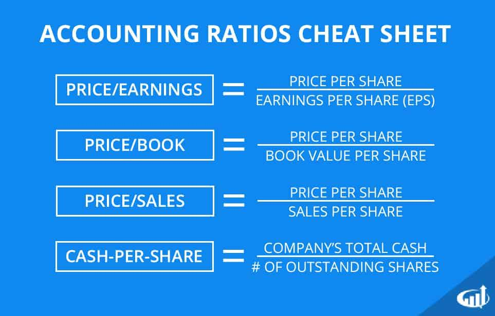

## Table of Contents

## What is a stock valuation ratio?

A stock valuation ratio is a tool that investors use to figure out if a stock is a good buy or not. It compares the price of a stock to things like the company's earnings, sales, or book value. By using these ratios, investors can see if a stock is priced too high, too low, or just right compared to its actual worth.

One common stock valuation ratio is the Price-to-Earnings (P/E) ratio. This ratio shows how much investors are willing to pay for each dollar of a company's earnings. For example, if a stock has a P/E ratio of 20, it means investors are willing to pay $20 for every $1 of earnings the company makes. A high P/E might mean the stock is overvalued, while a low P/E might suggest it's undervalued. But, it's important to compare these ratios with other companies in the same industry to get a better idea.

## Why are ratios important in assessing stock valuation?

Ratios are important in assessing stock valuation because they help investors understand if a stock is priced correctly. By comparing the stock price to different financial metrics like earnings, sales, or book value, ratios give a quick snapshot of a company's value. This helps investors decide if a stock is a good buy or if it's too expensive compared to what the company is actually worth.

Using ratios also allows investors to compare different companies within the same industry. For example, if one company has a much higher Price-to-Earnings (P/E) ratio than its competitors, it might mean that the stock is overvalued. On the other hand, a lower P/E ratio could suggest that the stock is undervalued and might be a good investment opportunity. By looking at these ratios, investors can make smarter choices about which stocks to buy or sell.

## What is the Price-to-Earnings (P/E) ratio and how is it calculated?

The Price-to-Earnings (P/E) ratio is a number that helps investors figure out if a stock is a good buy. It tells you how much money you have to pay for each dollar of the company's earnings. If a stock has a P/E ratio of 20, that means you're paying $20 for every $1 the company makes in profit.

To calculate the P/E ratio, you take the current stock price and divide it by the company's earnings per share (EPS). The EPS is found by dividing the company's total earnings by the number of outstanding shares. So, if a stock is trading at $50 and the EPS is $2.50, the P/E ratio would be $50 divided by $2.50, which equals 20. This simple calculation helps investors see if a stock is priced right compared to how much money the company is making.

## How can the Price-to-Book (P/B) ratio help in evaluating a company's stock?

The Price-to-Book (P/B) ratio is another way to check if a stock is priced right. It compares the stock's market price to its book value, which is the total value of the company's assets minus its liabilities. If the P/B ratio is low, it might mean the stock is undervalued and could be a good buy. If it's high, the stock might be overvalued.

You calculate the P/B ratio by dividing the stock's current market price by its book value per share. For example, if a stock is trading at $30 and its book value per share is $10, the P/B ratio would be 3. This ratio is really helpful, especially for companies with a lot of physical assets like factories or machines. It gives investors a quick way to see if they're paying a fair price for what the company actually owns.

## What does the Debt-to-Equity (D/E) ratio tell us about a company's financial health?

The Debt-to-Equity (D/E) ratio tells us how much a company is relying on borrowed money compared to the money put in by its owners. It's like looking at how much debt a company has for every dollar of equity. If the D/E ratio is high, it means the company has a lot of debt compared to its equity, which can be risky. A high D/E ratio might mean the company could have trouble paying back its loans, especially if business gets tough.

On the other hand, a low D/E ratio means the company isn't using much debt and is mostly funded by equity. This can be a sign of a financially healthy company because it's not as risky. But, it's important to compare the D/E ratio with other companies in the same industry because what's considered high or low can vary a lot from one industry to another.

## How does the Price-to-Sales (P/S) ratio differ from the P/E ratio and when should it be used?

The Price-to-Sales (P/S) ratio and the Price-to-Earnings (P/E) ratio are both used to figure out if a stock is a good buy, but they look at different things. The P/S ratio compares the stock's price to the company's sales, while the P/E ratio compares the stock's price to the company's earnings. This means the P/S ratio is useful when a company isn't making any profits yet, because it still has sales. On the other hand, the P/E ratio is better for companies that are already making money, because it shows how much you're paying for each dollar of earnings.

You should use the P/S ratio when you're looking at companies that are growing fast but aren't profitable yet. For example, a lot of tech startups might not have earnings, but they have big sales numbers. The P/S ratio can help you see if the stock's price is fair compared to those sales. If the P/S ratio is low, it might mean the stock is a good deal. But if it's high, the stock might be too expensive for the sales the company is making.

## Can you explain the concept of the Dividend Yield and its role in stock valuation?

The Dividend Yield is a way to see how much money you get back from a stock in the form of dividends. It's like a percentage that shows how much of the stock's price you get back each year as dividends. You find the Dividend Yield by taking the yearly dividend per share and dividing it by the stock's price, then multiplying by 100 to get a percentage. For example, if a stock costs $100 and pays a $5 dividend each year, the Dividend Yield would be 5%.

Dividend Yield is important in stock valuation because it helps investors see how much income they can expect from a stock. If a stock has a high Dividend Yield, it might be a good choice for someone looking for regular income from their investments. But, a high yield could also mean the stock's price has gone down a lot, which might be a warning sign. On the other hand, a low Dividend Yield might mean the stock is growing and the company is using its profits to grow the business instead of paying out dividends. So, it's a useful tool to compare different stocks and see which ones might fit your investment goals better.

## What advanced ratios like EV/EBITDA can tell investors about a company's value?

The EV/EBITDA ratio, which stands for Enterprise Value to Earnings Before Interest, Taxes, Depreciation, and Amortization, is a way to look at a company's value that's different from just looking at its stock price. It tells you how much you'd have to pay for the whole company, including its debt, to get its earnings before some big costs like interest and taxes are taken out. This ratio is helpful because it gives a clearer picture of a company's value, especially when comparing companies with different amounts of debt or different ways of handling their taxes and depreciation.

Investors use the EV/EBITDA ratio to see if a company is a good buy. If the ratio is low, it might mean the company is undervalued and could be a good investment. But if it's high, the company might be overvalued, and you might want to be careful. This ratio is especially useful for looking at companies that might be thinking about being bought by another company, because it shows what the whole business is worth, not just the stock price.

## How do sector-specific ratios, such as Price-to-Cash-Flow (P/CF) for tech companies, enhance valuation analysis?

Sector-specific ratios like the Price-to-Cash-Flow (P/CF) ratio are really helpful when you want to understand the value of companies in certain industries, like tech companies. The P/CF ratio looks at how much you're paying for each dollar of cash flow a company makes. Cash flow is important in tech because these companies often spend a lot of money on research and development, and they might not show big profits right away. By using the P/CF ratio, you can see if the stock price is a good deal compared to the actual cash the company is bringing in.

Using the P/CF ratio can give you a better picture of a tech company's value than just looking at earnings. Sometimes, tech companies might have low or even negative earnings because they're investing heavily in growth. But if they have strong cash flow, that's a good sign they're doing well. By comparing the P/CF ratio of different tech companies, you can figure out which ones might be undervalued and could be good investments. This way, you're not just looking at profits, but at the real money the company is making and spending.

## What are the limitations of using ratios alone for stock valuation?

Using ratios alone for stock valuation has some big limits. Ratios give you a quick look at things like earnings, sales, or cash flow, but they don't tell the whole story. For example, a company might look good on paper with a low P/E ratio, but there could be other problems like a lot of debt or bad management that the ratio doesn't show. Also, ratios can be different from one industry to another, so just looking at a single ratio might not be fair if you're not comparing it to similar companies.

Another problem is that ratios are based on past numbers, but what really matters is what will happen in the future. A company's earnings or sales might change a lot because of new competition, changes in the market, or new products. Ratios don't take these things into account. So, while ratios are a good starting point, you need to look at other things like the company's plans, the economy, and what experts think about the company's future to really understand if a stock is a good buy.

## How can investors combine multiple ratios to form a more comprehensive view of a stock's valuation?

Investors can get a better picture of a stock's value by using more than one ratio at the same time. For example, you might look at the Price-to-Earnings (P/E) ratio to see how much you're paying for the company's earnings, and then check the Price-to-Book (P/B) ratio to see if the stock price is fair compared to what the company actually owns. If you also look at the Debt-to-Equity (D/E) ratio, you can see how much debt the company has compared to what its owners have put in. By putting these ratios together, you can see if a company is a good buy from different angles, like earnings, assets, and financial health.

Using multiple ratios helps you avoid making decisions based on just one piece of information. For instance, a company might have a low P/E ratio, which makes it look like a good deal, but if its D/E ratio is high, it might be risky because of too much debt. By looking at both, you get a fuller picture. You can also compare these ratios with other companies in the same industry to see if the stock is really a good value or if it's just average. This way, you can make smarter choices about which stocks to buy or sell.

## What are some expert strategies for adjusting ratios to account for economic cycles and market conditions?

Experts often adjust ratios to better fit what's happening in the economy and the market. One way they do this is by looking at how ratios change over time. For example, during a boom time when the economy is doing well, P/E ratios might be higher because people are willing to pay more for stocks. But in a recession, when things are tougher, those same ratios might be lower because people are more careful with their money. By looking at past data during different economic cycles, experts can guess if current ratios are high or low compared to what's normal.

Another strategy is to adjust ratios based on what's happening in the market right now. For instance, if interest rates go up, companies with a lot of debt might see their stock prices drop because it's harder to pay back loans. So, experts might look at the Debt-to-Equity (D/E) ratio more closely during these times. They might also compare a company's ratios to those of other companies in the same industry to see if they're doing better or worse. This way, they can adjust their view of a stock's value based on what's happening around it, not just on the numbers alone.

## What is the key to understanding financial ratios?

Financial ratios are quantitative measures derived from a company’s financial statements, offering valuable insights into its performance, efficiency, and stability. These ratios are essential tools for investors, analysts, and stakeholders to evaluate and compare companies across different sectors and industries. By condensing vast amounts of complex financial data into simple, comparative figures, ratios facilitate the assessment of a company's financial health and viability.

**Valuation Ratios**

Valuation ratios are critical indicators utilized to assess whether a stock is overvalued, undervalued, or fairly valued in comparison to its peers. The primary valuation ratios include:

1. **Price-to-Earnings (P/E) Ratio**: This ratio is calculated as the market price per share divided by the earnings per share (EPS). It helps investors evaluate the market’s pricing of a company's earnings potential.
$$
   \text{P/E Ratio} = \frac{\text{Market Price per Share}}{\text{Earnings per Share}}

$$

2. **Price-to-Book (P/B) Ratio**: The P/B ratio compares a stock's market value to its book value, offering insights into the intrinsic value of the assets.
$$
   \text{P/B Ratio} = \frac{\text{Market Price per Share}}{\text{Book Value per Share}}

$$

3. **Price-to-Sales (P/S) Ratio**: This ratio measures a company’s stock price relative to its revenue per share, providing an indication of value against sales.
$$
   \text{P/S Ratio} = \frac{\text{Market Price per Share}}{\text{Revenue per Share}}

$$

These ratios enable investors to contextualize a company's valuation relative to its industry counterparts, supporting informed investment decisions.

**Other Key Ratios**

Beyond valuation ratios, other critical financial ratios include:

- **Debt-to-Equity (D/E) Ratio**: This leverage ratio indicates the proportion of company financing that comes from debt versus shareholder equity. It serves as a measure of financial risk, with higher ratios suggesting greater leverage.
$$
  \text{D/E Ratio} = \frac{\text{Total Liabilities}}{\text{Shareholders' Equity}}

$$

- **Return on Equity (ROE)**: ROE measures the profitability and efficiency of a company in generating profit from shareholders' equity. It is a fundamental indicator of financial performance.
$$
  \text{ROE} = \frac{\text{Net Income}}{\text{Shareholders' Equity}}

$$

Financial ratios distill intricate financial information into accessible metrics that support rapid evaluation. For investors aspiring to conduct thorough stock analyses, mastering these ratios is indispensable. Accurate interpretation of financial ratios ensures a well-rounded perspective on a company’s financial dynamics, enhancing strategic decision-making and investment evaluation.

## What are Stock Valuation Techniques?

Stock valuation involves determining the intrinsic value of a stock, which helps investors ascertain whether the stock is fairly priced by the market. This process is crucial for making informed buying and selling decisions. Valuation typically incorporates both quantitative and qualitative factors, creating a comprehensive assessment of a stock's worth.

Quantitative aspects rely heavily on financial ratios derived from a company's financial statements. These ratios offer insights into the company's financial health, efficiency, and market performance. Ratios such as Price-to-Earnings (P/E), Price-to-Book (P/B), and Price-to-Sales (P/S) are instrumental in evaluating whether a stock is overvalued or undervalued relative to its industry peers.

Qualitative factors add another layer of depth, examining elements like management quality, the company's competitive position in the market, and overall business model. These factors, while not easily quantifiable, provide crucial context that can influence a stock's perceived value.

Stock valuation employs several widely recognized methods, each offering a different perspective on intrinsic value. The Discounted Cash Flow (DCF) analysis is a cornerstone method that estimates a company's value based on its expected future cash flows, which are adjusted to present value using an appropriate discount rate. The formula used in DCF is:

$$
\text{DCF} = \sum \frac{CF_t}{(1 + r)^t}
$$

where $CF_t$ represents the cash flow at time $t$, and $r$ is the discount rate.

Another technique, Comparable Company Analysis (CCA), involves analyzing financial metrics of similar companies within the same industry to derive a valuation benchmark. This method assumes that similar companies will have similar market valuations, making industry peers a reference point for valuing the target company.

Precedent Transactions Analysis examines past merger and acquisition deals involving similar companies. This approach helps establish a range of potential values based on historical transactions, with the understanding that market conditions and valuation multiples from these deals can offer insights into a company's worth.

Fundamental analysis is integral to these valuation techniques. It focuses on understanding a company’s financials in-depth to identify the stock's intrinsic value, thereby guiding investment decisions. Fundamental analysis combines the elements of financial statement analysis, economic conditions, and industry trends to provide a holistic view of a company's potential.

Ultimately, stock valuation is a core aspect of investment analysis. By incorporating both quantitative ratios and qualitative assessments, and employing various methods like DCF, CCA, and precedent transactions, investors can establish a robust valuation model. This thorough approach informs sound investment strategies, reflecting an intricate understanding of both the company's financial performance and its position in the overarching market landscape.

## References & Further Reading

[1]: ["Wiley Finance: Quantitative Value"](https://onlinelibrary.wiley.com/doi/book/10.1002/9781119205456) by Wesley R. Gray and Tobias E. Carlisle

[2]: ["The Little Book of Valuation: How to Value a Company, Pick a Stock, and Profit"](https://www.amazon.com/Little-Book-Valuation-Company-Profits/dp/1394244401) by Aswath Damodaran

[3]: Bühler, A., Teichmann, J., & Wood, B. (2019). ["Deep hedging."](https://arxiv.org/abs/1802.03042) Quantitative Finance.

[4]: Patel, J., Shah, S., Thakkar, P., & Kotecha, K. (2015). ["Predicting stock market index using fusion of machine learning techniques."](https://www.sciencedirect.com/science/article/abs/pii/S0957417414006551) Expert Systems with Applications, 42(4), 2162-2172.

[5]: ["Financial Statement Analysis and Security Valuation"](https://www.mheducation.com/highered/product/financial-statement-analysis-security-valuation-penman/M9780078025310.html) by Stephen H. Penman