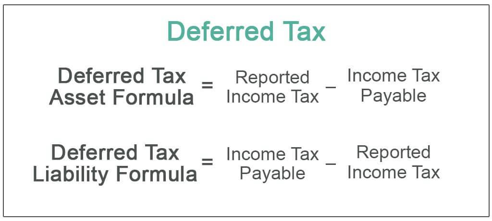

## Table of Contents

## What is tax deferral in the context of real estate?

Tax deferral in real estate means you can delay paying taxes on the profit you make from selling a property. Instead of paying taxes right away, you can use that money to buy another property. This is often done through a process called a 1031 exchange, which is a special rule in the tax code that allows you to swap one investment property for another without paying taxes on the gain immediately.

This can be really helpful because it lets you keep more money to invest in new properties. By deferring taxes, you can grow your real estate investments faster. However, it's important to follow the rules carefully, because if you don't, you might have to pay the taxes you were trying to defer. It's a good idea to work with a tax professional to make sure everything is done correctly.

## How does investing in real estate help in deferring taxes?

Investing in real estate can help you defer taxes through something called a 1031 exchange. When you sell a property and make a profit, you usually have to pay taxes on that profit right away. But with a 1031 exchange, you can use the money you made to buy another property instead of paying taxes immediately. This means you can keep more of your money to invest in more real estate, which can help you grow your investments faster.

To do a 1031 exchange, you have to follow some specific rules. You need to identify the new property you want to buy within 45 days of selling your old property, and you have to complete the purchase of the new property within 180 days. If you don't follow these rules, you might have to pay the taxes you were trying to defer. It's a good idea to work with a tax professional to make sure everything goes smoothly and you can take full advantage of the tax benefits.

## What is the 1031 exchange and how does it facilitate tax deferral?

A 1031 exchange is a special rule in the tax code that lets you swap one investment property for another without paying taxes on the profit right away. When you sell a property and make money, you usually have to pay taxes on that profit. But with a 1031 exchange, you can use the money you made to buy another property instead of paying taxes immediately. This is called tax deferral because you're putting off paying the taxes until later.

To do a 1031 exchange, you need to follow some specific rules. You have to identify the new property you want to buy within 45 days of selling your old property. Then, you have to complete the purchase of the new property within 180 days. If you don't follow these rules, you might have to pay the taxes you were trying to defer. Working with a tax professional can help make sure everything goes smoothly and you can take full advantage of the tax benefits.

## Can you explain the basic rules and timelines for a 1031 exchange?

A 1031 exchange lets you swap one investment property for another without paying taxes on the profit right away. To do this, you need to follow some important rules. First, the properties you're exchanging must be for investment or business use, not for personal use like your home. Also, the value of the new property should be the same or more than the old one, and you need to use all the money from the sale to buy the new property.

There are strict timelines you must follow for a 1031 exchange. After you sell your old property, you have 45 days to find and identify the new property you want to buy. This means you need to write down the address of the new property and give it to someone like a lawyer or a qualified intermediary. Then, you have 180 days from the day you sold your old property to finish buying the new one. If you don't meet these deadlines, you might have to pay the taxes you were trying to avoid.

It's really important to follow these rules carefully. If you mess up, you could end up owing taxes on the profit from your old property. Working with a tax professional can help make sure everything goes smoothly and you can take full advantage of the tax benefits of a 1031 exchange.

## What types of properties qualify for a 1031 exchange?

Properties that qualify for a 1031 exchange are those used for investment or business purposes. This means you can swap things like rental houses, apartment buildings, office buildings, shopping centers, and even vacant land that you plan to develop later. The key is that the property must be held for investment or used in a trade or business, not for personal use like your main home or a vacation home you use for yourself.

The properties you're exchanging must be of "like-kind." This term can be a bit confusing, but basically, it means the properties must be similar in nature or character, even if they're not exactly the same type. For example, you can exchange a rental house for a shopping center because both are considered real property used for investment. However, you can't exchange real property for personal property like stocks or cars, because those are not considered like-kind.

## How does depreciation recapture affect tax deferral strategies in real estate?

Depreciation recapture is something you need to think about when you're using tax deferral strategies like a 1031 exchange in real estate. When you own a rental property, you can claim depreciation on it, which means you can reduce your taxable income by the amount the property supposedly loses value over time. But when you sell the property, the IRS wants to get back some of the tax benefits you got from depreciation. This is called depreciation recapture, and it can make you owe taxes even if you're using a 1031 exchange to defer other taxes on your profit.

With a 1031 exchange, you can defer the taxes on the profit you made from selling your property, but you can't avoid depreciation recapture. When you sell your property, you'll still have to pay taxes on the amount of depreciation you claimed while you owned it. This means that while a 1031 exchange can help you keep more of your money to invest in new properties, you'll still need to pay taxes on the recaptured depreciation. It's important to plan for this when you're thinking about your overall tax strategy in real estate investing.

## What are the potential pitfalls or common mistakes to avoid when using real estate for tax deferral?

When using real estate for tax deferral, one of the biggest mistakes people make is not following the strict rules of a 1031 exchange. You have to identify the new property within 45 days of selling your old one and complete the purchase within 180 days. If you miss these deadlines, you might have to pay the taxes you were trying to avoid. Another common mistake is not using all the money from the sale of the old property to buy the new one. If you take any money out, you'll have to pay taxes on that amount right away.

Another pitfall is not understanding depreciation recapture. Even if you use a 1031 exchange to defer taxes on your profit, you still have to pay taxes on the depreciation you claimed while you owned the property. This can be a surprise to some people and affect their tax planning. Also, people sometimes forget that the properties they're exchanging must be for investment or business use, not personal use. If you try to exchange a property you live in, like your main home, you won't be able to defer the taxes.

Lastly, not working with a tax professional can lead to big mistakes. The rules for tax deferral in real estate can be complicated, and it's easy to mess up without expert help. A tax professional can guide you through the process, make sure you meet all the deadlines, and help you plan for things like depreciation recapture. This can save you a lot of headaches and help you take full advantage of the tax benefits available.

## How can real estate investors use tax-deferred retirement accounts like a self-directed IRA to enhance tax deferral?

Real estate investors can use tax-deferred retirement accounts like a self-directed IRA to grow their investments without paying taxes on the earnings right away. A self-directed IRA lets you invest in things like rental properties, not just stocks and bonds. When you earn money from your real estate, like rent or when you sell the property for a profit, you don't have to pay taxes on that money as long as it stays in the IRA. This can help your investments grow faster because you're not losing money to taxes every year.

Using a self-directed IRA for real estate does come with some rules you need to follow. You can't live in the property yourself or use it for your own business. Also, all the money you make from the property has to go back into the IRA, not into your pocket. If you break these rules, you might have to pay taxes and penalties. But if you follow the rules, a self-directed IRA can be a powerful tool to help you defer taxes and build wealth over time.

## What are the advanced strategies for maximizing tax deferral through real estate investments?

One advanced strategy for maximizing tax deferral through real estate investments is using a Delaware Statutory Trust (DST). A DST allows investors to exchange their property into a trust that holds real estate, which can be part of a 1031 exchange. This way, you can defer taxes on your profit and also diversify your investments without having to manage the property yourself. DSTs are great for people who want to keep deferring taxes but don't want the hassle of managing properties. They also let you invest in larger, more expensive properties that you might not be able to buy on your own.

Another strategy is to use a self-directed IRA to buy real estate. When you invest in real estate through a self-directed IRA, any money you make from rent or selling the property stays in the IRA and grows tax-deferred. This means you don't have to pay taxes on that money until you take it out of the IRA, which can be a long time if you're planning for retirement. Just remember, you can't use the property for personal use or take the money out of the IRA without paying taxes and possibly penalties. Using a self-directed IRA can help you build wealth over time without the burden of annual taxes on your real estate earnings.

## How do state and local taxes impact the effectiveness of real estate tax deferral strategies?

State and local taxes can change how well your real estate tax deferral strategies work. When you do a 1031 exchange, you might not have to pay federal taxes right away, but some states and cities might still want their share of the taxes on the profit you made from selling your property. This means you could end up paying some taxes even if you're trying to defer them. Different places have different rules, so it's important to know what your state and local taxes are like before you plan your tax deferral strategy.

Also, when you buy a new property in a different state or city, you might have to deal with new taxes that you didn't have before. Some places have higher property taxes or other fees that can affect how much money you make from your investment. This can make your overall tax deferral less effective if the new taxes are higher than what you were used to. It's a good idea to work with a tax professional who knows about the rules in different areas to help you plan the best way to defer your taxes and keep more of your money.

## What are the long-term implications of using real estate for tax deferral on estate planning?

Using real estate for tax deferral can have big effects on your estate planning. When you use strategies like a 1031 exchange, you're putting off paying taxes on the profit from selling your property. This means you can keep more money to invest in more properties or other investments. But when you pass away, your heirs might have to deal with those deferred taxes. If you didn't pay taxes on the profit you made, your heirs might have to pay them when they inherit the property. This can make things more complicated for them and might affect how much money they get from your estate.

Another thing to think about is how using real estate for tax deferral can change the value of your estate. If you keep buying more properties with the money you're not paying in taxes, your estate might grow a lot. This could mean your heirs have to pay estate taxes if the total value of your estate is over a certain amount. Estate taxes are different from the taxes you defer through a 1031 exchange, and they can be really high. It's important to plan carefully and maybe work with a tax professional or an estate planner to make sure your heirs are taken care of and don't have to deal with a big tax bill after you're gone.

## How can one transition from tax deferral to tax elimination through real estate investment strategies?

One way to move from tax deferral to tax elimination in real estate is by using a strategy called the "step-up in basis." When you pass away, your heirs can inherit your property at its current market value, not the value you bought it for. This means if you bought a property for $100,000 and it's worth $500,000 when you die, your heirs get it at the $500,000 value. If they sell it right away, they won't have to pay taxes on the $400,000 gain because they got a "step-up" to the new value. This can help eliminate the taxes you deferred through strategies like a 1031 exchange.

Another way to work towards tax elimination is by using real estate to generate income that qualifies for special tax treatments. For example, if you invest in properties that let you take advantage of things like depreciation or certain tax credits, you can reduce your taxable income. Over time, if you plan well, you might be able to structure your investments so that you're paying very little in taxes or even none at all. It's important to work with a tax professional to make sure you're using all the right strategies and following the rules to get the best tax benefits possible.

## Can I Borrow Against My Home Equity?

Homeowners and investors can strategically use the equity built up in their properties to secure additional funding for new investments, thereby expanding their portfolios without the need to sell their existing assets. Equity in a property is the difference between its current market value and the outstanding mortgage balance. When this equity is leveraged, it can be tapped into through financial products such as home equity loans or home equity lines of credit (HELOCs).

The process of borrowing against home equity involves assessing factors such as credit scores, which reflect the borrower’s creditworthiness and impact the interest rates offered by lenders. Moreover, debt-to-income ratios (DTI) are crucial. This ratio is calculated as follows:

$$
\text{DTI} = \frac{\text{Total Monthly Debt Payments}}{\text{Gross Monthly Income}} \times 100
$$

A lower DTI ratio indicates a lower risk for lenders and may result in more favorable loan terms.

Equity loans offer high [liquidity](/wiki/liquidity-risk-premium) and considerable flexibility, allowing borrowers to access substantial sums of money that can be reinvested in additional properties or other lucrative ventures. This capability to leverage existing property equity increases investment potential without necessitating asset liquidation.

However, while the ability to harness home equity is advantageous, it also introduces significant risks. Increased borrowing results in higher debt obligations, and failure to meet these obligations can lead to severe financial consequences, including the possibility of foreclosure. Thus, careful financial planning and consideration of repayment capabilities are essential when utilizing home equity as an investment strategy.

## How can you maximize mortgage interest deductions?

Mortgage interest deductions serve as a valuable tax benefit for homeowners, significantly reducing taxable income. In the initial years of a mortgage, a substantial portion of monthly payments is allocated towards interest, allowing for a considerable deduction. This deduction can make homeownership more financially viable by lowering the tax burden.

In the United States, tax reforms introduced in December 2017 under the Tax Cuts and Jobs Act have modified the landscape of mortgage interest deductions. For loans initiated after this date, the tax-deductible interest applies only to the first $750,000 of mortgage debt. Previously, the limit stood at $1,000,000, indicating a reduction aimed at tax code simplification and increased federal revenue.

Here's an example to illustrate this concept: consider a taxpayer with a primary mortgage of $800,000, taken after 2017. The deductible interest will apply only up to $750,000 of this debt. Assuming an [interest rate](/wiki/interest-rate-trading-strategies) of 4%, the interest paid annually would amount to approximately:

$$
\text{Interest for $750,000} = 750,000 \times 0.04 = 30,000
$$

Thus, $30,000 could be deducted from the taxpayer's taxable income, which can result in significant tax savings depending on their marginal tax bracket.

It's important to note that while the limit applies to new loans, existing mortgages as of December 2017 remain under the previous ceiling of $1,000,000. Furthermore, for married taxpayers filing separately, the mortgage interest deduction is limited to loans up to $375,000 (or $500,000 under the previous limit).

Given these stipulations, taxpayers are encouraged to maintain comprehensive records of their mortgage terms, as these determine the applicable tax deduction limit. Proper understanding and use of these deductions not only facilitate sound financial planning but also enhance the long-term benefits of homeownership.

## References & Further Reading

[1]: ["The Real Estate Wholesaling Bible: The Fastest, Easiest Way to Get Started in Real Estate Investing"](https://www.wiley.com/en-us/The+Real+Estate+Wholesaling+Bible%3A+The+Fastest%2C+Easiest+Way+to+Get+Started+in+Real+Estate+Investing-p-9781118807521) by Than Merrill

[2]: ["Real Estate Investment Trusts: Structure, Performance, and Investment Opportunities"](https://www.researchgate.net/publication/227466824_Real_estate_investment_trusts_Structure_performance_and_investment_opportunities) by Richard T. Garrigan

[3]: ["Real Estate Taxation: A Practitioner's Guide"](https://www.amazon.com/Real-Estate-Taxation-Practitioners-Fourth/dp/0808013769) by David F. Windish

[4]: ["Algorithmic Trading: Winning Strategies and Their Rationale"](https://www.wiley.com/en-us/Algorithmic+Trading%3A+Winning+Strategies+and+Their+Rationale-p-9781118460146) by Ernie Chan

[5]: Seppä, M. (2012). ["Optimization in Real Estate Transactions: An Algorithmic Approach to Timing Decisions in a Volatile Market."](https://scholar.google.com/citations?user=hR-P7h4AAAAJ) Journal of Real Estate Research.

[6]: ["Depreciation: A Report prepared by the Committee on Ways and Means"](https://waysandmeans.house.gov/) Committee on Ways and Means, U.S. Government.