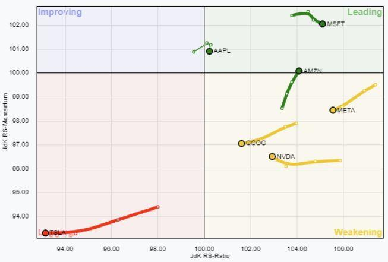

## Table of Contents

## What is a Relative Rotation Graph (RRG) and how does it work?

A Relative Rotation Graph, or RRG, is a tool used in finance to compare how different investments are doing compared to each other. It helps investors see which investments are getting stronger or weaker over time. The graph shows different investments as points on a circle. The circle is divided into four parts, and each part tells us something about how the investment is doing compared to a benchmark, like a stock market index.

The way RRG works is by plotting each investment on the circle based on two things: how much it's moving in the same direction as the benchmark (correlation) and how well it's doing compared to the benchmark (relative strength). If an investment is in the top right part of the circle, it means it's doing better than the benchmark and moving in the same direction. If it's in the bottom left, it's doing worse and moving in the opposite direction. By watching how these points move around the circle over time, investors can make better decisions about where to put their money.

## How can beginners use RRGs to identify market trends?

Beginners can use Relative Rotation Graphs (RRGs) to spot market trends by looking at how different investments move on the graph. Imagine the RRG as a big circle split into four parts. Each part tells you something about how an investment is doing compared to a big group of investments, like the stock market. If an investment is in the top right part, it's doing better than the market and moving with it. This means it's a good time to pay attention to that investment because it might keep doing well.

To use RRGs, beginners should watch how the points on the graph move over time. If a point is moving from the bottom left to the top right, it's getting stronger compared to the market. This could be a sign that the investment is starting a new trend and might be a good choice to invest in. On the other hand, if a point is moving from the top right to the bottom left, it's getting weaker, and it might be a good time to think about selling or avoiding that investment. By keeping an eye on these movements, beginners can get a better feel for what's happening in the market and make smarter choices.

## What are the key components of an RRG and their significance?

The key components of a Relative Rotation Graph (RRG) are the circle itself, the four quadrants, and the points that represent different investments. The circle is divided into four equal parts, called quadrants. Each quadrant tells us something different about how an investment is doing compared to a benchmark, like the stock market. The top right quadrant is called the "Leading" quadrant, where investments are doing better than the market and moving in the same direction. The bottom right is the "Weakening" quadrant, where investments are still doing better but starting to move away from the market's direction. The bottom left is the "Lagging" quadrant, where investments are doing worse and moving opposite to the market. Lastly, the top left is the "Improving" quadrant, where investments are still doing worse but starting to move back towards the market's direction.

The points on the RRG represent different investments, and their position on the circle shows how they are doing compared to the benchmark. The closer a point is to the center of the circle, the more it's moving in the same direction as the benchmark. The further away from the center, the more it's moving in a different direction. The position along the circle from left to right shows how well the investment is doing compared to the benchmark. By watching how these points move from one quadrant to another over time, investors can see trends and make better decisions. If a point is moving towards the Leading quadrant, it might be a good time to invest in that asset. If it's moving towards the Lagging quadrant, it might be time to sell or avoid it.

## How do you interpret the movement of sectors or assets on an RRG?

When you look at a Relative Rotation Graph (RRG), you see different sectors or assets as points moving around a circle. The circle is split into four parts, and each part tells you something about how well the sector or asset is doing compared to the whole market. If a point is moving towards the top right part of the circle, it means that sector or asset is getting stronger and doing better than the market. This is a good sign, and it might be a good time to invest in it. On the other hand, if a point is moving towards the bottom left part, it means the sector or asset is getting weaker and doing worse than the market. This could be a sign to sell or avoid that investment.

The movement of the points on the RRG also shows you how the sectors or assets are changing over time. If a point is moving from the bottom left to the top right, it's a sign that the sector or asset is starting to improve and might be entering a new trend. This can help you catch the beginning of a good run. If a point is moving from the top right to the bottom left, it's a sign that the sector or asset is starting to weaken and might be entering a bad run. By watching these movements, you can get a better idea of what's happening in the market and make smarter choices about where to put your money.

## What are the different quadrants of an RRG and what do they represent?

The Relative Rotation Graph (RRG) is a circle that's split into four parts, called quadrants. Each quadrant tells you something different about how a sector or asset is doing compared to the whole market. The top right quadrant is called the "Leading" quadrant. When a sector or asset is in this part, it means it's doing better than the market and moving in the same direction. This is a good sign, and it might be a good time to invest in it. The bottom right quadrant is called the "Weakening" quadrant. If a sector or asset is here, it's still doing better than the market but starting to move away from the market's direction. This could mean it's starting to lose strength.

The bottom left quadrant is called the "Lagging" quadrant. When a sector or asset is in this part, it means it's doing worse than the market and moving in the opposite direction. This is a sign that it might be a good time to sell or avoid that investment. The top left quadrant is called the "Improving" quadrant. If a sector or asset is here, it's still doing worse than the market but starting to move back towards the market's direction. This could be a sign that it's starting to get better and might be worth watching for a good time to invest. By looking at where sectors or assets are on the RRG and how they move between these quadrants, you can get a better idea of what's happening in the market and make smarter choices about where to put your money.

## How can RRGs be used to make trading decisions?

RRGs can help you make trading decisions by showing you how different sectors or assets are doing compared to the whole market. Imagine the RRG as a big circle split into four parts. Each part tells you something about how well a sector or asset is doing. If a sector or asset is in the top right part, it's doing better than the market and moving in the same direction. This is a good sign, and it might be a good time to buy that sector or asset. If it's in the bottom left part, it's doing worse and moving in the opposite direction. This could be a sign to sell or avoid that investment.

By watching how the points on the RRG move over time, you can see trends and make better choices. If a point is moving from the bottom left to the top right, it means that sector or asset is getting stronger and might be a good time to buy. If it's moving from the top right to the bottom left, it's getting weaker, and it might be a good time to sell. By keeping an eye on these movements, you can get a better feel for what's happening in the market and make smarter trading decisions.

## What are the common pitfalls to avoid when using RRGs for trading?

When using RRGs for trading, one common pitfall to avoid is relying too much on the graph alone. RRGs are great for showing how sectors or assets are doing compared to the market, but they don't tell the whole story. You should also look at other things like company news, economic reports, and overall market conditions before making a trade. If you only use the RRG, you might miss important information that could change your decision.

Another pitfall is not understanding that RRGs show trends over time, not instant predictions. The graph can help you see if a sector or asset is getting stronger or weaker, but it won't tell you exactly when to buy or sell. It's important to be patient and watch how the points move over time. Jumping into a trade just because a point is in a certain part of the graph can lead to bad decisions. Always use RRGs as one part of your trading plan, not the only part.

## How can advanced traders integrate RRGs with other technical analysis tools?

Advanced traders can use RRGs along with other technical analysis tools to make better trading decisions. One way to do this is by combining RRGs with moving averages. Moving averages help smooth out price data to see the overall trend. If an RRG shows a sector or asset moving into the Leading quadrant and the moving average is also trending up, it can give a strong signal to buy. On the other hand, if the RRG shows a sector or asset moving into the Lagging quadrant and the moving average is trending down, it might be a good time to sell.

Another way to use RRGs with other tools is by looking at momentum indicators like the Relative Strength Index (RSI). The RSI can show if a sector or asset is overbought or oversold. If an RRG shows a sector or asset in the Leading quadrant but the RSI is overbought, it might be a sign to wait before buying. If the RRG shows a sector or asset in the Lagging quadrant and the RSI is oversold, it could be a good time to think about buying, especially if the RRG starts to show improvement. By using RRGs with other tools, advanced traders can get a fuller picture of the market and make smarter trades.

## What are some case studies or examples where RRGs have been effectively used in trading?

In one case, a trader used RRGs to spot a trend in the technology sector. The RRG showed that tech stocks were moving into the Leading quadrant, meaning they were doing better than the market and moving in the same direction. The trader also looked at moving averages and saw that they were trending up. This gave a strong signal to buy tech stocks. Over the next few months, the tech sector did very well, and the trader made a good profit. This shows how RRGs can help traders find good opportunities by showing which sectors are getting stronger.

Another example is when a trader used RRGs to avoid a bad investment in the energy sector. The RRG showed that energy stocks were moving into the Lagging quadrant, meaning they were doing worse than the market and moving in the opposite direction. The trader also checked the RSI and saw that it was oversold, but the RRG's movement was clear. The trader decided to sell their energy stocks before they lost more value. A few weeks later, the energy sector took a big hit, and the trader was glad they got out in time. This case shows how RRGs can help traders avoid losing money by showing which sectors are getting weaker.

## How can RRGs help in managing risk and portfolio diversification?

RRGs can help manage risk by showing which sectors or assets are doing better or worse compared to the market. If a sector is moving into the Lagging quadrant, it means it's doing worse and might be riskier to invest in. By seeing this on the RRG, you can decide to sell or avoid that sector to lower your risk. On the other hand, if a sector is moving into the Leading quadrant, it's doing better and might be a safer choice. By using RRGs, you can make choices that help keep your investments safer.

RRGs also help with portfolio diversification by showing you which sectors are strong and which are weak. If all your money is in one sector and the RRG shows it's moving into the Lagging quadrant, you might want to move some of your money into a sector that's moving into the Leading quadrant. This way, you spread your money across different sectors, which can help protect your portfolio if one sector does badly. By using RRGs to see how different sectors are doing, you can make sure your investments are spread out and less risky.

## What are the limitations of RRGs and how can they be mitigated?

RRGs are great tools, but they have some limits. One big limit is that they only show how sectors or assets are doing compared to the market, not the whole picture. They don't tell you about things like company news or big economic changes that can affect your investments. Also, RRGs show trends over time, not instant predictions. If you only look at the RRG, you might miss important signs that could change your trading decisions.

To make up for these limits, you should use RRGs with other tools. Look at things like moving averages to see the overall trend, and use momentum indicators like the RSI to see if a sector or asset is overbought or oversold. Also, always keep an eye on the news and economic reports. By using RRGs along with other information, you can get a fuller picture of the market and make smarter choices about your investments.

## How can expert traders use RRGs to forecast long-term market movements?

Expert traders can use RRGs to forecast long-term market movements by watching how sectors or assets move between the different quadrants over time. If a sector keeps moving into the Leading quadrant and stays there for a long time, it might mean that sector will keep doing well in the future. On the other hand, if a sector keeps moving into the Lagging quadrant and stays there, it might mean that sector will keep doing badly. By looking at these long-term trends, expert traders can make guesses about where the market might be headed.

To make these forecasts more accurate, expert traders also use other tools along with RRGs. They might look at moving averages to see the overall trend and momentum indicators like the RSI to see if a sector or asset is overbought or oversold. They also keep an eye on big economic changes and company news. By putting all this information together, expert traders can get a better idea of what might happen in the market over the long term and make smarter investment choices.

## References & Further Reading

[1]: ["Visualizing Relative Rotation Graphs (RRG)"](https://www.investopedia.com/relative-rotation-graph-8418457) at StockCharts.com

[2]: "Relative Rotation Graphs" by Julius de Kempenaer, available on [StockCharts.com](https://stockcharts.com/articles/rrg/2024/12/financials-primed-to-beat-tech-652.html)

[3]: Kirkpatrick, C. D., & Dahlquist, J. R. (2010). ["Technical Analysis: The Complete Resource for Financial Market Technicians"](https://ptgmedia.pearsoncmg.com/images/9780134137049/samplepages/9780134137049.pdf). FT Press.

[4]: Murphy, J. J. (1999). ["Technical Analysis of the Financial Markets: A Comprehensive Guide to Trading Methods and Applications"](https://archive.org/details/technicalanalysi0000murp). New York Institute of Finance.

[5]: Plummer, T. (1993). ["The Psychology of Technical Analysis: Profiting from Crowd Behavior and the Dynamics of Price"](https://www.amazon.com/Psychology-Technical-Analysis-Profiting-Behavior/dp/1557385432). McGraw-Hill.

[6]: "Advances in Technical Analysis" in Journal of Portfolio Management, which provides academic insights into new methods like RRGs and their applications in trading strategies.