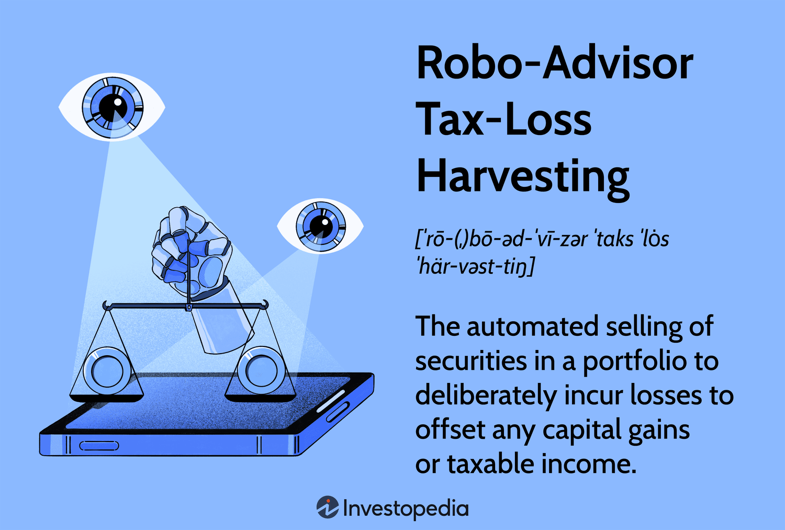

## Table of Contents

## What is a robo-advisor and how does it work?

A robo-advisor is a type of automated financial advisor that uses computer algorithms to manage your investments. It's like having a smart computer help you with your money. You tell the robo-advisor what your financial goals are, how much risk you're willing to take, and how long you want to invest for. Then, the robo-advisor creates a personalized investment plan for you, usually by investing your money in a mix of stocks and bonds.

Once your money is invested, the robo-advisor keeps an eye on your investments and makes changes as needed. For example, if the stock market goes up or down a lot, the robo-advisor might adjust your investments to keep them in line with your goals and risk level. This is called rebalancing. Robo-advisors are usually cheaper than human financial advisors because they don't have the same overhead costs, and they can be a good option for people who want a simple, hands-off way to invest their money.

## How can robo-advisors help with tax savings?

Robo-advisors can help you save on taxes by using a strategy called tax-loss harvesting. This means they look for investments that have lost value and sell them to offset any gains you might have made from other investments. By doing this, you can lower the amount of taxes you have to pay on your investment earnings. It's like finding a silver lining in a losing investment, because even though the investment went down, it can help you save money on taxes.

Another way robo-advisors help with tax savings is by choosing investments that are already tax-efficient. For example, they might put your money into index funds or ETFs, which usually have lower tax costs than other types of investments. By picking these kinds of investments, robo-advisors can help you keep more of your money instead of giving it to the taxman. So, even if you don't know much about taxes, a robo-advisor can work behind the scenes to make sure you're saving as much as possible.

## What are the basic tax-saving strategies that robo-advisors use?

Robo-advisors help you save on taxes by using a strategy called tax-loss harvesting. This means they look for investments that have gone down in value and sell them. By doing this, they can use the losses to offset any gains you might have made from other investments. This can lower the amount of taxes you have to pay on your earnings. It's like finding a good side to a bad investment, because even though the investment lost money, it can help you save on taxes.

Another way robo-advisors help with tax savings is by choosing investments that are already good at saving you money on taxes. They might put your money into things like index funds or ETFs, which usually have lower tax costs than other types of investments. By picking these kinds of investments, robo-advisors can help you keep more of your money instead of giving it to the taxman. So, even if you don't know much about taxes, a robo-advisor can work behind the scenes to make sure you're saving as much as possible.

## Can you explain tax-loss harvesting and how robo-advisors implement it?

Tax-loss harvesting is a way to save money on taxes by using investments that have lost value. When an investment goes down, instead of just holding onto it and hoping it goes back up, you sell it. By selling it at a loss, you can use that loss to reduce the taxes you owe on any gains from other investments. It's like turning a bad situation into something good, because even though you lost money on one investment, it can help you save money on taxes.

Robo-advisors make tax-loss harvesting easy because they do it automatically. They keep an eye on your investments all the time and look for ones that have gone down in value. When they find one, they sell it and use the loss to offset any gains you might have made from other investments. This way, you don't have to worry about keeping track of everything yourself. The robo-advisor does all the work for you, helping you save money on taxes without you having to do anything extra.

## What are the potential tax benefits of using a robo-advisor for retirement accounts?

Using a robo-advisor for your retirement accounts can help you save money on taxes in a few ways. One big benefit is that many retirement accounts, like IRAs and 401(k)s, let you put money in without paying taxes on it right away. This is called tax-deferred growth, and it means your investments can grow without being shrunk by taxes each year. Robo-advisors can help you choose the best investments for these accounts, making sure your money grows as much as possible before you have to pay taxes on it.

Another way robo-advisors can help with tax savings in retirement accounts is through smart investment choices. They can pick investments that are good at saving you money on taxes, like index funds or ETFs, which often have lower tax costs. By putting your retirement money into these kinds of investments, robo-advisors can help you keep more of your money for when you retire, instead of giving it to the taxman. So, even if you don't know much about taxes, a robo-advisor can work behind the scenes to make sure you're saving as much as possible for your future.

## How do robo-advisors handle asset location to optimize tax efficiency?

Robo-advisors help you save on taxes by using a strategy called asset location. This means they put different types of investments in different types of accounts to make sure you pay the least amount of taxes possible. For example, they might put investments that grow a lot but don't pay out much money, like stocks, into tax-deferred accounts like IRAs or 401(k)s. This way, the money can grow without being taxed each year. On the other hand, they might put investments that pay out a lot of money, like bonds, into regular taxable accounts where the tax hit isn't as big.

By doing this, robo-advisors make sure your money is working as hard as it can without giving too much to the taxman. They look at all your accounts and figure out the best place for each investment, so you don't have to worry about it. It's like having a smart friend who knows all about taxes and helps you keep more of your money.

## What are the differences in tax strategies between various robo-advisor platforms?

Different robo-advisor platforms use different tax strategies to help you save money. Some robo-advisors focus a lot on tax-loss harvesting, which means they look for investments that have gone down in value and sell them to offset any gains you might have made from other investments. This can lower the amount of taxes you have to pay. Other robo-advisors might not do tax-loss harvesting as often, or they might have different rules about when and how they do it. For example, some might only do it once a year, while others might check for opportunities to do it more often.

Another difference is how robo-advisors handle asset location. Some platforms are really good at putting your investments in the right accounts to save on taxes. They might put stocks in tax-deferred accounts like IRAs and bonds in regular taxable accounts. Other robo-advisors might not be as smart about this, and they might just put all your money in one type of account without thinking about taxes. So, it's important to look at what each robo-advisor does to see which one fits your needs best.

## How can robo-advisors be used to manage capital gains taxes?

Robo-advisors can help you manage capital gains taxes by using a strategy called tax-loss harvesting. This means they look for investments that have lost money and sell them. By selling these investments at a loss, they can use that loss to offset any gains you might have made from other investments. This way, you can lower the amount of taxes you have to pay on your earnings. It's like finding a good side to a bad investment, because even though the investment went down, it can help you save on taxes.

Another way robo-advisors help with capital gains taxes is by choosing where to put your investments. They can put investments that grow a lot, like stocks, into tax-deferred accounts like IRAs or 401(k)s. This means you don't have to pay taxes on the growth of these investments right away. On the other hand, they might put investments that pay out money, like bonds, into regular taxable accounts where the tax hit isn't as big. By doing this, robo-advisors can help you keep more of your money instead of giving it to the taxman.

## What advanced tax optimization techniques do robo-advisors offer?

Robo-advisors use a few smart tricks to help you save even more on taxes. One of these tricks is called tax-lot accounting. This means they keep track of every single piece of an investment you own, like when you bought it and how much it cost. By doing this, they can pick the best time to sell each piece to save you the most money on taxes. It's like having a super-organized friend who knows exactly which of your things to sell to get the best tax deal.

Another advanced technique is called direct indexing. Instead of buying a whole bunch of stocks all at once, robo-advisors can buy each stock one by one. This way, they can do tax-loss harvesting more often and more effectively. It's like picking out each piece of fruit from a basket instead of buying the whole basket, so you can choose the best ones to help you save on taxes. By using these smart techniques, robo-advisors can help you keep more of your money and pay less to the taxman.

## How do robo-advisors integrate with other tax planning tools or services?

Robo-advisors can work together with other tax planning tools or services to help you save even more money on taxes. They can connect with tax software like TurboTax or H&R Block, so all your investment information is automatically filled in when you do your taxes. This makes it easier for you because you don't have to enter everything by hand. Plus, some robo-advisors can share information with your accountant or tax advisor, so they can see exactly what's going on with your investments and give you better advice.

Another way robo-advisors integrate with other services is by working with financial planning tools. For example, they might connect with apps like Mint or Personal Capital to give you a full picture of your money. This way, you can see how your investments fit into your overall financial plan, and the robo-advisor can make smarter decisions about taxes based on your whole financial situation. By working together with these other tools, robo-advisors can help you save more money and make your tax planning easier.

## What should investors consider about the tax implications of rebalancing with robo-advisors?

When you use a robo-advisor, they might change your investments from time to time to keep them in line with your goals. This is called rebalancing. But rebalancing can have tax effects that you need to think about. If the robo-advisor sells some of your investments to rebalance, you might have to pay taxes on any money you made from those investments. This is called a capital gain. So, it's important to know that rebalancing can sometimes mean you owe more in taxes.

Some robo-advisors are smart about rebalancing to help you save on taxes. They might do things like tax-loss harvesting, where they sell investments that have lost money to offset the taxes on your gains. But not all robo-advisors do this, so you need to check if yours does. Also, how often they rebalance can make a difference. If they do it a lot, you might have more chances to owe taxes. So, it's good to ask your robo-advisor how they handle rebalancing and taxes, so you can plan better for your money.

## How can expert investors customize tax strategies within a robo-advisor platform?

Expert investors can customize tax strategies within a robo-advisor platform by using features like tax-loss harvesting settings. Some robo-advisors let you decide how often they should look for chances to do tax-loss harvesting. You might choose to do it more often if you want to save more on taxes, or less often if you want to keep your investments more stable. You can also set rules about which investments to sell and when, so you can make sure the robo-advisor is doing what you want it to do to save you money on taxes.

Another way expert investors can customize their tax strategies is by choosing where to put their money. Some robo-advisors let you decide which accounts to use for different types of investments. For example, you might put stocks in a tax-deferred account like an IRA to save on taxes, and bonds in a regular taxable account. By making these choices, you can make sure your money is working as hard as it can to save you money on taxes. It's like being the boss of your own tax plan, even with a robo-advisor helping you out.

## References & Further Reading

[1]: Wessel, D., & Chugh, I. (2019). ["Redefining Robo-Advice: How to Make It Work for Investors."](https://www.researchgate.net/profile/Christiane-Attig/publication/327671778_Human-Technology_Interaction_from_a_Personal_Resource_Perspective_The_Affinity_for_Technology_Interaction_ATI_Scale/links/5ba89b1b92851ca9ed213ee0/Human-Technology-Interaction-from-a-Personal-Resource-Perspective-The-Affinity-for-Technology-Interaction-ATI-Scale.pdf) Brookings Institution.

[2]: Mullins, D. W. (2019). ["Robo-Advisors: A Portfolio Management Perspective."](https://www.researchgate.net/publication/328390383_Robo-Advisory_Opportunities_and_Risks_for_the_Future_of_Financial_Advisory_Recent_Findings_and_Practical_Cases) CFA Institute Research Foundation Briefs.

[3]: Wealthfront. (2023). ["Understanding Tax-Loss Harvesting."](https://www.wealthfront.com/blog/tax-loss-harvesting-results-2023/)

[4]: Betterment. (2023). ["Tax-Loss Harvesting – What It Is and How Betterment Does It."](https://www.betterment.com/tax-loss-harvesting)

[5]: Kissell, R. (2013). ["The Science of Algorithmic Trading and Portfolio Management."](https://www.sciencedirect.com/book/9780124016897/the-science-of-algorithmic-trading-and-portfolio-management) Academic Press.

[6]: Bartholdy, J., & Peare, P. (2005). ["Estimation of expected return: CAPM vs. Fama and French."](https://www.sciencedirect.com/science/article/pii/S1057521904001085) International Review of Financial Analysis.