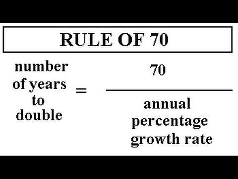

## Table of Contents

## What is the Rule of 70?

The Rule of 70 is a simple way to estimate how long it will take for something to double in size. You use it by dividing the number 70 by the growth rate of whatever you're looking at. For example, if a country's population is growing at 2% each year, you divide 70 by 2 to get 35 years. This means the population will double in about 35 years.

This rule is handy for things like population growth, money in a savings account, or even the spread of information. It's not perfect because it assumes the growth rate stays the same, which it often doesn't. But it gives a quick, easy way to understand how fast things are growing without needing a calculator or complex math.

## How is the Rule of 70 used to estimate GDP growth?

The Rule of 70 can help you guess how long it will take for a country's GDP to double if it keeps growing at the same rate. You just take the number 70 and divide it by the GDP growth rate. For example, if a country's GDP is growing by 3.5% each year, you divide 70 by 3.5 to get about 20 years. This means that if the GDP keeps growing at 3.5% every year, it will be twice as big in around 20 years.

This rule is useful because it's easy to use and doesn't need a lot of math. But remember, it's just an estimate. Real GDP growth can go up and down because of things like wars, new laws, or big changes in the world economy. So, the Rule of 70 gives you a quick idea, but it's not always exactly right.

## Why is the number 70 used in the Rule of 70?

The number 70 is used in the Rule of 70 because it's a handy way to make quick guesses about how long it takes for things to double. When you divide 70 by the growth rate, you get a number that's pretty close to the actual time it takes for something to double. This works because the math behind it is based on logarithms, which help us figure out how fast things grow. But instead of doing complicated math, we use 70 because it's easy to remember and use.

The reason 70 works well is that it's close to the natural logarithm of 2, which is about 0.693. If you multiply 0.693 by 100 to make it easier to use, you get around 69.3. We round that up to 70 because it's simpler and still gives us a good enough estimate. So, even though it's not perfect, the Rule of 70 is a quick and easy way to figure out doubling times without needing a calculator or deep math knowledge.

## Can the Rule of 70 be applied to other types of growth rates besides GDP?

Yes, the Rule of 70 can be used for many different kinds of growth rates, not just GDP. It's helpful for figuring out how long it will take for things like populations, savings accounts, or even the spread of information to double. For example, if a savings account grows at 5% each year, you can use the Rule of 70 to find out that it will take about 14 years for your money to double.

The Rule of 70 works well because it's easy to use and gives a quick estimate. You just divide 70 by the growth rate, and you get the number of years it will take for something to double. But remember, it's just a guess. Real growth can change because of many things, so the Rule of 70 might not be exactly right, but it's a good starting point.

## What are the limitations of using the Rule of 70 for GDP growth estimates?

The Rule of 70 is a handy tool for guessing how long it will take for a country's GDP to double, but it has some limits. One big limit is that it assumes the growth rate will stay the same forever. In real life, GDP growth can go up and down because of things like wars, new laws, or big changes in the world economy. So, the Rule of 70 might not give you the exact right answer if the growth rate changes a lot.

Another thing to think about is that the Rule of 70 is just a quick way to estimate. It's not perfect because it uses a simple number, 70, to make the math easy. This means the guess it gives you might be a bit off, especially if you're looking at very high or very low growth rates. But even with these limits, the Rule of 70 is still a good way to get a quick idea of how fast GDP might grow.

## How accurate is the Rule of 70 when applied to real-world GDP data?

The Rule of 70 gives a quick guess about how long it will take for a country's GDP to double, but it's not always spot-on. It works best when the GDP growth rate stays the same over time. But in the real world, GDP growth can change a lot because of things like wars, new laws, or big changes in the world economy. So, if the growth rate goes up or down a lot, the Rule of 70 might not give you the right answer.

Even though it's not perfect, the Rule of 70 is still useful because it's easy to use and doesn't need a lot of math. It's a good starting point to understand how fast GDP might grow. But remember, it's just an estimate. If you need a more exact number, you might need to use more detailed math or look at more data.

## What are some common misconceptions about the Rule of 70?

Some people think the Rule of 70 is always right, but it's just a guess. It assumes the growth rate will stay the same, which it often doesn't. Real-world things like wars, new laws, or big changes in the world economy can make GDP growth go up and down. So, the Rule of 70 might not give you the exact right answer, especially if the growth rate changes a lot.

Another common mix-up is thinking the Rule of 70 only works for GDP. But you can use it for other things too, like figuring out how long it will take for a savings account or a population to double. It's a simple tool that works for any kind of growth rate, as long as you remember it's just an estimate and not a perfect prediction.

## How does the Rule of 70 compare to other methods of estimating economic growth?

The Rule of 70 is a simple way to guess how long it will take for something to double, like a country's GDP. You just divide 70 by the growth rate to get the number of years it will take. This method is easy to use and doesn't need a lot of math, so it's handy for quick guesses. But it's not perfect because it assumes the growth rate will stay the same, which it often doesn't in the real world. Things like wars, new laws, or big changes in the world economy can make GDP growth go up and down.

Other methods for estimating economic growth are more detailed and can be more accurate. For example, economists might use complex math models that look at lots of different things, like how people spend money, how much businesses invest, and what's happening in other countries. These models can give a better idea of how GDP might grow, but they need more data and are harder to use. So, while the Rule of 70 is a good quick guess, these other methods can be more exact if you have the time and information to use them.

## Can the Rule of 70 be adjusted for different economic conditions?

The Rule of 70 is a simple tool that helps you guess how long it will take for something to double, like a country's GDP. It works by dividing 70 by the growth rate. But it assumes the growth rate will stay the same, which isn't always true. In real life, things like wars, new laws, or big changes in the world economy can make GDP growth go up and down. So, if you know the growth rate might change, you can't just use the Rule of 70 as it is.

To adjust the Rule of 70 for different economic conditions, you need to think about what might change the growth rate. If you expect the growth rate to go up or down, you can use different growth rates for different periods. For example, if you think the growth rate will be 3% for the first 10 years and then drop to 2%, you can use the Rule of 70 twice: first with 3% to see how much growth happens in 10 years, and then with 2% to see how long it takes to double from there. This way, you can get a better guess that takes into account changing economic conditions.

## What are the historical examples where the Rule of 70 has been effectively used to predict GDP growth?

The Rule of 70 has been used to make quick guesses about GDP growth in different countries. For example, in the late 20th century, many people used the Rule of 70 to understand how fast economies like Japan and South Korea were growing. Japan had a growth rate of around 10% in the 1960s, so using the Rule of 70, people guessed that Japan's GDP would double every 7 years. This was a good way to see how fast Japan was becoming a big economy. In South Korea, with a growth rate of about 8% in the 1980s, the Rule of 70 suggested that their GDP would double every 8.75 years, helping people understand how fast South Korea was developing.

Another example is China's economic growth in the early 2000s. China had a growth rate of around 10%, so the Rule of 70 suggested that their GDP would double every 7 years. This helped people see how quickly China was becoming a major player in the world economy. Even though the Rule of 70 is just a guess and doesn't account for changes in growth rates, it gave a simple way to understand the fast growth of these countries and helped people make plans based on that growth.

## How does inflation affect the application of the Rule of 70 in GDP growth estimation?

Inflation can mess with the Rule of 70 when you're trying to guess how fast a country's GDP will grow. The Rule of 70 looks at the growth rate of GDP, but if inflation is high, the numbers can be tricky. When prices go up because of inflation, the GDP might look like it's growing faster than it really is. So, if you use the Rule of 70 without thinking about inflation, you might think the economy is doubling faster than it actually is.

To use the Rule of 70 in a way that makes sense when inflation is around, you need to look at the real GDP growth rate. Real GDP growth takes inflation out of the picture, so it shows how much the economy is really growing. If you use the real GDP growth rate instead of the regular one, the Rule of 70 will give you a better guess about how long it will take for the economy to double. This way, you won't be fooled by rising prices and can get a clearer idea of the economy's true growth.

## What advanced statistical techniques can enhance the predictions made using the Rule of 70?

To make better guesses about how fast an economy will grow, you can use more detailed math tools along with the Rule of 70. One way is to use regression analysis, which looks at lots of different things that might affect GDP growth, like how people spend money, how much businesses invest, and what's happening in other countries. By using regression analysis, you can see how these things work together to change GDP growth rates. This can give you a clearer picture of what might happen in the future, instead of just guessing with the Rule of 70.

Another useful tool is time series analysis, which looks at how GDP growth changes over time. This can help you spot patterns and trends that the Rule of 70 might miss. For example, time series analysis can show you if GDP growth goes up and down in a certain way, or if it's affected by things like seasons or business cycles. By understanding these patterns, you can make better predictions about when the economy might double. So, while the Rule of 70 is a good starting point, using these advanced techniques can give you a more accurate guess about future GDP growth.

## What is the Rule of 70 and how can it be understood?

The Rule of 70 is a simple yet effective mathematical formula used to estimate the time it will take for a given quantity, such as an economy's GDP, to double, given a consistent annual growth rate. The formula is straightforward: 

$$
\text{Doubling Time (Years)} = \frac{70}{\text{Annual Growth Rate (\%)}}
$$

This approximation works best when the growth rate is steady and is generally applied when rates are not extremely high or low. For instance, if a country's GDP is growing at a rate of 2% per year, the Rule of 70 would suggest that it will take approximately 35 years for that GDP to double:

$$
\text{Doubling Time} = \frac{70}{2} = 35 \text{ years}
$$

In economics, particularly, the Rule of 70 is frequently utilized to estimate how quickly an economy might expand over time based on its current growth rate. This rule provides a quick and easy means to grasp potential economic outcomes without requiring complex calculations or in-depth models. By using this method, economists can quickly communicate the potential speed of economic growth, helping in planning and policy decision processes. Additionally, it offers a practical way to convey growth expectations to a non-technical audience, making it an invaluable tool in economic discussion and analysis.

## How can we estimate economic growth using the Rule of 70?

Gross Domestic Product (GDP) growth rate is a crucial measure of an economy's health, reflecting the overall economic performance and prosperity of a nation. The Rule of 70 offers a convenient method for estimating how long it will take for GDP to double, given a consistent growth rate. The fundamental formula applied in this rule is:

$$
\text{Doubling Time (in years)} = \frac{70}{\text{Annual Growth Rate (\%)}}
$$

This approach simplifies the complex nature of economic growth projections, enabling economists, investors, and policymakers to comprehend how quickly an economy can expand without relying on elaborate and intricate economic models. For example, if a country's GDP is growing at an annual rate of 2%, the Rule of 70 estimates that it would take approximately 35 years for its GDP to double:

$$
\text{Doubling Time} = \frac{70}{2} = 35 \text{ years}
$$

The straightforward calculation is one of the key advantages of the Rule of 70. Its simplicity allows for quick assessments, making it a popular preliminary forecasting tool in economic analysis. While more sophisticated models might be necessary for detailed projections, the Rule of 70 provides a valuable first glance at potential economic trajectories, especially when time and resources are limited.

In practice, using GDP figures and corresponding growth rates, stakeholders can quickly obtain insights into economic futures. By altering variables such as growth rates, economists can simulate different scenarios and assess potential long-term outcomes. These preliminary insights serve as a foundation for more detailed exploration or decision-making processes and can inform discussions about economic policies and strategic business planning. The Rule of 70 thus remains an integral part of the economic toolkit, offering valuable insights with minimal computation.

## How does the Rule of 70 compare with other doubling rules?

The Rule of 70 is a commonly used tool for estimating the time it takes for a quantity to double at a constant growth rate. However, there are related concepts such as the Rule of 69 and the Rule of 72 that also serve similar purposes with slight variations tailored to assumptions about compounding frequency.

The Rule of 70 divides the number 70 by the annual growth rate percentage to estimate the doubling time. When the growth rate is expressed as a decimal, the calculation is slightly adjusted: $\text{Doubling Time} = \frac{70}{\text{Growth Rate} \times 100}$.

The Rule of 69 arises from continuous compounding assumptions, providing a more precise estimate when dealing with continuous growth models. Mathematically, it can be derived from the natural logarithm of 2 (approximately 0.693) and is used as follows:

$$
\text{Doubling Time} = \frac{69}{\text{Growth Rate Percentage}}
$$

The Rule of 72 offers a more straightforward calculation and is particularly useful for annual compounding or situations where ease of calculation is prioritized over precision. This rule works well across a range of growth rates, maintaining accuracy in practical settings:

$$
\text{Doubling Time} = \frac{72}{\text{Growth Rate Percentage}}
$$

Each rule reflects a different approach to compounding, with the constant selected based on the situation's specific assumptions. The Rule of 70 is often favored for its general applicability and ease of use, especially in discrete compounding scenarios. The Rule of 69 is considered more accurate for continuous compounding. The Rule of 72, due to its simplicity and ease of divisibility by a wide range of numbers, is commonly used for mental calculations and quick estimations.

Selecting the appropriate rule involves evaluating the underlying assumptions of your economic analysis. For instance, if dealing with continuously compounded interest rates, the Rule of 69 may provide more accurate results. On the other hand, the Rule of 72 can be convenient for quick assessments or when precision is less critical.

Understanding these nuances helps analysts and economists choose the right tool for their analytical needs, enhancing the accuracy of their economic forecasts and financial analyses.

## What are some practical examples and applications?

To effectively illustrate the application of the Rule of 70 in projecting future economic scenarios, consider a hypothetical example involving current GDP data. Suppose a country has a Gross Domestic Product (GDP) of $1 trillion and an annual GDP growth rate of 3.5%. Using the Rule of 70, we can estimate the time it will take for the country's GDP to double.

The Rule of 70 is represented by the formula:

$$
\text{Doubling Time (years)} = \frac{70}{\text{Annual Growth Rate (\%)}}
$$

Applying this formula to our example:

$$
\text{Doubling Time (years)} = \frac{70}{3.5} \approx 20 \text{ years}
$$

This calculation suggests that if the country maintains an annual growth rate of 3.5%, its GDP would double from $1 trillion to $2 trillion in approximately 20 years.

### Comparing Different Growth Rates

Consider analyzing different growth rates to gain further insights into varying future economic scenarios. For example, if the growth rate increases to 5% due to favorable economic policies, the doubling time will be:

$$
\text{Doubling Time (years)} = \frac{70}{5} = 14 \text{ years}
$$

Alternatively, if the growth rate decreases to 2% because of adverse conditions, the doubling time will be:

$$
\text{Doubling Time (years)} = \frac{70}{2} = 35 \text{ years}
$$

### Application in Policy-Making and Strategic Planning

Governments can use these projections to inform policy decisions. For instance, knowing that an increased growth rate could double GDP sooner encourages the adoption of economic policies that stimulate growth, such as tax cuts or increased infrastructure spending.

For businesses, these predictions facilitate strategic planning. Companies might accelerate investment in specific sectors if they anticipate rapid economic expansion, or they might curtail spending during anticipated slow periods. Using Python, businesses can automate these calculations for various scenarios:

```python
def calculate_doubling_time(growth_rate):
    return 70 / growth_rate

current_gdp = 1_000_000_000_000  # $1 trillion
growth_rates = [2.0, 3.5, 5.0]  # different growth rate scenarios

for rate in growth_rates:
    doubling_time = calculate_doubling_time(rate)
    print(f"For an annual growth rate of {rate}%, GDP doubles in {doubling_time:.2f} years.")
```

By using tools like these, stakeholders can rapidly assess the impact of different growth trajectories on economic outcomes, aiding both governments and businesses in making informed decisions.

## References & Further Reading

[1]: Mankiw, N. G. (2010). [Macroeconomics.](https://archive.org/details/macro-economics-mankew) Worth Publishers.

[2]: Dornbusch, R., Fischer, S., & Startz, R. (2010). [Macroeconomics.](https://archive.org/details/macroeconomics0000dorn_r1w2) McGraw-Hill Education.

[3]: Samuelson, P. A., & Nordhaus, W. D. (2010). [Economics.](https://books.google.com/books/about/EBOOK_Economics.html?id=rMovEAAAQBAJ) McGraw-Hill Education.

[4]: Tharp, V. K. (1998). [Trade Your Way to Financial Freedom.](https://www.amazon.com/Trade-Your-Way-Financial-Freedom/dp/007147871X) McGraw-Hill Education.

[5]: Sharpe, W. F. (1966). [Mutual Fund Performance.](https://www.jstor.org/stable/2351741) The Journal of Business, 39(1), 119–138.

[6]: Markowitz, H. (1952). [Portfolio Selection.](https://onlinelibrary.wiley.com/doi/abs/10.1111/j.1540-6261.1952.tb01525.x) The Journal of Finance, 7(1), 77–91.