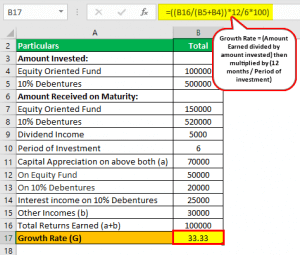

Understanding the economic growth of a country is crucial for policymakers, investors, and economists. One effective tool for estimating how quickly an economy can double is the Rule of 70. This straightforward concept enables individuals and institutions to determine the doubling time of any given quantity, such as GDP, based on its annual growth rate. The simplicity and elegance of the Rule of 70 lie in its basic formula: 

$$
\text{Doubling Time} = \frac{70}{\text{Annual Growth Rate (\%)}}
$$



This allows economists and analysts to provide a quick estimate of growth dynamics, which can be particularly beneficial in economic forecasting and scenario analysis.

The Rule of 70 is not only a powerful tool for macroeconomic analysis but also plays a significant role in algorithmic trading. In an era where high-frequency trading and automated decision-making dominate financial markets, possessing accurate predictions of economic conditions can significantly enhance trading strategies. By incorporating the Rule of 70 into algorithmic models, traders can potentially improve the adaptability and robustness of their systems, enabling them to capitalize on opportunities arising from economic expansions or contractions.

Given its applications in both economic estimation and trading, understanding the Rule of 70 is essential for making informed decisions in today's fast-paced financial environment.

## Table of Contents

## Understanding the Rule of 70

The Rule of 70 is a simple yet effective mathematical formula used to estimate the time it will take for a given quantity, such as an economy's GDP, to double, given a consistent annual growth rate. The formula is straightforward: 

$$
\text{Doubling Time (Years)} = \frac{70}{\text{Annual Growth Rate (\%)}}
$$

This approximation works best when the growth rate is steady and is generally applied when rates are not extremely high or low. For instance, if a country's GDP is growing at a rate of 2% per year, the Rule of 70 would suggest that it will take approximately 35 years for that GDP to double:

$$
\text{Doubling Time} = \frac{70}{2} = 35 \text{ years}
$$

In economics, particularly, the Rule of 70 is frequently utilized to estimate how quickly an economy might expand over time based on its current growth rate. This rule provides a quick and easy means to grasp potential economic outcomes without requiring complex calculations or in-depth models. By using this method, economists can quickly communicate the potential speed of economic growth, helping in planning and policy decision processes. Additionally, it offers a practical way to convey growth expectations to a non-technical audience, making it an invaluable tool in economic discussion and analysis.

## Estimating Economic Growth with the Rule of 70

Gross Domestic Product (GDP) growth rate is a crucial measure of an economy's health, reflecting the overall economic performance and prosperity of a nation. The Rule of 70 offers a convenient method for estimating how long it will take for GDP to double, given a consistent growth rate. The fundamental formula applied in this rule is:

$$
\text{Doubling Time (in years)} = \frac{70}{\text{Annual Growth Rate (\%)}}
$$

This approach simplifies the complex nature of economic growth projections, enabling economists, investors, and policymakers to comprehend how quickly an economy can expand without relying on elaborate and intricate economic models. For example, if a country's GDP is growing at an annual rate of 2%, the Rule of 70 estimates that it would take approximately 35 years for its GDP to double:

$$
\text{Doubling Time} = \frac{70}{2} = 35 \text{ years}
$$

The straightforward calculation is one of the key advantages of the Rule of 70. Its simplicity allows for quick assessments, making it a popular preliminary forecasting tool in economic analysis. While more sophisticated models might be necessary for detailed projections, the Rule of 70 provides a valuable first glance at potential economic trajectories, especially when time and resources are limited.

In practice, using GDP figures and corresponding growth rates, stakeholders can quickly obtain insights into economic futures. By altering variables such as growth rates, economists can simulate different scenarios and assess potential long-term outcomes. These preliminary insights serve as a foundation for more detailed exploration or decision-making processes and can inform discussions about economic policies and strategic business planning. The Rule of 70 thus remains an integral part of the economic toolkit, offering valuable insights with minimal computation.

## Rule of 70 in Algorithmic Trading

Algorithmic traders rely heavily on precise economic predictions to develop and refine trading strategies, where the Rule of 70 stands as a crucial analytical tool. This rule offers a straightforward way to estimate the time it will take for an economy to double in size, based on its growth rate. By incorporating Rule of 70 forecasts into trading models, traders can enhance the adaptability and robustness of their algorithms, which is essential for navigating the dynamic financial markets.

The integration of the Rule of 70 into [algorithmic trading](/wiki/algorithmic-trading) involves using it to project potential growth scenarios. Traders can utilize this rule to anticipate economic expansions or contractions. For instance, if a country’s GDP growth rate is projected at 3%, the Rule of 70 indicates that the GDP will double in approximately 23.33 years (calculated as 70 / 3). This information is vital for traders who need to position themselves advantageously in anticipation of such shifts.

Enhancing trading algorithms with the Rule of 70 involves programming models to recognize signals of impending economic changes. Python, due to its flexibility and vast array of libraries, is often used for such tasks. Here's a simple snippet demonstrating how a trader might implement the Rule of 70 in a trading algorithm:

```python
def calculate_doubling_time(growth_rate):
    return 70 / growth_rate

# Example usage
current_growth_rate = 3  # For a country with a 3% GDP growth rate
doubling_time = calculate_doubling_time(current_growth_rate)
print(f"The GDP will double in approximately {doubling_time:.2f} years.")
```

By predicting the doubling time of GDP, traders can adjust their portfolios, optimize their investment strategies, and mitigate risks associated with economic cycles. This proactive approach allows traders to capitalize on growth opportunities or hedge against potential downturns, promoting a well-balanced and informed trading strategy. Although the Rule of 70 should not be the sole tool for decision-making, its integration can significantly enhance the predictive power of algorithmic trading models.

## Comparing the Rule of 70 with Other Doubling Rules

The Rule of 70 is a commonly used tool for estimating the time it takes for a quantity to double at a constant growth rate. However, there are related concepts such as the Rule of 69 and the Rule of 72 that also serve similar purposes with slight variations tailored to assumptions about compounding frequency.

The Rule of 70 divides the number 70 by the annual growth rate percentage to estimate the doubling time. When the growth rate is expressed as a decimal, the calculation is slightly adjusted: $\text{Doubling Time} = \frac{70}{\text{Growth Rate} \times 100}$.

The Rule of 69 arises from continuous compounding assumptions, providing a more precise estimate when dealing with continuous growth models. Mathematically, it can be derived from the natural logarithm of 2 (approximately 0.693) and is used as follows:

$$
\text{Doubling Time} = \frac{69}{\text{Growth Rate Percentage}}
$$

The Rule of 72 offers a more straightforward calculation and is particularly useful for annual compounding or situations where ease of calculation is prioritized over precision. This rule works well across a range of growth rates, maintaining accuracy in practical settings:

$$
\text{Doubling Time} = \frac{72}{\text{Growth Rate Percentage}}
$$

Each rule reflects a different approach to compounding, with the constant selected based on the situation's specific assumptions. The Rule of 70 is often favored for its general applicability and ease of use, especially in discrete compounding scenarios. The Rule of 69 is considered more accurate for continuous compounding. The Rule of 72, due to its simplicity and ease of divisibility by a wide range of numbers, is commonly used for mental calculations and quick estimations.

Selecting the appropriate rule involves evaluating the underlying assumptions of your economic analysis. For instance, if dealing with continuously compounded interest rates, the Rule of 69 may provide more accurate results. On the other hand, the Rule of 72 can be convenient for quick assessments or when precision is less critical.

Understanding these nuances helps analysts and economists choose the right tool for their analytical needs, enhancing the accuracy of their economic forecasts and financial analyses.

## Practical Examples and Application

To effectively illustrate the application of the Rule of 70 in projecting future economic scenarios, consider a hypothetical example involving current GDP data. Suppose a country has a Gross Domestic Product (GDP) of $1 trillion and an annual GDP growth rate of 3.5%. Using the Rule of 70, we can estimate the time it will take for the country's GDP to double.

The Rule of 70 is represented by the formula:

$$
\text{Doubling Time (years)} = \frac{70}{\text{Annual Growth Rate (\%)}}
$$

Applying this formula to our example:

$$
\text{Doubling Time (years)} = \frac{70}{3.5} \approx 20 \text{ years}
$$

This calculation suggests that if the country maintains an annual growth rate of 3.5%, its GDP would double from $1 trillion to $2 trillion in approximately 20 years.

### Comparing Different Growth Rates

Consider analyzing different growth rates to gain further insights into varying future economic scenarios. For example, if the growth rate increases to 5% due to favorable economic policies, the doubling time will be:

$$
\text{Doubling Time (years)} = \frac{70}{5} = 14 \text{ years}
$$

Alternatively, if the growth rate decreases to 2% because of adverse conditions, the doubling time will be:

$$
\text{Doubling Time (years)} = \frac{70}{2} = 35 \text{ years}
$$

### Application in Policy-Making and Strategic Planning

Governments can use these projections to inform policy decisions. For instance, knowing that an increased growth rate could double GDP sooner encourages the adoption of economic policies that stimulate growth, such as tax cuts or increased infrastructure spending.

For businesses, these predictions facilitate strategic planning. Companies might accelerate investment in specific sectors if they anticipate rapid economic expansion, or they might curtail spending during anticipated slow periods. Using Python, businesses can automate these calculations for various scenarios:

```python
def calculate_doubling_time(growth_rate):
    return 70 / growth_rate

current_gdp = 1_000_000_000_000  # $1 trillion
growth_rates = [2.0, 3.5, 5.0]  # different growth rate scenarios

for rate in growth_rates:
    doubling_time = calculate_doubling_time(rate)
    print(f"For an annual growth rate of {rate}%, GDP doubles in {doubling_time:.2f} years.")
```

By using tools like these, stakeholders can rapidly assess the impact of different growth trajectories on economic outcomes, aiding both governments and businesses in making informed decisions.

## Limitations of the Rule of 70

The Rule of 70 is a convenient shorthand for estimating the time it takes for a quantity to double given a constant annual growth rate. Nevertheless, its applicability is limited in certain economic contexts due to several assumptions and simplifications inherent in the rule.

Firstly, the Rule of 70 presumes a constant growth rate over the time period in question. This assumption is often unrealistic in dynamic economies where growth rates are influenced by a multitude of factors, including political shifts, technological advancements, demographic changes, and external economic shocks. In such volatile or rapidly changing environments, the actual growth rate may fluctuate significantly, leading to inaccuracies if the Rule of 70 is applied uncritically. For instance, a country experiencing an economic boom might see high growth rates for a few years, which could then taper off due to market saturation or policy changes.

Secondly, the Rule of 70 does not account for compounding frequency other than annual, assuming that growth operates continuously and smoothly. In reality, economic growth can be highly erratic, with periods of rapid expansion followed by downturns. This limitation is particularly prominent when comparing economic projections over shorter time frames where the compounding effects are more pronounced.

Furthermore, the extrapolation inherent in the Rule of 70 does not accommodate structural changes in the economy. For example, a shift from a manufacturing-based economy to a service-oriented one can significantly alter growth trajectories. Similarly, unforeseen events such as pandemics, geopolitical conflicts, or technological breakthroughs can render previous growth rate assumptions obsolete.

A practical example illustrates this. Consider an economy with a reported growth rate of 5% per annum. Using the Rule of 70, one might estimate that the GDP will double in 14 years (70/5). However, if the growth rate unexpectedly declines to 3% due to a recession, the doubling time would increase to approximately 23.3 years, highlighting how sensitive the rule is to changes in the growth rate.

In summary, while the Rule of 70 offers a quick estimate for doubling times, reliance on its simplicity can lead to misleading conclusions if the assumptions about constant growth rates do not hold. Analysts and policymakers should employ it as an initial guide, supplemented with more detailed analyses that take into account the variability and complexity of economic growth. This cautious approach can help mitigate the risk of overestimating economic prospects, thereby guiding more informed decision-making.

## Conclusion

The Rule of 70 is a highly practical method for estimating economic growth and evaluating investment prospects. By simply dividing the number 70 by the annual growth rate, one can ascertain how long it takes for an economy or investment to double, providing a straightforward measure of growth potential. This approach is particularly beneficial in algorithmic trading strategies. Investors and traders can leverage Rule of 70 forecasts to fine-tune their strategies, ensuring adaptability and resilience in ever-changing markets. This proactive adjustment to economic conditions can create a competitive edge, allowing for timely decisions based on anticipated economic trends.

However, the Rule of 70 is not without its limitations. It assumes a constant growth rate, which is often subject to fluctuation due to various economic factors. As such, while it offers a clear and quick calculation method, it is crucial to use this tool with a degree of caution, complementing it with other analytical methods for a more comprehensive economic forecast.

Ultimately, the Rule of 70 remains a popular choice in both economic analysis and trading due to its ease of use and practical applicability, underscoring its enduring value in these fields.

## References & Further Reading

[1]: Mankiw, N. G. (2010). [Macroeconomics.](https://archive.org/details/macro-economics-mankew) Worth Publishers.

[2]: Dornbusch, R., Fischer, S., & Startz, R. (2010). [Macroeconomics.](https://archive.org/details/macroeconomics0000dorn_r1w2) McGraw-Hill Education.

[3]: Samuelson, P. A., & Nordhaus, W. D. (2010). [Economics.](https://books.google.com/books/about/EBOOK_Economics.html?id=rMovEAAAQBAJ) McGraw-Hill Education.

[4]: Tharp, V. K. (1998). [Trade Your Way to Financial Freedom.](https://www.amazon.com/Trade-Your-Way-Financial-Freedom/dp/007147871X) McGraw-Hill Education.

[5]: Sharpe, W. F. (1966). [Mutual Fund Performance.](https://www.jstor.org/stable/2351741) The Journal of Business, 39(1), 119–138.

[6]: Markowitz, H. (1952). [Portfolio Selection.](https://onlinelibrary.wiley.com/doi/abs/10.1111/j.1540-6261.1952.tb01525.x) The Journal of Finance, 7(1), 77–91.