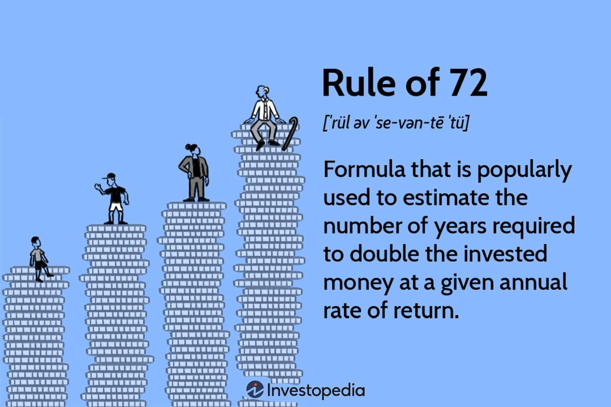

The Rule of 72 is a straightforward yet potent tool that investors utilize to estimate the time required for an investment to double in value at a fixed annual rate of return. By offering a quick approximation, the Rule of 72 underscores the profound effect of compound interest on investments, thus serving as an immediate reference for assessing growth potential. This simplicity makes it particularly advantageous in various financial scenarios, including algorithmic trading (algo trading), where rapid decision-making is crucial.

The Rule of 72 operates on the principle of dividing the number 72 by the annual interest rate, which then provides an estimate of the years needed to double the investment. For instance, at an annual rate of 6%, it will take approximately 12 years for an investment to double, as computed by 72/6 = 12. This rule's utility transcends traditional investment platforms, extending into more complex areas like continuous compounding, which is frequently employed in algo trading due to its mathematical elegance and ability to forecast exponential growth over time.



The derivation of the Rule of 72 is rooted in mathematical approximations and logarithms, offering a practical approach for financial strategists to visualize growth projections without intricate calculations. However, while it provides valuable insights, the rule has its limitations, such as the assumption of a constant rate and exclusion of external factors like taxes and fees, which can significantly influence the actual doubling time in practice.

This article aims to dissect the Rule of 72's derivation, assess its implications within different financial contexts, and highlight its relevance and constraints. By understanding these aspects, investors and traders can better strategize their approaches to maximize potential returns, catering to both traditional investment vehicles and high-frequency trading landscapes.

## Table of Contents

## Understanding Continuous Compounding

Continuous compounding is an advanced concept in finance that assumes interest is calculated and added to the principal an infinite number of times within a given period. It serves as the mathematical limit of compounding frequency, offering a theoretical model where interest compounds continuously without pause. This concept is instrumental in illustrating the ultimate potential of compound interest, which lies at the heart of maximizing investment growth.

The formula for continuous compounding is expressed as:

$$
A = Pe^{rt}
$$

Here, $A$ represents the future value of the investment or amount after time $t$, $P$ is the principal or initial investment, $r$ denotes the annual [interest rate](/wiki/interest-rate-trading-strategies) expressed as a decimal, and $t$ is the time in years.

The exponential function $e^{rt}$ in the formula reflects how interest is accumulated and added to the principal at every conceivable moment, thereby providing a smooth exponential growth curve. This differs from more conventional compounding methods, such as annual or monthly compounding, which involve periodic intervals and correspond to fewer compounding periods over the same duration.

Understanding continuous compounding is essential for maximizing long-term investment growth because it showcases the power of exponential growth, often leading to higher returns compared to traditional compounding methods. Its theoretical framework reveals the exponential potential of investing, aiding investors and financial analysts in capturing a more precise picture of how investments may grow over time under ideal conditions.

In practical usage, while actual financial instruments rarely compound interest continuously, the concept helps investors approximate the upper bounds of growth potential and make more informed decisions regarding compounding frequencies and investment choices. Continuous compounding serves as an excellent benchmark, establishing a goal for the highest possible growth and offering insights into how varying compound frequencies impact overall investment performance.

## The Mathematics Behind the Rule of 72

The Rule of 72 is a heuristic used to estimate the doubling time of an investment with a fixed annual rate of return. It is derived from the compound interest formula, which lays the groundwork for understanding how investments grow over time. The compound interest formula is given by:

$$
A = P \left(1 + \frac{r}{n}\right)^{nt}
$$

where $A$ is the future value of the investment, $P$ is the principal amount, $r$ is the annual interest rate, $n$ is the number of compounding periods per year, and $t$ is the time in years. By using the natural logarithm, this formula can help determine the time required for an investment to double in value.

Mathematically, the doubling time can be approximated by setting $A = 2P$ and solving for $t$:

$$
2 = \left(1 + \frac{r}{n}\right)^{nt}
$$

Taking the natural logarithm of both sides gives:

$$
\ln(2) = nt \ln\left(1 + \frac{r}{n}\right)
$$

For very small values of $r/n$, the natural log can be approximated as $\ln(1 + x) \approx x$, leading to:

$$
t \approx \frac{\ln(2)}{r}
$$

The natural logarithm of 2, $\ln(2)$, is approximately 0.693. However, for ease of mental calculation, the Rule of 72 approximates this by using the number 72, which conveniently has many factors, simplifying division and mental math.

Thus, the Rule of 72 indicates that the time $t$ it takes for an investment to double can be calculated as:

$$
t \approx \frac{72}{r}
$$

This estimation is relatively accurate for interest rates ranging from 6% to 10%. For higher accuracy, especially in scenarios involving continuous compounding, the Rule of 69.3 is more precise, derived from the equation using $\ln(2)$ directly. The formula then becomes:

$$
t \approx \frac{69.3}{r}
$$

In essence, the Rule of 72 is a practical approximation useful for quickly assessing investment growth without complex calculations.

## Applying the Rule of 72 in Investment Strategies

The Rule of 72 serves as a powerful tool for investors to quickly evaluate the growth potential of various investments. By estimating the time required to double an investment's value at a fixed annual rate of return, this heuristic simplifies the decision-making process. The simplicity of the Rule of 72, expressed as $\text{Years to Double} = \frac{72}{r}$, where $r$ represents the annual interest rate, allows investors to make rapid assessments without relying on complex financial calculations.

Despite its usefulness, a prudent investor must account for additional factors such as fees, taxes, and inflation. These can significantly influence investment outcomes and should be considered when applying the rule. For example, management fees associated with mutual funds or index funds will reduce the net return, extending the doubling time estimated by the Rule of 72. Similarly, inflation decreases the real value of returns, further impacting growth projections.

When comparing various investment opportunities, the Rule of 72 offers a straightforward approach to measure potential doubling times. For instance, consider an investor evaluating different asset classes such as bonds, equities, and retirement accounts. If a bond yields a nominal return of 6%, the Rule of 72 suggests a doubling time of approximately 12 years. Conversely, an equity investment with an expected 9% return would halve that period to roughly 8 years. Retirement accounts, often involving diverse portfolios and potentially lower risk, can be evaluated similarly, providing insights into long-term financial planning.

The Rule of 72 also aids in recognizing the benefits of higher returns. As annual rates increase, the impact on doubling time becomes markedly significant, underscoring the importance of choosing investments with optimized risk-adjusted returns. Thus, while the Rule of 72 offers a simplified method for projection, it remains an invaluable component of strategic financial analysis, emphasizing the need for a holistic approach that includes other pertinent financial factors.

## Continuous Compounding vs. Simple and Compound Interest

Continuous compounding is a financial concept where the frequency of compounding is maximized to an infinite level. This means interest is calculated and added to the principal amount continuously, rather than at discrete intervals, such as annually, semi-annually, quarterly, or monthly. The effect of continuous compounding is that investments grow at the maximum possible rate allowed by a given interest rate, outpacing both simple interest and regular compound interest methods.

In simple interest calculations, interest is computed solely on the initial principal amount throughout the investment period. The formula used is:

$$
A = P(1 + rt)
$$

where $A$ is the final amount, $P$ is the principal, $r$ is the annual interest rate, and $t$ is the time in years. Simple interest does not take into account the reinvestment of earned interest, resulting in linear growth.

Compound interest, however, considers the reinvestment of accrued interest. The standard formula for compound interest is:

$$
A = P\left(1 + \frac{r}{n}\right)^{nt}
$$

where $n$ is the number of compounding periods per year. This method introduces exponential growth, as interest is recalculated at each compounding period with respect to the updated principal amount that now includes previous interest earnings.

Continuous compounding takes this concept to its ultimate form by using the formula:

$$
A = Pe^{rt}
$$

where $e$ is the base of the natural logarithm, approximately equal to 2.71828. This formula represents the scenario where compounding occurs infinitely frequently, allowing the principal to grow continuously.

Through continuous compounding, the growth becomes exponential at an even faster rate compared to regular compounding methods. For instance, with a 5% annual interest rate, a principal amount of $1,000 compounded annually yields $1,050 after one year, whereas continuous compounding results in approximately $1,051.27. Although the difference appears minor over a single year, it becomes significant over long investment horizons.

In practical terms, continuous compounding serves as a theoretical benchmark. Most real-world financial products like bonds, savings accounts, and loans employ periodic compounding. However, the principle of continuous compounding remains crucial for financial modeling and theoretical analysis, providing insights into the limits of investment growth potentials.

## Real-World Examples of the Rule of 72 in Action

The Rule of 72 offers a practical approach for investors seeking to estimate doubling times for various investments, including savings accounts and equity portfolios. The simplicity of this rule lies in its straightforward formula: the time it takes for an investment to double is approximately 72 divided by the annual interest rate (expressed as a percentage).

For example, consider a savings account with an annual interest rate of 3%. According to the Rule of 72, the time required for the investment to double is approximately 72 divided by 3, or 24 years. This estimation provides a quick reference for savers to understand the long-term growth potential of their savings, without engaging in complex calculations.

In the context of equity portfolios, the Rule of 72 remains an effective tool. Historical data suggests that equity markets, such as the S&P 500, have an average annual return of around 8% to 10%. Using an 8% return as a conservative estimate, the Rule of 72 indicates that the investment would double approximately every 9 years (72 divided by 8). This quick estimate reinforces the potential benefits of long-term equity investment strategies, highlighting the significance of compounding returns over decades.

The application of the Rule of 72 extends to fixed-income investments as well. Consider a bond yielding a 5% annual return. The Rule of 72 suggests the investment will double in approximately 14.4 years (72 divided by 5). Such a computation allows bond investors to gauge the time frame required to achieve specific financial goals, adding clarity to investment planning.

While the Rule of 72 provides valuable estimations across various asset classes, it is crucial for investors to consider additional factors such as market [volatility](/wiki/volatility-trading-strategies), investment [liquidity](/wiki/liquidity-risk-premium), and economic conditions. These elements can significantly influence actual returns and the time needed for an investment to double in value.

## Limitations and Considerations of the Rule of 72

The Rule of 72 is a valuable tool for quickly estimating the time needed for an investment to double at a fixed annual rate of return. However, it has limitations that investors should be aware of to prevent miscalculations in financial planning. One significant limitation is that the Rule of 72 assumes a constant interest rate throughout the investment period. In reality, interest rates are often variable, fluctuating with economic conditions, monetary policies, and changes in market demand. As a result, the rule's accuracy diminishes when applied to investments subject to variable interest rates.

Additionally, the Rule of 72 does not account for factors like taxes, fees, and other transaction costs that can significantly impact investment returns. For instance, when analyzing the doubling time of a specific investment, taxes on capital gains or dividends can reduce the effective rate of return, thereby extending the time required for an investment to double. Similarly, management fees associated with mutual funds or exchange-traded funds (ETFs) can also erode returns, necessitating adjustments to the rule's output for more accurate predictions.

Another consideration is the rule's precision across different interest rates. The Rule of 72 offers a general approximation and is most accurate when applied to interest rates ranging between 6% and 10%. As the rate deviates from this range, the rule's precision diminishes. For instance, at very low or very high interest rates, the simple division suggested by the rule may yield results that diverge significantly from those calculated using more rigorous compounding formulas. For such cases, using variations like the Rule of 69.3 for continuous compounding might offer better accuracy.

While the Rule of 72 is a useful heuristic, it is essential for investors to consider these limitations and employ more comprehensive models or calculations when precision is critical. By understanding these constraints, investors can better navigate financial decisions and optimize their investment strategies.

## Exponential Growth and e

Exponential growth is a fundamental concept in finance and investing, especially in the context of continuous compounding. At the heart of this growth model is the mathematical constant 'e', approximately equal to 2.71828. This constant is the base of the natural logarithm and is essential because it offers a precise way to describe continuous growth processes.

The significance of 'e' arises from its role in the formula for continuous compounding. The formula $A = Pe^{rt}$ utilizes 'e' to calculate the future value $A$ of an investment with an initial principal $P$, a continuous interest rate $r$, and a time period $t$. Here, 'e' facilitates turning the linear progression of time and interest rate into exponential growth, showcasing how investments can expand more rapidly with continuous compounding.

Understanding 'e' is vital for investors looking to incorporate continuous growth patterns into their financial strategies. It provides a foundation for evaluating investments that leverage constant and incremental growth, such as savings accounts with daily interest compounding or [growth stocks](/wiki/growth-stocks) with rapid expansion due to reinvested earnings. By grasping how 'e' functions within the exponential growth framework, investors can make informed decisions, capitalizing on the higher potential returns associated with continuous compounding. 

Moreover, the algebra of 'e' can be explored using tools like Python to simulate growth scenarios. An example of calculating future investment value using Python is shown below:

```python
import math

def continuous_compounding(principal, rate, time):
    # Calculate future value using the continuous compounding formula
    return principal * math.exp(rate * time)

# Example: Principal = $1000, Rate = 5% (0.05), Time = 10 years
future_value = continuous_compounding(1000, 0.05, 10)
print(f"Future investment value: ${future_value:.2f}")
```

In this example, understanding and applying the concept of 'e' enables precise computation of investment growth over a specific period, demonstrating its underpinning role in continuous compounding and investment planning.

## Maximizing Your Investment Potential

To maximize investment potential, the Rule of 72 can be used alongside strategic financial insights to effectively harness compounding benefits. This simple rule provides a quick estimation of the time required for an investment to double, thus helping investors make informed decisions on where to allocate their resources for optimal growth.

Investors can leverage the Rule of 72 to evaluate various investment opportunities, recognizing that the ability of an investment to double quickly can significantly impact future wealth. For instance, an investment with a 9% annual return would take approximately 8 years to double ($\frac{72}{9} = 8$ years). Knowing this, investors can set realistic expectations and adjust their portfolios to achieve desired financial goals.

However, while focusing on growth potential is essential, balancing risk and return is crucial. Diversifying investment portfolios across different asset classes can mitigate risks without sacrificing growth opportunities. By spreading investments in stocks, bonds, and other assets with varying risk levels and returns, investors can achieve a balanced portfolio that maximizes potential growth.

To implement these strategies effectively, investors should combine the Rule of 72 with comprehensive risk assessments. Tools such as the Sharpe Ratio, which measures the risk-adjusted return of an investment, can be useful. The formula for the Sharpe Ratio is as follows:

$$
\text{Sharpe Ratio} = \frac{E[R_i] - R_f}{\sigma_i}
$$

where $E[R_i]$ is the expected return of the investment, $R_f$ is the risk-free rate, and $\sigma_i$ is the standard deviation of the investment's excess return. By maximizing the Sharpe Ratio, investors can aim for the most efficient portfolio, where returns are maximized for a given level of risk.

Additionally, leveraging technology through [algorithmic trading](/wiki/algorithmic-trading) systems can further enhance investment strategies. These systems can optimize trading decisions based on historical data and market trends, offering a dynamic approach to compounding benefits. By maximizing the efficiency of investment decisions through automation, such systems can enhance long-term portfolio growth in line with the insights provided by the Rule of 72.

In summary, combining the Rule of 72 with strategic portfolio management and sophisticated analytical tools allows investors to capitalize on compound growth. By carefully balancing risk and return, investors can position themselves for superior growth outcomes, translating the theoretical simpleness of the Rule of 72 into practical financial success.

## References & Further Reading

[1]: ["The Rule of 72: A Shortcut to Estimate Investment Doubling Times"](https://money.usnews.com/investing/articles/the-rule-of-72) on Investopedia

[2]: Boyle, P. P., & McGlaughlin, P. V. (1999). ["Continuous Compounding."](https://books.google.com/books/about/Continuous_Quality_Improvement_in_Health.html?id=FEY2AQAAIAAJ) ASTIN Bulletin

[3]: ["The Mathematics of Compound Interest"](https://www.mathsisfun.com/money/compound-interest.html) by D. Fred Danforth

[4]: ["Using the Rule of 72 in Financial Planning"](https://www.kiplinger.com/investing/what-is-the-rule-of-72) on Forbes

[5]: Bernstein, P. L. (1996). ["Against the Gods: The Remarkable Story of Risk"](https://www.amazon.com/Against-Gods-Remarkable-Story-Risk/dp/0471295639) by Peter L. Bernstein

[6]: ["Practical Finance Applications of the Rule of 72"](https://www.investopedia.com/terms/r/ruleof72.asp) on The Motley Fool