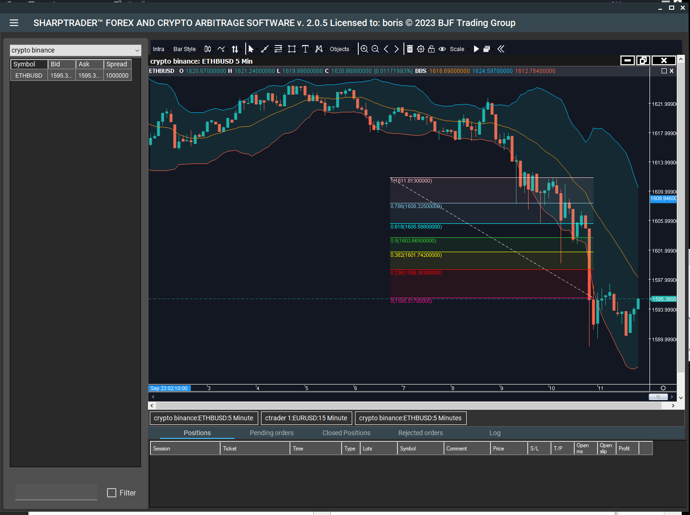

## Table of Contents

## What is arbitrage trading?

Arbitrage trading is when someone buys something in one place and sells it in another place for a higher price. This is done to make a profit from the difference in prices. For example, if a toy costs $10 in one store and $15 in another store, a person can buy the toy for $10 and sell it for $15, making a $5 profit.

This kind of trading often happens in financial markets, like the stock market or currency markets. Traders look for small differences in prices of the same thing in different places. They use computers and fast internet to buy and sell quickly before the prices change. It's a way to make money with low risk, but it needs quick actions and good technology.

## How does software assist in arbitrage trading?

Software helps in arbitrage trading by quickly finding price differences in different markets. It uses special computer programs to look at prices from many places at the same time. When it finds a price that is lower in one place and higher in another, it tells the trader. This way, the trader can buy and sell fast to make a profit before the prices change.

The software also helps by making trades happen very quickly. It can send buy and sell orders to different markets in just a few seconds. This is important because prices can change fast, and the software helps traders act before it's too late. Using software makes [arbitrage](/wiki/arbitrage) trading easier and more efficient, helping traders make money with less effort and time.

## What are the basic types of arbitrage opportunities that software can identify?

One basic type of arbitrage opportunity that software can identify is called spatial arbitrage. This happens when the same thing, like a stock or a currency, has different prices in different places. For example, if a stock is cheaper on one stock exchange than on another, the software can spot this difference. Then, a trader can buy the stock where it's cheaper and sell it where it's more expensive, making a profit from the price difference.

Another type is called temporal arbitrage. This is when the price of something changes over time, and the software can predict these changes. For example, if a currency is expected to go up in value later in the day, the software can tell the trader to buy it now and sell it later for a higher price. This way, the trader can make money by buying at the right time and selling at the right time.

A third type is called [statistical arbitrage](/wiki/statistical-arbitrage). This involves using math and data to find patterns in how prices move. The software looks at lots of data to find small differences in prices that might not be obvious. For example, it might notice that two stocks usually move together, but one is currently cheaper than it should be. The trader can then buy the cheaper stock and sell the more expensive one, betting that the prices will come back together, making a profit from the difference.

## What are the key features to look for in arbitrage trading software?

When choosing arbitrage trading software, it's important to look for features that help you find and act on price differences quickly. The software should be able to scan many markets at the same time to spot opportunities where the same thing is priced differently in different places. It should also be able to send buy and sell orders very fast, because prices can change quickly. Good software will have a user-friendly interface so you can easily see the opportunities and make decisions without getting confused.

Another key feature to look for is reliability. The software should work well all the time without crashing or slowing down, because missing even a small window of opportunity can mean missing out on profits. It should also be secure, protecting your data and your money from hackers. Finally, good support from the software company can be very helpful. If you have questions or run into problems, it's good to know that you can get help quickly.

## How do you set up arbitrage trading software for the first time?

Setting up arbitrage trading software for the first time starts with choosing the right software that fits your needs. Look for software that can scan multiple markets at once and has a user-friendly interface. Once you've picked your software, you'll need to download and install it on your computer. Follow the installation instructions carefully, making sure you have a stable internet connection. After installation, you'll need to set up an account with the software provider. This usually involves entering your personal information and setting up secure login details.

Next, you'll need to connect the software to the trading platforms or exchanges where you want to trade. This often involves entering API keys or other access codes provided by the exchanges. Make sure to keep these codes safe and secure. Once connected, you'll need to configure the software settings to match your trading strategy. This might include setting up alerts for price differences, deciding how much you want to trade at once, and setting up rules for automatic trading if the software supports it. It's a good idea to start with a small amount of money to test the software and make sure everything is working correctly before you start trading with larger sums.

## What are the common pitfalls to avoid when using arbitrage trading software?

When you start using arbitrage trading software, it's important to watch out for some common mistakes. One big pitfall is not setting up the software correctly. If you don't enter the right information or connect it to the trading platforms properly, the software won't work the way it should. This can lead to missed opportunities or even losing money. Another mistake is relying too much on the software without understanding how it works. Just because the software tells you to buy or sell, it doesn't mean you should do it without thinking. You need to know what the software is doing and why it's making certain suggestions.

Another common pitfall is not keeping an eye on the software and the markets. Even the best software can have glitches or stop working, so you need to check it regularly. Also, markets can change quickly, and what worked one day might not work the next. If you're not paying attention, you could miss important changes or let the software make bad trades. Finally, be careful with how much money you put into arbitrage trading at first. Start small until you're sure the software is working well and you understand how to use it. Jumping in with a lot of money right away can be risky if something goes wrong.

## How can software help in real-time monitoring and execution of arbitrage trades?

Software helps in real-time monitoring and execution of arbitrage trades by constantly checking prices across different markets. It uses fast internet connections and powerful computers to look at prices from many places at the same time. When it finds a price difference, it can quickly tell the trader about it. This is important because prices can change very fast, and the software helps make sure the trader doesn't miss out on a good opportunity. By keeping an eye on the markets all the time, the software can spot small differences that a person might not see, helping the trader make more money.

Once the software finds a good arbitrage opportunity, it can also help with the execution of the trades. It can send buy and sell orders to the markets in just a few seconds, much faster than a person could do it. This quick action is key because it lets the trader buy at the lower price and sell at the higher price before the prices change. The software makes sure that everything happens smoothly and that the trader can take advantage of the price differences without delays. This way, the trader can focus on making decisions rather than worrying about the speed of the trades.

## What advanced algorithms are used in arbitrage trading software?

Arbitrage trading software uses advanced algorithms to find and take advantage of price differences. One common type of algorithm is called a latency arbitrage algorithm. This algorithm looks for small differences in prices that happen because of the time it takes for information to travel between different markets. For example, if a stock price changes in one market, it might take a few seconds for that change to show up in another market. The software can buy the stock at the old price in the second market and sell it at the new price in the first market, making a quick profit.

Another type of algorithm used in arbitrage trading is called a statistical arbitrage algorithm. This algorithm uses math and data to find patterns in how prices move. It looks at lots of information to see if two things, like two stocks, usually move together. If one stock is suddenly cheaper than it should be compared to the other, the algorithm can tell the trader to buy the cheaper stock and sell the more expensive one. The idea is that the prices will eventually come back together, and the trader can make money from the difference. These algorithms help traders find opportunities that might not be obvious and make trades quickly to take advantage of them.

## How do you evaluate the performance of arbitrage trading software?

To evaluate the performance of arbitrage trading software, you need to look at how well it finds price differences and how quickly it can act on them. The software should be able to scan many markets at the same time and spot opportunities where the same thing is priced differently in different places. You can check this by running the software in a test mode with real market data to see if it catches all the opportunities that you know are there. Also, it's important to see how fast the software can send buy and sell orders. You can measure this by timing how long it takes from when the software spots a price difference to when it completes the trades. The quicker it is, the better chance you have of making a profit before the prices change.

Another way to evaluate the software is by looking at its reliability and security. The software should work well all the time without crashing or slowing down, because missing even a small window of opportunity can mean missing out on profits. You can test this by running the software for a long time and seeing if it keeps working smoothly. Also, the software should be secure, protecting your data and your money from hackers. You can check this by making sure the software uses strong encryption and secure connections to the trading platforms. Finally, you can look at the software's past performance and user reviews to see if other people have had good results with it. This can give you an idea of how well it might work for you.

## What are the regulatory considerations when using software for arbitrage trading?

When using software for arbitrage trading, you need to think about the rules and laws that apply. Different countries have different rules about trading, and these rules can change over time. You need to make sure that the software you use follows all these rules. For example, some places have rules about how fast you can trade or how much you can trade at one time. If your software breaks these rules, you could get in trouble or lose money. It's a good idea to talk to a lawyer or someone who knows about trading rules to make sure you're doing everything right.

Another thing to think about is how the software handles your data and money. Many countries have rules about keeping your information safe and making sure your money is secure. The software should use strong security to protect your data and your money from hackers. Also, some places have rules about how you can use other people's money for trading. If you're using other people's money, you need to make sure the software follows these rules too. Always check the software's security features and make sure it meets the rules in your area.

## How can one integrate arbitrage trading software with other trading platforms?

To integrate arbitrage trading software with other trading platforms, you first need to find out if the software supports the platforms you want to use. Most arbitrage trading software uses something called an API, which is like a special code that lets different programs talk to each other. You'll need to get API keys from the trading platforms you want to connect to. These keys are like special passwords that let the software access the platforms. Once you have the keys, you enter them into the software. This tells the software which platforms to connect to and how to do it.

After setting up the API keys, you need to make sure everything is working right. The software should be able to see the prices on the different platforms and send buy and sell orders quickly. You can test this by running the software in a test mode to see if it can find and act on price differences. If everything looks good, you can start using the software for real trading. Just remember to keep an eye on things to make sure the connections stay strong and the software keeps working the way it should.

## What are the future trends in arbitrage trading software development?

In the future, arbitrage trading software is likely to get even better at finding and using price differences. One big trend is the use of artificial intelligence (AI) and machine learning. These technologies can help the software learn from past trades and get better at spotting opportunities. They can also help the software make smarter decisions about when to buy and sell. Another trend is the use of more advanced algorithms that can look at more data and find even smaller price differences. This means traders can make money from opportunities that were too small to see before.

Another important trend is the focus on speed and reliability. As markets get faster, arbitrage trading software needs to be able to act even quicker. This means using better internet connections and more powerful computers. The software also needs to be very reliable, so it doesn't miss any opportunities or make mistakes. Security is another big focus, as more traders use the software, it's important to keep their data and money safe. Overall, the future of arbitrage trading software is about making it smarter, faster, and safer.

## What is Algorithmic Trading and Arbitrage?

Algorithmic trading involves the use of complex mathematical models and statistical analysis to automate trading decisions. This method is particularly suitable for arbitrage trading, where speed and precision are vital. By executing a high [volume](/wiki/volume-trading-strategy) of trades based on predefined rules without human intervention, [algorithmic trading](/wiki/algorithmic-trading) can capitalize on brief price discrepancies in various markets.

The compatibility between algorithmic trading and arbitrage stems from their shared emphasis on rapid execution and accuracy. Traders leverage algorithms to identify and exploit market inefficiencies that arise due to price differences across exchanges or markets. These opportunities are often fleeting, making the quick response time of algorithmic systems invaluable. 

A significant advantage of algorithmic trading is the removal of emotional biases from the trading process. Decisions are made solely on data and algorithms, thus ensuring consistency and objectivity. This approach reduces the risk of human error and enhances the reliability of trading strategies. For instance, a typical algorithm might be parameterized to execute trades when a price deviation exceeds a certain threshold, expressed as:

$$
\text{Execute Trade} \quad \text{if} \quad |P_1 - P_2| > \Delta P
$$

where $P_1$ and $P_2$ are asset prices in different markets, and $\Delta P$ is a predefined price difference threshold.

Recent advancements in technology have further amplified the efficiency of algorithmic arbitrage. The integration of [machine learning](/wiki/machine-learning) and [artificial intelligence](/wiki/ai-artificial-intelligence) enables algorithms to evolve and adapt to market conditions, optimizing strategies in real time. This has not only increased the profitability of arbitrage strategies but also expanded their applicability across diverse asset classes.

Python, with its extensive libraries such as NumPy, pandas, and TensorFlow, offers a robust platform for developing sophisticated trading algorithms. Below is a simple Python snippet that demonstrates a basic arbitrage strategy:

```python
import numpy as np

def check_arbitrage(prices_exchange1, prices_exchange2, threshold):
    arbitrage_opportunities = []
    for p1, p2 in zip(prices_exchange1, prices_exchange2):
        if np.abs(p1 - p2) > threshold:
            arbitrage_opportunities.append((p1, p2))
    return arbitrage_opportunities

exchange1_prices = [101, 102, 103]
exchange2_prices = [100, 104, 102]

opportunities = check_arbitrage(exchange1_prices, exchange2_prices, threshold=2)
print(opportunities)
```

This sample code checks for arbitrage opportunities when price differences exceed a specified threshold, underscoring the practical application of algorithmic trading in identifying profitable trades.

In summary, algorithmic trading is indispensable in arbitrage. Its reliance on data-driven decisions and rapid execution aligns seamlessly with the dynamic and fast-paced nature of arbitrage, ultimately boosting traders’ capabilities in taking advantage of market inefficiencies.

## References & Further Reading

[1]: Bergstra, J., Bardenet, R., Bengio, Y., & Kégl, B. (2011). ["Algorithms for Hyper-Parameter Optimization."](https://dl.acm.org/doi/10.5555/2986459.2986743) Advances in Neural Information Processing Systems 24.

[2]: ["Advances in Financial Machine Learning"](https://www.amazon.com/Advances-Financial-Machine-Learning-Marcos/dp/1119482089) by Marcos Lopez de Prado

[3]: ["Evidence-Based Technical Analysis: Applying the Scientific Method and Statistical Inference to Trading Signals"](https://www.amazon.com/Evidence-Based-Technical-Analysis-Scientific-Statistical/dp/0470008741) by David Aronson

[4]: ["Machine Learning for Algorithmic Trading"](https://github.com/stefan-jansen/machine-learning-for-trading) by Stefan Jansen

[5]: ["Quantitative Trading: How to Build Your Own Algorithmic Trading Business"](https://www.amazon.com/Quantitative-Trading-Build-Algorithmic-Business/dp/1119800064) by Ernest P. Chan