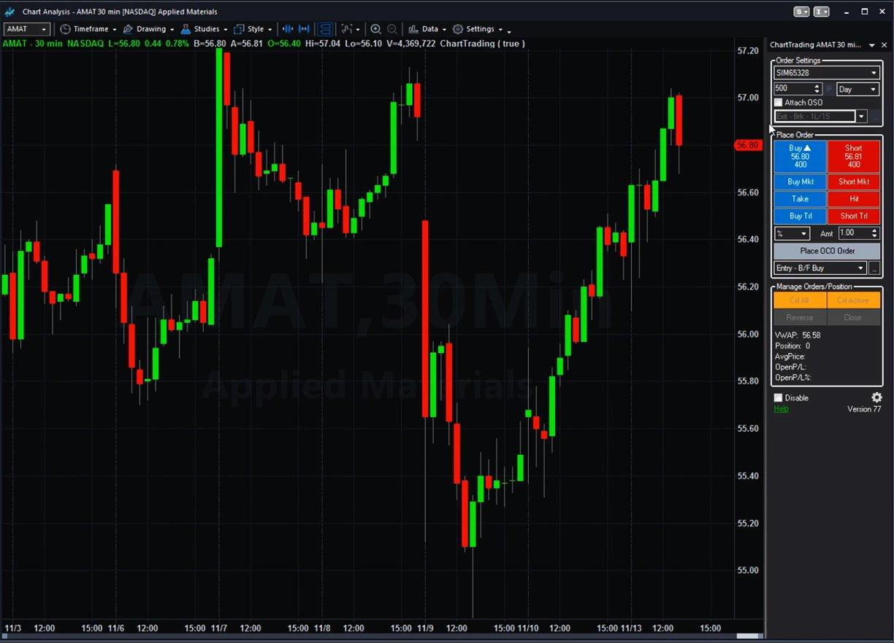

## Table of Contents

## What is a stock simulator?

A stock simulator is a tool that lets you practice buying and selling stocks without using real money. It's like a game where you can learn how the stock market works without risking any of your own cash. You get to pretend you're an investor and see how your choices would play out in the real world.

Using a stock simulator can be very helpful if you're new to investing. It gives you a safe space to try different strategies and see what happens. You can make mistakes and learn from them without losing any money. Many simulators also offer tips and guidance to help you understand the stock market better.

## Why should beginners use stock simulators?

Beginners should use stock simulators because they provide a safe way to learn about the stock market without risking real money. When you're new to investing, it's easy to make mistakes. A stock simulator lets you practice buying and selling stocks, so you can see what works and what doesn't without losing any cash. This helps you build confidence and understand how the market works before you start investing for real.

Another reason to use a stock simulator is that it allows you to try out different strategies. You can experiment with various approaches to see which ones might be successful. This is a great way to learn what kind of investor you want to be. Plus, many simulators come with educational resources and tips that can help you understand the stock market better, making your learning experience even more valuable.

## How do you set up an account on a stock simulator?

Setting up an account on a stock simulator is easy and usually takes just a few minutes. First, you need to find a good stock simulator website or app. There are many out there, so pick one that looks easy to use and has good reviews. Once you've chosen a simulator, go to their website or download their app. Look for a button that says something like "Sign Up" or "Register." Click on it and you'll be taken to a form where you need to enter some information about yourself, like your name, email address, and sometimes a password.

After you fill out the form and submit it, you'll usually get an email to confirm your account. Click on the link in the email to finish setting up your account. Once your account is set up, you can log in and start using the simulator. You'll usually get some pretend money to start with, so you can begin buying and selling stocks right away. If you need help, most simulators have guides or tutorials to show you how to use them.

## What are the key features to look for in a stock simulator?

When looking for a good stock simulator, one of the most important features to consider is how easy it is to use. A good simulator should have a simple and clear interface that lets you buy and sell stocks easily. It should also have helpful guides or tutorials that explain how to use the simulator and teach you about the stock market. Another key feature to look for is the amount of pretend money you get to start with. You want enough to be able to try out different strategies and see how they work.

Another important feature is the variety of stocks and other investments you can choose from. A good simulator should have a wide range of options, so you can practice with different kinds of investments. It's also helpful if the simulator updates in real-time, so you can see how your choices would play out in the actual market. Lastly, consider if the simulator offers any additional tools or resources, like charts, news updates, or community forums where you can learn from other users. These can make your learning experience even better.

## How does a stock simulator mimic real market conditions?

A stock simulator mimics real market conditions by using real-time data from the stock market. This means that when you use a simulator, the prices of stocks and other investments are the same as they are in the real world. The simulator updates these prices throughout the day, just like the real market does. This allows you to see how your choices would play out if you were actually investing real money. You can buy and sell stocks at the same times and prices as real investors, which helps you learn how the market works.

In addition to using real-time data, a stock simulator also includes other features that make it feel like the real market. For example, many simulators include news updates and economic reports that can affect stock prices, just like in the real world. They also let you use different types of orders, like limit orders and stop-loss orders, which are tools that real investors use. By including these features, a stock simulator gives you a realistic experience that helps you learn how to invest without risking any money.

## What are the common pitfalls to avoid when using stock simulators?

When using stock simulators, one common pitfall to avoid is getting too confident too quickly. Because you're not using real money, it's easy to think you're doing better than you really are. You might take bigger risks than you would with real money, and this can give you a false sense of how well you're doing. Remember, the goal is to learn how to invest wisely, not just to make pretend money.

Another pitfall is not taking the simulator seriously enough. Some people treat it like a game and don't pay attention to the lessons they're learning. To get the most out of a stock simulator, you should treat it like real investing. Take notes, try different strategies, and think about why things are happening the way they are. This will help you learn more and be better prepared when you start investing for real.

## How can you transition from using a stock simulator to real trading?

When you feel ready to move from a stock simulator to real trading, start by setting up a real brokerage account. This is like setting up a bank account, but for buying and selling stocks. Choose a broker that is easy to use and doesn't charge too much in fees. Once your account is set up, you can put real money into it. It's a good idea to start small, so you don't risk too much money at first. Remember, real trading is different because you can lose money, so be careful and think about each trade before you make it.

After you've set up your account and put in some money, you can begin trading for real. Start by using the strategies you learned on the simulator, but be ready to adjust them if needed. The real market can be different from the simulator, so stay flexible. Keep learning by reading about the stock market and maybe even talking to other investors. It's also smart to keep using the simulator to practice new ideas before trying them with real money. This way, you can keep improving your skills without risking too much.

## What advanced strategies can be practiced using stock simulators?

Using a stock simulator, you can practice advanced strategies like options trading. Options are a bit more complicated than just buying stocks, but they can help you make money in different ways. With options, you can bet on whether a stock will go up or down without actually owning it. In a simulator, you can try different options strategies, like buying calls or puts, and see how they work out without risking real money. This can help you understand options better and feel more confident when you're ready to use them in the real market.

Another advanced strategy you can practice is short selling. Short selling means you borrow a stock and sell it, hoping to buy it back later at a lower price and make a profit. It's a bit risky, but it can be a good way to make money if you think a stock's price will go down. In a simulator, you can try short selling different stocks and see how it works. This lets you get a feel for the risks and rewards of short selling without losing any real money. Practicing these advanced strategies in a simulator can help you learn a lot and be better prepared for real trading.

## How do stock simulators handle different types of financial instruments?

Stock simulators handle different types of financial instruments by letting you practice with them just like you would in the real market. For example, you can buy and sell stocks, which are shares in a company. You can also try trading other things like bonds, which are loans you give to a company or government, and they pay you back with interest. Some simulators even let you practice with options, which are contracts that give you the right to buy or sell a stock at a certain price. This way, you can learn how each type of investment works and how they might fit into your overall strategy.

In addition to stocks, bonds, and options, some advanced simulators also let you play with futures and forex. Futures are agreements to buy or sell something at a future date, like oil or wheat, at a price you set now. Forex, or foreign exchange, is about trading different currencies, like dollars for euros. By using a simulator, you can see how these different instruments behave and how they can be part of your investment plan. This helps you get a full picture of the financial world and practice with all kinds of investments before you start using real money.

## Can stock simulators be used for backtesting trading strategies?

Yes, stock simulators can be used for [backtesting](/wiki/backtesting) trading strategies. Backtesting means you take a strategy you want to try and see how it would have worked in the past. You can do this in a simulator by using historical data, which is information about how stocks and other investments did in the past. This way, you can see if your strategy would have made money or lost money if you had used it before.

Using a simulator for backtesting is helpful because it lets you try out different ideas without risking any real money. You can change your strategy and see how it would have worked over different time periods. This can help you find out what works best and what doesn't, so you can be more confident when you start trading for real.

## What metrics should you track to evaluate your performance on a stock simulator?

When using a stock simulator, you should track a few important numbers to see how well you're doing. One key number is your overall return, which shows how much money you've made or lost. This helps you know if your strategy is working. Another important thing to look at is your risk-adjusted return, like the Sharpe Ratio. This tells you how much return you're getting for the amount of risk you're taking. It's good to see if you're making smart choices or just taking big risks.

Also, keep an eye on your portfolio's diversification. This means checking if you're spreading your money across different kinds of investments. It's important because it can help reduce risk. Another thing to track is your win rate, which is how often your trades make money. And don't forget about your average gain and average loss per trade. These numbers help you understand if your winning trades make up for your losing ones. By watching these metrics, you can learn a lot about your performance and improve your strategy.

## How do professional traders utilize stock simulators for ongoing skill development?

Professional traders use stock simulators to keep their skills sharp and learn new strategies without risking real money. They can try out new ideas and see how they might work in the real market. By using a simulator, they can practice different types of trades, like buying and selling stocks, options, or even more complex things like futures and forex. This helps them stay up-to-date with the latest market trends and techniques, making sure they're always ready to adapt to changes in the market.

Simulators also let professional traders test their strategies against historical data, which is called backtesting. This means they can see how their strategies would have worked in the past, helping them understand what might work well in the future. By tracking important numbers like their overall return, risk-adjusted return, and how well they're spreading their investments, they can fine-tune their approach. This ongoing practice and analysis help professional traders stay at the top of their game and continue to improve their skills.

## What are the Advanced Features of Stock Simulators?

Advanced stock simulators offer a range of sophisticated features that cater to the needs of experienced investors seeking to refine their trading strategies. These simulators incorporate complex functionalities such as options trading, [forex](/wiki/forex-system) trading, and margin trading, providing a comprehensive environment for users to explore and master various market instruments.

Options trading within stock simulators allows users to execute strategies involving derivatives that grant the right, but not the obligation, to buy or sell a security at a predetermined price before the expiration date. This feature enables traders to practice complex options strategies, like covered calls, straddles, and spreads, aiding in understanding risk management and leveraging techniques. For example, a call option pricing can be modeled using the Black-Scholes formula:

$$
C = S_0 \cdot N(d_1) - X \cdot e^{-rT} \cdot N(d_2)
$$

where:
- $C$ is the call option price,
- $S_0$ is the current stock price,
- $X$ is the strike price,
- $r$ is the risk-free interest rate,
- $T$ is the time to expiration,
- $N(d)$ is the cumulative distribution function of the standard normal distribution,
- $d_1$ and $d_2$ are calculated using the stock price, strike price, risk-free rate, time to expiration, and volatility.

Forex trading features in simulators provide a platform to experiment with currency pairs and leverage ratios, essential for understanding the dynamics of the international currency market. Simulated environments allow traders to test the impacts of macroeconomic factors, geopolitical events, and market [volatility](/wiki/volatility-trading-strategies) on currency valuations without financial risk.

Margin trading is another advanced feature offered by some simulators, enabling traders to borrow funds to increase their trading position, providing opportunities to explore leveraged trading. This feature is crucial for understanding the risks and rewards associated with borrowing, as well as the implications for margin calls and [liquidity](/wiki/liquidity-risk-premium) management.

These advanced features in stock simulators enable seasoned investors to deepen their understanding of complex securities and market conditions, equipping them with the skills necessary to formulate and refine advanced trading strategies. Consequently, these tools serve as invaluable resources for experienced traders aiming to maximize their investment outcomes through comprehensive and informed decision-making in various trading scenarios.

## References & Further Reading

[1]: Bergstra, J., Bardenet, R., Bengio, Y., & Kégl, B. (2011). ["Algorithms for Hyper-Parameter Optimization."](https://dl.acm.org/doi/10.5555/2986459.2986743) Advances in Neural Information Processing Systems 24.

[2]: ["Advances in Financial Machine Learning"](https://www.amazon.com/Advances-Financial-Machine-Learning-Marcos/dp/1119482089) by Marcos Lopez de Prado

[3]: ["Evidence-Based Technical Analysis: Applying the Scientific Method and Statistical Inference to Trading Signals"](https://www.amazon.com/Evidence-Based-Technical-Analysis-Scientific-Statistical/dp/0470008741) by David Aronson

[4]: ["Machine Learning for Algorithmic Trading"](https://github.com/stefan-jansen/machine-learning-for-trading) by Stefan Jansen

[5]: ["Quantitative Trading: How to Build Your Own Algorithmic Trading Business"](https://www.amazon.com/Quantitative-Trading-Build-Algorithmic-Business/dp/1119800064) by Ernest P. Chan