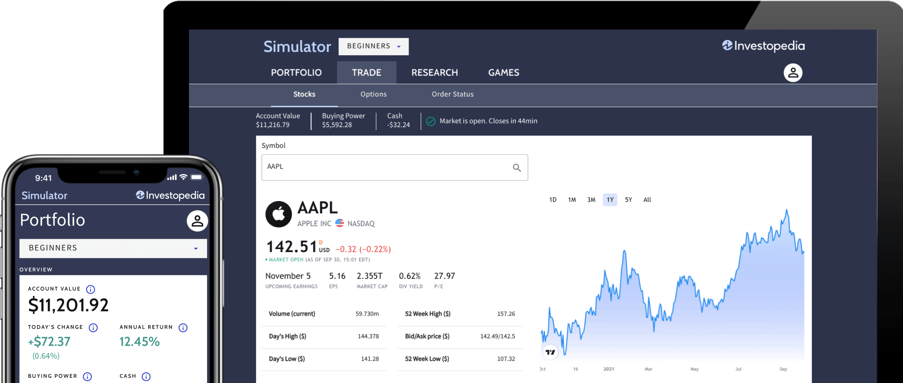

Virtual trading has gained prominence as a crucial mechanism for individuals to engage with financial markets without the inherent risks associated with real-money trading. By facilitating a simulated environment, these platforms allow investors to hone their trading skills and strategies effectively. Stock simulators replicate market conditions meticulously, providing features such as real-time data and security analysis, enabling traders to practice in a risk-free manner. This immersive learning environment is particularly beneficial not only for aspiring traders aiming to grasp the fundamentals of market dynamics but also for seasoned investors refining complex strategies.

The scope of virtual trading extends to enhancing investment practices and supporting algorithmic trading strategies. As algorithmic trading continues to grow, the need for robust testing environments becomes ever more critical. Stock simulators serve as essential tools for testing and optimizing algorithms under diverse market conditions, thereby fine-tuning strategies before deployment in live markets. By integrating virtual trading into their regular practice, both novice and experienced traders can better understand the nuances of market behavior, ultimately leading to more informed investment decisions.



Through this article, the various types of trading simulators will be examined, shedding light on their specific applications and contribution toward strategy development. The synergy between virtual trading and algorithmic strategies marks a notable advancement in modern investment practices, highlighting the indispensable role of stock simulators in contemporary financial learning and execution.

## Table of Contents

## Understanding Stock Simulators

Stock simulators are sophisticated platforms designed to replicate real market conditions, offering users a safe and risk-free environment to hone their trading skills. These simulators are equipped to mirror the complexities of actual trading markets, allowing participants to engage in activities ranging from buying and selling virtual stocks to implementing diverse investment strategies, all without the fear of financial loss.

One of the core features of stock simulators is their ability to integrate real-time data. This is crucial as it allows users to experience market volatility and respond to changes as they occur, mirroring the decision-making process required in real trading scenarios. Real-time data integration helps users to understand market trends and the impact of news on stock prices, which is a fundamental aspect of successful trading.

Furthermore, stock simulators often come with a variety of educational resources. These resources are tailored to aid beginners and advanced traders alike, offering insights into market dynamics, trading strategies, and stock analysis techniques. Educational tools might include tutorials, webinars, and in-depth articles on financial markets and instruments, which collectively serve to enhance the user's trading knowledge and confidence.

Performance tracking capabilities are another pivotal component of stock simulators. Through these features, users can monitor their trading activities and analyze outcomes over time. Performance tracking helps traders identify their strengths and weaknesses, refining their strategies and improving their decision-making processes. This is typically achieved through detailed reports and analytics provided by the simulator, which might include metrics such as return on investment (ROI), win/loss ratios, and historical performance charts.

In essence, stock simulators serve as an invaluable educational tool and practice platform. They cater to both newcomers and seasoned traders, offering functionalities that simulate real-world trading and provide strategic insights without exposing users to the financial risks inherent in actual trading environments. By leveraging real-time data, offering comprehensive educational content, and enhancing abilities through performance tracking, stock simulators play a vital role in preparing users for real-world market participation.

## Benefits of Virtual Trading for Beginners

Virtual trading platforms offer a significant advantage for beginners who are interested in learning the intricacies of trading without the associated financial risk. By simulating real-market conditions, these platforms provide a safe and controlled environment where users can experiment with various investment strategies. This hands-on experience allows novices to build their confidence and skill set in trading.

One of the prominent benefits of virtual trading is the opportunity to explore different investment strategies without the fear of incurring actual financial losses. For beginners, the ability to trial diverse approaches such as [day trading](/wiki/day-trading-spy), swing trading, or long-term investing can lead to a deeper understanding of what aligns best with their objectives and risk tolerance. By allowing experimentation with strategies like value investing or [momentum](/wiki/momentum) trading, users can learn the nuances and implications of each strategy.

Furthermore, virtual trading plays a pivotal role in helping new traders develop a strong grasp on market dynamics. As users engage with the platform, they encounter fluctuating market conditions, price volatilities, and macroeconomic variables that influence the market environment. This interaction cultivates a practical understanding of concepts such as supply and demand, market sentiment, and the impact of economic indicators on asset prices.

Overall, virtual trading platforms serve as an essential educational tool for beginners, offering an immersive learning experience that nurtures a foundational knowledge of markets. This preparation is crucial when transitioning to real trading, as it equips new traders with the confidence and competence needed to make informed investment decisions.

## Advanced Features of Stock Simulators

Advanced stock simulators offer a range of sophisticated features that cater to the needs of experienced investors seeking to refine their trading strategies. These simulators incorporate complex functionalities such as options trading, [forex](/wiki/forex-system) trading, and margin trading, providing a comprehensive environment for users to explore and master various market instruments.

Options trading within stock simulators allows users to execute strategies involving derivatives that grant the right, but not the obligation, to buy or sell a security at a predetermined price before the expiration date. This feature enables traders to practice complex options strategies, like covered calls, straddles, and spreads, aiding in understanding risk management and leveraging techniques. For example, a call option pricing can be modeled using the Black-Scholes formula:

$$
C = S_0 \cdot N(d_1) - X \cdot e^{-rT} \cdot N(d_2)
$$

where:
- $C$ is the call option price,
- $S_0$ is the current stock price,
- $X$ is the strike price,
- $r$ is the risk-free interest rate,
- $T$ is the time to expiration,
- $N(d)$ is the cumulative distribution function of the standard normal distribution,
- $d_1$ and $d_2$ are calculated using the stock price, strike price, risk-free rate, time to expiration, and volatility.

Forex trading features in simulators provide a platform to experiment with currency pairs and leverage ratios, essential for understanding the dynamics of the international currency market. Simulated environments allow traders to test the impacts of macroeconomic factors, geopolitical events, and market [volatility](/wiki/volatility-trading-strategies) on currency valuations without financial risk.

Margin trading is another advanced feature offered by some simulators, enabling traders to borrow funds to increase their trading position, providing opportunities to explore leveraged trading. This feature is crucial for understanding the risks and rewards associated with borrowing, as well as the implications for margin calls and [liquidity](/wiki/liquidity-risk-premium) management.

These advanced features in stock simulators enable seasoned investors to deepen their understanding of complex securities and market conditions, equipping them with the skills necessary to formulate and refine advanced trading strategies. Consequently, these tools serve as invaluable resources for experienced traders aiming to maximize their investment outcomes through comprehensive and informed decision-making in various trading scenarios.

## Algorithmic Trading and Stock Simulators

Algorithmic trading involves the use of computer algorithms to automate trading processes, leveraging speed and precision to execute trades far quicker than human capability. These algorithms analyze various parameters such as price, timing, and [volume](/wiki/volume-trading-strategy), and make trading decisions based on pre-set rules or strategies. Stock simulators serve as an essential platform for testing these algorithms before they are deployed in live markets, thus playing a critical role in refining [algorithmic trading](/wiki/algorithmic-trading) strategies.

Simulators enable traders to optimize and backtest their algorithms by replicating real-world trading environments. This involves utilizing historical data to simulate trades and understand how strategies would have performed in past market conditions. Such an approach allows for the evaluation and fine-tuning of algorithms without the inherent financial risk. For example, traders can adjust stop-loss levels, modify algorithm parameters, and experiment with different trading strategies, ensuring their approach is robust and effective.

By functioning as a controlled testing ground, stock simulators enhance the efficiency of algorithmic trading. Traders can experiment with complex strategies, such as [arbitrage](/wiki/arbitrage) opportunities or statistical models, under various market scenarios. This level of experimentation is vital for understanding the algorithm's behavior and for making necessary adjustments to boost performance.

Moreover, the synergy between simulators and algorithmic trading lies in the iterative process of testing and refining strategies. Algorithmic traders frequently employ languages such as Python for algorithm development due to its simplicity and extensive libraries that facilitate data analysis and model creation. Below is a simple example of how Python can be used to backtest a trading strategy within a simulated environment:

```python
import pandas as pd
import numpy as np

# Sample function to simulate a basic moving average crossover strategy
def moving_average_strategy(data, short_window=40, long_window=100):
    signals = pd.DataFrame(index=data.index)
    signals['price'] = data['price']
    signals['short_mavg'] = data['price'].rolling(window=short_window, min_periods=1, center=False).mean()
    signals['long_mavg'] = data['price'].rolling(window=long_window, min_periods=1, center=False).mean()

    # Create signals: 1 for buy, -1 for sell
    signals['signal'] = 0
    signals['signal'][short_window:] = np.where(signals['short_mavg'][short_window:] > signals['long_mavg'][short_window:], 1, -1)

    # Generate trading orders
    signals['positions'] = signals['signal'].diff()

    return signals

# Hypothetical price data
price_data = pd.DataFrame({'price': [100, 102, 104, 103, 105, 107, 106, 108, 110, 109]})

# Running the strategy
strategy_signals = moving_average_strategy(price_data)
print(strategy_signals)
```

This code demonstrates a basic moving average crossover strategy, where buy and sell signals are generated based on the crossover points of two moving averages. Implementing and testing such strategies in a simulator enables traders to assess potential risks and returns, ultimately leading to more informed and effective trading decisions.

Overall, the integration of stock simulators with algorithmic trading represents a significant advancement in trading practices, allowing traders to refine their strategies with greater confidence and precision.

## Popular Stock Simulators and Their Features

Popular stock simulators are pivotal in offering traders, both novice and seasoned, platforms where they can practice and refine their trading strategies without assuming financial risk. Among the prominent options in the market are eToro, Thinkorswim, and TradeStation. Each of these simulators offers distinct features, catering to varied trading experiences and preferences.

### eToro

eToro is renowned for its social trading platform, which allows users to mimic the trades of successful investors. This feature is particularly beneficial for beginners who wish to learn from experienced traders. The platform offers a user-friendly interface, making it accessible to new users who might be overwhelmed by more complex simulators. Additionally, eToro provides real-time data and includes a copy-trading feature, where users can follow and copy trades from other successful investors, enhancing the learning curve.

**User Experience and Suitability**: 
eToro is suitable for traders interested in social trading aspects and those who prefer learning through observing experienced traders' strategies. It provides an excellent starting point for beginners aiming to understand trading intricacies through a collaborative approach.

### Thinkorswim

Thinkorswim, by TD Ameritrade, is a feature-rich platform known for its advanced analytical tools. It offers a paperMoney® feature, a practice version of the trading platform that enables users to practice trading stocks, options, and other securities with virtual currency. The platform supports complex trading strategies and is well-suited for traders who appreciate technical analysis due to its comprehensive charting tools, indicators, and data capabilities.

**User Experience and Suitability**: 
Thinkorswim caters primarily to intermediate and experienced traders who require a sophisticated platform for technical analysis and advanced trading strategies. Its wide range of features, while potentially overwhelming for novices, provides a robust environment for developing and testing complex strategies.

### TradeStation

TradeStation offers a powerful array of tools tailored for both novice and professional traders. Its simulator, TradeStation Desktop, features advanced trading platforms with superb charting tools, automated strategy features, and customizable indicators. The platform excels in offering algorithmic trading and [backtesting](/wiki/backtesting), making it a top choice for traders focusing on developing and testing algorithms.

**User Experience and Suitability**: 
TradeStation is ideal for experienced traders and those keen on algorithmic trading and backtesting strategies. It provides a comprehensive suite of tools that supports the development of customized trading strategies, making it a preferred option for traders who have moved beyond basic trading concepts to more advanced, personalized trading methods.

In summary, while eToro is appealing for socially driven traders and beginners, Thinkorswim and TradeStation cater to more experienced traders who demand advanced technical analysis and algorithmic capabilities. The choice of simulator depends largely on the trader’s experience level, preferred trading style, and specific needs in strategy development.

## Conclusion

Stock simulators have emerged as foundational tools for traders across all experience levels, offering a platform where the financial risk is effectively eliminated. This risk-free environment allows users to experiment with real-time trading strategies, which is crucial in making informed investment decisions. By providing access to real market data and allowing for simulated trades, these platforms enable users to develop strategic approaches without the fear of financial loss. Over time, this fosters a deeper understanding of market dynamics and enhances decision-making skills, which are essential for successful trading.

The integration of stock simulators with algorithmic trading represents a substantial advancement in investment practices. As algorithmic trading relies on the precise execution of trades based on pre-set criteria and mathematical models, simulators offer a valuable testing ground. This integration allows traders to backtest their algorithms against historical data and see how they would perform under current market conditions. Such opportunities for optimization and testing are pivotal for enhancing the efficiency and effectiveness of algorithmic trading strategies, ensuring that they are robust before being deployed in live markets.

In conclusion, the utility of stock simulators extends beyond mere practice for beginners; they serve as critical tools for seasoned traders aiming to refine their strategies and approaches. By bridging theoretical knowledge with practical application, they empower traders to navigate the complexities of the financial markets with increased confidence and precision.

## FAQs

### How to Get Started with Virtual Trading?

Getting started with virtual trading is straightforward. First, select a stock simulator platform that suits your trading interests, such as stock trading, forex, or options. Many platforms offer free sign-ups with access to a virtual account. Once registered, familiarize yourself with the platform's features. Begin by simulating trades using virtual funds and leverage educational resources provided to enhance your understanding of trading strategies and market dynamics.

### How to Track Progress in Virtual Trading?

Tracking progress in virtual trading involves regular performance evaluation and using the analytics tools offered by simulators. These platforms typically provide detailed reports of your trading activity, including gains, losses, and efficiency ratios. Use these metrics to identify strengths and areas for improvement. Set realistic goals and periodically review your strategy to ensure alignment with your trading objectives.

### Transitioning from Virtual Trading to Real Trading

Transitioning from virtual to real trading requires careful planning. Start by gradually applying successful virtual strategies to smaller trades in the real market to gauge their efficacy. Make sure to keep abreast of market conditions and educate yourself continuously to adapt strategies if needed. Manage risk by setting stop-loss orders and maintaining a diversified portfolio to mitigate potential losses.

### Limitations of Virtual Trading and Impact on Real Market Trading

While virtual trading offers numerous benefits, it has limitations. It does not account for emotional responses to risk, such as fear and greed, which can significantly impact decision-making in live trading. Market liquidity and slippage are also not accurately mirrored in simulators. Consequently, traders might have a distorted perception of market dynamics, leading to potential challenges when transitioning to real trading environments.

### Tips for Maximizing the Benefits of Stock Simulators

To maximize the benefits of stock simulators, adopt a disciplined approach to trading practice. Treat virtual funds like real assets to foster a realistic trading mindset. Engage with community forums or discussion groups to gain insights from experienced traders. Regularly evaluate and adjust your strategies based on performance data and market trends. Aim to learn from each trading session, enhance your strategies, and steadily progress toward more complex trading scenarios.

## References & Further Reading

[1]: Bergstra, J., Bardenet, R., Bengio, Y., & Kégl, B. (2011). ["Algorithms for Hyper-Parameter Optimization."](https://dl.acm.org/doi/10.5555/2986459.2986743) Advances in Neural Information Processing Systems 24.

[2]: ["Advances in Financial Machine Learning"](https://www.amazon.com/Advances-Financial-Machine-Learning-Marcos/dp/1119482089) by Marcos Lopez de Prado

[3]: ["Evidence-Based Technical Analysis: Applying the Scientific Method and Statistical Inference to Trading Signals"](https://www.amazon.com/Evidence-Based-Technical-Analysis-Scientific-Statistical/dp/0470008741) by David Aronson

[4]: ["Machine Learning for Algorithmic Trading"](https://github.com/stefan-jansen/machine-learning-for-trading) by Stefan Jansen

[5]: ["Quantitative Trading: How to Build Your Own Algorithmic Trading Business"](https://www.amazon.com/Quantitative-Trading-Build-Algorithmic-Business/dp/1119800064) by Ernest P. Chan