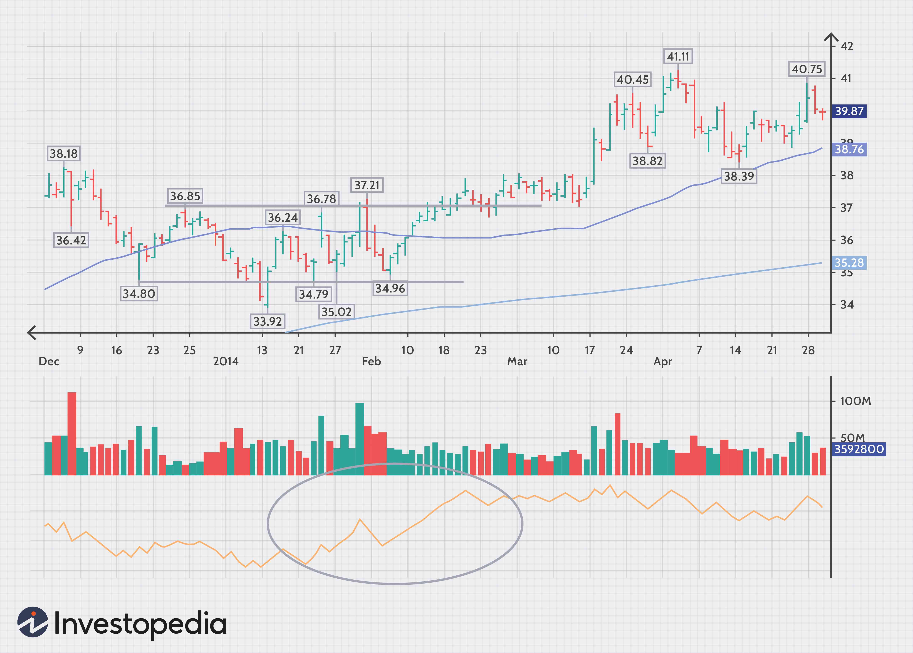

## Table of Contents

## What is stock volume and why is it important in trading?

Stock volume is the number of shares of a stock that are traded on a particular day. It shows how many people are buying and selling that stock. If a lot of shares are traded, it means the stock is popular and many people are interested in it. If fewer shares are traded, it means fewer people are paying attention to it.

Volume is important in trading because it helps traders understand how strong a price movement is. If a stock's price goes up and the volume is high, it means many people believe the price will keep going up. This can make the price movement more reliable. On the other hand, if the price goes up but the volume is low, it might not be a strong movement and the price could change direction soon. So, traders use volume to make better decisions about when to buy or sell a stock.

## How can beginners use stock volume to identify market trends?

Beginners can use stock volume to identify market trends by looking at how many shares are traded when the stock price changes. If a stock's price is going up and the volume is high, it means many people are buying the stock. This can show that the upward trend is strong and likely to continue. On the other hand, if the stock price is going up but the volume is low, it might mean that not many people are interested, and the upward trend might not last long.

When the stock price is going down, volume can also help. If the price is falling and the volume is high, it means many people are selling the stock. This can show that the downward trend is strong and might keep going. If the price is falling but the volume is low, it might mean that not many people are selling, and the downward trend might not be as strong. By watching the volume along with price changes, beginners can get a better idea of whether a trend is likely to continue or reverse.

## What are the basic volume indicators that traders use?

Traders use a few basic volume indicators to help them make decisions. One common indicator is the Volume Bar Chart, which shows the number of shares traded during a specific time period, like a day or an hour. This helps traders see if the volume is increasing or decreasing. Another simple indicator is the On-Balance Volume (OBV), which adds volume on days when the stock price goes up and subtracts it on days when the price goes down. This helps traders see if volume is supporting the price trend.

Another useful volume indicator is the Accumulation/Distribution Line. This indicator looks at where the stock price closes within its daily range and then uses the volume to show if the stock is being bought (accumulated) or sold (distributed). If the line is going up, it means more people are buying the stock, which can be a good sign. Traders also use the Volume Rate of Change (VROC), which measures how fast the volume is changing over time. If the VROC is high, it means the volume is increasing quickly, which can show strong interest in the stock.

## How does volume affect the reliability of price movements?

Volume affects the reliability of price movements by showing how many people are involved in the price change. If the price of a stock goes up and the volume is high, it means many people are buying the stock. This makes the price movement more reliable because it shows that a lot of people believe the price will keep going up. On the other hand, if the price goes up but the volume is low, it means fewer people are buying. This can make the price movement less reliable because it might not last long if not many people are interested.

When the price of a stock goes down, volume also plays a big role. If the price falls and the volume is high, it means many people are selling the stock. This makes the downward trend more reliable because it shows that a lot of people think the price will keep falling. If the price falls but the volume is low, it means fewer people are selling. This can make the downward trend less reliable because it might not continue if not many people are involved. So, volume helps traders decide if a price movement is strong and likely to continue.

## Can volume be used to predict price reversals?

Volume can be used to predict price reversals by looking at how many people are trading the stock when the price is changing. If the price of a stock is going up but the volume is getting lower, it might mean that not many people are buying anymore. This can be a sign that the price might start going down soon. Traders look for this because it tells them that the upward trend might be getting weak.

On the other hand, if the price of a stock is going down but the volume is getting lower, it might mean that not many people are selling anymore. This can be a sign that the price might start going up soon. Traders watch for this because it tells them that the downward trend might be losing strength. By paying attention to volume, traders can try to guess when the price might change direction.

## What are volume spikes and how should they be interpreted in trading?

Volume spikes happen when a lot more shares of a stock are traded than usual in a short time. This can mean something important is happening with the stock. Maybe there's news about the company, or maybe a lot of people suddenly want to buy or sell the stock. When you see a volume spike, it's a good idea to find out why it's happening. This can help you understand if the stock's price might go up or down because of what's going on.

When you see a volume spike, it can be a sign that the price of the stock might change a lot. If the volume spike happens when the price is going up, it might mean the price will keep going up because many people are buying. But if the volume spike happens when the price is going down, it might mean the price will keep going down because many people are selling. So, volume spikes can help you guess what might happen next with the stock's price, but you should always look at other things too, like the news and the overall market, before making a decision.

## How can volume be integrated into a moving average strategy?

Volume can be integrated into a moving average strategy by using it to confirm the signals given by the moving averages. Moving averages help traders see the general direction of a stock's price over time. For example, if the price of a stock is above its moving average, it might be a good time to buy. But to make sure this is a strong signal, traders can also look at the volume. If the price goes above the moving average and the volume is high, it means many people are buying the stock, which makes the buy signal more reliable.

When the price of a stock goes below its moving average, it might be a good time to sell. But again, traders should check the volume. If the price goes below the moving average and the volume is high, it means many people are selling the stock, which makes the sell signal more reliable. By using volume along with moving averages, traders can make better decisions about when to buy or sell a stock, because they can see if the price movement is supported by a lot of people trading the stock.

## What is the Volume Price Trend (VPT) indicator and how is it calculated?

The Volume Price Trend (VPT) indicator is a tool that traders use to see how volume and price changes are related. It helps them understand if the volume is supporting the price movement of a stock. The VPT indicator is useful because it can show if a lot of people are buying or selling a stock when its price is changing. This can help traders decide if a price trend is strong and likely to continue.

To calculate the VPT, you start with an initial value, usually set to zero. Then, for each trading day, you find the percentage change in the stock's price from the previous day. You multiply this percentage change by the volume of shares traded on that day. You add this result to the previous VPT value to get the new VPT value. So, if the price goes up and the volume is high, the VPT will go up a lot. If the price goes down and the volume is high, the VPT will go down a lot. This way, the VPT shows how volume is affecting the price trend over time.

## How do advanced traders use volume profile to analyze market structure?

Advanced traders use volume profile to see where the most trading happens at different price levels of a stock. It's like a map that shows how many shares were traded at each price. By looking at this map, traders can find out where a lot of people are buying or selling the stock. These places are called "high volume nodes" and "low volume nodes." High volume nodes are where a lot of shares are traded, which means these prices are important to many people. Low volume nodes are where fewer shares are traded, which means these prices are less important.

Traders use this information to understand the market structure better. For example, if the price of a stock is near a high volume node, it might be hard for the price to move away from that level because a lot of people are interested in buying or selling at that price. On the other hand, if the price is near a low volume node, it might be easier for the price to move past that level because fewer people care about it. By knowing where these important price levels are, traders can make better guesses about where the price might go next and plan their trades accordingly.

## What are the limitations of using volume in trading strategies?

Using volume in trading strategies can be helpful, but it also has some limitations. One big problem is that volume alone doesn't tell the whole story. It shows how many shares are traded, but it doesn't say why people are buying or selling. Sometimes, high volume might happen because of news or events that aren't good for the stock's future. So, traders need to look at other things like the news and the overall market to understand what's really going on.

Another limitation is that volume can be misleading sometimes. For example, a big jump in volume might look like a strong signal, but it could just be a short-term thing that doesn't last. Also, volume patterns can be different for different stocks and markets, so what works for one stock might not work for another. Traders need to be careful and not rely only on volume when making decisions. They should use it along with other tools and information to get a better picture of what might happen with a stock's price.

## How can volume analysis be combined with other technical indicators for enhanced decision-making?

Volume analysis can be combined with other technical indicators to make better trading decisions. One way to do this is by using volume with moving averages. Moving averages show the general direction of a stock's price over time. When the price goes above the moving average and the volume is high, it's a strong sign that the price might keep going up. This is because a lot of people are buying the stock, which supports the upward trend. On the other hand, if the price goes below the moving average and the volume is high, it's a strong sign that the price might keep going down. This is because a lot of people are selling the stock, which supports the downward trend.

Another way to use volume with other indicators is by combining it with the Relative Strength Index (RSI). The RSI helps traders see if a stock is overbought or oversold. If the RSI shows that a stock is overbought and the volume is high, it might mean the price is about to go down because too many people have bought the stock. If the RSI shows that a stock is oversold and the volume is high, it might mean the price is about to go up because too many people have sold the stock. By looking at volume along with other indicators like moving averages and RSI, traders can get a fuller picture of what's happening with a stock and make smarter choices about when to buy or sell.

## What are some advanced volume-based trading strategies used by professional traders?

Professional traders often use a strategy called Volume Weighted Average Price (VWAP) to make decisions. VWAP calculates the average price of a stock over a certain time period, taking into account the volume of shares traded at each price. This helps traders see if the current price is a good deal compared to the average price. If the stock price is below the VWAP, it might be a good time to buy because the price is lower than the average. If the price is above the VWAP, it might be a good time to sell because the price is higher than the average. By using VWAP, traders can make better choices about when to buy or sell a stock based on how the volume affects the price.

Another advanced strategy is using the Volume Profile to find key price levels where a lot of trading happens. This helps traders understand where the stock might find support or resistance. For example, if the price is near a high volume node, it might be hard for the price to move away from that level because a lot of people are interested in buying or selling at that price. Traders can use this information to plan their trades better. They might decide to buy near a support level where a lot of people are buying, or sell near a resistance level where a lot of people are selling. By combining volume profile with other technical indicators, professional traders can get a clearer picture of the market and make more informed decisions.

## What is the Role of Volume Indicators in Trading?

Volume indicators are indispensable tools for traders seeking to understand market trends and dynamics. They provide insights into the flow of capital in and out of securities by analyzing the volume of traded shares. Two of the most commonly used volume indicators are On-Balance Volume (OBV) and Chaikin Money Flow.

On-Balance Volume (OBV) is a [momentum](/wiki/momentum)-based indicator that combines price and volume data to assess buying and selling pressure. It calculates a running total of volume to predict changes in stock price. The underlying principle of OBV is that volume precedes price movements. The OBV is computed by adding the day's volume to a cumulative total when the price closes higher than the previous close or subtracting it when the price closes lower:

$$

OBV = 
\begin{cases} 
OBV_{prev} + Volume & \text{if } Close > Close_{prev} \\
OBV_{prev} - Volume & \text{if } Close < Close_{prev} \\
OBV_{prev} & \text{if } Close = Close_{prev}
\end{cases}
$$

In contrast, Chaikin Money Flow focuses primarily on the flow of money in and out of a security over a specific period, typically 20 or 21 days. This indicator assesses the buying and selling pressure by analyzing both the price and volume. The calculation involves determining the Money Flow Multiplier and the Money Flow Volume:

$$
\text{Money Flow Multiplier} = \frac{((Close - Low) - (High - Close))}{(High - Low)}
$$

$$
\text{Money Flow Volume} = \text{Money Flow Multiplier} \times Volume
$$

The sum of the Money Flow Volume over a specified period gives the Chaikin Money Flow value, which oscillates above and below zero, providing bullish or bearish signals. Positive values suggest buying pressure, while negative values indicate selling pressure.

Using volume indicators like OBV and Chaikin Money Flow alongside other technical analysis tools, such as moving averages and support/resistance levels, can significantly enhance decision-making. They act as confirmations for price movements and help traders gauge market sentiment. For example, a bullish signal might be confirmed by a rising OBV and a positive Chaikin Money Flow, suggesting a strong upward trend.

Effectively implementing volume indicators requires thorough comprehension of their functionalities. Traders must recognize that these indicators are not infallible and should be used as part of a broader analytical framework. Understanding their limitations and combining them with other technical and [fundamental analysis](/wiki/fundamental-analysis) methods can lead to more informed and strategic trading decisions.

## References & Further Reading

[1]: Bergstra, J., Bardenet, R., Bengio, Y., & Kégl, B. (2011). ["Algorithms for Hyper-Parameter Optimization."](https://papers.nips.cc/paper/4443-algorithms-for-hyper-parameter-optimization) Advances in Neural Information Processing Systems 24.

[2]: ["Advances in Financial Machine Learning"](https://www.amazon.com/Advances-Financial-Machine-Learning-Marcos/dp/1119482089) by Marcos Lopez de Prado

[3]: ["Evidence-Based Technical Analysis: Applying the Scientific Method and Statistical Inference to Trading Signals"](https://www.amazon.com/Evidence-Based-Technical-Analysis-Scientific-Statistical/dp/0470008741) by David Aronson

[4]: ["Machine Learning for Algorithmic Trading"](https://github.com/stefan-jansen/machine-learning-for-trading) by Stefan Jansen

[5]: ["Quantitative Trading: How to Build Your Own Algorithmic Trading Business"](https://www.amazon.com/Quantitative-Trading-Build-Algorithmic-Business/dp/1119800064) by Ernest P. Chan