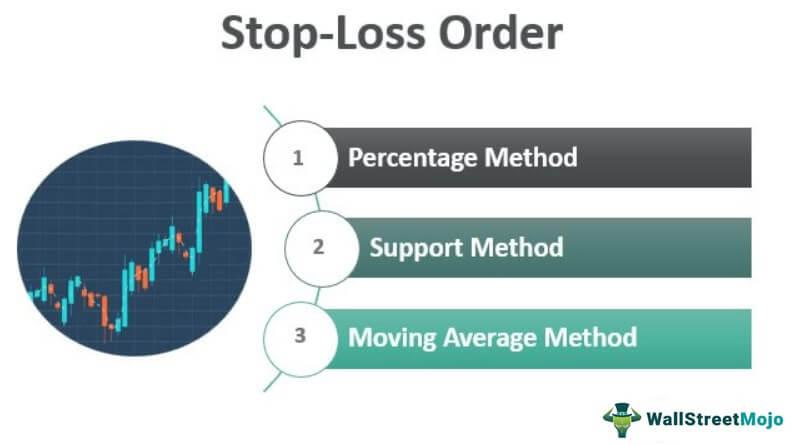

Investment protection is essential in navigating the intricate landscape of modern financial markets. A primary aspect of ensuring the security of investments is understanding market loss prevention strategies. These strategies serve as a safeguard against potential financial downturns by helping investors mitigate risks associated with market volatility.

Among the tools available to investors, stop orders and algorithmic trading stand out as vital components in protecting investments. Stop orders automate the process of buying or selling securities when they reach predetermined price levels, thereby preventing significant losses and managing risk effectively. Algorithmic trading, often referred to as algo trading, utilizes advanced computational algorithms to execute trades with speed and precision, reducing human error and enhancing the efficiency of trading strategies.



This article will examine these concepts, offering insights into their effective implementation. By exploring the mechanisms of stop orders and the advantages of algorithmic trading, investors can gain a comprehensive understanding of how these tools contribute to robust market risk management. Through this exploration, we aim to provide valuable knowledge to both new and experienced investors, empowering them to navigate market complexities with confidence and secure their financial futures.

## Table of Contents

## Understanding Stop Orders

Stop orders serve as essential tools in trading, primarily designed to mitigate potential losses and manage risk effectively. By automating the execution of trades when prices reach predetermined levels, stop orders offer a mechanism for protecting investments against undesired market fluctuations.

The fundamental operation of stop orders involves setting a specific price, known as the stop price, at which the order is activated. Once the market reaches this stop price, the stop order is converted into a market order and executed at the prevailing market rate. This automatic conversion allows traders to safeguard their positions without the need for constant market monitoring, thereby reducing the emotional and psychological stress often associated with trading.

- **Sell Stops**: A sell stop order is placed below the current market price and is typically utilized to protect long positions. For instance, a trader holding a stock currently trading at $50 might set a sell stop order at $45. If the stock's price declines to $45, the stop order becomes a market order, and the shares are sold at the best available price. This strategy is pivotal in curbing downside risk and locking in gains.

- **Buy Stops**: Conversely, buy stop orders are positioned above the current market price and are commonly used to protect short positions or enter long positions in momentum trading. For example, a trader may be shorting a stock trading at $30 and sets a buy stop order at $35. If the stock price surges to $35, the stop order triggers a buy, covering the short position to limit potential losses.

- **Trailing Stops**: Trailing stop orders are dynamic in nature, shifting with favorable market movements. They permit a trader to safeguard profits by setting the stop order a certain percentage or dollar amount away from the current market price. For instance, a trailing stop set at 5% below a stock's market price will adjust its stop price upward as the stock's price ascends, securing gains while still providing a safety net if the price falls. 

In varying market conditions, stop orders can function differently. In highly volatile markets, traders must be cautious as stop orders can be triggered by short-term price fluctuations or "noise," potentially leading to unintentional sales or purchases. To address this, traders might opt for stop-limit orders, which combine the features of stop orders and limit orders. A stop-limit order is activated at the stop price, but unlike a standard stop order, it will only execute at a specific limit price or better. While this approach provides more control over execution prices, it also carries the risk that the order may not be executed if the market moves past the limit price before the order can be fulfilled.

Understanding the nuanced operation of stop orders in diverse market scenarios is crucial. Traders must adapt their strategies to ensure these orders align with their overall risk management objectives, considering factors such as asset [volatility](/wiki/volatility-trading-strategies), market [liquidity](/wiki/liquidity-risk-premium), and personal risk tolerance.

## Market Loss Prevention Strategies

Market loss prevention requires proactive measures to safeguard against financial downturns. Chief among these measures are stop-loss and stop-limit orders, which are vital for mitigating risks by automatically executing trades when certain conditions are met. These orders are designed to limit an investor's loss on a security position, offering a layer of protection against unpredictable market movements.

### Stop-loss and Stop-limit Orders

Stop-loss orders are set at a specific price point below the current market price. When the market price reaches this threshold, the stop-loss order becomes a market order, instructing the broker to sell the security immediately at the best available price. This mechanism ensures that losses are capped at a predetermined level, reducing emotional decision-making often triggered by sudden market drops.

Stop-limit orders, on the other hand, combine the features of stop-loss and limit orders. They trigger a limit order to sell the security at or above a set price once the stop price is hit. The primary benefit is the greater control over the selling price, but this comes with the risk of the order not being filled if the market price moves too quickly past the limit.

### Incorporation into Trading Strategies

Integrating stop orders into trading strategies involves strategic planning. Investors must set stop prices based on technical analysis, historical price patterns, and market conditions. A commonly used strategy is the trailing stop order, which adjusts the stop price at a fixed amount below the market price of a rising security. Here is a Python example for computing a trailing stop:

```python
def calculate_trailing_stop(current_price, trailing_rate):
    trailing_stop_price = current_price * (1 - trailing_rate)
    return trailing_stop_price

current_price = 100  # Current market price of the asset
trailing_rate = 0.1  # 10% trailing stop

trailing_stop = calculate_trailing_stop(current_price, trailing_rate)
print(f"The trailing stop price is set at: {trailing_stop}")
```

### Practical Examples

Consider an investor holding shares of a volatile stock priced at $100, with a stop-loss order set at $90. If the price falls to $90, the order will be triggered, preventing further losses if the stock price continues to decline. Alternatively, using a stop-limit order, the investor might set a limit price of $85, ensuring they do not sell the stock for less than this price, even if the stop price of $90 is reached.

Incorporating these orders into a diversified portfolio enables investors to manage risk across various assets, aligning with their risk tolerance and investment objectives. By harnessing the distinct functionalities of stop-loss and stop-limit orders, investors can better prepare for and withstand the impacts of market volatility, ultimately protecting their investments.

## Algo Trading and Its Advantages

Algorithmic trading is a sophisticated method that utilizes complex algorithms to automate the process of trading. It is designed to execute trades swiftly and efficiently, capitalizing on market opportunities that are often fleeting and challenging to capture manually. The key feature of [algorithmic trading](/wiki/algorithmic-trading) is its ability to eliminate human errors and introduce precision and consistency into executing trading strategies.

The implementation of algorithmic trading systems is highly beneficial in several ways. Firstly, these systems can manage and process vast amounts of data in real-time, allowing traders to make informed decisions based on comprehensive market analysis. Algorithms can be programmed to follow specific strategies, such as [arbitrage](/wiki/arbitrage) or [market making](/wiki/market-making), and adjust to changing market conditions without human intervention.

Moreover, algorithmic trading enables the execution of complex strategies that would be difficult to manage manually. For instance, [statistical arbitrage](/wiki/statistical-arbitrage), which involves exploiting price differentials between related assets, requires swift and precise execution that only automated systems can provide. By leveraging mathematical models and statistical techniques, these algorithms can identify trading opportunities with high accuracy.

However, while the advantages of algorithmic trading are substantial, there are potential downsides to consider. The reliance on algorithms can lead to significant losses if the models are incorrectly programmed or the market behaves unpredictably. Additionally, high-frequency trading, a subset of algorithmic trading, has been criticized for contributing to market volatility and for its role in incidents such as the 2010 Flash Crash.

Furthermore, the complexity of developing and maintaining an algorithmic trading system requires a significant investment of time and resources. Traders must continuously update their algorithms to adapt to evolving market conditions, necessitating a deep understanding of both financial markets and programming. Despite these challenges, for those who can effectively harness its power, algorithmic trading remains an indispensable tool in modern portfolio management.

## Integrating Stop Orders with Algo Trading

Integrating stop orders with algorithmic trading provides a robust framework for enhancing risk management in financial markets. By combining these mechanisms, traders can benefit from automated, strategic decision-making processes that dynamically respond to market conditions.

**Adaptive Strategies and Real-Time Adjustments**

Stop orders, when integrated with algorithmic trading systems, enable adaptive strategies that adjust in real-time. Such systems continuously monitor price movements and other market indicators, executing trades as pre-defined conditions are met. Algorithms can be designed to adapt to changes in volatility, allowing stop orders to be re-evaluated and adjusted dynamically. This adaptability helps maintain optimal portfolio positioning, minimizing potential losses while capitalizing on market opportunities.

For example, a simple Python algorithm could be written to adjust a trailing stop order based on volatility indicators, such as:

```python
import numpy as np

def trailing_stop(price_data, vol_threshold):
    volatility = np.std(price_data[-20:])  # Standard deviation of the last 20 price points
    stop_loss_level = max(price_data) - (volatility * vol_threshold)
    return stop_loss_level
```

This function calculates a trailing stop level based on recent volatility, helping ensure that stop orders remain effective under evolving market conditions.

**Case Studies of Successful Integration Techniques**

Various case studies highlight the practical applications of integrating stop orders with algorithmic trading. One example is the use of [machine learning](/wiki/machine-learning) algorithms in quant funds, where predictive models inform stop order levels. A notable approach involves using neural networks to predict short-term price movements, dynamically adjusting stop-loss levels to optimize risk-reward ratios.

Another example involves high-frequency trading firms that implement stop orders within their algorithms to protect against rapid market swings. These firms utilize low-latency execution platforms to ensure stop orders are triggered milliseconds after price conditions are met, thereby mitigating slippage and enhancing execution efficiency.

**Challenges and Considerations**

While the integration of stop orders and algorithmic trading is beneficial, it presents challenges. Algorithms must be carefully tested to avoid false triggers that could result in unnecessary trades. The effectiveness of stop orders hinges on accurate data feeds and robust technical infrastructure; any delay or error here can lead to suboptimal trade execution.

Additionally, algorithmic systems face the challenge of overfitting to historical data, which may not always predict future market behavior. Ensuring the generalizability of algorithms requires comprehensive [backtesting](/wiki/backtesting) and real-time calibration. Furthermore, regulatory compliance must be considered, as algorithmic trading is subject to scrutiny and must align with financial regulations.

In conclusion, integrating stop orders with algorithmic trading empowers traders with enhanced risk management capabilities. Through adaptive strategies and real-time responsiveness, investors can effectively navigate market uncertainties. However, a cautious approach is necessary to address the inherent challenges associated with these technologies.

## Tools and Platforms for Implementation

Various platforms facilitate the integration of stop orders and algorithmic (algo) trading, enhancing the effectiveness of investment strategies. These platforms enable traders to execute complex strategies with precision and adaptability, leveraging both stop orders and advanced trading algorithms.

### MetaTrader
MetaTrader is one of the most widely used trading platforms due to its user-friendly interface and robust capabilities. It supports algorithmic trading through its MetaQuotes Language (MQL), allowing traders to design, test, and implement custom trading algorithms. MetaTrader provides features for implementing stop orders, including stop-loss and take-profit orders, which are crucial for minimizing risk. Its strategy tester tool allows traders to backtest their algorithms using historical data, optimizing them for effectiveness under various market conditions. The platform's compatibility with numerous brokers makes it a versatile choice for individual investors and institutional traders alike.

### QuantConnect
QuantConnect is an open-platform leveraging the Lean Algorithmic Trading Engine, which supports algorithmic trading across multiple assets, including equities, [forex](/wiki/forex-system), and cryptocurrencies. It offers a cloud-based integrated development environment (IDE) where traders can write algorithms in Python and C#. QuantConnect provides extensive data sources, including historical and real-time data, enabling comprehensive backtesting of trading strategies. The platform facilitates the use of stop orders through its intuitive API, allowing traders to incorporate risk management techniques directly into their algorithms. This integration enhances the ability to execute stop-loss and take-profit orders efficiently, protecting investments from sudden market shifts.

### TradeStation
TradeStation combines powerful trading tools with flexible charting and analysis capabilities. It supports custom algorithmic trading strategies through EasyLanguage, a proprietary scripting language designed for strategy development. TradeStation's platform allows for the seamless integration of stop orders, enabling automated risk management directly within the trading strategy. Its RadarScreen tool provides real-time monitoring of market conditions, assisting traders in making informed decisions based on specific trade criteria. TradeStation's advanced order execution and direct market access bolster effective implementation of stop orders, reinforcing the protection of investments against market volatility.

### Capabilities in Risk Management and Strategy Execution
Each of these platforms offers unique features that contribute to effective risk management and strategy execution. By facilitating the integration of stop orders, they enable traders to automate risk mitigation processes. Advanced data analytics, backtesting capabilities, and custom scripting languages further empower traders to refine their strategies for optimal performance. These platforms not only enhance precision and consistency in executing trades but also allow for adaptive strategies that respond to changing market conditions in real time.

In summary, the effective use of platforms like MetaTrader, QuantConnect, and TradeStation can significantly enhance the integration of stop orders with algorithmic trading. These platforms provide the tools necessary for sophisticated strategy development and execution, ultimately contributing to more robust investment protection.

## Conclusion

Effective investment protection requires a blend of strategic tools and vigilant risk management. In the dynamic environment of modern financial markets, investors face significant uncertainties and potential risks. Incorporating stop orders and algorithmic trading into portfolio management strategies provides essential mechanisms for mitigating potential losses and improving overall performance. Stop orders, such as sell stops, buy stops, and trailing stops, automate the execution of trades at predefined price levels. This automation acts as a safeguard against unanticipated market movements, ensuring that losses are minimized and gains are protected.

Algorithmic trading further complements stop orders by employing advanced algorithms for precise and consistent execution of trading strategies. The ability to process vast amounts of data in real-time and execute complex trades swiftly is a significant advantage. This systematic approach reduces human errors and provides the flexibility to implement sophisticated strategies that can rapidly adapt to changing market conditions.

Continuous learning and adaptation to the ever-evolving market landscape are imperative for sustained success. Financial markets are influenced by a myriad array of global factors, and technology evolves rapidly. Investors need to stay informed about new tools and strategies, market trends, and economic indicators. By remaining agile and informed, investors can better anticipate market shifts and strategically adjust their portfolios to align with their financial objectives.

Investors must tailor risk management techniques to their unique objectives and risk tolerance levels. The investment landscape is not uniform; each investor has specific goals, whether they are focused on growth, income, or capital preservation. Risk tolerance varies significantly among individuals and institutions, influenced by factors such as investment horizon, financial situation, and personal preferences. Therefore, a one-size-fits-all approach is ineffective. Instead, a personalized strategy designed to address specific needs and constraints offers the best prospects for preserving investments while pursuing desired returns.

## References & Further Reading

[1]: Bergstra, J., Bardenet, R., Bengio, Y., & Kégl, B. (2011). ["Algorithms for Hyper-Parameter Optimization."](https://dl.acm.org/doi/10.5555/2986459.2986743) Advances in Neural Information Processing Systems 24.

[2]: ["Advances in Financial Machine Learning"](https://www.amazon.com/Advances-Financial-Machine-Learning-Marcos/dp/1119482089) by Marcos Lopez de Prado

[3]: ["Evidence-Based Technical Analysis: Applying the Scientific Method and Statistical Inference to Trading Signals"](https://www.amazon.com/Evidence-Based-Technical-Analysis-Scientific-Statistical/dp/0470008741) by David Aronson

[4]: ["Machine Learning for Algorithmic Trading"](https://github.com/stefan-jansen/machine-learning-for-trading) by Stefan Jansen

[5]: ["Quantitative Trading: How to Build Your Own Algorithmic Trading Business"](https://www.amazon.com/Quantitative-Trading-Build-Algorithmic-Business/dp/1119800064) by Ernest P. Chan